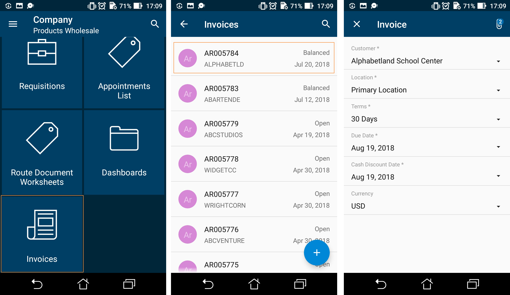

# Configuring Editing Screens {#_c8e0561d-7d44-4313-b380-e3bb12860796 .reference}

You may have to configure an editing screen \(that is, a screen that can be used to enter and edit a data record\) based on the use of the corresponding form in Acumatica ERP.

In some cases, Acumatica ERP uses a single form to manage data records of a particular type \(that is, the *.aspx* page contains the FormView and Grid controls\). In these cases, in the mobile site map, you have to configure both the form view and the list view by using a single declaration of the Screen object.

In other cases, Acumatica ERP uses the following separate forms for data records of a particular type:

-   A list view \(the *.aspx* page contains one Grid control\) to manage records, which is called the *substitute form*. \(It has this name because this form is brought up instead of the data entry form when a user navigates to or searches for the form; it shows these records in a tabular format. On the substitute form, when the user clicks a record, the entry form opens to show the details of the selected record.\)
-   A form view \(the *.aspx* page with one FormView control\) to enter and edit settings, which is usually called a *form* or *entry form*.

In these cases, you have to configure two separate declarations of the Screen object \(that is, two screens\): the list screen \(which corresponds to the Acumatica ERP substitute form\), and the editing screen.

## Example: Creating the Same Layout for the List View and the Form View { .section}

An example of a screen with the same layout for the list view and the form view is presented in the [Configuring Lists](mobile_msdl_screen_list.md) topic.

You can see the list of fields and edit them at the same time.

## Example: Configuring the List and the Editing Form Separately { .section}

In this example, we will add the Invoices \(SO3030PL\) list screen, which corresponds to the Invoices \(SO3030PL\) substitute form \(a grid listing all available invoices\), and the Invoices \(SO303000\) editing screen, which corresponds to the Invoices \(SO303000\) entry form \(used to enter and edit the data of one invoice\) in Acumatica ERP .

To configure these screens, do the following:

1.  Add the Invoices \(SO3030PL\) list screen, as described in [To Add a Screen to the Mobile Site Map \(Example\)](MOBILE_MobileSiteMap_AddingMSDL.md).
2.  Insert the following code in the **Commands** area of the Add: SO3030PL page.

    ```
    add screen SO3030PL {
      add container "Result" {
        add field "ReferenceNbrSOInvoiceRefNbr"
        add field "Status"
        add field "Customer"
        add field "Date"
        add containerAction "Insert" {
          icon = "system://Plus"
          behavior = Create
          redirect = True
        }
        add containerAction "EditDetail" {
          behavior = Open
          redirect = True
        }
      }
    }
    ```

    In the screen, you find two actions that can be invoked to open the editing screen for a data record: `behavior = Create` and `behavior = Open`. The `redirect = True` attribute indicates that the editing screen needs to be opened separately. The actual screen that will be opened is determined by the server logic.

3.  Add the Invoices \(SO303000\) screen, as described in [To Add a Screen to the Mobile Site Map \(Example\)](MOBILE_MobileSiteMap_AddingMSDL.md).
4.  Insert the following code in the **Commands** area of the Add: SO303000 page.

    ```
    add screen SO303000 {
      add container "InvoiceSummary" {  
        add field "Customer"
        add field "Location"
        add field "Terms" 
        add field "DueDate"
        add field "CashDiscountDate" 
        add field "Currency" {
          selector {
            add field "CurrencyID"
          }
          PickerType = Attached
        }
        add recordAction "Save" {
          behavior = Save
        } 
        add recordAction "Cancel" {
          behavior = Cancel
        }
      } 
    }
    ```

5.  Add the screens to the mobile site map by using the **Update: SITEMAP** page as shown below.

    ```
    add item "SO3030PL" {
      displayName = "Invoices" 
      icon = "system://NewsPaper" 
    }  
    add item "SO303000" {
      displayName = "Invoice"
      visible = False  
    }
    ```

    **Note:** The visible attribute of the Invoices \(SO303000\) screen is set to *false* to hide the editing screen from the Home screen of the mobile app so that a user can access it only from the Invoices \(SO3030PL\) screen.


After you publish the customization project, you should see a new tile on the main menu of the mobile app and the corresponding screens, as shown below.



In this example, you use the Invoices \(SO3030PL\) screen to display the list screen, and you use the Invoices \(SO303000\) screen to display the editing screen. The same approach is used with forms in Acumatica ERP.

**Parent topic:**[Screens](../StudioDeveloperGuide/mobile_msdl_screens.md)

