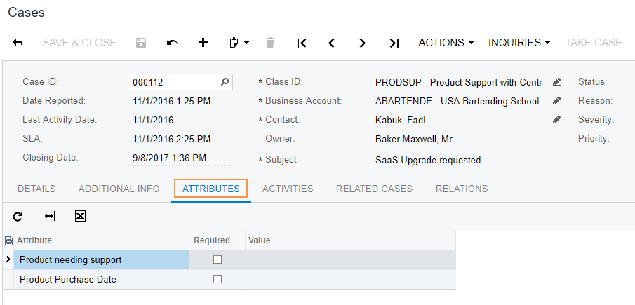
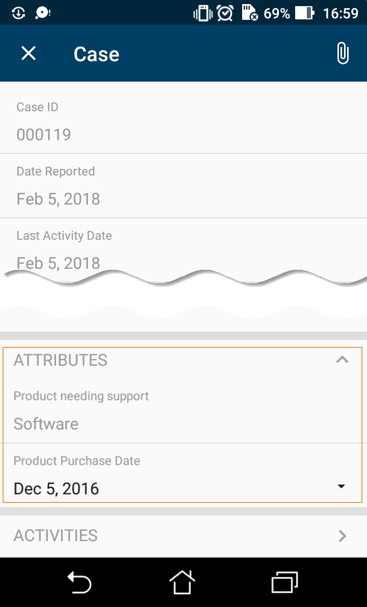
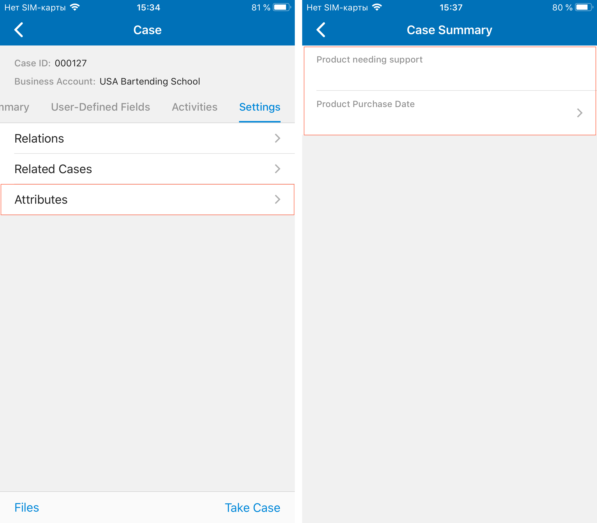

# Adding Attributes of Entities to Mobile Screens {#_6ecef553-4689-4bc9-a334-25d585c28482 .reference}

In Acumatica ERP, a *class* is a grouping of entities of a particular type—such as leads, opportunities, customers, cases, projects, and stock or non-stock items—that have similar properties. For each class, you can define a list of attributes to gather specific information about entities of the class. In Acumatica ERP, an *attribute* is some quality or characteristic beyond those already tracked on the data entry form for the entity.

If attributes have been defined for an entity class, on the data entry form for the entity, the attributes are usually displayed on a separate tab as a table that contains a set of key-value pairs. Attributes of entities can be redefined, added, or removed at any time; thus, it is not possible to explicitly specify them in a mobile site map. Instead, you use specific definitions to show attributes of entities in a mobile application.

In a mobile application, the attributes of entities are displayed as a screen or a part of a screen with input fields rather than being displayed in a table. For improved usability, you can apply a group as a container for attributes.

## Example: Displaying a Group of Attributes on the Summary Tab { .section}

Suppose that in the mobile app, you need to display the attributes that are defined for a case class and displayed on the [Cases](../UserGuide/CR_30_60_00.md)\(CR306000\) form of Acumatica ERP. \(These attributes are shown in the following screenshot.\)

**Note:** On screens that have been predefined for the Acumatica mobile app, there are usually two additional tabs that are not present on the corresponding Acumatica ERP form: the **Summary** tab and the **Settings** tab. The **Summary** tab contains most of the elements from the Summary area of the corresponding form. The **Settings** tab contains group objects, each of which is related to a tab from the tab area of the corresponding form.



To display attributes on the **Summary** tab, you should use the `add attributes` instruction inside the `add group` instruction. The following example adds a group of attributes in the `CaseSummary` container.

```
add screen CR306000 {
  openAs = Form
  … 
  add container "CaseSummary" {
    add group "AttributesGroup" {
      displayName = "Attributes"
      collapsable = True
      collapsed = True
      add attributes "Attributes"
    }
  }
  … 
}
```

In this code, the attributes object is wrapped in the group named `AttributesGroup`.

The following screenshot shows the resulting screen in the mobile app.



## Example: Displaying Attributes on Other Tabs of a Screen { .section}

To display attributes on a tab other than the **Summary** tab, you need to add a container with attributes and use a containerLink object, as the following code shows.

```
add screen CR306000 {
  add container "CaseSummary" {
    add layout "Settings" {
      displayName = "Settings"
      layout = "Tab"
      add containerLink "Attributes"
    }
  }
  add container "Attributes" {
    attributes = True
    attachments {}
  }
}
```

In this code, the link to the *Attributes* container is added inside the **Settings** tab. To see the full example, in the navigation pane of the Customization Project Editor, select the **Mobile Application** page, and click **Customize &gt; Update Existing Screen &gt; CR306000**

The following screenshots show the **Settings** tab with a link to the list of attributes and the list of attributes \(on the second screen\).



**Parent topic:**[Screens](../StudioDeveloperGuide/mobile_msdl_screens.md)

