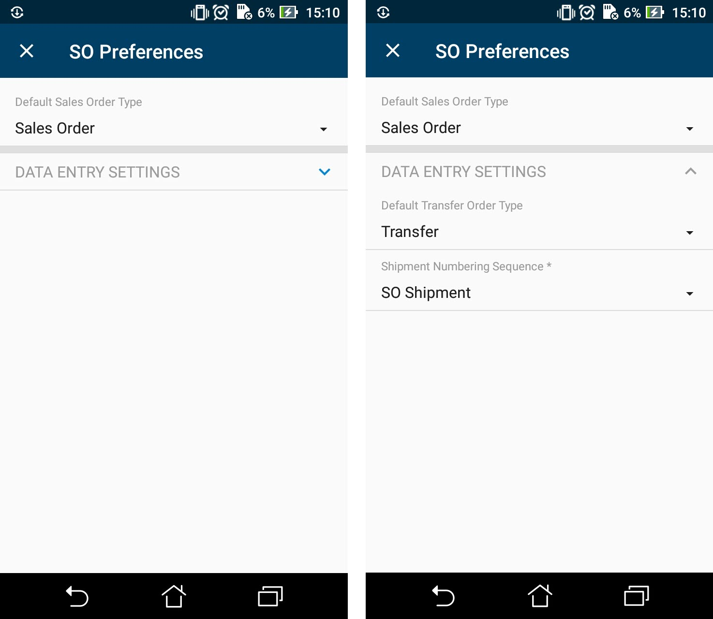

# Grouping Fields on a Screen {#_41dc0754-bdef-4a00-9cac-df4fb5d49e6d .reference}

You can combine fields into groups to make data entry more logical and intuitive by using the group object, as the following example shows.

## Example: Grouping Fields { .section}

The following example enhances the Sales Order Preferences \(SO101000\) screen. To see an example of grouping fields into a group, add the Sales Orders Preferences \(SO101000\) screen to your customization project \(as described in [To Add a Screen to the Mobile Site Map \(Example\)](MOBILE_MobileSiteMap_AddingMSDL.md)\), copy the code below to the **Commands** area of the Add: SO101000 page, and publish the project.

```
add screen SO101000 {
  add container "GeneralSettingsDataEntrySettings" {
    add field "DefaultSalesOrderType"
    add group "DataEntrySettings" {
      displayName = "Data Entry Settings"
      collapsable = True
      collapsed = True
      add field "DefaultTransferOrderType"
      add field "ShipmentNumberingSequence"
    }
    add recordAction "Save" {
      behavior = Save
    }
  }
}
```

While entering data, the user may collapse or expand a particular group of fields. You can prevent a group from being collapsed by setting the collapsable attribute of the group to *False* \(by default, the attribute value is *True*\). If a group is collapsible \(the collapsable attribute is set to *True*\), the collapsed attribute indicates whether a group is initially collapsed \(by default, the attribute value is *False*\).

You can see the result in the mobile application in the following screenshots.

The left screenshot shows the **Data Entry Settings** group, which is initially collapsed. If the user clicks on the header of the group, the group is expanded, as shown in the right screenshot.



**Parent topic:**[Configuring a Screen Layout](../StudioDeveloperGuide/MOBILE_MSDL_Layout.md)

