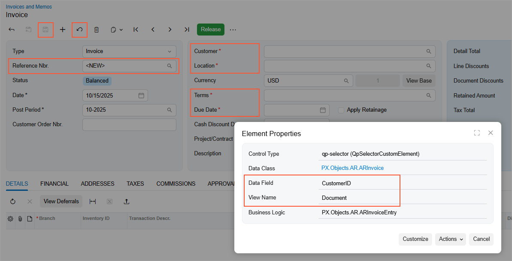
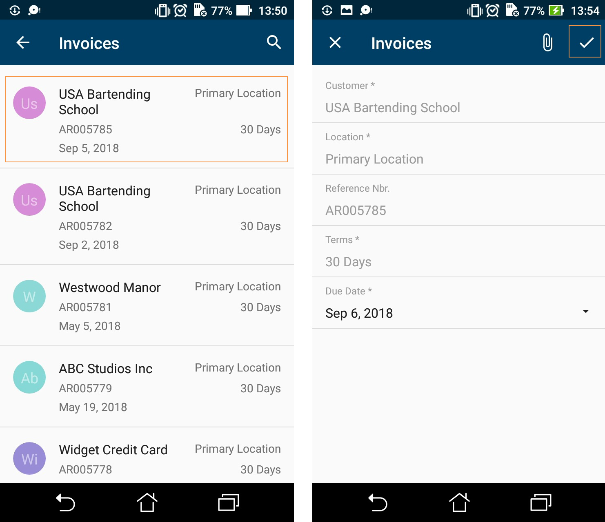

# Configuring Lists {#_a363d54e-6c3e-4de3-8ac2-5940d276870d .reference}

This topic describes how to configure a screen that contains a list of records created by an entry form in Acumatica ERP.

## Example: Creating a Simple List View Layout { .section}

A list view \(that is, a list of records\) is the simplest screen layout.

In this example, you will add a list of records that have been created on the [Invoices and Memos](../UserGuide/AR_30_10_00.md) \(AR301000\) form or its corresponding screen. To prepare a screen for this example, you should do the following:

-   Add a screen based on the Invoices and Memos \(AR301000\) form to the mobile site map. For details, see [To Add a Screen to the Mobile Site Map \(Example\)](MOBILE_MobileSiteMap_AddingMSDL.md).
-   Add a screen to the mobile site map. For details, see [Home Screen](mobile_msdl_mainmenu.md).
-   Add a screen to a mobile workspace

Before adding a list of records created by a particular form, you need to find the names of elements you want to map. To do that, use the Element Inspector. For details, see [Element Inspector](../UserGuide/AU_ElementInspector.md) and [To Map a Screen in the Modern UI](Mobile_MSDL_UseModernUI.md). In this example, we want to map action buttons and fields of a record. To map the fields, you need to know the container name \(the **View Name** from the **Element Inspector** dialog box\) and the field name \(the **Data Field** value from the **Element Inspector** dialog box\). The **Element Inspector** dialog box for one of the fields is shown below.



**Note:** If you are mapping a screen that exists both in the Classic UI and the Modern UI, all the elements for mapping should be present in the Classic UI—that is, the ASPX file of the form.

So to add the highlighted action buttons and fields to the screen, you should use the following code.

```
add screen AR301000 {
  add container "Document" {
    add field "CustomerID"
    add field "CustomerLocationID"
    add field "RefNbr"
    add field "TermsID"
    add field "DueDate"
        
    add recordAction "Save" {
      behavior = Save
    }    
    add recordAction "Cancel" {
      behavior = Cancel
    }
  }
}
```

**Note:** You must declare the `Cancel` action for all screens that include it in the WSDL schema. Without the `Cancel` action mapped, the changes discarded in the mobile app might not be discarded on the server.

The left screenshot below shows the resulting screen you will see in the mobile application; you can tap any record to make changes to it. The right screenshot shows the form view of an individual record. Once you change any setting in this view, the ✓ symbol appears. Tap it to save your changes.



**Note:** All list views in Acumatica ERP mobile app support multi-selection. You can select multiple records and perform actions that have been declared as [selectionAction](mobile_ref_msdl_objtypes_seleciona.md).

**Parent topic:**[Configuring a Screen Layout](../StudioDeveloperGuide/MOBILE_MSDL_Layout.md)

