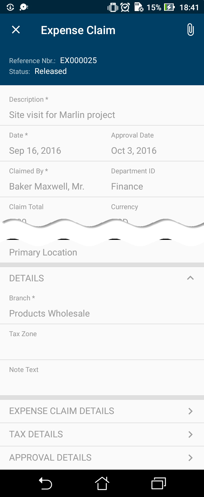
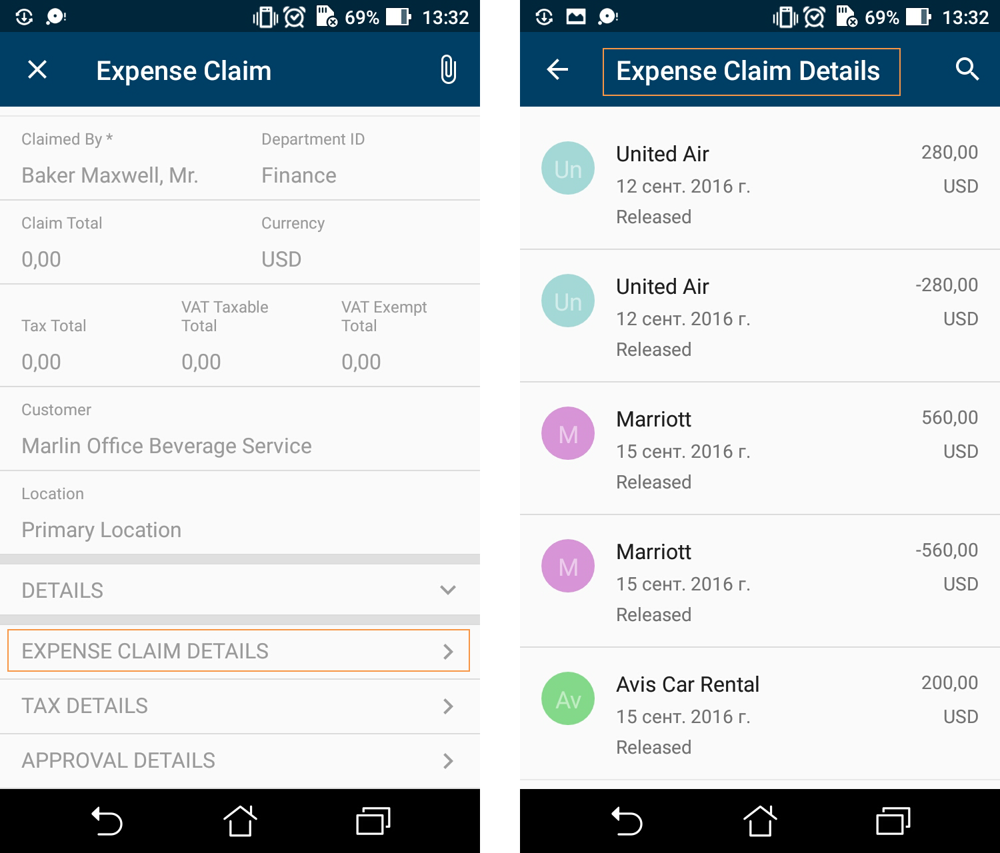
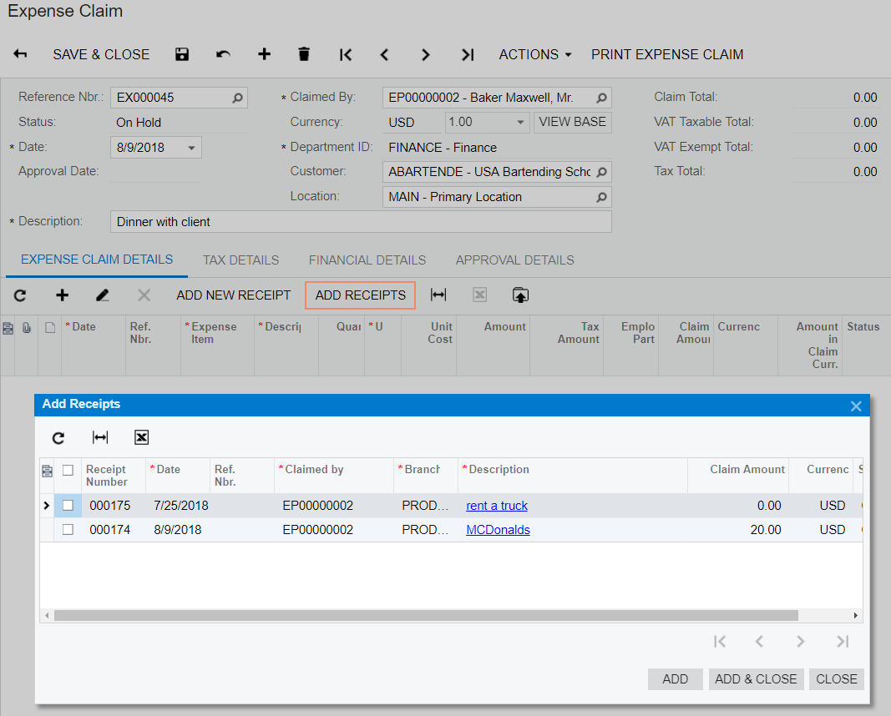
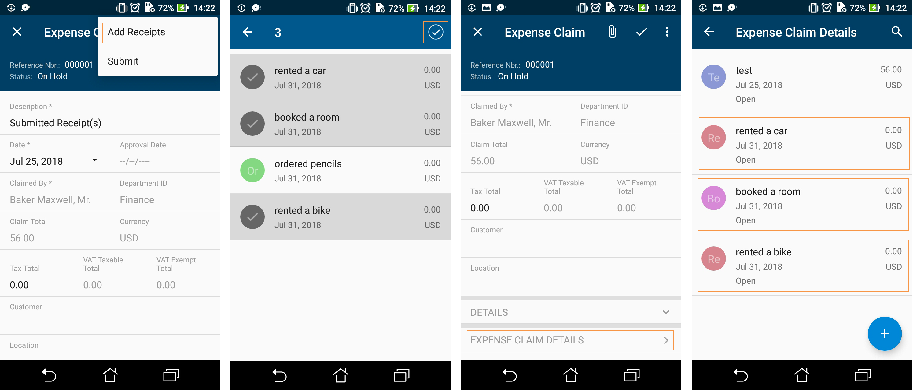
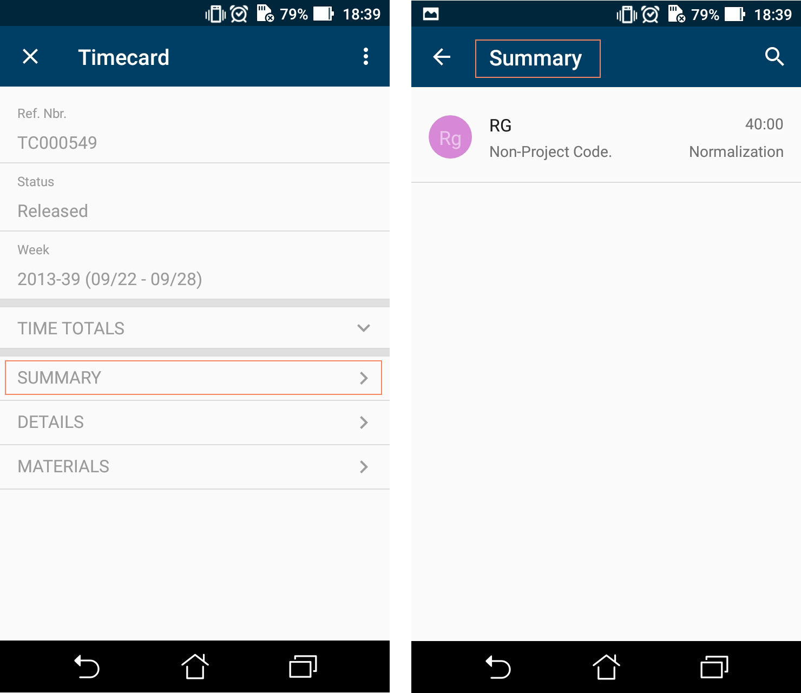

# Configuring Related Containers {#_471a1a6d-d88e-48ea-b5e6-45512ccfb1b8 .reference}

This topic describes how to configure different types of related containers on the same screen.

## Example: Configuring a Screen with One-to-Many \(Master-Detail\) Containers { .section}

With one-to-many containers declared inside the screen object, one container is considered the master container, while all other containers are considered detail containers.

The following code is an example of the one-to-many-containers scheme. You can see the full example if you select **Update Existing Screen &gt; EP301000** on the toolbar of the Mobile Application page in the Customization Project Editor.

```
add screen EP301000 {
  openAs = Form
  add container "DocumentSummary" {
    ...
  }
  add container "AddReceipts" {
    type = SelectionActionList
    visible = False
    listActionsToExpand = 1
    add field "Description"
    add field "ClaimAmount"
    add field "Date"
    add field "Currency"
    add listAction "SubmitReceipt" {
      icon = "system://Check"
      behavior = Void
    }
    attachments {}
  }
  add container "ExpenseClaimDetails" {
    fieldsToShow = 6
    listActionsToExpand = 3
    containerActionsToExpand = 3
    add field "Description"
    add field "Amount"
    ...
    attachments {}
  }
  ...
}
```

In this example, `DocumentSummary` is the master container. All other declared detail containers are displayed on the screen below the master container in the order of their declaration.

The following screenshot shows the resulting screen in the mobile application.



## Example: Displaying Fields from Different Containers in One Container {#_b7eb3fd7-220f-4e6f-a513-82d0a73b2f9b .section}

You can configure a container so that it displays fields form different containers.

The screen in this example includes the `ClaimDetails` container, which also has a field from the `ReceiptDetailsExpenseDetails` container. You do not need to declare both containers. Instead, in the field object, you separate the corresponding container name and its field with the *\#* symbol, as shown in the following sample code.

```
add screen EP301020 {
  openAs = Form
  add container "ClaimDetails" {
    … 
    add field "ReceiptDetailsExpenseDetails#Description"
    add field "Date"
    add field "ExpenseItem" {
      pickerType = Searchable
      selector {
        add field "Description"
        add field "InventoryID"
      }
    }
    … 
  }
  … 
}
```

In this example, the `Description` field of the `ReceiptDetailsExpenseDetails` container is displayed \(among other fields\). To see the full example, in the navigation pane of the Customization Project Editor select the Mobile Application page and click **Customize &gt; Update Existing Screen &gt; EP301020**.

The following screenshot shows the resulting screens with containers containing declared fields.



## Example: Configuring a Screen with Many-to-One \(Master-Detail\) Containers {#_1e07d417-e059-447d-a693-fb06a87b4850 .section}

Acumatica ERP includes dialog boxes that are opened from forms and that provide additional actions for items in a grid. For example, on the Expense Claims \(EP301030\) form, you could use the **Add Receipts** dialog box to add receipts to an expense claim entity. See the following screenshot.



To map this kind of dialog box to the mobile app, you need to specify `type = SelectionActionList` for the container corresponding to this dialog box in the form's WSDL schema and specify a [listAction](mobile_ref_msdl_objtypes_lista.md), as shown in the following code.

```
add screen EP301000 {
  openAs = Form
  … 
  add container "AddReceipts" {
    type = SelectionActionList
    visible = False
    listActionsToExpand = 1
    add field "Description"
    add field "ClaimAmount"
    add field "Date"
    add field "Currency"
    add listAction "SubmitReceipt" {
      icon = "system://Check"
      behavior = Void
    }
    attachments {}
  }
  … 
}
```

To see the full example, in the navigation pane of the Customization Project Editor select the Mobile Application page and click **Customize &gt; Update Existing Screen &gt; EP301000**.

The screenshots below show the resulting screens in the mobile app. Screens with list actions support selecting multiple items.

The first screenshot shows the content of the DocumentSummary container of the Expense Claims \(EP301030\) screen and the **Add Receipts** button, which corresponds to the `listAction "SubmitReceipt"`.

**Note:** The DisplayName attribute is not defined for the nested container; therefore, for the container, the mobile application displays the *Add Receipts* name, which is obtained from the Mobile API server.

If a user taps the **Add Receipts** button, the mobile app displays the content of this container and provides multi-selection, as the second screenshot shows. The user can tap **Expense Claim Details**, as shown in the third screenshot, to view the Expense Claim Details screen, shown in the fourth screenshot.



## Example: Configuring a Screen with a Container Link { .section}

In the mobile app, a container can contain a link to another container on the screen toolbar or on the screen among the fields. To use a container link, do the following:

-   Declare the container to which you want to add a link
-   Add the [containerLink](mobile_ref_msdl_objtype_containerlink.md) object

See the following code for an example of the creation of a link to the `Summary` container.

```
add screen EP305000 {
  add container "DocumentSummary" {
    … 
    add containerLink "Summary" {
      control = "ListItem"
      formPriority = 52
    }
    … 
  }
  add container "Summary" {
    …}
  … 
}
```

Based on this code, you can open the Summary screen by using the list entry.

The screenshots below show the Timecard \(EP305000\) screen with the container links and the opened Summary screen.



**Parent topic:**[Screens](../StudioDeveloperGuide/mobile_msdl_screens.md)

