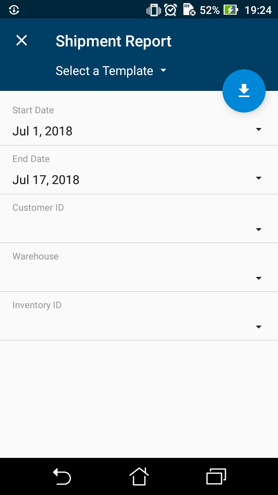
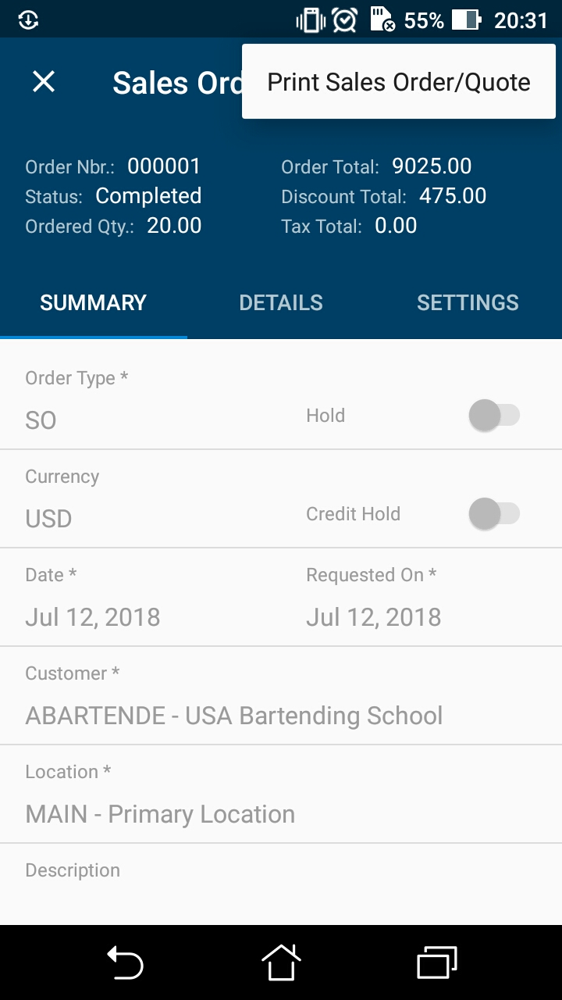
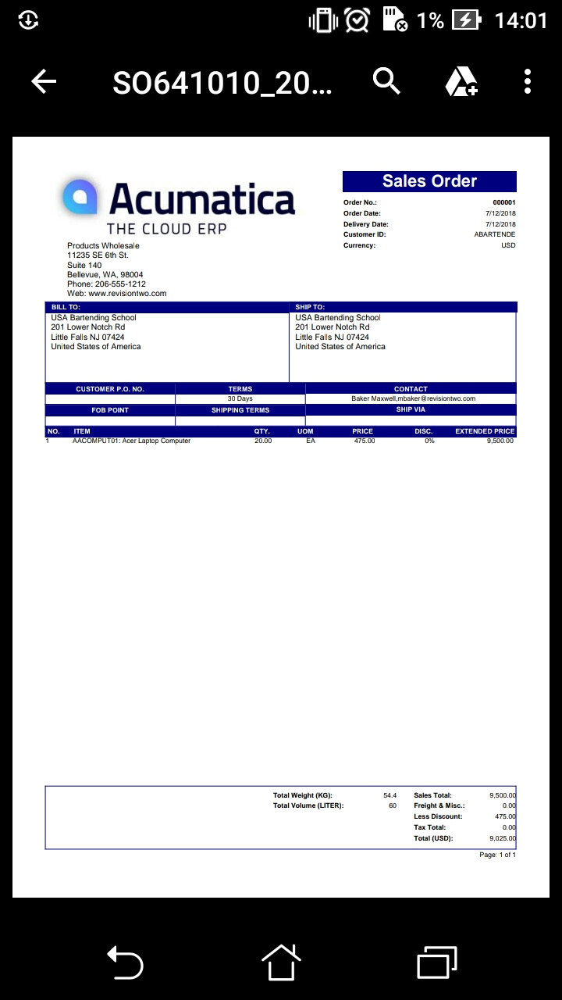

# Mapping Reports {#_a298502e-2ec7-4fc9-a76c-2f74c3c6791e .reference}

A user can create and view an Acumatica Report Designer report through the mobile app if the following conditions are met:

-   The report form already exists in Acumatica ERP.
-   The report form metadata has been added to the mobile site map.
-   The user account has been granted access rights to view the report.

To map a report form to the mobile app, you have to add a screen for the report form. This screen must have the type attribute set to *Report*.

The following screenshot displays a sample screen of the *Report* type with the DisplayName attribute set to *Shipment Report*.



On the screenshot, notice the round blue button, which corresponds to the **Run Report** button on the report form toolbar in Acumatica ERP.

## Using an Action to Generate a Report { .section}

Acumatica Mobile Framework supports the Acumatica ERP actions that generate reports. To enable such an action in the mobile app, you should map the action to the form on which the action is invoked. For example, you could map the action to print a document to the entry form on which the document is created. In the mobile site map, the containerAction, recordAction, or selectionAction object has to contain the Redirect attribute set to *True*.

To map a report to the mobile app, do the following:

1.  Add the report form to the mobile site map. For details, see [To Add a Screen to the Mobile Site Map \(Example\)](MOBILE_MobileSiteMap_AddingMSDL.md).
2.  Add the report form to the mobile site map. For details, see [To Update the Site Map of a Mobile App](mobile_updatemainmenu.md).
3.  Map the action that opens the report.

For example, if you need to map the Sales Order \(SO641010\) report to the Sales Orders \(SO301000\) screen, do the following:

1.  Add the Sales Order report to the mobile site map. The screen code should look as follows.

    ```
    add screen SO641010 {
      type = Report
    }
    ```

2.  Add the report to the mobile site map. The code for the site map should look as follows.

    ```
    update sitemap {
      ...
      add item "SO641010" {
        displayName="Sales Order"
        visible=False
      }
    }
    ```

3.  In the Sales Orders screen, map the action that opens the Sales Order report. The mapping of the action should look as follows.

    ```
    update screen SO301000 {
      update container "OrderSummary" {
        add recordAction "PrintSalesOrder" {
          redirect = True
        }
      }
    }
    ```


The following screenshot shows the resulting action button for the report in the screen's menu.



When a user performs the action by using the mobile app, the app immediately receives the corresponding report in PDF format from the Acumatica ERP server and displays the report for the user, as shown in the following screenshot.



**Parent topic:**[Screens](../StudioDeveloperGuide/mobile_msdl_screens.md)

