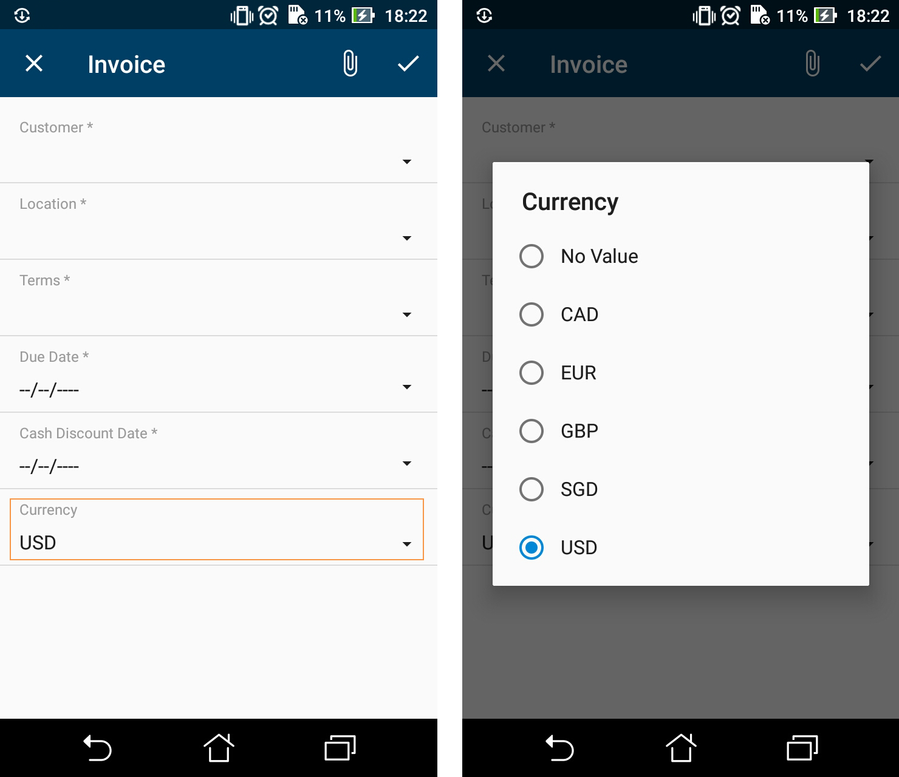

# Configuring Selectors {#_f5d08023-22d3-4e15-bc94-5b0ec85d9aa6 .reference}

You can configure selector fields to be displayed as pop-up windows or grids by using the selector instruction.

## Example: Configuring a Screen with Selectors { .section}

The following example configures a selector for the **Currency** field of the Invoices \(SO303000\) screen. To see an example, copy the code below to the Add: SO303000 Invoices page of the Customization Project Editor, and publish the project.

```
add screen SO303000 {
  add container "InvoiceSummary" {
    add field "Customer"
    add field "Location"
    add field "Terms"
    add field "DueDate"
    add field "CashDiscountDate"
     add field "Currency" {
      selector {
        add field "CurrencyID"
      }
      pickerType = Attached
    }
    add recordAction "Save" {
      behavior = Save
    }
  }
}
```

A selector with `pickerType="Attached"` is displayed as a field on the first screenshot and as a pop-up window on the second screenshot.



**Parent topic:**[Screens](../StudioDeveloperGuide/mobile_msdl_screens.md)

