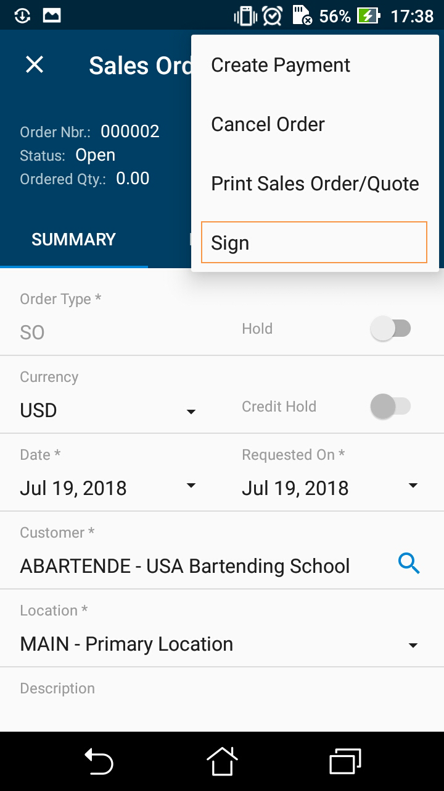
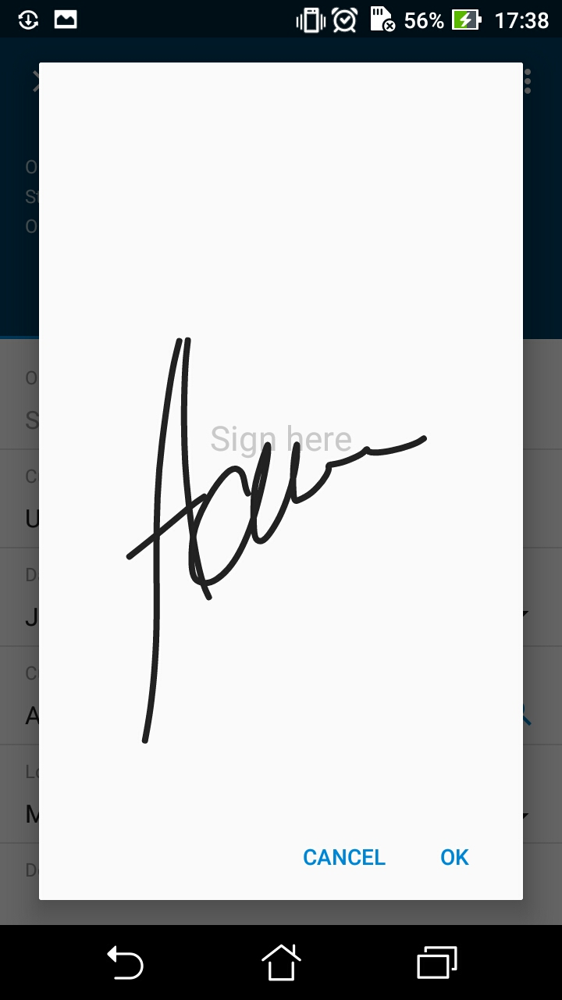
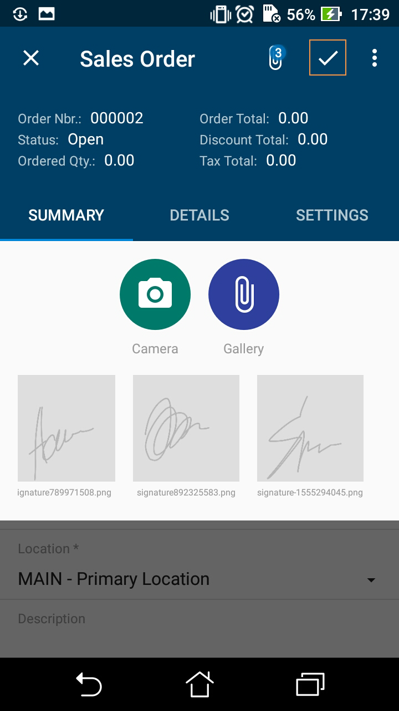

# Creating the User Signature {#_2daa9950-7424-4060-8f44-4d7cd519e1df .reference}

The mobile app provides the additional functionality for user to create a signature and attach the signature image file to an Acumatica ERP form that supports file attachments.

**Note:** This functionality does not work in the container object with attachments disabled \(the attachments instruction with the disabled attribute set to *True*\).

To add this functionality to your mobile app, you should update the corresponding page by adding the recordAction object with the behavior attribute set to *SignReport*. The container to which you add the recordAction object must support attachments.

For example, to add an area for adding a user signature to the Sales Orders \(SO301000\) screen, open the Update: SO301000 page \(for details, see [To Update a Screen of a Mobile App](mobile_updatescreen.md)\), and insert the following code in the **Commands** area.

```
update screen SO301000 {
  update container "OrderSummary" {
    ...
    add recordAction "SignReport" {
      behavior = SignReport
       displayName = "Sign"
    }
    ...
  }
}
```

As a result, the **Sign** action appears on the appropriate screen of the mobile app, as the following screenshot shows.



When the user clicks this action, the app displays a blank form with the **Cancel** and **OK** buttons and the words *Sign here* to instruct the user to add the signature, as shown in the following screenshot. A user can add multiple signatures to one record.



After the user clicks the Save \(✓\) button on the screen toolbar \(shown in the following screenshot\), the mobile app sends the signature file to the Acumatica ERP server, which saves the file in the database as a file attached to the appropriate form. In the mobile app, the attachment is displayed as an image that is attached to the Acumatica ERP form.



**Parent topic:**[Configuring Specific Functionality of a Screen](../StudioDeveloperGuide/MOBILE_MSDL_ScreenFunctionality.md)

