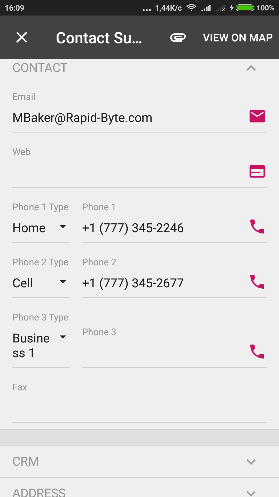

# field {#_e7d0b802-dedb-406d-aa24-27c767cd2710 .concept}

An object that maps a UI element field to the mobile app. This object can include fields, actions, nested containers, and other elements.

If a field from one container is also used in another container, you should use the `ContainerName#FieldName` format of the field name, where `ContainerName` is the name of the container \(as it is specified in the WSDL schema\) that contains the field, and `FieldName` is the name of the field in this container. See [Example: Displaying Fields from Different Containers in One Container](mobile_msdl_screen_nested.md#_b7eb3fd7-220f-4e6f-a513-82d0a73b2f9b) for details.

## Attributes { .section}

|Attribute|Description|
|---------|-----------|
|displayName|The name for the field, which by default is automatically set by the system. However, you can change it.|
|elementType|The type of the field. The attribute can have only one value: *FilePreview*. **Important:** A field marked with FilePreview should have a FileID value that corresponds to the FileID value in the UploadFile table in the instance database.

|
|forceIsDisabled|An indicator of whether the field will be unavailable on the editing form regardless of the server logic. By default, the field availability depends on the server logic.|
|forceIsVisible|An indicator of whether the field is visible on the editing form regardless of the server logic. By default, the field visibility depends on the server logic.|
|forceRequired|An indicator of whether the field is mandatory and must be filled in on the screen. If its value is *true*, the field is mandatory. If its value is *false*, the field is not mandatory. If the attribute is not specified, the need to fill the field is determined by the data obtained from the server.|
|forceType|The field type that is used by the application instead of the original field type. The only value of this attribute is *String*, which is an indicator of whether the field is visible on the editing form regardless of the server logic. By default, the field visibility depends on the server logic.|
|formPriority|The priority value that defines the position of the field on the form.|
|listDisplayFormat|The format that is used to display the field in the list. The value can be one of the following:-   *Value*: An indicator that the field is represented only by the field value in the list.
-   *CaptionValue*: An indicator that the field is represented by the caption and the value in the list.

This attribute is applicable only to selector fields. See [selector](MOBILE_Ref_MSDL_Instr_SELECTOR.md) and [Configuring Selectors](mobile_msdl_screen_selectors.md) for details.

|
|listPriority|The priority value that defines the position of the field in the list.|
|pickerType|The processing type of the selector field value; this attribute is applicable to only selector fields. The value can be one of the following:-   *Attached*: An indicator that the selector is displayed as a pop-up dialog box.
-   *Detached*: An indicator that the selector is displayed as a separate screen.
-   *Searchable*: An indicator that the mobile app should display the Search button \(\) right of the field control. If the user enters a text fragment in the control and clicks the button, the app sends to the Acumatica ERP server a query to search the records, and find those that contain the specified fragment in the field value. After the response, the mobile app opens the selector screen and displays the list of the field values obtained from the server. The user uses the list to select a value for the selector control.

|
|selectorDisplayFormat|The selector field format that is used to display the field value. The value can be one of the following:-   *Key*: An indicator that the value is represented by the key field of the selector.
-   *Description*: An indicator that the value is represented by the value field of the selector. This is the default value of the SelectorDisplayFormat attribute.
-   *KeyDescription*: An indicator that the value is represented by the combination of the key and value fields of the selector.

This attribute is applicable to only selector fields. See [selector](MOBILE_Ref_MSDL_Instr_SELECTOR.md) and [Configuring Selectors](mobile_msdl_screen_selectors.md) for details.

|
|special|The field type that is used by the mobile app for a specific purpose. The value can be one of the following:

 -   *AllowEdit* \(applicable to selector fields only\): An indicator that the app should display the Edit button \(\) right of the field. If the user taps the button, the mobile app opens the data entry form for the business entity \(such as a customer or sales order\), selected in the field. The button appears if both of the following conditions are met:
    -   On the Acumatica ERP form, the edit button is displayed for the corresponding control.
    -   In the mobile app, the field is not empty and contains an ID that can be used to select the appropriate data record of the business entity.
-   *Counter*: An indicator that the app should make this field editable in a list of records. This field type provides a user with the ability to edit the value of a field directly in a list of records without opening the record first. For details, see [Making a Record’s Fields Editable in a List of Records](Mobile_msdl_screen_edit_record_field.md).
-   *EmailAddress*: An indicator that the app should treat this field as an input box for an email address. It enables auto-complete for email addresses: As the user types an email address for a new email activity by using the on-screen keyboard, the system displays a list of possible completions, which are derived from the system database or from the device's address book. The *EmailAddress* value is not supported in iOS apps.
-   *EmailSend*: An indicator that the app should display the Send Email button \(\) right of the field control. If the user clicks the button, the mobile app forces the system of the mobile device to create a new email message and use the field value as the destination address for the message. In iOS, the Mail app is opened.
-   *GpsCoords*: An indicator that the app should obtain the location of the user's mobile device and fill the field before sending to the Acumatica ERP server the data record that is being modified on the screen. If the field with this attribute value does not have a value, an action mapped on the screen cannot be executed; for example, the user cannot save a data record that contains an empty field with the *Special* attribute set to *GpsCoords*.

The location is reported as a string in the following format: *&lt;Latitude&gt;:&lt;Longitude&gt;* \(for instance, *65.61295166666667:-20.137938333333334*\).

You can forcibly hide the field by setting the ForceIsVisible attribute to *false*, so it is not shown in the user interface, or you can make the field unavailable for editing by setting the ForceIsDisabled attribute to *true*. If the ForceIsVisible and ForceIsDisabled attributes are not specified, then the appropriate field state will be defined by the Acumatica ERP server.

-   *PhoneCall*: An indicator that the app should display the Phone Call button \(\) right of the field. If the user taps the button, the mobile app forces the system of the mobile device to open an app for voice calls with the phone number that has been specified in the field.
-   *UrlOpen*: An indicator that the app should display the Open URL button \(\) right of the field control. If the user clicks the button, the mobile app forces the system of the mobile device to launch the default browser \(Safari in iOS\) for the external URL specified in the field control.
-   ListSelection: An indicator that a field holds the current state of selection of an item in the list \(*true* for selected, *false* for unselected\). The option can be used only for Boolean fields.

 The following screenshot shows an example of using the Special attribute for fields mapped on a screen in the mobile app.



|
|textType|The type of text to be used for the field value. The value can be one of the following:-   *HTML*: The text can be HTML markup.
-   *PlainSingleLine*: The text is displayed on a single line.
-   *PlainMultiLine*: The text is displayed on multiple lines. The look of the input control depends on the platform.

|
|style|The visual emphasis and alignment of the field in the UI. When you’re specifying the visual emphasis, the value can be one of the following:-   *importance-low*: A smaller font size and lighter weight is used than medium
-   *importance-medium* \(default\): The medium font size and weight is used.
-   *importance-high*: A larger font size than medium and bold for the font weight is used.

When you’re specifying the alignment, the value can be one of the following:

-   *column-left* \(default\): The field is aligned to the left side of its container.
-   *column-right*: The field is aligned to the right side of its container.

**Attention:** The options of the style property work only when they’re defined within the scope of the *ListView* template \(that is, the layout property of a [layout](mobile_ref_msdl_objtypes_layout.md) object is set to *ListView\)*; they are ignored outside of this scope. This property can also be used with [recordActionLink](MOBILE_ref_MSDL_objtypes_RecordActionLink.md) objects in the same scope but with a different set of values. For details, see [Customizing the Design and Layout for a List of Records](Mobile_msdl_screen_customize_ListViewTemplate.md).

|
|weight|The value that is used to set the width of the field within the UI element line defined by the [layout](mobile_ref_msdl_objtypes_layout.md) object with the layout attribute set to *Inline*. The default value is *1*.In the following example, the `TotalAmount` field takes two-thirds of the total width, and the `Currency` field takes one-third.

```
add layout "Layout_1" {
      layout = "Inline"
      add field "ReceiptDetailsExpenseDetails#TotalAmount" {
        weight = 2
      }
      add field "ReceiptDetailsExpenseDetails#Currency" {
        pickerType = Attached
      }
    }
```

|

## Example { .section}

In the following example, a field is added.

```
add field "OrderNbr" {        
    forceIsDisabled = True        
    listPriority = 100      
}
```

**Parent topic:**[Object Types](../StudioDeveloperGuide/MOBILE_Ref_MSDL_ObjTypes.md)

