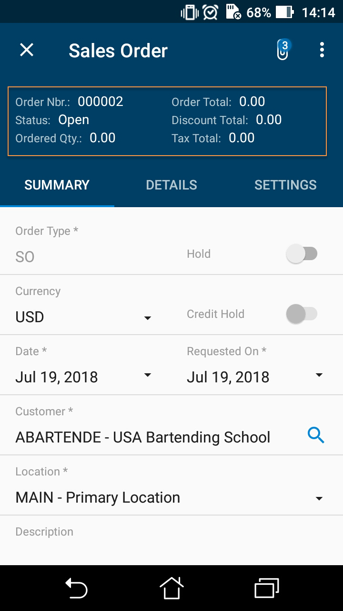

# layout {#_bd31e3a8-538f-47d5-84ff-251ca3d03c43 .concept}

An object that helps to arrange multiple UI elements on a screen of the mobile app. The object can contain the following types of nested objects:

-   [field](mobile_ref_msdl_objtypes_field.md)
-   [group](mobile_ref_msdl_objtype_group.md)
-   [containerLink](mobile_ref_msdl_objtype_containerlink.md)
-   [recordActionLink](MOBILE_ref_MSDL_objtypes_RecordActionLink.md)
-   layout

    **Note:** The layout object with the layout attribute set to one of the following can include nested layout objects whose layout attribute is set to *Inline*:

    -   *HeaderSimple*
    -   *HeaderFirstAttachment*
    -   *HeaderSticky*
    -   *ListView*
    -   *Tab*
    The layout objects for which the layout attribute is *DataTab* can include only containerLink objects.


## Attributes { .section}

|Attribute|Description|
|---------|-----------|
|Layout|The template used to define the layout. The following values can be used for this attribute:-   *HeaderSimple*: An indicator that the mobile app should arrange the UI elements that are mapped by the nested objects in a group-like header container.

An object with the attribute set to *HeaderSimple* can include nested layout objects with `layout=Inline`. An object with the attribute set to *HeaderSimple* cannot be nested in other layout objects and can be nested only in container objects.

**Note:** Fields inside a layout object of the *HeaderSimple* type are always displayed read-only.

-   *HeaderFirstAttachment*: An indicator that the mobile app should arrange the UI elements that are mapped by the nested objects in a group-like header container with an attachment icon on the left. If you click the attachment icon, you can take a photo and attach the photo to the screen of the mobile app. The camera behavior is affected by the attributes of the attachments instruction.

The tag with the attribute set to *HeaderFirstAttachment* can include nested layout objects with `layout=Inline`. The objects with the attribute set to *HeaderFirstAttachment* cannot be nested in other layout instruction and can be nested only in container objects.

**Note:** Fields inside a layout object of the *HeaderFirstAttachment* type are always displayed read-only.

-   *HeaderSticky*: An indicator that the mobile app should arrange the UI elements that are mapped by the nested objects in a group-like header container that is always displayed at the top of the screen. It means that when a user scrolls a screen, the header container stays at the top of the screen.

An object with the attribute set to *HeaderSticky* can include nested layout objects with `layout=Inline`. An object with the attribute set to *HeaderSticky* cannot be nested in other layout objects and can be nested only in container objects.

**Note:** Fields inside a layout object of the *HeaderSticky* type are always displayed read-only.

-   *ListView*: An indicator that in a list of records, the mobile app should adjust the appearance and alignment of the UI elements \(such as fields and actions\) of a record as defined by the objects nested within this layout. The appearance and alignment of the individual UI elements \(such as a field or action\) within each record can be customized in a number of ways. For details, see [Customizing the Design and Layout for a List of Records](Mobile_msdl_screen_customize_ListViewTemplate.md).

An object with the attribute set to *ListView* can include nested layout objects with `layout=Inline`. An object with the attribute set to *ListView* cannot be nested in other layout objects and can be nested only in container objects.

An object with the attribute set to *ListView* can also include nested layout objects with the following values for this attribute:

    -   *CaptionValueTemplate*
    -   *Column*
    -   *Inline*
**Note:** Fields inside a layout object of the *ListView* type are always read-only.

-   *CaptionValueTemplate*: An indicator that the mobile app should use a table format to arrange the UI elements \(fields\) that are mapped by the nested objects and organize them as name–value pairs in individual rows.

The object with the attribute set to *CaptionValueTemplate* works as described only when it is nested within a layout object with layout=ListView. The system ignores the usage of *CaptionValueTemplate* outside of this scope. For details, see [Customizing the Design and Layout for a List of Records](Mobile_msdl_screen_customize_ListViewTemplate.md).

-   *Column*: An indicator that the mobile app should arrange the UI elements \(fields\) that are mapped by the nested objects in a vertical stack.

The object with the attribute set to *Column* only works as described when it is nested within a layout object with layout=ListView. The system ignores the usage of *Column* outside of this scope. For details, see [Customizing the Design and Layout for a List of Records](Mobile_msdl_screen_customize_ListViewTemplate.md).

-   *Inline*: An indicator that the mobile app should arrange UI elements that are mapped by the nested tags in a line by using the Weight attributes specified for these elements. If the Weight attribute is not defined for a nested tag, the mobile app uses *1* as the default value.

The object with the attribute set to *Inline* can include nested layout objects. The objects with the attribute set to *Inline* can be nested in other layout objects.

-   *Tab*: An indicator that the mobile app can contain elements valid for templates, such as other layouts with *Inline* template, recordAction objects, and cotainerLink objects.

Objects that are inside the object wrapping the tab object but not included in the tab explicitly are located in a default tab that is always displayed in the mobile app as the first tab on the screen. The name of the default tab is *Summary*.

-   *DataTab*: A layout object that can contain only [containerLink](mobile_ref_msdl_objtype_containerlink.md) objects. Containers that are referenced using containerLink objects from the dataTab are displayed as a list of elements, not links to containers.
-   *EmbeddedList*: A layout object that can contain a single [containerLink](mobile_ref_msdl_objtype_containerlink.md) object. The option allows the support of embedded list markup.

|

## Example { .section}

In the following example, the fields are arranged in three rows using the layout object.

```
add layout "OrderHeader" {
  displayName = "OrderHeader"
  layout = "HeaderSimple"
  add layout "OrderHeaderNbrRow" {
    layout = "Inline"
    add field "OrderNbr"
    add field "OrderTotal"
  }
  add layout "OrderHeaderTaxTotalRow" {
    layout = "Inline"
    add field "Status"
    add field "DiscountTotal"
  }
  add layout "OrderHeaderTotalRow" {
    layout = "Inline"
    add field "OrderedQty"
    add field "TaxTotal"
  }
}
```

The result is presented on the following screenshot.



**Parent topic:**[Object Types](../StudioDeveloperGuide/MOBILE_Ref_MSDL_ObjTypes.md)

