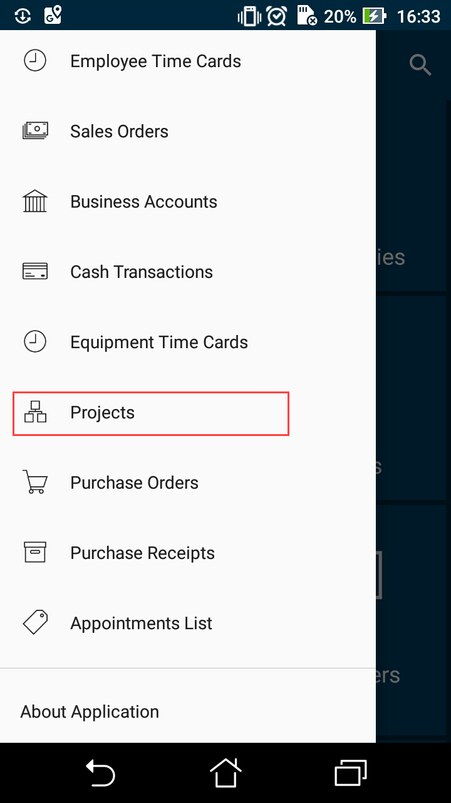

# Sidebar Menu {#_c4a7a3b3-a0ea-4143-8a88-6ca8d9dcdc2d .concept}

**Important:** As of Acumatica ERP 2026 R1, the sidebar menu of the Acumatica mobile app has been deprecated. Customization projects that contain modification to the sidebar menu will no longer work. We recommend that you use the workspace functionality and add the required records and screens to Favorites. \(For details, see [Home Screen](mobile_msdl_mainmenu.md).\)

The mobile app has a *sidebar menu*, which is the shortcut menu for favorite folders and screens. You can add links to folders and screens to the sidebar menu.

## Example: Adding a Screen to the Sidebar Menu { .section}

To add a folder or screen to the sidebar menu, you need to set the IsDefaultFavorite attribute of the folder or screen to *true*.

To do this, copy the code below to the Commands area of the Update: MENU page, and publish the customization project.

```
update sitemap {
  ...
  update item "PM301000" {    
    isDefaultFavorite = True  
  }
  ...
}
```

The resulting sidebar menu of the mobile app will include a link for quick access to the Projects \(PM301000\) screen.



**Parent topic:**[Configuring the Mobile Site Map](../StudioDeveloperGuide/MOBILE_MSDL.md)

