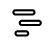

# Engineering Workbench {#_a6b21aa9-c154-43f8-bd28-0eefc8a66743 .reference}

Form ID: \(AM208100\)

You use this form to view, create, and modify bills of material \(BOMs\), including multilevel BOMs, displayed in a tree structure.

On this form, you can do any of the following:

-   Change the order of operations

    **Attention:** When you reorder operations, the system automatically updates the operation IDs based on the new order.

-   Change the order of materials within an operation
-   Move materials between operations
-   Add new operations or materials
-   Delete operations or materials
-   Click a tree node to view its settings and modify these settings if needed

To move a node within the tree, you drag the node to the needed position. Some movements are forbidden, such as the movement of an operation at a lower level than another operation or the movement of a material under another material. If you attempt a forbidden movement, the system displays an error message and does not move the node.

**Attention:** The system saves changes to the selected bill of material each time you move nodes in the tree.

## Form Toolbar { .section}

The form toolbar and More menu include the buttons and commands described below.

|Command|Description|
|-------|-----------|
|**Archive BOM**|Changes the status of the bill of material revision to *Archived*. A bill of material revision with this status cannot be used for production, for planning, or as a source for estimates and configurations.|
|**BOM Attributes**|Opens the [BOM Attributes](AM_20_85_00.md) \(AM204500\) form so that the attributes of the selected BOM can be viewed or edited.|
|**BOM Summary**|Opens the [BOM Summary](AM_61_10_00.md) \(AM611000\) report for the BOM, where you can view all materials of the BOM and their unit costs.|
|**Calculate BOM Cost**|Opens the [BOM Cost Settings](#_028408b7-3291-422e-9f76-0ed26177cec9) dialog box, where you can specify the settings for calculating the BOM cost for a specific lot size.

 If you click **OK** in the dialog box, the system calculates the costs and displays them in the [BOM Cost Summary](#_6fd2224f-ae9a-4239-9f0a-1148658071cc) dialog box, which it opens.

|
|**Compare BOM**|Opens the [BOM Compare](AM_41_00_00.md) \(AM410000\) form, and populates the left pane of the form with the tree view of the current bill of material and revision.|
|**Copy BOM**|Opens the [Copy BOM](#_703fd196-6df2-4689-80f1-8709f39a22db) dialog box, in which you can specify the settings for copying the current bill of material to a new bill of material.|
|**Create ECR**|Opens the [Engineering Change Request](AM_21_00_00.md) \(AM210000\) form populated with the applicable settings of the current BOM.|
|**Multilevel**|Opens the [Multilevel BOM](AM_41_30_00.md) \(AM413000\) report for the BOM.|
|**Set as Default BOM**|Opens the [Default BOM Levels](#_e0819d9b-562f-422e-bcb0-a25a8e62976d) dialog box. In the dialog box, you can select the combination of entities \(any of the following: item, warehouse, or subitem\) for which the selected bill of material is set as the default.|
|**Set as Planning BOM**|Opens the [Planning BOM Levels](#_569e67ab-5e59-47a7-8773-42930d815426) dialog box. In the dialog box, you can select the combination of entities \(any of the following: item, warehouse , or subitem\) for which the selected bill of material is set as the planning BOM.|

|Element|Description|
|-------|-----------|
|The **Copy From** section has the following elements.|
|**From BOM ID**|The identifier of the selected BOM whose settings will be copied.|
|**From Revision**|The BOM revision.|
|**From Inventory ID**|The inventory ID of the BOM.|
|**From Warehouse**|The warehouse ID of the BOM.|
|The **Copy To** section has the following elements.|
|**To BOM ID**|The identifier of the bill of material that will be created.

 This box is available only if the **Manual Numbering** check box is selected on the [Numbering Sequences](../Shared/../UserGuide/CS_20_10_10.md) \(CS201010\) form for the numbering sequence that is used for bills of material, as specified on the [BOM Preferences](../Shared/../UserGuide/AM_10_10_00.md) \(AM101000\) form. If the check box is cleared, the system will assign the identifier automatically.

|
|**To Revision**|The revision of the BOM to be created.|
|**To Inventory ID**|The identifier of the inventory item for which the BOM will be created.|
|**To Warehouse**|The identifier of the default warehouse for storing the item to be produced.|
|**Update Material Warehouse**|A check box that indicates \(if selected\) that the system will copy the warehouse ID specified in the **To Warehouse** box to all material lines of the new BOM only if another warehouse is specified in the material lines; also, the system will clear the warehouse location in the material lines. For material lines with the **Warehouse** column left empty, the system will not copy the warehouse.|
|The **Copy Notes** section has the following elements.|
|**BOM Header**|A check box that indicates \(if selected\) that the system will copy notes specified at the BOM level to the new BOM.|
|**Operation**|A check box that indicates \(if selected\) that the system will copy notes specified at the operation level to the new BOM.|
|**Material**|A check box that indicates \(if selected\) that the system will copy notes specified at the material level to the new BOM.|
|**Step**|A check box that indicates \(if selected\) that the system will copy notes specified at the step level to the new BOM.|
|**Tool**|A check box that indicates \(if selected\) that the system will copy notes specified at the tool level to the new BOM.|
|**Overhead**|A check box that indicates \(if selected\) that the system will copy notes specified at the overhead level to the new BOM.|
|The dialog box has the following buttons.|
|**Copy**|Creates the copy of the bill of material with the specified settings, closes the dialog box, and opens the new bill of material on the form.|
|**Cancel**|Closes the dialog box without creating a copy of the bill of material.|

|Element|Description|
|-------|-----------|
|The dialog box has the following boxes.|
|**Lot Size**|The lot size for which you would like to view costs.|
|**Level**|The BOM level for which you would like to view BOM costs.

 You can select one of the following options:

 -   *Single*: The system will not consider the subassemblies added as BOM materials when calculating the costs.
-   *Multi*: The system will calculate the cost considering all subassemblies added as BOM materials

|
|The dialog box has the following buttons.|
|**OK**|Closes the dialog box and opens the [BOM Cost Summary](../Shared/../UserGuide/AM_20_81_00.md#_6fd2224f-ae9a-4239-9f0a-1148658071cc) dialog box with the calculated costs based on the settings you have selected.|
|**Cancel**|Closes the dialog box without displaying BOM costs.|

|Element|Description|
|-------|-----------|
|Before the sections of the dialog box, the following element is shown.|
|**Lot Size**|Read-only. The lot size that you entered in the **BOM Cost Settings** dialog box. Fixed costs are divided by this lot size to calculate the unit cost.|
|The **Labor** section contains the following elements.|
|**Fixed Labor**|The fixed labor cost, which the system calculates by using the following formula: `Sum of ((Operation setup time) * (Work center standard cost adjusted with shift differentials)) for all BOM operations`.|
|**Variable Labor**|The variable labor cost, which the system calculates by using the following formula: `(Sum of ((Run time per run unit) * (Work center standard cost adjusted with shift differentials)) for all BOM operations) * (Lot size)`.**Attention:** If a rate type of an operation run time is pieces per hour, the system converts the rate to hours per piece first.

|
|The **Overhead** section contains the following elements.|
|**Fixed Overhead**|The total of the overhead costs with a type of *Fixed*.|
|**Variable Overhead**|The total of the overhead costs with a type of *Variable*.|
|The **Other Costs** section contains the following elements.|
|**Machine**|The total machine cost, which the system calculates by using the following formula: `Sum of ((Machine hours) * (Machine rate)) for all BOM operations * (Lot size)`.|
|**Tools**|The total tool costs for all operations. The system calculates the tool costs for the lot size you have specified.|
|**Material**|The total material cost, which the system calculates by using the following formulas:

 -   For a zero batch size: `Sum of (Quantity required * (1 + Scrap factor) * (Current unit cost of the item–warehouse pair) for all BOM materials) * (Lot size)`
-   For a nonzero batch size: `Sum of (Quantity required * (1 + Scrap factor) * (1 / Batch Size) * (Current unit cost of the item–warehouse pair) for all BOM materials) * (Lot size)`

|
|The **Totals** section contains the following elements.|
|**Unit Cost**|The unit cost, which the system calculates by using the following formula: `(The total of all costs) / (Lot size)`.|
|**Total Cost**|The sum of all costs.|
|The dialog box has the following button.|
|**OK**|Closes the dialog box.|

|Element|Description|
|-------|-----------|
|The dialog box has the following elements.|
|**Item**|A check box that you select to specify the bill of material in the **Default BOM ID** box on the **Manufacturing** tab of the [Stock Items](../Shared/../UserGuide/IN_20_25_00.md) \(IN202500\) form for the item specified in the **Inventory ID** box of the Summary area.|
|**Subitem**|A check box that you select to specify the bill of material in the **Default BOM ID** column of the **Sub Item Defaults** table on the **Manufacturing** tab of the [Stock Items](../Shared/../UserGuide/IN_20_25_00.md) form and, if the record for the combination of the item and warehouse exists, on the [Item Warehouse Details](../Shared/../UserGuide/IN_20_45_00.md) \(IN204500\) form for the subitem specified in the **Subitem** box of the Summary area.

 This check box is displayed only if the *Inventory Subitems* feature is enabled on the [Enable/Disable Features](../Shared/../UserGuide/CS_10_00_00.md) \(CS100000\) form.

 **Important:** The **Inventory Subitems** check box has been removed from the [Enable/Disable Features](../Shared/../UserGuide/CS_10_00_00.md) \(CS100000\) form because the functionality associated with the *Inventory Subitems* feature will be phased out. If you have this feature enabled in your system, the associated functionality remains available. To disable the feature, contact your Acumatica support provider.

|
|**Warehouse**|A check box that you select to specify the bill of material in the **Default BOM ID** box on the **Manufacturing** tab of the [Item Warehouse Details](../Shared/../UserGuide/IN_20_45_00.md) \(IN204500\) form for the item and warehouse specified in the **Inventory ID** and **Warehouse** boxes of the Summary area accordingly.|
|The dialog box has the following button.|
|**Update**|Specifies the bill of material as the default bill of material for the selected entities and closes the dialog box.|
|**Cancel**|Closes the dialog box without specifying the bill of material as the default bill of material for any entities.|

|Element|Description|
|-------|-----------|
|The dialog box contains the following elements.|
|**Item**|A check box that you select to specify the bill of material in the **Planning BOM ID** box on the **Manufacturing** tab of the [Stock Items](../Shared/../UserGuide/IN_20_25_00.md) \(IN202500\) form for the item specified in the **Inventory ID** box of the Summary area.|
|**Subitem**|A check box that you select to specify the bill of material in the **Planning BOM ID** column of the **Sub Item Defaults** table on the **Manufacturing** tab of the [Stock Items](../Shared/../UserGuide/IN_20_25_00.md) \(IN202500\) form and, if the record for the combination of the item and warehouse exists, on the [Item Warehouse Details](../Shared/../UserGuide/IN_20_45_00.md) \(IN204500\) form for the subitem specified in the **Subitem** box of the Summary area.

 This check box is displayed only if the *Inventory Subitems* feature is enabled on the [Enable/Disable Features](../Shared/../UserGuide/CS_10_00_00.md) \(CS100000\) form.

 **Important:** The **Inventory Subitems** check box has been removed from the [Enable/Disable Features](../Shared/../UserGuide/CS_10_00_00.md) \(CS100000\) form because the functionality associated with the *Inventory Subitems* feature will be phased out. If you have this feature enabled in your system, the associated functionality remains available. To disable the feature, contact your Acumatica support provider.

|
|**Warehouse**|A check box that you select to specify the bill of material in the **Planning BOM ID** box on the **Manufacturing** tab of the [Item Warehouse Details](../Shared/../UserGuide/IN_20_45_00.md) \(IN204500\) form for the item and warehouse specified in the **Inventory ID** and **Warehouse** boxes of the Summary area accordingly.|
|The dialog box has the following button.|
|**Update**|Specifies the bill of material as the planning bill of material for the selected entities and closes the dialog box.|
|**Cancel**|Closes the dialog box without specifying the bill of material as the planning bill of material for any entities.|

## Summary Area { .section}

In this area, you can view general information about the bill of material, such as the identifier, the status, and the effective date. You can change information in this area if the bills of material is assigned the *On Hold* status—that is, when the **Hold** check box is selected.

|Element|Description|
|-------|-----------|
|**BOM ID**|The identifier of the bill of material.|
|**Revision**|The identifier of the BOM revision, which is the modification of the bill of material.

 This box has the *string* data type, meaning that you can enter both alphabetic and numeric characters.

 **Attention:**

If you choose to use numeric values for revision tracking, it is important that you add leading zeros to ensure the correct sort order \(for example, *02*\). Without leading zeros, string-based sorting will incorrectly sequence revisions. For example, revisions *2*, *3*, and *10* would be sorted into the following order: *10*, *2*, and *3*.

When you create an additional BOM revision, the system copies to the new revision all settings \(including all attributes, notes, and attachments\) of the revision whose ID is last in the string-based sort \(when the list is sorted by ID in ascending order\). In the example above, revision 3 would be used as the basis for the new BOM revision.

|
|**Hold**|A check box that you select to change the bill of material's status to *On Hold* so that you can make changes to it.

 If the **Hold BOM Revisions on Entry** check box is selected on the [BOM Preferences](../Shared/../UserGuide/AM_10_10_00.md) \(AM101000\) form, for a new bill of material, this check box is selected by default. Otherwise, this check box is cleared and the bill of material is assigned the *Active* status.

|
|**Status**|The status of the revision.

 The status can be any of the following:

 -   *Active*: The BOM revision can be used for production, for planning, or as a source for estimates and configurations.
-   *On Hold*: The BOM revision can be edited.
-   *Archive*: The BOM revision has been archived and is unavailable for use.

|
|**Description**|A description of the bill of material. The system copies the description to production orders that are created by using the bill of material.|
|**Inventory ID**|The identifier of the stock item that is produced by using the bill of material.|
|**Subitem**|The subitem of the stock item.

 This box is visible only if the *Inventory Subitems* feature is enabled on the [Enable/Disable Features](../Shared/../UserGuide/CS_10_00_00.md) \(CS100000\) form.

**Important:** The **Inventory Subitems** check box has been removed from the [Enable/Disable Features](../Shared/../UserGuide/CS_10_00_00.md) \(CS100000\) form because the functionality associated with the *Inventory Subitems* feature will be phased out. If you have this feature enabled in your system, the associated functionality remains available. To disable the feature, contact your Acumatica support provider.

|
|**Warehouse**|The warehouse to which the produced stock item is received when the item production is completed.|
|**Start Date**|The date when the BOM revision becomes effective.|
|**End Date**|The last date when the BOM revision is effective. After this date, users will not be able to create production orders based on the BOM. You can specify this date if the revision is effective during a limited period of time.

 When you click the **Archive BOM** command, the system sets this date to the current business date.

|

## Left Pane { .section}

In the left pane, you can view the bill of material structure in the tree. You can also modify the BOM by dragging the tree nodes to the needed locations if the BOM is on hold.

|Element|Description|
|-------|-----------|
|Filter|In this box, you enter keywords and the system displays only the tree nodes that contain the keywords in the ID or description.|

|Element|Description|
|-------|-----------|
|BOM tree|Displays the operations and materials. If a material is a subassembly, all the nested operations and materials are also displayed.

 For the list of icons that represent the tree nodes, see [Table 9](#_5df6b873-2852-4268-bb3a-6f646c9ed6d9).

|
|**Qty.**|The quantity of the material required for an operation.|
|**UOM**|The unit of measure for the material quantity.|
|Commands|The More button, which you can click to view the commands that are appropriate for the selected node. For the list of possible commands, see the following table.

 This column is displayed on the pane only if the selected bill of material has the *On Hold* status.

|

|Command|Description|
|-------|-----------|
|If the tree node is a bill of material, the following command is available on the More menu.|
|**Add child**|Adds a new operation.|
|If the tree node is an operation, the following commands are available on the More menu.|
|**Add sibling**|Adds a new operation on the same level as the current operation.|
|**Add child**|Adds a new material beneath the operation.|
|**Delete**|Deletes the operation.|
|If the tree node is a material, the following commands are available on the More menu.|
|**Add sibling**|Adds a new material on the same level as the current material.|
|**Delete**|Deletes the material.|

|Icon|Description|
|----|-----------|
||The top-level bill of material.|
||An operation that is performed internally.|
||An outside operation.|
||A material that is a subassembly. This material has an assigned bill of material.|
||A material that is a phantom subassembly.|
||A material of an outside operation that is a subassembly.|
||A material that is a finished stock item.|
||A material that is a phantom stock item without a BOM assigned.|
||A material of an outside operation that is a finished stock item.|
||A material that is a non-stock item.|
||A material that is a phantom non-stock item without a BOM assigned.|
||A material of an outside operation that is a non-stock item.|

## Right Pane for an Operation Node { .section}

On the right pane, you can view the settings of the selected tree node. You can also make changes to these settings if the status of the selected bill of material is *On Hold*. The information on the pane differs depending on the type of node that is selected in the tree; when the top-level node is selected \(the bill of material itself\), no information is displayed on the pane.

This section describes the contents of the right pane if an operation node is selected in the BOM tree.

|Element|Description|
|-------|-----------|
|**Operation ID**|The numeric identifier of the operation, which determines the sequence in which operations are executed in production orders.|
|**Work Center**|The work center where the operation takes place.|
|**Operation Description**|The description of the operation. The system copies the value to this box from the work center description on the [Work Centers](../Shared/../UserGuide/AM_20_70_00.md) \(AM207000\) form.|

|Element|Description|
|-------|-----------|
|**Operation ID**|The numeric identifier of the operation, which determines the sequence in which the operation is executed in production orders. We recommend that you use a consistent numbering scheme that gives you the ability to insert operations, such as *10*, *20*, and *30* rather than *1, 2*, and *3*. For details, see [Bills of Material: Operations](BOM_Operations.md).

 You can change this identifier, and if necessary, the system will change the sequence of operations. Any changes in the sequence will be reflected in new production orders based on this bill of material but not existing ones.

 **Attention:** When a user creates a production order, the system generates operation identifiers, which may differ from those in the bill of material on which the order is based. During the generation of operation IDs for the production order, the system maintains the order of operations specified in the bill of material. In the production order, the system assigns *0010* as the identifier of the first operation and then increases the identifier of each new operation by 10. Thus, the second operation ID will be *0020* and the third operation ID will be *0030*.

|
|**Work Center**|The active work center where the operation takes place. The work center determines the standard labor costs for the cost rollups.|
|**Oper Desc**|The description of the operation. The system copies the value to this box from the work center description on the [Work Centers](AM_20_70_00.md) \(AM207000\) form.|
|**Setup Time**|The time it takes to prepare to start the operation. Based on this time, the system adds a fixed labor cost to the cost of the produced item regardless of the size of the order. The system always backflushes the setup time for the first labor or move transaction to record the quantity completed.|
|**Run Units**|The number of units produced during the specified run time for the operation.|
|**Run Time**|The time required to produce the specified run units of the operation. If the number of run units is zero, then the system does not consider the run time in the production cost.|
|**Machine Units**|The number of units produced during the specified machine time for the operation. You specify the value of this box if machines are involved in the operation.|
|**Machine Time**|The time required to produce the number of machine units specified for the operation. If the number of machine units is zero, then the system does not consider the machine time in the production cost. You specify the value of this box if machines are involved in the operation.|
|**Backflush Labor**|A check box that indicates \(if selected\) that the system backflushes the cost of the labor hours spent for the operation.

 **Attention:** The system does not apply this setting to machine time, which is always backflushed.

 The system copies the default state of the check box from the **Backflush Labor** check box on the [Work Centers](AM_20_70_00.md) \(AM207000\) form.

|
|**Control Point**|A check box that indicates \(if selected\) that the operation is a control point. If it is, for this operation, workers must record the quantity of completed items.|
|**Queue Time**|The time a semi-finished item has to wait in the work center before workers can start processing the item.|
|**Finish Time**|The time required for the semi-finished item to be prepared for the next operation when the current operation has been finished.|
|**Move Time**|The time for a semi-finished item to be moved from the work center where the current operation is performed to the work center where the next operation will be performed.|
|**Scrap Action**|The default scrap action for the operation in new production orders. You can select one of the following options:-   *No Action:* The system does not calculate the scrap cost separately. When workers record scrap in a move or labor transaction for a production order, the system adds the scrap cost to the total cost of the production order.
-   *Write-Off:* The system posts the scrap cost to the scrap expense account. A reason code specifies the scrap expense account and subaccount.
-   *Quarantine:* The system posts the scrap cost to the scrap expense account and creates an inventory adjustment for the scrap quantity and value.

The system copies the default value of this box from the **Scrap Action Default** box on the [Work Centers](AM_20_70_00.md) \(AM207000\) form.

|

|Element|Description|
|-------|-----------|
|**Reference Designators**|Opens the [Reference Designators](#_4a01e94b-6602-446d-87b8-c1c8a857d5e6) dialog box.|
|**Reset Lines**|Resets the values in the **Line Order** column to the original order of lines. **Attention:** This column is hidden by default. You can display this column in the table by using the **Column Configuration** dialog box. For details, see [Adjustment of the Acumatica ERP UI: To Personalize a View of a Form](../Shared/../UserGuide/GS_ModernUI_User_Interface_Personalization_Activity.md).

|
|The table contains the following columns.|
|**Inventory ID**|The identifier of the item used as a material.|
|**Subitem**|The subitem of the inventory item.

 This box is visible only if the *Inventory Subitems* feature is enabled on the [Enable/Disable Features](../Shared/../UserGuide/CS_10_00_00.md) \(CS100000\) form.

**Important:** The **Inventory Subitems** check box has been removed from the [Enable/Disable Features](../Shared/../UserGuide/CS_10_00_00.md) \(CS100000\) form because the functionality associated with the *Inventory Subitems* feature will be phased out. If you have this feature enabled in your system, the associated functionality remains available. To disable the feature, contact your Acumatica support provider.

|
|**Description**|The description of the inventory item.|
|**Required Qty.**|The material quantity needed to produce the item. The system calculates the final quantity based on the combination of this value and the value of the **Batch Size** column.

 A negative quantity indicates that the row represents a by-product.

|
|**Batch Size**|The additional parameter that you can use to flexibly set up the required material quantity. The system uses this value to calculate the final quantity of the material.

 You specify the value of the box as follows:

 -   `0`: The required quantity does not depend on the quantity of the item being produced. The system always uses the quantity specified in the **Required Qty.** column.
-   `1` \(default\): The required quantity of the material is multiplied by the quantity of the item being produced.
-   `2` or greater: The required quantity of the material is divided by this value. You can use this option, for example, if materials are supplied in non-base units of measure.

 For more information, see [Bills of Material: Operations](BOM_Operations.md).

|
|**UOM**|The unit of measure for the quantity specified in the **Required Qty.** column.

 The system copies the default value from the [Stock Items](IN_20_25_00.md) \(IN202500\) form. You can specify a different unit of measure, if needed.

|
|**Unit Cost**|The unit cost for the material.

 The system copies the default value from the **Price/Cost** tab of the [Stock Items](IN_20_25_00.md) \(IN202500\) form depending on the valuation method of the item as follows:

 -   *Average* or *FIFO*: The system copies the value of the **Average Cost** box. If the average cost is zero, then the value of the **Last Cost** box is used.
-   *Standard*: The system copies the value of the **Standard Cost** box.
-   *Specific*: The system copies the value of the **Last Cost** box.

 You can change the unit cost, if needed. If the unit cost was not changed manually, the system updates this value during the cost roll process on the [Process Cost Rollup Results](AM_50_80_00.md) \(AM508000\) form.

|
|**Planned Cost**|The planned cost of the inventory item. The system calculates the planned cost when a user creates a production order based on the BOM and then recalculates the cost when the user releases the production order.**Attention:** This column has been added for informational purposes only.

|
|**Material Type**|The type of the material.

 You can select one of the following options:

 -   *Regular* \(default\): The material is either a finished item or a subassembly \(if it has a bill of material assigned\).
-   *Phantom*: The material is a phantom subassembly.
-   *Subcontract*: The material is supplied to a subcontractor if the operation is outsourced.

|
|**Subcontract Source**|The source of the material. The column is available only when *Subcontract* is selected in the **Material Type** box.

 You can select one of the following options:

 -   *None*: The default option for materials of the type other than *Subcontract*. If the material type is *Subcontract*, you cannot select this option.
-   *Purchase*: The material is to be purchased by using a standard purchase order. You select this option for a material row that represents a vendor service. Each outside processing operation must have at least one material row with this source. When you select this option, the check box in the **Mark for PO** column is selected automatically for the material line in a production order on the [Production Order Details](AM_20_90_00.md) \(AM209000\) form.
-   *Drop Ship*: The material is sent directly to the vendor. You can select this option for informational purposes.
-   *Vendor Supplied*: The material is supplied by the vendor. You can select this option for informational purposes.

**Attention:** Vendor-supplied materials are not included in the production order cost.

-   *Ship to Vendor*: The material is shipped to the vendor by using a vendor shipment, which you create by using the [Vendor Shipments](AM_31_00_00.md) \(AM310000\) form.

|
|**Phantom Routing**|The way of adding operations of the material that is a phantom subassembly to production orders based on the BOM.

 You can select one of the following options:

 -   *Before* \(default\): Operations of the phantom subassembly are included in a production order before the parent operation.
-   *After*: Operations of the phantom subassembly are included in a production order after the parent operation
-   *Exclude*: Operations of the phantom subassembly are not included in a production order, but the materials of the subassembly are included in the materials list for the parent operation.

|
|**Backflush Materials**|A check box that indicates \(if selected\) that the material is backflushed. If the check box is cleared, you must issue materials for the operation on the [Materials](AM_30_00_00.md) \(AM300000\) form before workers can record labor time or produced item quantities.

 The system copies the default state of this check box from the **Backflush Materials** check box on the [Work Centers](AM_20_70_00.md) \(AM207000\) form.

|
|**Warehouse**|The warehouse from which the material is issued. If this box is empty, the system uses the warehouse specified in the **Warehouse** box of a production order on the [Production Order Maintenance](AM_20_15_00.md) \(AM201500\) form.|
|**Location**|The warehouse location from which the material is issued. If the column is empty, the system selects a warehouse location, as described in [Production Processing: Selection of Warehouse Locations](MFG_PM_BinLocations.md).

 If the **Backflush** check box is selected and the warehouse location is specified, the material is issued only from this location as follows:

 -   If the **Allow Negative Quantity** check box is selected for the item class assigned to the material, the system issues the material from this location regardless of the required quantity.
-   If the **Allow Negative Quantity** check box is cleared, the system issues only the material quantity that is available in this location.
-   If the **Allow Negative Quantity** check box is cleared and the available material quantity in the location is zero, the system does not issue the material and returns an error message on the form from which the material issue has been requested.

|
|**Comp. BOM ID**|The bill of material that is used to produce the material that is a subassembly. You can specify the BOM in this column if a bill of material that differs from the default one should be used to produce the material for the BOM selected in the Summary area.

 If the column is empty, the system uses the BOM specified in the **Default BOM ID** box either on the [Stock Items](IN_20_25_00.md) \(IN202500\) or [Item Warehouse Details](IN_20_45_00.md) \(IN204500\) form.

|
|**Comp. BOM Revision**|The revision of the BOM that is specified in the **Comp. BOM ID**. This box is required if the BOM is specified.|
|**Scrap Factor**|The scrap or shrinkage factor for the material. The system uses this value to calculate the needed material quantity and the material cost for the item being produced in a production order and during material requirements planning.

 You enter the scrap percentage as a decimal value, such as *0.1* for 10% of scrap per item unit.

 You specify this value if the material scrap is common and the system must consider it during the calculation of the material quantity and cost.

|
|**Bubble Nbr.**|The number of the material on the engineering drawing that relates to the BOM.|
|**Effective Date**|The date when the system starts using the material for the item production. This date is independent of the start and end dates of the BOM.|
|**Expiration Date**|The date when the system stops using the material for the item production. This date is independent of the start and end dates of the BOM.|
|**Line Order**|The number that indicates the order of the material in the list.

 **Attention:** This column is hidden by default. You can display this column in the table by using the **Column Configuration** dialog box. For details, see [Adjustment of the Acumatica ERP UI: To Personalize a View of a Form](../Shared/../UserGuide/GS_ModernUI_User_Interface_Personalization_Activity.md).

|

|Element|Description|
|-------|-----------|
|**Ref Des**|The identifier of the reference designator to be added.|
|**Description**|The description of the new reference designator.|
|The dialog box contains the following buttons.|
|**OK**|Saves your changes and closes the dialog box.|
|**Cancel**|Closes the dialog box without saving your changes.|

|Element|Description|
|-------|-----------|
|**Description**|The description of the step in the work instruction.|
|**Line Order**|The order number of the step that is defined by the sequence of steps in the operation.|

|Element|Description|
|-------|-----------|
|**Tool ID**|The identifier of the tool.|
|**Description**|The read-only description of the tool, which the system copies from the [Tools](AM_20_55_00.md) \(AM205500\) form.|
|**Required Qty.**|The quantity of the tool per item unit that is required for the operation.|
|**Unit Cost**|The unit cost of the tool.

 By default, the system copies this cost from the [Tools](AM_20_55_00.md) \(AM205500\) form, but you can change the cost if needed.

|

|Element|Description|
|-------|-----------|
|**Overhead ID**|The overhead identifier.|
|**Description**|The read-only overhead description, which the system copies from the [Overhead](AM_20_25_00.md) \(AM202500\) form.|
|**Type**|The read-only overhead type, which the system copies from the [Overhead](AM_20_25_00.md) \(AM202500\) form.|
|**Factor**|The multiplier that the system uses to calculate the overhead cost for the operation. The system applies the multiplier to the cost rate specified on the [Overhead](AM_20_25_00.md) \(AM202500\) form.|

|Element|Description|
|-------|-----------|
|**Outside Process**|A check box that indicates \(if selected\) that the operation takes place at another organization; that is, the process is outsourced.

 By default, the system copies the check box state from the settings of the assigned work center on the [Work Centers](AM_20_70_00.md) \(AM207000\) form.

|
|**Drop-Shipped to Vendor**|A check box that indicates \(if selected\) that the item being produced is shipped directly to the subcontractor from the previous storage place.|
|**Vendor**|The subcontactor that processes items for the operation.|
|**Vendor Location**|The subcontractor's location to which the items to be produced are delivered and from which the ready items are received.

 This box is displayed only when the *Business Account Locations* feature is enabled on the [Enable/Disable Features](CS_10_00_00.md) \(CS100000\) form.

|

## Right Pane for a Material Node { .section}

On the right pane, you can view the settings of the selected tree node. You can also make changes to these settings if the status of the selected bill of material is *On Hold*. The information on the pane differs depending on the type of node that is selected in the tree.

This section describes the contents of the right pane if a material node is selected in the BOM tree.

|Element|Description|
|-------|-----------|
|**BOM ID**|The identifier of the bill of material.|
|**Revision**|The identifier of the BOM revision, which is the modification of the bill of material.|
|**Hold**|A check box that you select to change the bill of material's status to *On Hold* so that you can make changes to it.|
|**Status**|The status of the revision.

 The status can be any of the following:

 -   *Active*: The BOM revision can be used for production, for planning, or as a source for estimates and configurations.
-   *On Hold*: The BOM revision can be edited.
-   *Archive*: The BOM revision has been archived and is unavailable for use.

|
|**Inventory ID**|The identifier of the stock item that is produced by using the bill of material.|
|**Subitem**|The subitem of the stock item.

 This box is visible only if the *Inventory Subitems* feature is enabled on the [Enable/Disable Features](../Shared/../UserGuide/CS_10_00_00.md) \(CS100000\) form.

**Important:** The **Inventory Subitems** check box has been removed from the [Enable/Disable Features](../Shared/../UserGuide/CS_10_00_00.md) \(CS100000\) form because the functionality associated with the *Inventory Subitems* feature will be phased out. If you have this feature enabled in your system, the associated functionality remains available. To disable the feature, contact your Acumatica support provider.

|
|**Warehouse**|The warehouse to which the produced stock item is received when the item production is completed.|
|**Start Date**|The date when the BOM revision becomes effective.

 If the **Hold** check box is selected, this box is available for editing.

|
|**End Date**|The last date when the BOM revision is effective. After this date, users will not be able to create production orders based on the BOM. You can specify this date if the revision is effective during a limited period of time.

 When you click the **Archive BOM** command, the system sets this date to the current business date.

 If the **Hold** check box is selected, this box is available for editing.

|
|**Description**|The description of the bill of material. The system copies the description to production orders that are created by using the bill of material.

 If the **Hold** check box is selected, this box is available for editing.

|

|Element|Description|
|-------|-----------|
|**Operation ID**|The numeric identifier of the operation, which determines the sequence in which operations are executed in production orders.|
|**Work Center**|The work center where the operation takes place.|
|**Operation Description**|The description of the operation. The system copies the value to this box from the work center description on the [Work Centers](../Shared/../UserGuide/AM_20_70_00.md) \(AM207000\) form.|

|Element|Description|
|-------|-----------|
|**Inventory ID**|The identifier of the item used as a material.|
|**Subitem**|The subitem of the inventory item.

 This box is visible only if the *Inventory Subitems* feature is enabled on the [Enable/Disable Features](../Shared/../UserGuide/CS_10_00_00.md) \(CS100000\) form.

**Important:** The **Inventory Subitems** check box has been removed from the [Enable/Disable Features](../Shared/../UserGuide/CS_10_00_00.md) \(CS100000\) form because the functionality associated with the *Inventory Subitems* feature will be phased out. If you have this feature enabled in your system, the associated functionality remains available. To disable the feature, contact your Acumatica support provider.

|
|**Description**|The description of the inventory item.|
|**Required Qty.**|The material quantity needed to produce the item. The system calculates the final quantity based on the combination of this value and the value of the **Batch Size**column.

 A negative quantity indicates that the row represents a by-product.

|
|**UOM**|The unit of measure for the quantity specified in the **Required Qty.** column.

 The system copies the default value from the [Stock Items](IN_20_25_00.md) \(IN202500\) form. You can specify a different unit of measure, if needed.

|
|**Backflush Materials**|A check box that indicates \(if selected\) that the material is backflushed. If the check box is cleared, you must issue materials for the operation before workers can record labor time or produced item quantities.

 The system copies the default state of this check box from the **Backflush Materials** check box on the [Work Centers](AM_20_70_00.md) \(AM207000\) form.

|
|**Scrap Factor**|The scrap or shrinkage factor for the material. The system uses this value to calculate the needed material quantity and the material cost for the item being produced during the item production and material requirements planning.

 You enter the scrap percentage as a decimal value, such as *0.1* for 10% of scrap per item unit.

 You specify this value if the material scrap is common and the system must consider it during the calculation of the material quantity and cost.

|
|**Unit Cost**|The unit cost for the material.

 The system copies the default value from the **Price/Cost** tab of the [Stock Items](IN_20_25_00.md) \(IN202500\) form depending on the valuation method of the item as follows:

 -   *Average* or *FIFO*: The system copies the value of the **Average Cost** box. If the average cost is zero, then the value of the **Last Cost** box is used.
-   *Standard*: The system copies the value of the **Standard Cost** box.
-   *Specific*: The system copies the value of the **Last Cost** box.

 You can change the unit cost when you add a new material, if needed. The system updates this value during the cost roll process on the [Process Cost Rollup Results](AM_50_80_00.md) \(AM508000\) form.

|
|**Planned Cost**|The planned cost of the inventory item. The system calculates the planned cost when a user creates a production order based on the BOM and then recalculates the cost when the user releases the production order.**Attention:** This box has been added for informational purposes only.

|
|**Material Type**|The type of the material.

 You can select one of the following options:

 -   *Regular* \(default\): The material is either a finished item or a subassembly \(if it has a bill of material assigned\).
-   *Phantom*: The material is a phantom subassembly.
-   *Subcontract*: The material is supplied to a subcontractor within the outside processing operation.

|
|**Subcontract Source**|The source of the material. The box is available only when *Subcontract* is selected in the **Material Type** box.

 If the material type is *Subcontract*, you can select one of the following options:

 -   *None*: The default option for materials of the type other than *Subcontract*. If the material type is *Subcontract*, you cannot select this option.
-   *Purchase*: The material is to be purchased by using a standard purchase order. You select this option for a material row that represents a vendor service. Each outside processing operation must have at least one material row with this source. When you select this option, the check box in the **Mark for PO** column is selected automatically.
-   *Drop Ship*: The material is sent directly to the vendor. You can select this option for informational purposes.
-   *Vendor Supplied*: The material is supplied by the vendor. You can select this option for informational purposes.

**Attention:** Vendor-supplied materials are not included in the production order cost.

-   *Ship to Vendor*: The material is shipped to the vendor by using a vendor shipment, which you create by using the [Vendor Shipments](AM_31_00_00.md) \(AM310000\) form.

|
|**Phantom Routing**|The way of adding operations of a phantom subassembly to production orders based on the BOM.

 You can select one of the following options:

 -   *Before* \(default\): Operations of the phantom subassembly are included in a production order before the parent operation.
-   *After*: Operations of the phantom subassembly are included in a production order after the parent operation.
-   *Exclude*: Operations of the phantom subassembly are not included in a production order, but the materials of the subassembly are included in the materials list for the parent operation.

|
|**Warehouse**|The warehouse from which the material is issued. If this box is empty, the system uses the warehouse specified in the **Warehouse** box of a production order on the [Production Order Maintenance](AM_20_15_00.md) \(AM201500\) form.|
|**Location**|The warehouse location from which the material is issued. If the box is empty, the system selects a warehouse location, as described in [Production Processing: Selection of Warehouse Locations](MFG_PM_BinLocations.md).

 If the **Backflush** check box is selected and the warehouse location is specified, the material is issued only from this location as follows:

 -   If the **Allow Negative Quantity** check box is selected for the item class assigned to the material, the system issues the material from this location regardless of the required quantity.
-   If the **Allow Negative Quantity** check box is cleared, the system issues only the material quantity that is available in this location.
-   If the **Allow Negative Quantity** check box is cleared and the available material quantity in the location is zero, the system does not issue the material and returns an error message on the form from which the material issue has been requested.

|
|**Comp. BOM ID**|The bill of material that is used to produce the material that is a subassembly. You can specify the BOM in this box if a bill of material that differs from the default one should be used to produce the material within the BOM selected in the Summary area.

 If the box is empty, the system uses the BOM specified in the **Default BOM ID** box either on the [Stock Items](IN_20_25_00.md) \(IN202500\) or [Item Warehouse Details](IN_20_45_00.md) \(IN204500\) form.

|
|**Comp. BOM Revision**|The revision of the BOM specified in the **Comp. BOM ID**. This box is required if the BOM is specified.|
|**Bubble Nbr.**|The number of the material on the engineering drawing that relates to the BOM.|
|**Effective Date**|The date when the system starts using the material for the item production. This date is independent of the start and end dates specified in the Summary area.|
|**Expiration Date**|The date when the system stops using the material for the item production. This date is independent of the start and end dates specified in the Summary area.|

|Element|Description|
|-------|-----------|
|**BOM ID**|The identifier of the bill of material.|
|**Revision**|The identifier of the BOM revision, which is a modification of a bill of material.|
|**Hold**|A check box that indicates \(if selected\) that you can make changes to the BOM.|
|**Status**|The status of the revision. The status can be any of the following:-   *Active*: The BOM revision can be used for production, planning, or as a source for estimates and configurations.
-   *On Hold*: The BOM revision can be edited.
-   *Archive*: The BOM revision has been archived and is unavailable for use.

|
|**Inventory ID**|The identifier of the stock item that is produced by using the bill of material.|
|**Subitem**|The subitem of the stock item.

 This box is visible only if the *Inventory Subitems* feature is enabled on the [Enable/Disable Features](../Shared/../UserGuide/CS_10_00_00.md) \(CS100000\) form.

**Important:** The **Inventory Subitems** check box has been removed from the [Enable/Disable Features](../Shared/../UserGuide/CS_10_00_00.md) \(CS100000\) form because the functionality associated with the *Inventory Subitems* feature will be phased out. If you have this feature enabled in your system, the associated functionality remains available. To disable the feature, contact your Acumatica support provider.

|
|**Warehouse**|The warehouse to which the produced stock item is received when item production is completed. This box is required because bills of material are warehouse-specific.|
|**Start Date**|The date starting from which the BOM revision becomes effective.|
|**End Date**|The last date when the BOM revision is effective. After this date, users will not be able to create production orders based on the BOM.|
|**Description**|The description of the bill of material. The system copies the description to production orders created by using the bill of material.|

**Parent topic:**[Bill of Material Form Reference](../UserGuide/MFG_BOM_Forms.md)

