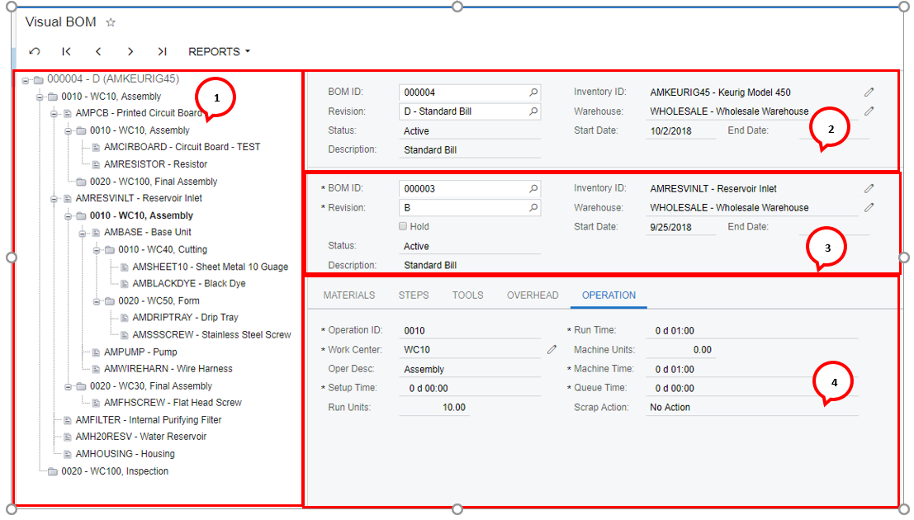

# Visual BOM {#_f8ca15d3-de7b-45d0-8254-7d3cf3eb5c99 .reference}

Form ID: AM216000

**Important:** This form will be deprecated in a future version of Acumatica ERP. All processes available on this form can be performed on the [Engineering Workbench](AM_20_81_00.md) \(AM208100\) form.

This form displays the entire multilevel bill of material for one bill and revision. It shows for each operation the associated materials, steps, overhead, and tools.

The right side of the form is the selection area. The top half is where you enter the bill and revision you wish to view.

The left side of the from displays the bill and allows you to navigate through the levels. As you navigate, the record you select is displayed in bold font. When you select an operation, the right side of the form displays the subassembly bill details and the associated operation details.

1.  Navigation Area
2.  Selection Area
3.  Subassembly Area
4.  Operation and the associated details.

You can edit multilevel bills of material by using the [Engineering Workbench](AM_20_81_00.md) \(AM208100\) form.

## Form Toolbar { .section}

The form toolbar and More menu include the buttons and commands described below.

|Command|Description|
|-------|-----------|
|**BOM Summary**|Opens the [BOM Summary](AM_61_10_00.md) \(AM611000\) report for the BOM, where you can view all materials for the BOM and their unit costs.|
|**Multilevel**|Opens the [Multilevel BOM](AM_41_30_00.md) \(AM413000\) report for the BOM.|

## Selection Area { .section}

This area is used to select the top level bill of material

|Element|Description|
|-------|-----------|
|**BOM ID**|This is the identifier for a specific bill of material; a stock item may have multiple bills of material. The lookup table for the BOM ID provides full text search for BOM ID, inventory ID, and description.|
|**Revision**|The revision number signifies what version of the BOM is being used.|
|**Status**|The status of the revision selected. The values are the following:-   *Active:* This bill of material revision can be used for production, planning, or as a source for estimates and configurations.
-   *On Hold:* The revision can be edited.
-   *Archive:* The revision is archived and unavailable for use.

|
|**Inventory ID**|This is the inventory ID for the stock item.|
|**Subitem**|This column is visible only if the *Inventory Subitems* feature is enabled on the [Enable/Disable Features](../Shared/../UserGuide/CS_10_00_00.md) \(CS100000\) form.

**Important:** The **Inventory Subitems** check box has been removed from the [Enable/Disable Features](../Shared/../UserGuide/CS_10_00_00.md) \(CS100000\) form because the functionality associated with the *Inventory Subitems* feature will be phased out. If you have this feature enabled in your system, the associated functionality remains available. To disable the feature, contact your Acumatica support provider.

|
|**Warehouse**|The default warehouse for receipts from production orders.|
|**Description**|An optional description for this bill of material.|
|**Start Date**|The date the revision becomes effective.|
|**End Date**|The optional date the revision is no longer effective.|

## Subassembly Area { .section}

This area indicates the data for the bill of material selected in the navigation area.

|Element|Description|
|-------|-----------|
|**BOM ID**|This is the identifier for a specific bill of material.|
|**Revision**|The revision number signifies what version of the BOM is being used.|
|**Status**|The status of the revision selected. The values are:-   *Active:* This bill of material revision can be used for production, planning, or as a source for estimates and configurations.
-   *On Hold:* The revision can be edited.
-   *Archive:* The revision is archived and unavailable for use.

|
|**Inventory ID**|This is the Inventory ID for the stock item.|
|**Subitem**|This column is visible only if the *Inventory Subitems* feature is enabled on the [Enable/Disable Features](../Shared/../UserGuide/CS_10_00_00.md) \(CS100000\) form.

**Important:** The **Inventory Subitems** check box has been removed from the [Enable/Disable Features](../Shared/../UserGuide/CS_10_00_00.md) \(CS100000\) form because the functionality associated with the *Inventory Subitems* feature will be phased out. If you have this feature enabled in your system, the associated functionality remains available. To disable the feature, contact your Acumatica support provider.

|
|**Warehouse**|The default warehouse for receipts from production orders.|
|**Description**|An optional description for this bill of material.|
|**Start Date**|The date the revision becomes effective.|
|**End Date**|The optional date the revision is no longer effective.|

## Operation Details { .section}

This area contains the following tabs for the detailed records associated with the operation selected in the navigation area:

-   Materials
-   Steps
-   Tools
-   Overhead
-   Operation

The tab elements are the same as on the [Bill of Material](AM_20_80_00.md) \(AM208000\) form.

**Parent topic:**[Bill of Material Form Reference](../UserGuide/MFG_BOM_Forms.md)

