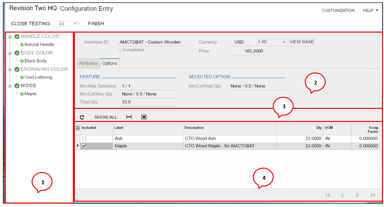

# Configuration Entry {#_dc9466e5-b880-44c7-9921-78f3f82b15d7 .reference}

Form ID: \(AM306000\)

You can open this form in any of the following ways:

-   By clicking the **Configure** button on the **Details** tab of the [Sales Orders](SO_30_10_00.md) \(SO301000\) form
-   By clicking the **Configure** button on the **Products** tab of the [Opportunities](CR_30_40_00.md) \(CR304000\) form
-   By clicking the **Configure** button on the **References** tab of the [Production Order Maintenance](AM_20_15_00.md) \(AM201500\) form
-   By clicking **Test Configuration** on the More menu of the [Configuration Maintenance](AM_20_75_00.md) \(AM207500\) form

You make sure that the following is done before you use configuration entry:

-   On the [Enable/Disable Features](CS_10_00_00.md) \(CS100000\) form, the *Product Configurator* feature is enabled.
-   On the **Manufacturing** tab of the [Stock Items](IN_20_25_00.md) \(IN202500\) form, the stock item to be configured has the **Configuration ID** specified.
-   The stock Item has an active configuration revision related on the [Configuration Maintenance](AM_20_75_00.md) \(AM207500\) form.
-   The **Allow Configuration Entry** check box must be selected on the following forms:
    -   [Order Types](SO_20_10_00.md) \(SO201000\) for all required sales order types
    -   [Customer Management Preferences](CR_10_10_00.md) \(CR101000\)

## Form Toolbar { .section}

The form toolbar includes the buttons described below.

|Button|Description|
|------|-----------|
|**Close Testing**|The button only appears if you are testing the configuration from the [Configuration Maintenance](AM_20_75_00.md) \(AM207500\) form.|
|**Finish**|Validates all rules, makes sure the pricing is up to date on the configuration, and selects the **Completed** check box. Configurations that are not complete cannot move forward to production. Incomplete configurations are allowed for progress saving.

 If you need to make a change to a configuration, you must click this button again to confirm completion of the changes, revalidate the configuration, and regenerate the configuration keys and descriptions.

|
|**Unfinish**|Changes the configuration and clears the **Completed** check box.|

## Form Elements { .section}

On the following screenshot, you can view the form elements.

1.  Features pane
2.  Feature/Options Allowable Values
3.  Table Toolbar
4.  Options or Attributes Details

The tree on the left of the page displays all features and their available options. The features list uses the labels defined for each feature. The options show their label and description but if desired, the user can add the inventory item ID to the columns. The order of the features is the sort order defined for the features in [Configuration Maintenance](AM_20_75_00.md) \(AM207500\). Icons are used to indicate the feature as satisfying the configuration requirements. The check box icon indicate the feature has satisfied the quantity and selection requirements. The error icon indicates the feature needs to be completed before the overall configuration can be completed.

You can navigate through the feature selection by clicking on the feature or option in the panel. There is no required sequence in configuration entry but changing the option selected may invalidate an option previously selected and this will be indicated by the error icon as shown below.

**Attention:** This icon indicates the feature/option has not been selected or another selection has invalidated this selection.

## Summary Area { .section}

|Element|Description|
|-------|-----------|
|**Inventory ID**|The ID of the stock item related to the order being configured.|
|**Warehouse**|The warehouse related to the order.|
|**Price**|The calculated total configured price in the currency specified. Price updates depend on the price settings for the configuration.|
|**Customer**|The customer specified for the order. The purpose of this value is to provide the ability to test using customer or customer class pricing when you click **Test Configuration** on the form toolbar of the [Configuration Maintenance](AM_20_75_00.md) \(AM207500\) form.|
|**Completed**|Read-only. A check box that indicates \(if selected\) that the configuration is finished or completed. This occurs when all attributes and features are indicated as completed. If the check box is cleared, the configuration is still in progress.|
|**Test Configuration**|A check box that indicates \(if selected\) that this is a test configuration.|
|**Currency**|The currency in which the price is specified.|

## Options Tab { .section}

When a feature or option of a feature is selected in the feature navigation panel the options tab will show the options selected for that feature \(or feature of selected option\) to guide the user in their selections.

|Element|Description|
|-------|-----------|
|**Min/Max Selection**|The minimum and maximum number of options that must be selected for the given feature. *NONE* indicates no restrictions. For example:

 -   *A max of 1* indicates you cannot select more than 1 option.
-   *A min of 1* indicates you must select at least 1 option.

|
|**Min/Lot/Max Qty**|The total feature quantities. *NONE* indicates no restrictions.

 -   When referring to a feature, a maximum quantity restricts the sum of the quantity for all options.
-   When referring to an option, the quantity for a specific option is restricted.

|
|**Total Qty**|The running total of the quantities of all options.|

|Element|Description|
|-------|-----------|
|**Min/Lot/Max Qty**|The quantity of each option. *NONE* indicates no restrictions.

 -   When referring to a feature, a maximum quantity restricts the sum of the quantity for all options.
-   When referring to an option, the quantity for a specific option is restricted.

|

|Button|Description|
|------|-----------|
|**Show All**|Displays all options that are available. An option is not available if it has been excluded by a rule.|
|**Hide**|Hides options with the *Excluded* status.|

|Column|Description|
|------|-----------|
|**Included**|This indicates an option has been selected.|
|**Label**|The label identifies the option.|
|**Description**|Description of the option.|
|**Qty**|The quantity required for one manufactured configured item. The field enabled status is controlled from the configuration maintenance features tab. This field can also be calculated from formulas. If the field allows entry the values will be limited to Min/Max values. If Lot Qty is entered for the option/feature the value will auto-adjust up to the next Lot Qty. \(Ex: Lot qty = 2.5 and user enters 6. The value will then change from 6 to 7.5. Same goes for a calculated/formula value. If the result of the formula violates the lot allowed values, it is rounded up to the next lot qty.|
|**UOM**|The base unit of measure for the option is display only.|
|**Inventory ID**|The identifier of the inventory item assigned to the option.|

## Attributes Tab { .section}

Attributes related to the current configuration. Includes attributes from all levels of configurations. As sublevel configurations are pulled in via selections the attributes update accordingly.

The table toolbar has only standard buttons.

|Element|Description|
|-------|-----------|
|**Parent**|Configurations are multilevel and each new level selected into the configuration will display the attributes for all levels involved. The parent shows the inventory ID \(for configured item only\) or the child level option label.|
|**Label**|Attribute label value.|
|**Description**|Attribute label description.|
|**Required**|A check box that indicates \(if selected\) that the attribute must have a value before the configuration can be completed.|
|**Value**|Entered value. Required when the **Required** check box is selected.|

**Parent topic:**[Product Configurator Form Reference](../UserGuide/MFG_Product_Configurator_Form_Reference.md)

