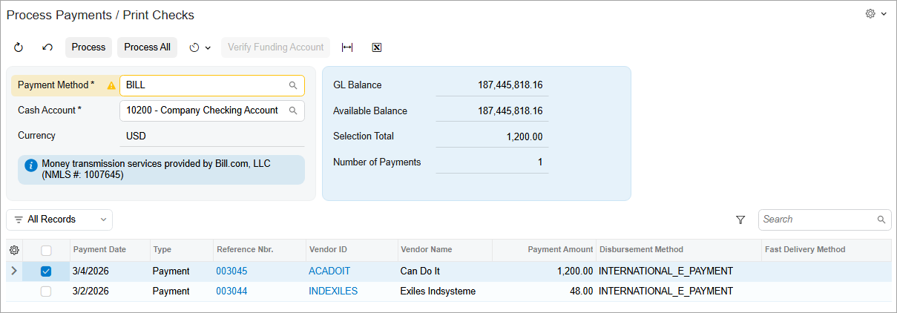
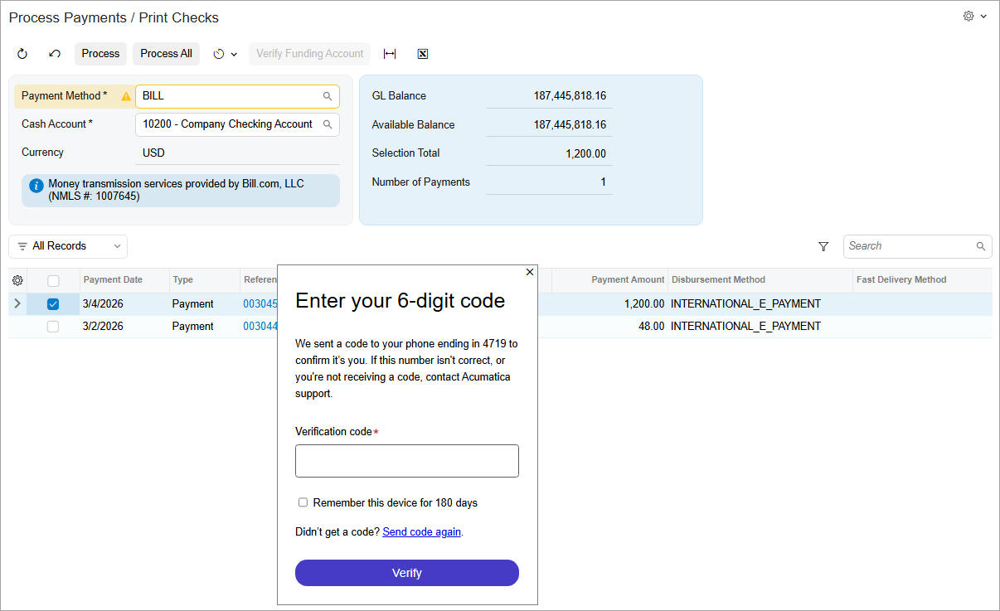

# Processing International Payments {#_72d4a5b7-d645-4c2c-a47e-99e7a76e5b9e .concept}

Acumatica ERP supports the following payment processing scenarios:

-   A bill created in USD and paid in USD
-   A bill created in USD and paid in a foreign currency

When you process international payments, the system won't perform currency conversion, rounding operations, or RGOL calculation. All these operations will be performed by BILL.

For details on setting up BILL integration, see [Setup of Integration with BILL](AP__CON_BillCom_Integration_Setup.md).

## Example { .section}

Suppose that a bill in the amount of USD 1200 has been entered in the system for a Canadian vendor. Because your company is based in the US, you will pay this bill in USD, but the vendor will receive the payment in CAD. BILL will convert the amount by using the valid exchange rate valid at the time of the conversion.

Below you can see the vendor’s payment, which was created in BILL.

**Tip:** The text of the warning on the **Payment Method** box says that the payment will be processed in the BILL sandbox environment. You won't see this warning in the production environment.

Once you click **Process** on the form toolbar, the system displays the widget shown below.

When you enter the code and click **Verify**, the payment retains its *Pending Processing* status.

**Tip:** The processing usually happens on the next day. You can click the **Synchronize Payment** button on the **Remittance** tab of the [Checks and Payments](AP_30_20_00.md) \(AP302000\) form to sync the payment between Acumatica ERP and BILL.

When the payment has been processed in BILL, its status changes to *Processed*.

**Parent topic:**[Creating Documents for External Payment Processing](../UserGuide/AP__con_Create_Doc_External_Processing.md)

