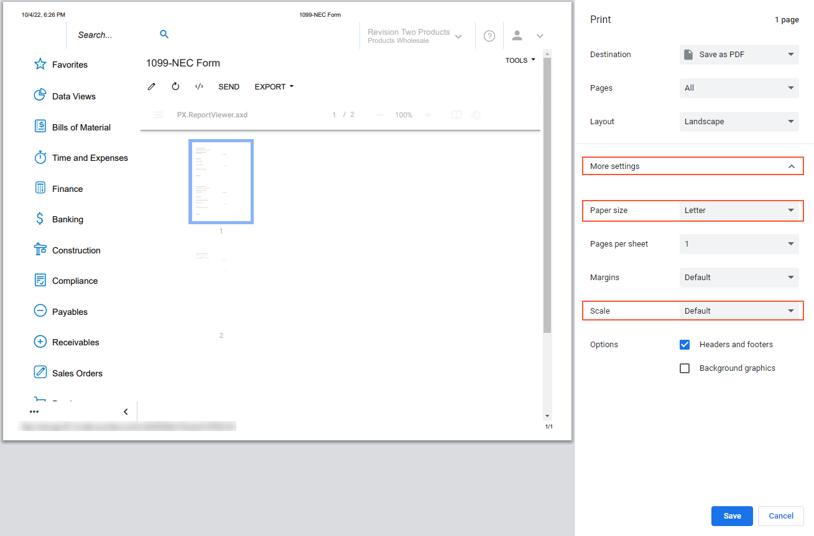
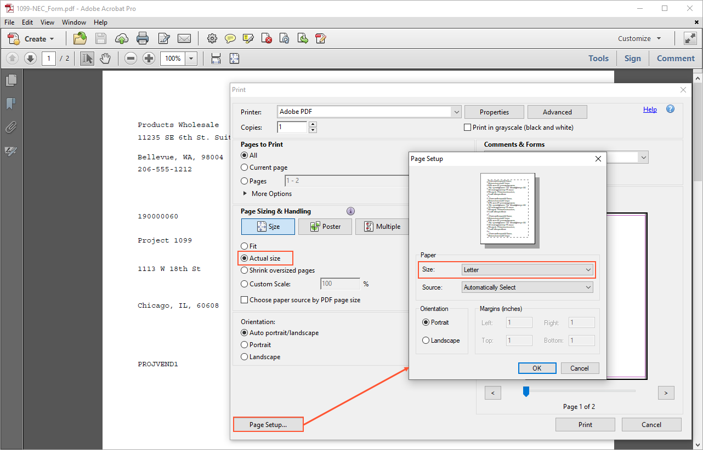

# Configuring 1099 Reporting {#_def76f01-4b80-41e0-95a8-304a69d5b50e .concept}

Companies in the United States should submit the following to the IRS:

-   A Form 1099-MISC for every independent contractor who was paid at least the specified minimum amount for services during a calendar year. The 1099-MISC form has boxes for non-employee compensation \(for any year earlier than 2020\), rents, royalties, medical and health care payments, and other types of payments.
-   Starting in 2020, a Form 1099-NEC for non-employee compensation, which was reported in Box 7 of the 1099-MISC prior to 2020. The 1099-NEC form has a box for non-employee compensation.
-   Starting in 2024, box MISC14 of the 1099-MISC form is not supported. As part of the changes of tax year 2025, Golden Parachute payments can no longer be filed through the FIRE system. This includes the current year and prior year payments. Golden Parachute payments must be filed using the Information Returns Intake System \(IRIS\) or on paper. Payments filed through the FIRE system that need to be corrected must be filed on paper.

    **Attention:** Golden parachutes are printed on Form 1099-NEC, in box 3.

## Enabling the 1099 Reporting Feature {#section_xkp_njv_vxb .section}

In Acumatica ERP, you need to enable the *1099 Reporting* feature on the [Enable/Disable Features](CS_10_00_00.md) \(CS100000\) form to be able to configure 1099 vendors and boxes \(with names similar to those on the boxes on the 1099-MISC form\) that correspond to compensations and payments that are subject to 1099 tax. You can also set up automatic recording of payments to those boxes.

You configure the 1099 reporting once. Then over a calendar year, you track and maintain 1099 data by using reports. At the end of the year, you print and send the 1099-MISC and 1099-NEC forms to your contractors and the IRS.

In this topic, you will read about how to configure 1099 reporting.

## Configuring the 1099 Reporting Year {#section_blp_njv_vxb .section}

No matter what financial year your company uses, 1099 reporting is based on the calendar year \(January 1 through December 31\). When a user enters the first transaction for a 1099 vendor defined in your system, the system initializes a reporting year for 1099 information, also known as a *1099 year*. The initialized reporting year corresponds to the transaction date. Thus, each time you enter the first transaction dated in a particular calendar year for a 1099 vendor, the system initializes that reporting year as well. Thus, no special steps are needed to configure a 1099 year. After the first 1099 year has been initialized, you can view the 1099 information by using the [1099 Vendor History](AP_40_50_00.md) \(AP405000\) form.

## Configuring the Ability to File the 1099-MISC and 1099-NEC Forms {#section_dlp_njv_vxb .section}

With Acumatica ERP, you can provide the IRS with Form 1099-MISC and Form 1099-NEC based on the transactions that occurred during the reporting year. To configure the tracking of this information, do the following:

-   Make sure the *1099 Reporting* feature is enabled on the [Enable/Disable Features](CS_10_00_00.md) \(CS100000\) form.
-   Before you start entering 1099-MISC and 1099-NEC transactions, configure the compensation types subjected to 1099 reporting as 1099 form boxes by using the **1099 Settings** tab of the [Accounts Payable Preferences](AP_10_10_00.md) \(AP101000\) form. \(The 1099 tax boxes are established by the IRS and are preconfigured in Acumatica ERP; they appear on the form when you enable the *1099 Reporting* feature.\) Specify the expense accounts associated with the 1099 boxes used by your company. When a user later specifies one of these expense accounts for a bill detail, the system will update the **1099 Box** with this detail.
-   Make sure that the following information is specified for your company, which is a legal entity, on the [Companies](CS_10_15_00.md) \(CS101500\) form: company name, address, phone number, and tax registration identifier \(in the **Main Contact**, **Main Address**, and **Tax Registration Info** sections of the form\). Also, the **1099-MISC Reporting Entity** check box must be selected. The system uses this information to fill in the payer's details when generating the [1099-MISC Form](AP_65_30_00.md) \(AP653000\) and [1099-NEC Form](AP_65_31_00.md) \(AP653100\) reports.
-   By using the [Vendors](AP_30_30_00.md) \(AP303000\) form, for each contractor that is defined in the system as a 1099 vendor, do the following:

    1.  If a contractor does not have a vendor account in the system, create a new vendor account, and select the **1099 Vendor** check box on the **General** tab. In the **1099 Box** drop-down list, select the 1099 box that is applicable to the contractor by default. If the vendor is a foreign financial institution \(in terms of 1099-MISC form reporting\), select the **Foreign Entity** check box as well. If the vendor is subject to FATCA reporting, select the **FATCA** check box.
    2.  In the **Legal Name** box of the **Account Info** section, specify the legal name of the vendor as it will be displayed in 1099 reports.
    3.  Whether the vendor is new or existing, on the **GL Accounts** tab, specify the expense account that will be used by default for the vendor. Assign the account used for the vendor's 1099 payments—that is, the account associated with the 1099 box corresponding to the vendor's primary type of compensation. By default, the system will insert this expense account in the **Account** column for a bill detail.
    4.  Whether the vendor is new or existing, on the **Purchase Settings** tab, in the **Tax Registration ID** box, provide the vendor's Taxpayer Identification Number \(TIN\) or Social Security Number \(SSN\), and select the type of tax registration ID in the **Type of TIN** box.
    The system uses the vendor's legal name, address, and Taxpayer Identification Number \(TIN\) to fill in payee details when the [1099-MISC Form](AP_65_30_00.md) and [1099-NEC Form](AP_65_31_00.md) reports are generated. The TIN can be the Employer Identification Number \(EIN\), the Social Security Number \(SSN\), Individual Taxpayer Identification Number \(ITIN\), or Adoption Taxpayer Identification Number \(ATIN\).

Once you have configured 1099-MISC and 1099-NEC payment types and set up 1099 vendors, information corresponding to compensation types can be tracked as 1099 vendors are paid.

## Adjusting Printer Settings for the 1099-NEC Report {#section_hlp_njv_vxb .section}

When you print the 1099-NEC report generated on the [1099-NEC Form](AP_65_31_00.md) \(AP653100\) form, the report values on the resulting printed page may not fit into the 1099 form boxes.

To avoid this issue when printing the form from Acumatica ERP, do the following:

1.  On the [1099-NEC Form](AP_65_31_00.md) form, specify the needed settings and click **Run Report** on the form toolbar.
2.  On the printed report form that is opened in a browser tab, press Ctrl + P.
3.  In the **Print** dialog box, click **More settings** and make sure that the following settings are specified:

    -   **Paper size**: *Letter*
    -   **Scale**: *Default*

        **Attention:** Depending on the browser you are using, this settings can also be *100%*.

    The following screenshot shows the settings that need to be checked.

    

4.  Click **Save** to save the settings and print the form.

To avoid this issue when printing the form from PDF, do the following:

1.  On the [1099-NEC Form](AP_65_31_00.md) form, specify the needed settings and click **Run Report** on the form toolbar.
2.  On the printed report form that is opened in a browser tab, click **Print** and select *Save as PDF* in the **Destination** box to save the report in the PDF format.
3.  Click **Save**, specify the path to the document and the file name and click **Save** again.
4.  Open the PDF file and click **Print file**.
5.  In the **Print** dialog box, select *Adobe PDF* in the **Printer** box and select the **Actual size** option button.
6.  Click the **Page Setup...** button.
7.  In the **Page Setup** dialog box, select *Letter* in the **Size** box and click **OK**.

    The following screenshot shows the settings that need to be adjusted.

    

8.  In the **Print** dialog box, click **Print** to print the 1099-NEC form.

**Tip:** The box sizes on 1099 form blanks may slightly differ from one another and different printers scale pages differently. As a result, when 1099 values are printed on the form, they may be slightly stretched or compressed and may not fit into the form boxes.

To make the 1099 values fit into the proper boxes on the form, you may need to adjust the printer scale as follows:

-   For stretched values, you decrease the scale by 0.5%, making it 99.5%.
-   For compressed values, you increase the scale by 0.5%, making it 100.5%.

-   **[To Modify a Company's Configuration for 1099 Reports](../UserGuide/AP__HOW_Configure_Cons_Company_1099.md)**  

-   **[To Modify a Branch's Configuration for 1099 Reports](../UserGuide/AP__HOW_Configure_Branch_1099.md)**  

**Parent topic:**[Filing Out the 1099 Forms](../UserGuide/AP__MNG_1099_Filing.md)

