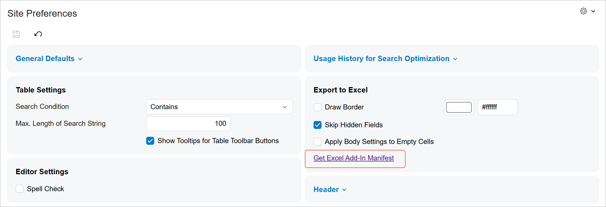
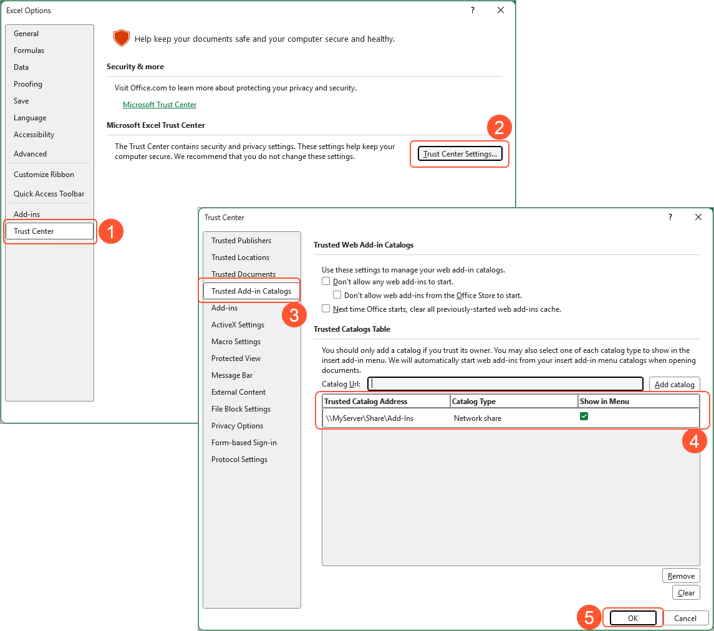
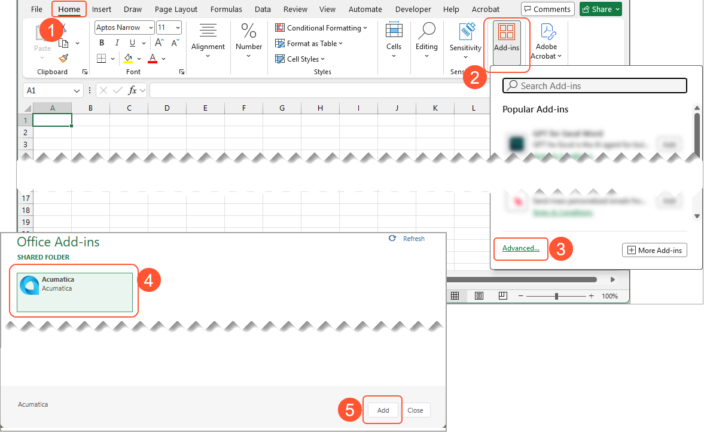
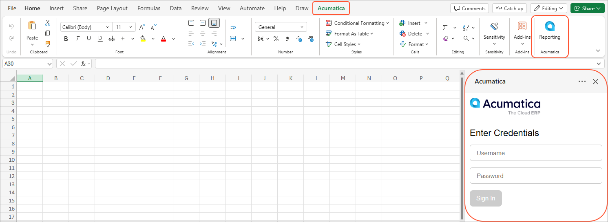
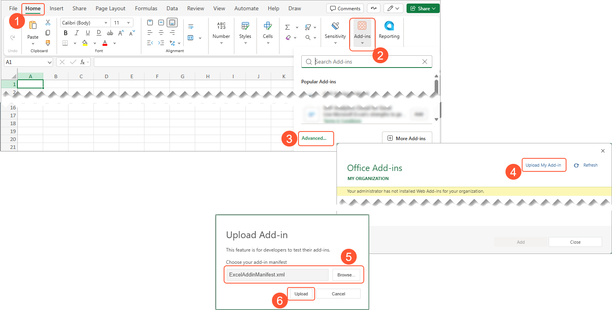

# InsightXL: Installing the Excel Add-In {#_dc3178de-4b1b-47f3-b75a-804f6c6c0fe1 .concept}

To use the Excel add-in, you perform a one-time setup that includes the following steps:

1.  [Set up HTTPS for the Acumatica ERP instance](INST_Preparing_Installation_System_Environment.md#_d1aaeb17-67ae-48d7-9a8d-0537d53ffe5d)
2.  [Configure an OpenID provider](OU_AddIn_Create_OpenID_Provider_Activity.md)
3.  Make adjustments to the `web.config` file
4.  Download the add-in manifest from Acumatica and place it in a shared location
5.  Grant access rights to the users who will run the add-in
6.  Install the add-in in Excel

For instructions on setting up HTTPS for an instance and configuring an OpenID provider, see the links above. Read on to learn about Steps 3 to 6.

## Making Adjustments to Web.config { .section}

Modify the settings in the `web.config` file, which is located in the application instance folder, as follows:

-   Add the text in bold to the `<formsAuth>` tag of the `<px.core>` section.

    ```
    <formsAuth loginUrl="Frames/Login.aspx" timeout="60" **requireSSL="true"** />
    ```

-   Add the text in bold to the `<sessionState>` tag of the `<system.web>` section.

    ```
    <sessionState **cookieSameSite="None"** cookieless="UseCookies" mode="Custom" 
    customProvider="PXSessionStateStore" timeout="60" 
    sessionIDManagerType="PX.Owin.SessionIdManager, PX.Owin">
    ```

-   In the `<system.web>` section, add the following line before the `<compilation>` tag.

    ```
    <httpCookies sameSite="None" requireSSL="true" />
    ```

    **Attention:** When you insert the line, note that:

    -   The first two occurrences of the `<system.web>` section within the `<location>` tag are not the sections you need.
    -   Insert the line only once; otherwise, a compilation error may occur when the site is restarted.

## Downloading the Add-In Manifest { .section}

Once you have configured an OpenID provider, download the add-in manifest on the [Site Preferences](SM_20_05_05.md) \(SM200505\) form. To do so, click the *Get Excel Add-In Manifest* link in the **Export to Excel** section.



Place the downloaded manifest file in a shared folder on a network server \(such as `\\MyServer\Share\AddIns`\) where add-in users will be able to access it.

## Granting Access to the Add-In Panel { .section}

Make sure that users of the Excel add-in have access rights to the *Excel Add-In \(EX000000\)* form. This form displays information in the add-in's right panel in Excel, including details about the add-in's connection, status, and settings.

You can modify access rights by using any of the following forms:

-   [Access Rights by Role](SM_20_10_25.md) \(SM201025\)
-   [Access Rights by User](SM_20_10_55.md) \(SM201055\)
-   [Access Rights by Screen](SM_20_10_20.md) \(SM201020\)

## Configuring the Add-In in the Excel Desktop App { .section}

Once the manifest has been downloaded and placed in a shared folder, you can proceed to install the add-in in Excel.

**Note:** In Excel, you can configure the add-in only if the system is running on Windows. The full **Trust Center** functionality in Excel, including **Trusted Add-in Catalogs**, is not supported on macOS.

To install the add-in in the Excel desktop app, add the shared folder to the list of trusted add-in catalogs as follows:

1.  Open the **Excel Options** dialog box by clicking **File** &gt; **Options**.
2.  Open the **Trust Center** by opening the **Trust Center** tab \(Item 1 below\) and clicking **Trust Center Settings** \(Item 2\).
3.  In the **Trust Center** dialog box, open the **Trusted Add-in Catalogs** tab \(Item 3\), and add the shared folder to the **Trusted Catalogs** table \(Item 4\).
4.  Click **OK** \(Item 5\).



**Tip:** Select the **Next time Office starts, clear all previously started web add-ins cache** check box to avoid issues with starting the add-in after installation. Then make sure to close all Excel windows to restart the app.

After you reopen Excel, you can add the add-in to the **Home** tab by clicking **Home** &gt; **Add-ins** &gt; **Advanced** \(Items 1–3 below\) and selecting the add-in from the list of available add-ins \(Item 4\). Click **Add** \(Item 5\).



Once the add-in has been installed, you'll see the **Acumatica** tab, the **Reporting** button on the **Home** tab, and the **Acumatica** panel.



## Configuring the Add-In in the Excel Browser App { .section}

To install the add-in in the Excel browser app, do the following:

1.  Open the **Office Add-ins** dialog box by clicking **Home** &gt; **Add-ins** and then clicking **Advanced** \(Items 1–3 below\).
2.  Click **Upload My Add-in** \(Item 4\) and then select and upload the add-in manifest that you previously downloaded \(Items 5–6\).



Once the add-in has been installed, you'll see the **Acumatica** tab, the **Reporting** button on the **Home** tab, and the **Acumatica** panel.

**Parent topic:**[Working with ARM Reports in Excel](../UserGuide/ARM_InsightXL_Mapref.md)

