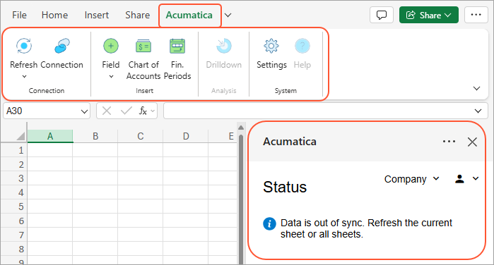
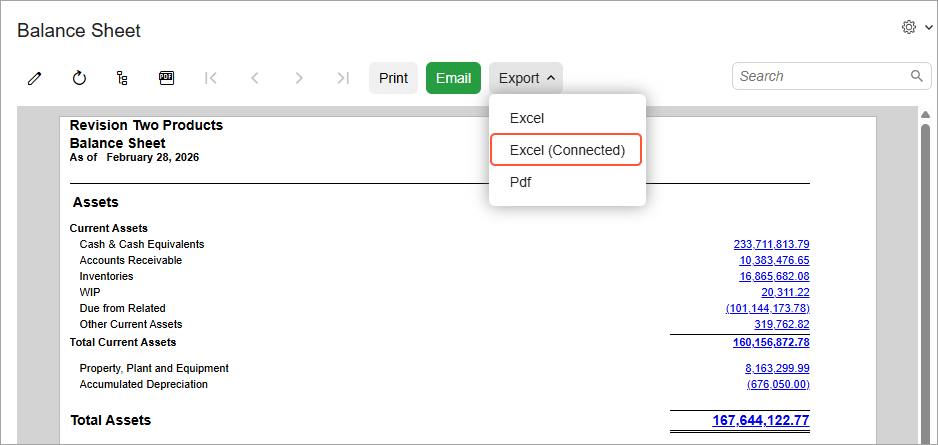

# InsightXL: Using the Excel Add-In {#_1dbf3447-be44-4d98-aff3-d8430fdd2e47 .concept}

Once the Excel add-in is installed, the **Acumatica** tab is added to Excel.

Here is what you can do by using the commands available on this tab:

-   Connect to Acumatica ERP
-   Refresh values in Excel by pulling data from Acumatica ERP
-   Insert Acumatica ERP helper functions
-   Drill down into calculated values to see underlying data

## Connecting to Acumatica ERP { .section}

Click **Connection** on the **Acumatica** tab to open the add-in's right panel and sign in to Acumatica ERP. When you are signed in, this panel displays the status of workbook synchronization and informs you if displayed data needs to be refreshed. If you work with multiple tenants, you can also use this panel to switch between the tenants you have access to.

## Refreshing Data Exported to Excel { .section}

Use **Refresh** options on the **Acumatica** tab to recalculate and repopulate values from Acumatica ERP in your workbook.

During refresh, the add-in batches Acumatica ERP functions found in the sheet or workbook and sends them to the server to be calculated by the ARM engine. The calculated values are sent back to Excel. The add-in then identifies any other functions \(for example, Excel functions\) that reference those values, recalculates formulas containing those functions, and fills the results into the appropriate cells.

Before you start refresh, make sure that no cell is selected for editing. While refresh is in progress, you can monitor its status and progress in the right panel.

You can control what you refresh in your workbook:

-   **Pending and Errors**: Refresh recently changed but not yet calculated cells, or cells with errors in the current sheet.
-   **Current Sheet**: Refresh only the active sheet.
-   **All Sheets**: Refresh the entire workbook.
-   **Cancel Refresh**: Cancel a refresh if it takes too long.

## Using Helper Functions { .section}

The add-in's **Acumatica** tab includes the **Insert** group of actions that place supported functions into the worksheet in the cell you're working in:

Click a cell that contains a calculated *Beginning Balance*, *Debit*, *Credit*, *Turnover*, or *Ending Balance* value, and then click **Drilldown**. This opens a new sheet named **Drilldown** with the underlying data.

**Attention:** Only one drilldown sheet can be created for a workbook. If you select a different cell and click **Drilldown**, the existing drilldown sheet will be deleted, and a new one will be created for the selected cell.

## Exporting ARM Reports to Excel { .section}

You can export an existing ARM report to Excel by clicking **Export** &gt; **Excel \(Connected\)** on the report form's toolbar. The report is exported along with the functions used to calculate amount values as well as formulas used in the report cells.

**Parent topic:**[Working with ARM Reports in Excel](../UserGuide/ARM_InsightXL_Mapref.md)

