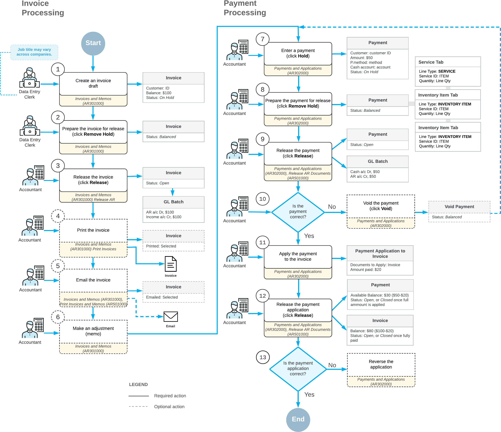

# Overview of Accounts Receivable Features and Processes {#_95828b13-9f26-4f23-95bb-2eee704f0969 .concept}

By using the accounts receivable subledger, you can maintain complete and structured information about customers and salespeople, and track all sales, commissions, and incoming payments from customers. With a variety of time-saving automation features and reporting options, the AR subledger of Acumatica ERP streamlines your entire receivable process and gives you the ability to reduce input error rates.

The primary features and main processes of the AR subledger module are described briefly below and extensively in other topics in this section.

## Accounts Receivable Multicurrency Options {#section_awk_4jv_vxb .section}

Each customer account has a default currency assigned to it. Invoices will be generated in this customer's default currency unless currency overriding is allowed. The system automatically computes realized gains or losses when payments are received from foreign customers. Users can revalue outstanding foreign currency invoices in the base currency as often as needed by using the Currency Management module.

## Customer Defaults and Overrides {#section_cwk_4jv_vxb .section}

During Acumatica ERP implementation, you can establish customer classes, which provide suitable default values to ease data entry. If you set up a default customer class that holds data common to most customers, users can add new customers more quickly. Also, when users enter documents, they specify a customer and most of the elements will be automatically filled in with the default values of the customer. This makes input of documents much easier and saves time. For additional details, see [Creating a Customer](Customer_Mapref.md).

You can control which users can see which customers on the forms by using restriction groups. You can specify a default restriction group for a customer class, and the system will automatically include all newly added customers in this group. For more information, see [Customers: Security Configuration](AR__con_Customer_Security.md).

## Multiple Document and Payment Types {#section_fwk_4jv_vxb .section}

With the accounts receivable subledger, your company's personnel can create manually or generate customer invoices for sold goods and services provided. You can correct invoices by using credit and debit memos. Users can account for goods and services paid by cash and returned for cash with *cash sale* and *cash return* documents, respectively. Payments of various types made by different methods and prepayments can be entered and posted as they're received. For more information, see [Preparation of Deposits](CA__CON_Preparation_of_Deposits.md).

## AR Document Processing Flow {#section_iwk_4jv_vxb .section}

Typically, an AR document goes through the following states during its life cycle:

1.  Recorded: Documents that have been entered but not released. Recorded documents do not affect the balances of customers and General Ledger accounts. Recorded documents may be processed further or may be just deleted from the system.
2.  Released: Documents that have been released but not closed. Released documents affect the balances of customers and General Ledger accounts, and require further processing. Released documents cannot simply be deleted from the system. Their effect on balances may be reversed.
3.  Closed: Documents that have been released and closed. Closed documents had affected balances of customers and General Ledger accounts when they were closed. Closed documents do not require further processing and cannot be deleted from the system. Their effect on balances may be reversed.

The following diagram illustrates the processing of invoices and customer payments in the system, which is described in greater detail in the following chapters of the document.

## Payment Application {#section_lwk_4jv_vxb .section}

When entering a customer payment, you can apply it to open invoices and memos of the customer including credit memos. To reduce the time required to match payments to invoices, Acumatica ERP gives you the ability to automatically apply customer payments and prepayments to the oldest outstanding invoices, memos, or overdue charges. If a payment was applied incorrectly, you can void the application of the payment or the entire payment. For more information, see [Auto-Applying Payments: General Information](Finance_AutoApplication_to_Documents_GeneralInfo.md).

## Rounding of Invoice Totals {#section_nwk_4jv_vxb .section}

If the feature of rounding of the document amounts is activated in your system, you can set up the rules and the precision to be used to automatically round the amounts of invoices. Notice that the rounding rules and the rounding precision that you specify for invoices are the same for all currencies. For more information, see [Rounding of AR Document Amounts: General Information](Finance_AR_Doc_Amount_Rounding_GeneralInfo.md).

## Workflow Options {#section_pwk_4jv_vxb .section}

In Acumatica ERP, you can configure the document processing workflow to match the policies established in your organization. You can use multiple options that control processing and multiple processing forms. Newly entered documents can be released immediately or placed on hold and then reviewed by an authorized user before being released. Also, you can configure the workflow in such way that the documents are automatically posted on release, or that posting can be performed only by authorized users.

## Sending Documents Electronically {#section_rwk_4jv_vxb .section}

With Acumatica ERP, you can set up sending released documents, such as invoices or memos, electronically to customers who want to receive documents by email. Also, you can configure sending such emails to employees who work with specific customers. For customers who do not want to receive documents electronically, you can continue to print documents for sending them via postal services. For more information, see [Mailings for Customers: General Information](Finance_PredefinedMailings_Customers_GeneralInfo.md).

## Recurring Invoices {#section_twk_4jv_vxb .section}

Schedules can be used to create and maintain recurring invoices, such as invoices for regular jobs or services your company provides for customers. After a recurring invoice is entered and assigned to a schedule, you will not need to reenter the entire invoice each time it needs to be generated. For more information, see [Creating Recurring AR Documents](Finance_Creating_Recurring_ARDocuments_Mapref.md).

## Debt Collection {#section_vwk_4jv_vxb .section}

Whenever customer payments are not immediately bound to the delivery of goods and services, businesses need complete and continuous tracking of outstanding debts. In Acumatica ERP, it's easy to configure statement cycles and print statements, so customers have a detailed record of their balances with a specific branch or the entire organization. Credit verification rules can be defined for each customer class and for each individual customer. Overdue charges can be applied if payments are late. A sequence of dunning letters can be configured to remind customers about unpaid invoices, and a credit hold can be applied to customers once the last letter has been generated. To learn more, see [Managing Credit Policy](AR__MNG_CreditPolicy.md).

## Write-Offs {#section_xwk_4jv_vxb .section}

After a certain period of time, a credit on your books should be written off and considered income. You can write off customer credits and balances that are less than the tolerance limits you have defined for the customers. For more details, see [Direct Write-Offs: General Information](Finance_Direct_Write-Offs_GeneralInfo.md) and [Payments with Write-Offs: General Information](Finance_ProcessingCustomerPayment_GeneralInfo.md).

## Salespeople and Commissions {#section_zwk_4jv_vxb .section}

In Acumatica ERP, you can create accounts for each salesperson and assign default commission percentages. Sales commissions are calculated automatically, based on total sales or payments minus total returns during the sales commission period. See [Managing Commissions](Finance_Managing_Commissions_Mapref.md) for additional details.

## Contracts {#section_bxk_4jv_vxb .section}

Many businesses use contracts if they provide goods and services to the customers during the specified period of time—for example, to maintain and repair a product during the manufacturer’s warranty period or after it has expired. In Acumatica ERP, you can configure contract templates to provide typical settings for contracts. Contract settings are used for contract renewals \(if they're permitted\) and for recurring billing in accordance with the contract's billing schedule. For more information, see [Managing Contracts](Contracts_Managing_Contracts_Mapref.md).

## Integrated Credit Card Processing {#section_dxk_4jv_vxb .section}

With the integrated credit card processing functionality of Acumatica ERP, your company can use automated credit card processing to accept customer payments. To collect payments, you can perform mass-processing, by using credit cards to charge for the invoices of customers that prefer to pay this way, and manually initiate card payments for customer invoices. You can easily identify and handle failed transactions, void transactions, and issue refunds. You can maintain up-to-date information about customers' credit cards, deactivate expired cards, and automatically notify customers about expiring credit cards by using personalized emails. For details, see the following topics:

-   [Card Payments](AR__con_Card_Payments.md)
-   [Automatic Payment Collection](AR__con_Automatic_Payment_Collection.md)

## Accounts Receivable Security Options {#section_gxk_4jv_vxb .section}

To restrict users' access to some customer accounts, you can include the customer accounts and the users authorized to work with them in restriction groups. This feature can be used to properly organize the work of salespeople.

## Audit Trail {#section_ixk_4jv_vxb .section}

Invoices have unique IDs that have been generated in accordance with the assigned numbering sequence, along with the customers' document reference numbers. These features provide an easy-to-follow audit trail while preventing duplicate entries and payments.

## Other Features and Options {#section_kxk_4jv_vxb .section}

In addition to the features already discussed, you can use the following capabilities to organize the collection process in the most convenient and effective way for your business:

-   Create and maintain an unlimited number of customer accounts.
-   Attach scanned images or electronic versions of customer original documents to payments, memos, and prepayments or to lines of the documents
-   Organize and store comprehensive customer information, including multiple billing and shipping addresses and associated General Ledger accounts.
-   Verify customer addresses at customer account creation by using integration with the AvaTax service of Avalara or other specialized third-party software.
-   Run multiple reports displaying customer balances, aging periods, statements, and transaction registration information.
-   Use inquiries, which display current customer information in a variety of ways:
    -   Outstanding balances for a customer or customers by period and by currency.
    -   Documents that are past due for a specific customer and overdue charge amounts owed by the customers.
    -   Commissions payable to salespeople and their details, including sales amounts, return amounts, and total commissions.

