# Examples of Credit and Cash Discount Periods {#_cf92a58d-14c5-4a98-b22a-e3ecfb60969b .concept}

In this topic, you can find examples that demonstrate how the credit period and cash discount period are calculated based on the calculation method of the applicable credit terms.

## Structure of These Examples {#section_n1d_hjv_vxb .section}

Each section describes a particular method of calculating the length of credit period and discount period defined by the credit terms. You select the calculation method in the **Due Date Type** box on the [Credit Terms](CS_20_65_00.md) \(CS206500\) form.

In each section, the first column of the table lists the options that you can select in the **Discount Type** box, based on the method selected for due date calculation. The second column contains sample settings for each option that you could use to configure the credit terms on the [Credit Terms](CS_20_65_00.md) form, as well as the document date from the Acumatica ERP form used to create the document. The third column displays the resulting credit period and cash discount period for the document date specified in the sample settings. This column includes a diagram that shows the resulting credit period and cash discount period. The legend of the diagram is as follows:

-   : Starting and ending dates of the credit period
-   : Days of the credit period
-   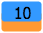: Days of the cash discount period

## Due Date Type: *Fixed Number of Days* {#section_q1d_hjv_vxb .section}

With the *Fixed Number of Days* calculation method, the payment is due a fixed number of days after the sale or purchase. You specify the number of days in **Due Day 1**.

|**Discount Type**|**Sample Settings**|Result|
|-----------------|-------------------|------|
|*Fixed Number of Days*|On the [Credit Terms](CS_20_65_00.md) form:

 -   **Due Day 1**: *30*
-   **Discount Day**: *7*

 On the document creation form:

 -   **Document Date**: *1/1/2016*

|Credit period: 1/1/2016–1/31/2016

 Cash discount period: 1/1/2016–1/8/2016

 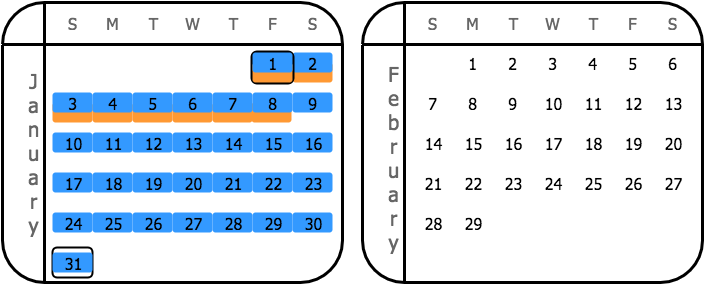

|

## **Due Date Type**: *Day of Next Month* {#section_sbs_szx_gv .section}

With the *Day of Next Month* calculation method, the payment is due on a particular day of the next calendar month after the month of the document date. You specify the day in **Due Day 1**.

In this example, the value of the **Due Day 1** parameter is greater than the number of days in the next month \(February\); therefore, the system uses the last date in the next month for the calculation of the credit period.

|**Discount Type**|**Sample Settings**|Result|
|-----------------|-------------------|------|
|*Day of Next Month*|On the [Credit Terms](CS_20_65_00.md) form:

 -   **Due Day 1**: *30*
-   **Discount Day**: *7*

 On the document creation form:

 -   **Document Date**: *1/1/2016*

|Credit period: 1/1/2016–2/29/2016

 Cash discount period: 1/1/2016–2/7/2016

 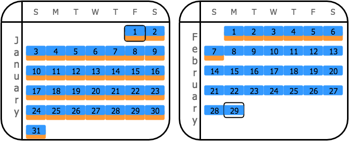

|
|*End of Month*|On the [Credit Terms](CS_20_65_00.md) form:

 -   **Due Day 1**: *30*
-   **Discount Day**: *N/A*

 On the document creation form:

 -   **Document Date**: *1/1/2016*

|Credit period: 1/1/2016–2/29/2016

 Cash discount period: 1/1/2016–1/31/2016

 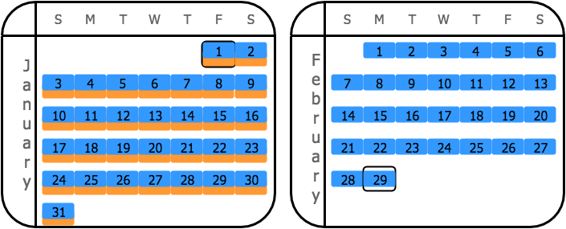

|
|*Day of the Month*|On the [Credit Terms](CS_20_65_00.md) form:

 -   **Due Day 1**: *30*
-   **Discount Day**: *7*

 On the document creation form:

 -   **Document Date**: *1/1/2016*

|Credit period: 1/1/2016–2/29/2016

 Cash discount period: 1/1/2016–1/7/2016

 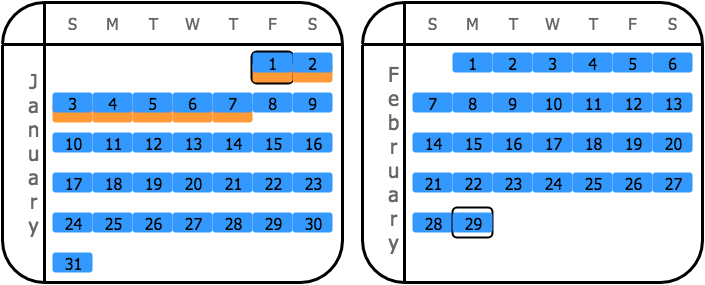

|

## **Due Date Type**: *End of Next Month* {#section_kbd_hjv_vxb .section}

With the *End of Next Month* calculation method, the payment is due at the end of the next calendar month after the month of the document date.

For this calculation method, note that the credit and cash discount periods are equal if the [*End of Next Month*](#entry_f2p_2yx_gv) option is selected in the **Discount Type** box.

|**Discount Type**|**Sample Settings**|Results|
|-----------------|-------------------|-------|
|*Day of Next Month*|On the [Credit Terms](CS_20_65_00.md) form:

 -   **Due Day 1**: *N/A*
-   **Discount Day**: *7*

 On the document creation form:

 -   **Document Date**: *1/1/2016*

|Credit period: 1/1/2016–2/29/2016

 Cash discount period: 1/1/2016–2/7/2016

 

|
|*End of Month*|On the [Credit Terms](CS_20_65_00.md) form:

 -   **Due Day 1**: *N/A*
-   **Discount Day**: *N/A*

 On the document creation form:

 -   **Document Date**: *1/1/2016*

|Credit period: 1/1/2016–2/29/2016

 Cash discount period: 1/1/2016–1/31/2016

 

|
|*End of Next Month*|On the [Credit Terms](CS_20_65_00.md) form:

 -   **Due Day 1**: *N/A*
-   **Discount Day**: *N/A*

 On the document creation form:

 -   **Document Date**: *1/1/2016*

|Credit period: 1/1/2016–2/29/2016

 Cash discount period: 1/1/2016–2/29/2016

 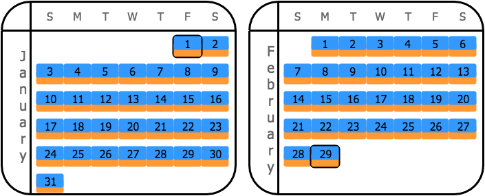

|
|*Day of the Month*|On the [Credit Terms](CS_20_65_00.md) form:

 -   **Due Day 1**: *N/A*
-   **Discount Day**: *7*

 On the document creation form:

 -   **Document Date**: *1/1/2016*

|Credit period: 1/1/2016–2/29/2016

 Cash discount period: 1/1/2016–1/7/2016

 

|

## **Due Date Type**: *Day of the Month* {#section_dcd_hjv_vxb .section}

With the *Day of the Month* calculation method, the payment is due on a particular day of the current calendar month, if the invoice is issued before this day. If the invoice is issued after this day of the current calendar month, then the payment is due on the day of the next calendar month. You specify the day in **Due Day 1**.

|**Discount Type**|**Sample Settings**|Result|
|-----------------|-------------------|------|
|*Day of the Month*|On the [Credit Terms](CS_20_65_00.md) form:

 -   **Due Day 1**: *30*
-   **Discount Day**: *7*

 On the document creation form:

 -   **Document Date**: *1/1/2016*

|Credit period: 1/1/2016–1/30/2016

 Cash discount period: 1/1/2016–1/7/2016

 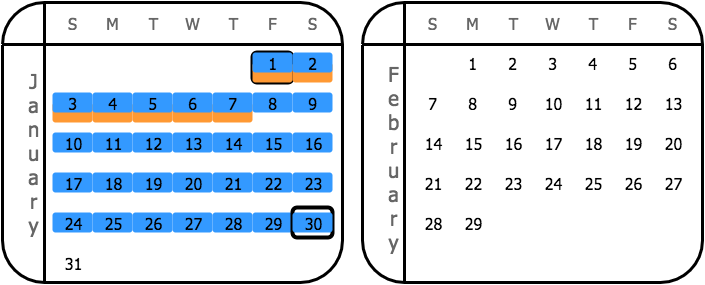

|

## **Due Date Type**: *Fixed Number of Days Starting Next Month* {#section_jcd_hjv_vxb .section}

With the *Fixed Number of Days Starting Next Month* calculation method, the payment is due a fixed number of days starting the first day of the next calendar month after a sale or purchase. You specify the number of days in **Due Day 1**.

|**Discount Type**|**Sample Settings**|Result|
|-----------------|-------------------|------|
|*Fixed Number of Days Starting Next Month*|On the [Credit Terms](CS_20_65_00.md) form:

 -   **Due Day 1**: *30*
-   **Discount Day**: *7*

 On the document creation form:

 -   **Document Date**: *1/1/2016*

|Credit period: 1/1/2016–3/2/2016

 Cash discount period: 1/1/2016–2/8/2016

 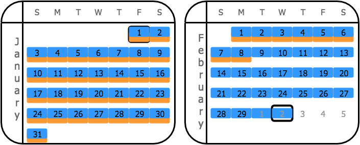

|

## **Due Date Type**: *Fixed Number of Days Plus Day of Next Month* {#section_pcd_hjv_vxb .section}

With the *Fixed Number of Days Plus Day of Next Month* calculation method, you set two due dates—**Due Date 1** that shows the number of days to be added to the invoice date to get the EOM date and **Due Date 2** that shows the day in the following month, which is the due date.

|**Discount Type**|**Sample Settings**|Result|
|-----------------|-------------------|------|
|*Fixed Number of Days*|On the [Credit Terms](CS_20_65_00.md) form:

 -   **Due Day 1**: *30*
-   **Due Day 2**: *10*
-   **Discount Day**: *7*

 On the document creation form:

 -   **Document Date**: *9/5/2022*

|Credit period: 9/5/2022–11/10/2022

 Cash discount period: 9/5/2022–9/12/2022

 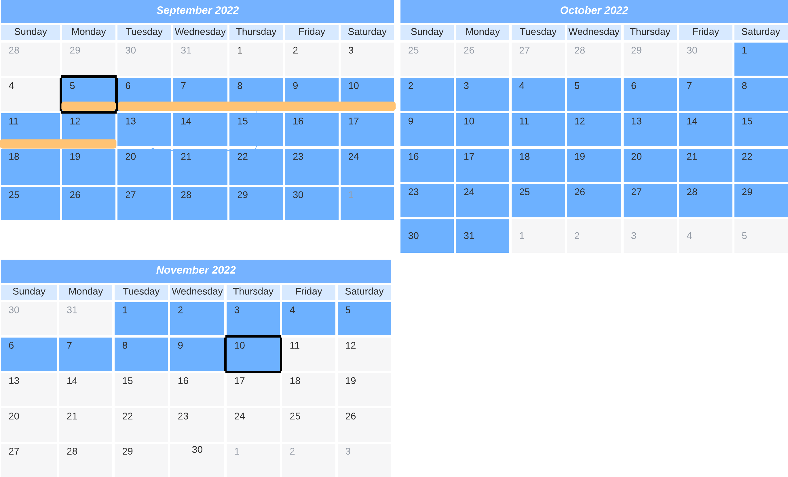

|
|*Day of Next Month*|On the [Credit Terms](CS_20_65_00.md) form:

 -   **Due Day 1**: *30*
-   **Due Day 2**: *10*
-   **Discount Day**: *5*

 On the document creation form:

 -   **Document Date**: *9/18/2022*

|Credit period: 9/18/2022–11/10/2022

 Cash discount period: 9/18/2022–10/5/2022

 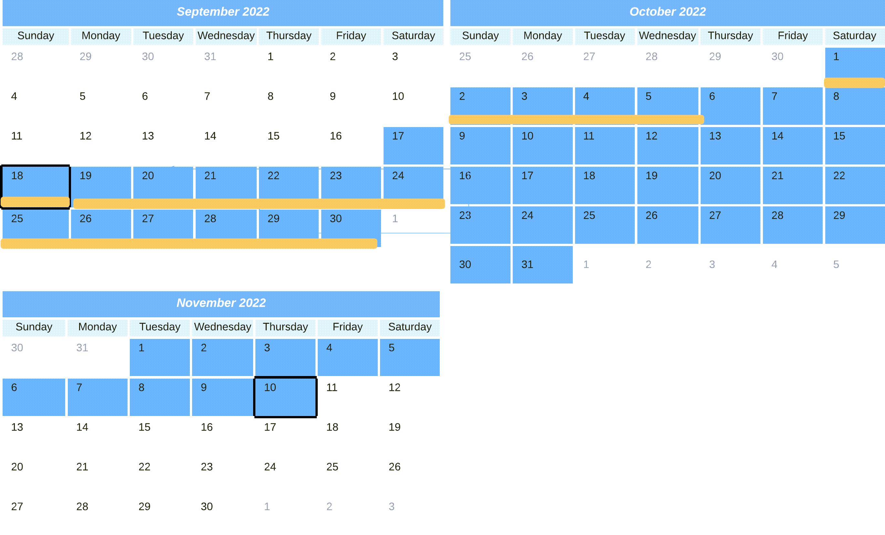

|
|*End of Month*|On the [Credit Terms](CS_20_65_00.md) form:

 -   **Due Day 1**: *30*
-   **Due Day 2**: *10*
-   **Discount Day**: *N/A*

 On the document creation form:

 -   **Document Date**: *5/1/2022*

|Credit period: 5/1/2022–6/10/2022

 Cash discount period: 5/1/2022–5/31/2022

 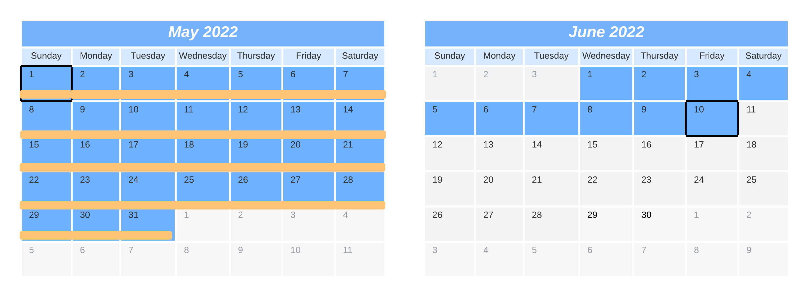

|
|*Day of the Month*|On the [Credit Terms](CS_20_65_00.md) form:

 -   **Due Day 1**: *30*
-   **Due Day 2**: *10*
-   **Discount Day**: *7*

 On the document creation form:

 -   **Document Date**: *1/5/2022*

|Credit period: 1/5/2022–3/10/2022

 Cash discount period: 1/5/2022–1/7/2022

 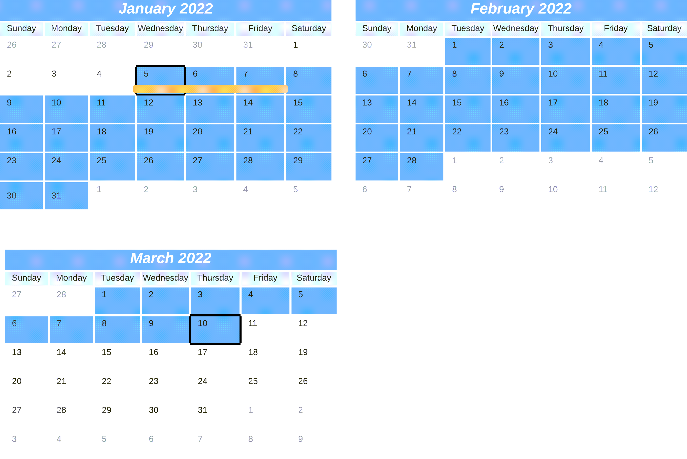

|

## **Due Date Type**: *Custom* {#section_hdd_hjv_vxb .section}

With the *Custom* calculation method, you set two time intervals for the document dates and specify a due date for each interval. The parameters for configuring the first interval are **Due Day 1**, **Day From 1**, and **Day To 1**, and the parameters for configuring the second interval are **Due Day 2**, **Day From 2**, and **Day To 2**.

The sample settings here define the following intervals: 1–15 and 16–31. The due date for the first interval is the 10th of the next month for documents issued between day 1 and day 15 of the current month. The due date for the second interval is the 25th of the next month for documents issued between day 16 and day 31 of the current month.

For this calculation method, note that the system shortens the cash discount period to be equal to the credit period if the [*End of Next Month*](#entry_vcl_bdy_gv) option is selected as the **Discount Type**.

|**Discount Type**|**Sample Settings**|Results|
|-----------------|-------------------|-------|
|*Day of Next Month*|On the [Credit Terms](CS_20_65_00.md) form:

 Interval 1:

 -   **Due Day 1**: *10*
-   **Day From 1**: *1*
-   **Day To 1**: *15*

 Interval 2:

 -   **Due Day 2**: *25*
-   **Day From 2**: *16*
-   **Day To 2**: *31*

 **Discount Day**: *7*

 On the document creation form:

 -   **Document 1 Date**: *1/1/2016*
-   **Document 2 Date**: *1/16/2016*

|*Document 1*

 Credit period: 1/1/2016–2/10/2016

 Cash discount period: 1/1/2016–2/7/2016

 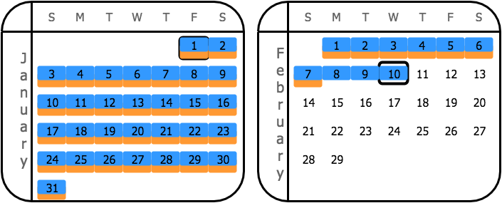

 *Document 2*

 Credit period: 1/16/2016–2/25/2016

 Cash discount period: 1/16/2016–2/7/2016

 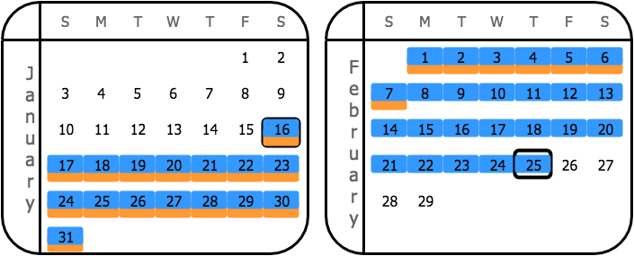

|
|*Fixed Number of Days*|On the [Credit Terms](CS_20_65_00.md) form:

 Interval 1:

 -   **Due Day 1**: *10*
-   **Day From 1**: *1*
-   **Day To 1**: *15*

 Interval 2:

 -   **Due Day 2**: *25*
-   **Day From 2**: *16*
-   **Day To 2**: *31*

 **Discount Day**: *7*

 On the document creation form:

 -   **Document 1 Date**: *1/1/2016*
-   **Document 2 Date**: *1/16/2016*

|*Document 1*

 Credit period: 1/1/2016–2/10/2016

 Cash discount period: 1/1/2016–1/8/2016

 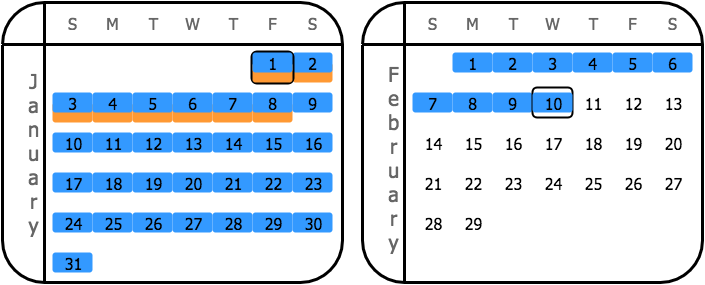

 *Document 2*

 Credit period: 1/16/2016–2/25/2016

 Cash discount period: 1/16/2016–1/23/2016

 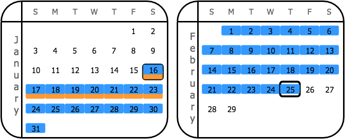

|
|*End of Month*|On the [Credit Terms](CS_20_65_00.md) form:

 Interval 1:

 -   **Due Day 1**: *10*
-   **Day From 1**: *1*
-   **Day To 1**: *15*

 Interval 2:

 -   **Due Day 2**: *25*
-   **Day From 2**: *16*
-   **Day To 2**: *31*

 **Discount Day**: *N/A*

 On the document creation form:

 -   **Document 1 Date**: *1/1/2016*
-   **Document 2 Date**: *1/16/2016*

|*Document 1*

 Credit period: 1/1/2016–2/10/2016

 Cash discount period: 1/1/2016–1/31/2016

 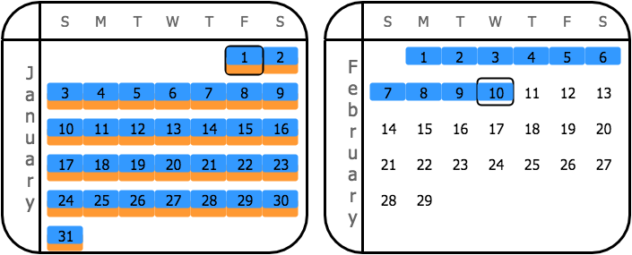

 *Document 2*

 Credit period: 1/16/2016–2/25/2016

 Cash discount period: 1/16/2016–1/31/2016

 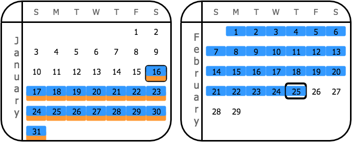

|
|*End of Next Month*|On the [Credit Terms](CS_20_65_00.md) form:

 Interval 1:

 -   **Due Day 1**: *10*
-   **Day From 1**: *1*
-   **Day To 1**: *15*

 Interval 2:

 -   **Due Day 2**: *25*
-   **Day From 2**: *16*
-   **Day To 2**: *31*

 **Discount Day**: *N/A*

 On the document creation form:

 -   **Document 1 Date**: *1/1/2016*
-   **Document 2 Date**: *1/16/2016*

|*Document 1*

 Credit period: 1/1/2016–2/10/2016

 Cash discount period: 1/1/2016–2/10/2016

 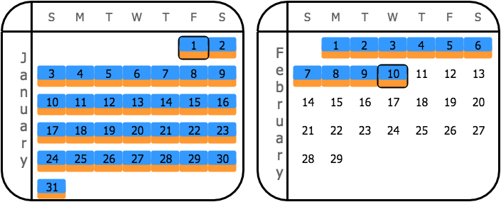

 *Document 2*

 Credit period: 1/16/2016–2/25/2016

 Cash discount period: 1/16/2016–2/25/2016

 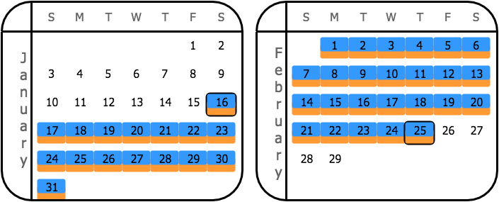

|
|*Day of the Month*|On the [Credit Terms](CS_20_65_00.md) form:

 Interval 1:

 -   **Due Day 1**: *10*
-   **Day From 1**: *1*
-   **Day To 1**: *15*

 Interval 2:

 -   **Due Day 2**: *25*
-   **Day From 2**: *16*
-   **Day To 2**: *31*

 **Discount Day**: *7*

 On the document creation form:

 -   **Document 1 Date**: *1/1/2016*
-   **Document 2 Date**: *1/16/2016*

|*Document 1*

 Credit period: 1/1/2016–2/10/2016

 Cash discount period: 1/1/2016–1/7/2016

 

 *Document 2*

 Credit period: 1/16/2016–2/25/2016

 Cash discount period: 1/16/2016–2/7/2016

 

|
|*Fixed Number of Days Starting Next Month*|On the [Credit Terms](CS_20_65_00.md) form:

 Interval 1:

 -   **Due Day 1**: *10*
-   **Day From 1**: *1*
-   **Day To 1**: *15*

 Interval 2:

 -   **Due Day 2**: *25*
-   **Day From 2**: *16*
-   **Day To 2**: *31*

 **Discount Day**: *7*

 On the document creation form:

 -   **Document 1 Date**: *1/1/2016*
-   **Document 2 Date**: *1/16/2016*

|*Document 1*

 Credit period: 1/1/2016–2/10/2016

 Cash discount period: 1/1/2016–2/8/2016

 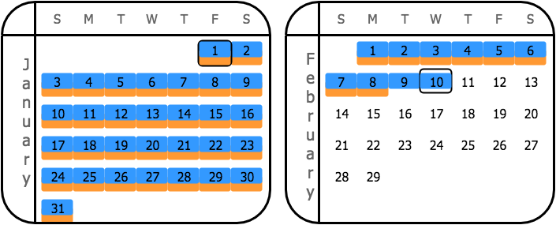

 *Document 2*

 Credit period: 1/16/2016–2/25/2016

 Cash discount period: 1/16/2016–2/8/2016

 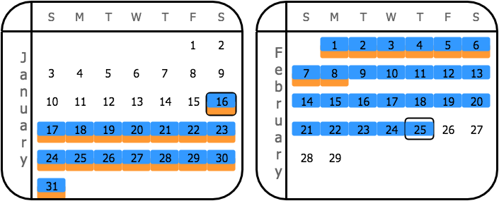

|

**Parent topic:**[Credit Terms](../UserGuide/AP__con_Credit_Terms.md)

