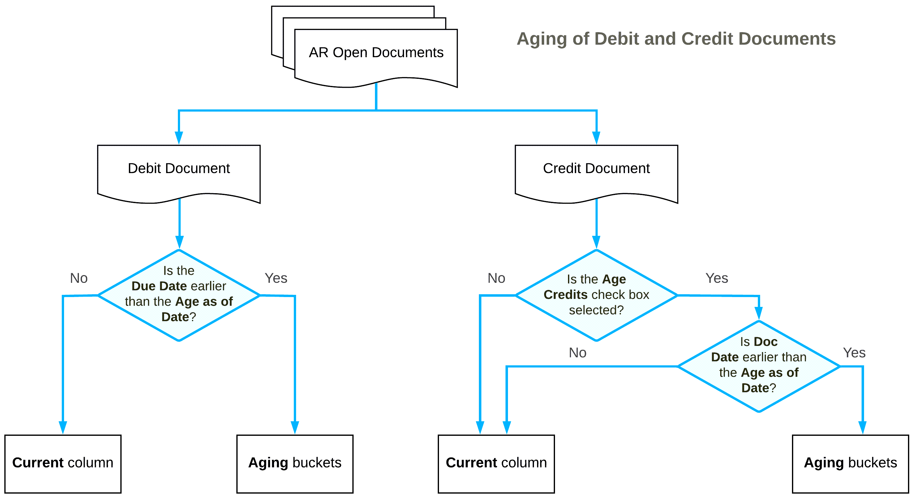

# Preparation of Dunning Letters: Using the AR Aging Report {#_29ef9c86-8f91-4705-bdfc-a649053c8e22 .concept}

Acumatica ERP includes reports that can be used by your collection personnel to determine which invoices are overdue for payment. These reports can also be used by management to determine the effectiveness of the credit and collections efforts. The following section describes the [AR Aging](AR_63_10_00.md) \(AR631000\) report. For descriptions of other reports, see [Preparation of Dunning Letters: Related Reports](CreditPolicy_Preparing_Dunning_Letters_Reports.md).

## AR Aging Report {#section_owj_gvj_bx .section}

You use the [AR Aging](AR_63_10_00.md) \(AR631000\) report and its multicurrency version, [AR Aging MC](AR_63_11_00.md) \(AR631100\), to determine which documents are overdue for payment and for how long.

These reports show all released AR documents in the system whose document dates are earlier than or the same as the date specified in the **Age as of Date** box on the report form. These documents are grouped by statement cycle and by customer.

**Tip:** To see overdue customer balances at the end of the particular period, use the [AR Aged Period-Sensitive](AR_63_05_00.md) \(AR630500\) report.

For each customer, the report shows the outstanding customer balance in the system and lists the released AR documents, which are broken down by aging periods. The balance of the listed AR documents is calculated as the difference between the original amount of the documents and the application amounts of the documents that were applied no later than the specified aging date. The balances of the documents are sorted into columns that represent aging buckets. The system forms aging buckets for a particular statement cycle depending on whether the **Use Financial Periods for Aging** check box is selected for this cycle on the [Statement Cycles](AR_20_28_00.md) \(AR202800\) form as follows:

-   If the check box is selected, the system uses aging buckets that correspond to the financial periods; the zero period \(the leftmost column in the report\) is the financial period of the **Age as of Date** specified on the report form; the other aging periods are the preceding financial periods.
-   If the check box is cleared, the system will show the aging buckets that are specified for the statement cycle.

Depending on the **Age Based On** setting of the statement cycle on the [Statement Cycles](AR_20_28_00.md) form, in the report, debit documents are aged by due dates or by document dates as follows:

-   If the *Due Date* option is selected, the system will compare the due dates of invoices, debit memos, and overdue charges with the aging date \(which you specify in the **Age as of Date** box of the report form\) to determine the appropriate aging periods for the documents included in the report. If the due date of a debit document is the same as or later than the aging date, the document balance is reflected in the **Current** column of the report. Otherwise, the document balance is reflected in the aging period associated with the number of days past due.
-   If the *Document Date* option is selected, the system will compare the document dates of invoices, debit memos, and overdue charges with the aging date \(which you specify in the **Age as of Date** box of the report form\) to determine the appropriate aging buckets for the documents included in the report. If the document date of a debit document is the same as or later than the aging date, the document balance is reflected in the **Current** column of the report. Otherwise, the document balance is reflected in the aging period associated with the number of days that have passed after the document date.

Credit documents are aged based on their document date and the aging date specified for the report if the **Age Credits** check box is selected on the [Accounts Receivable Preferences](AR_10_10_00.md) \(AR101000\) form. By default, the check box is cleared and the credit amounts are shown in the **Current** column of the report. With the check box selected, if the document date of a credit document is the same as or later than the aging date, the document balance is reflected in the current aging period of the report. Otherwise, the document balance is reflected in the aging period associated with the number of days that have passed after the document date.

**Parent topic:**[Preparing Dunning Letters](../UserGuide/CreditPolicy_Preparing_Dunning_Letters_Mapref.md)

