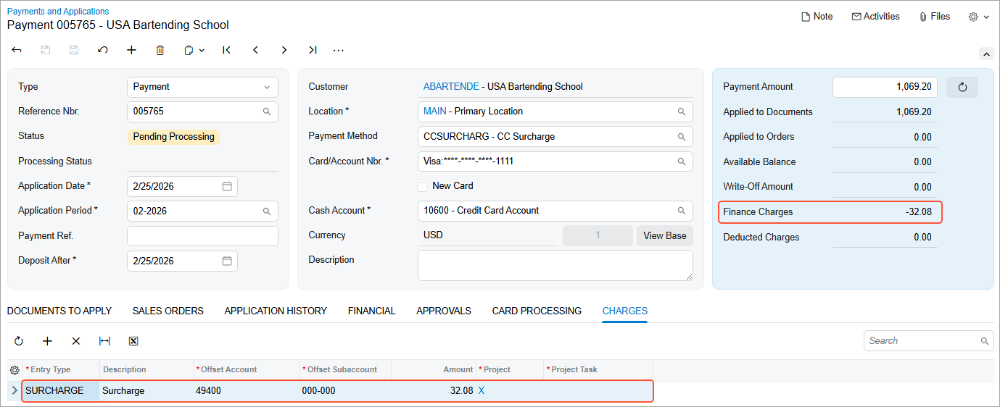
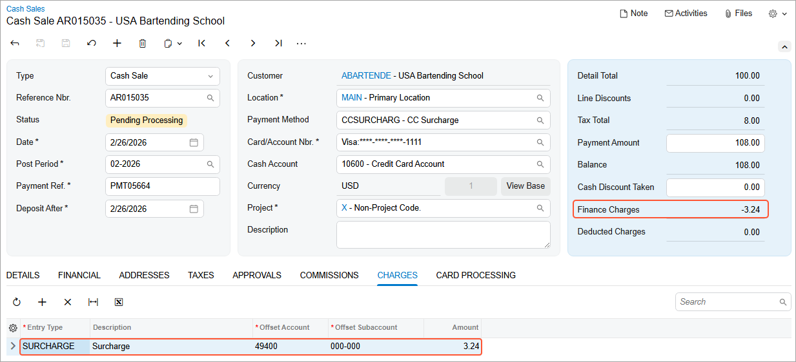
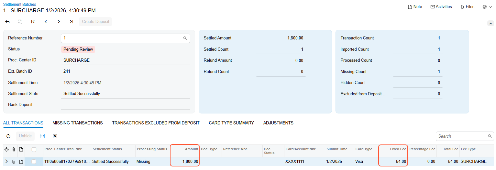
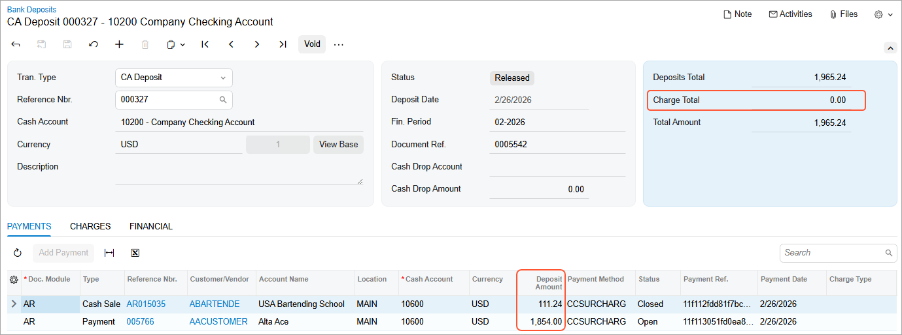
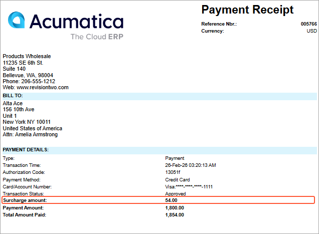

# Automatic Credit Card Surcharges {#_d7118231-32d9-481b-a24a-377a8efce902 .concept}

When customers choose to pay by credit card, you can automatically apply a surcharge to help recover credit card processing costs. *Surcharge* is a small fee added to a credit card transaction to cover your company's costs for processing the payment. You can configure and apply a surcharge to each payment created with a credit card or POS terminal. The surcharge is calculated by the processing center and added to the transaction total \(including sales tax and applicable fees\), then itemized so it's visible in the payment and on receipts.

The surcharge functionality supports only monthly billing. In other words, your company \(a merchant\) pays the fees to the processing center once a month. Surcharging in Acumatica ERP works only when the **Compliant Surcharge** service is enabled for the merchant location in the processing center.

**Attention:** This functionality is available only if the *Acumatica Payments* feature is enabled on the [Enable/Disable Features](CS_10_00_00.md) \(CS100000\) form.

## What You Need to Know { .section}

-   Fees are regulated by states. Most states cap the surcharge at 3% of the purchase, including sales tax. CT \(Connecticut\), MA \(Massachusetts\), Maine \(ME\), and PR \(Puerto Rico\) prohibit surcharging. Surcharging isn't supported outside of USA.
-   Surcharging is not allowed on ACH payments or debit card payments.
-   Each surcharge is shown in a separate line on the bill or receipt and its amount doesn't exceed the cost of processing.
-   Sales taxes are applied to surcharges. In other words, a surcharge is applied to the total transaction amount that includes the sales tax and any other applicable fees.

## Configuration of Surcharge Functionality { .section}

A system administrator should make sure that the **Compliant Surcharge** functionality is enabled for the merchant location in the processing center.

**Tip:** After the processing center enables the service, you may need two merchant accounts \(one with surcharge enabled and one without\). It typically results in setting up two processing centers in Acumatica ERP—so you can choose whether to process a particular transaction with or without a surcharge.

To configure the surcharge functionality:

1.  On the [Entry Types](CA_20_30_00.md) \(CA203000\) form, create a new entry type with the following settings:
    -   **Disb./Receipt**: *Receipt*
    -   **Module**: *CA*
    -   **Default Offset Account**: Specified
2.  On the [Cash Accounts](CA_20_20_00.md) \(CA202000\) form, add this entry type to the cash account specified for the payment method.
3.  On the [Processing Centers](CA_20_50_00.md) \(CA205000\) form, create a new processing center.
4.  In the **Cash Account** box, select the cash account for the processing center.

    **Attention:** You should add the entry type for surcharges to this cash account as well.

5.  On the **Preferences** tab, select the **Compliant Surcharge** check box.

    **Attention:** This check box appears on the tab when a new processing center is created. It won't be shown for existing processing centers.

6.  In the **Surcharge Entry Type** box, select the entry type set up for surcharges.
7.  On the form toolbar, click **Save**.

## Reviewing the Surcharge Before Processing a Payment { .section}

On the [Payments and Applications](AR_30_20_00.md) \(AR302000\) and [Cash Sales](AR_30_40_00.md) \(AR304000\) forms, the surcharge applied to each payment is shown on the **Charges** tab and in the **Finance Charges** box in the Summary area \(see below\).

What happens when you save a payment or cash sale with the credit card or POS payment method:

-   The system retrieves a calculated surcharge and shows it on the form \(see above\).
-   **For saved cards**: a surcharge is calculated once you select the customer payment method.
-   **For new cards** entered in a hosted form: the system may show an assumed surcharge initially. After the card is entered, the system updates the surcharge amount. If the card is debit, the surcharge becomes zero.
-   If you change the payment method or processing center before processing the payment, the system updates the surcharge amount accordingly.

The line added on the **Charges** tab:

-   Is added automatically by the system
-   Can't be selected manually, edited, or deleted
-   Remains non-editable even for unreleased payments
-   Is removed automatically if the payment method is changed to a non-eligible method \(for example, *CHECK* or *ACH*\)

**Tip:** To help users understand the posting direction, the **Disb./Receipt** column is available on the **Charges** tab. The column is hidden by default and can be added by clicking the Column Configuration button.

## Applying Surcharges Across Payment Channels { .section}

The surcharge functionality is applied not only in Acumatica ERP but also in customer-facing payment flows:

-   Processing actions: Surcharges are applied when you click **Authorize**, **Capture**, **Void**, or **Refund** on the More menu of the [Payments and Applications](AR_30_20_00.md) \(AP302000\) or [Cash Sales](AR_30_40_00.md) \(AR304000\) form.

    **Attention:** The amount shown in the **Financial Charges** box is negative for authorized and captured payments and positive for voided payments and refunds.

-   Payment links: Surcharges are applied to transactions processed through payment links. For more details about payment links, see [Processing of Payment Links](AR__con_Processing_Payment_Links.md).
-   Acumatica Self-Service Portal: The surcharge amount is shown before the payment is processed and only when a credit card payment method is selected.

## Posting Surcharge Amounts to the GL { .section}

When you release a payment that includes a surcharge, the system automatically generates a GL entry using the selected surcharge entry type. The surcharge is posted to the **default offset account**, separating surcharge income from the main sales income.

You can review this amount on the [Journal Transactions](GL_30_10_00.md) \(GL301000\) form.

## Surcharges in Settlement Batches and Bank Deposits { .section}

In settlement batches on the [Settlement Batches](CA_30_70_00.md) \(CA307000\) form, each payment is displayed as a single line:

-   Payment amount is shown in the **Amount** column
-   Surcharge amount is shown in the **Fixed Fee** column

Below is a settlement batch with a surcharge applied.

For more details on using settlement batches, see [Performing Settlement of Credit Card Payments and EFTs](CA__MNG_Settlement_of_CC_Payments.md).

The surcharge functionality supports monthly billing \(the processing center bills at the end of the month and does not withhold the surcharge amount from the settlement batches\). Because the surcharge is treated as funds coming in, it doesn't appear as a negative charge on the [Bank Deposits](CA_30_50_00.md) \(CA305000\) form. Instead, it's included in the deposit amount displayed on the **Payments** tab, as shown below.

For more details on bank deposits, see [Preparation of Deposits](CA__CON_Preparation_of_Deposits.md).

## Reviewing Surcharges on Receipts { .section}

On the printed forms of the [Invoice/Memo](AR_64_10_00.md) \(AR641000\) and [Payment Receipt](AR_64_30_00.md) \(AR643000\) reports, every surcharge is shown as a separate line item.

Below is the printed [Payment Receipt](AR_64_30_00.md) report with a surcharge displayed in a separate line.

This line appears on the reports for documents that have the *Credit Card* or *POS Terminal* means of payment.

**Parent topic:**[Processing Credit Card Payments](../UserGuide/AR__MNG_ProcessingCCPayments.md)

