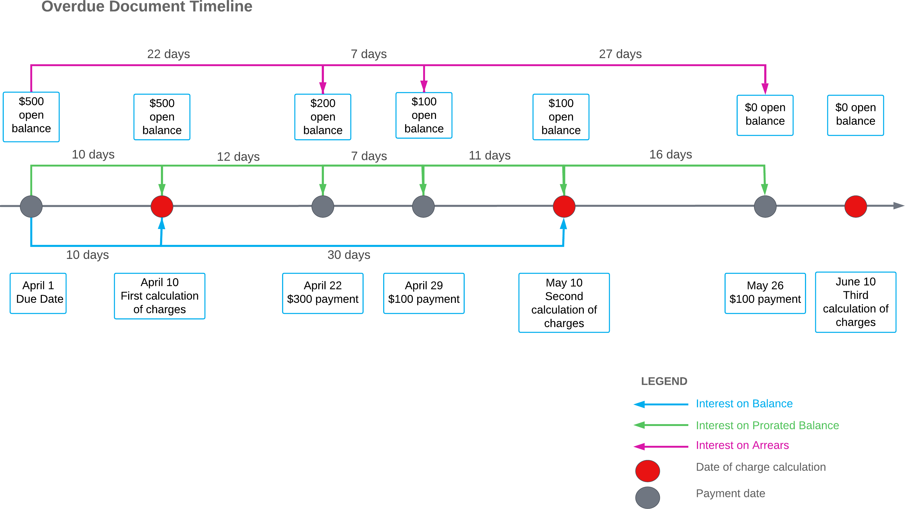

# Overdue Charges: Example of Applying Calculation Methods {#_2c59328d-7341-4a41-9117-bb91221730b2 .concept}

This topic provides examples of the overdue charge calculation methods that can be set up in the system.

Suppose that a customer's invoice is due on April 1; its open balance is $500 as of the due date. The customer paid the invoice after the due date with three payments: $300 on April 22, $100 on April 29, and $100 on May 26. The system calculates overdue charges on the 10th day of each month. The overdue charge amount is an annual rate of 10% and no thresholds are configured. The overdue invoice timeline in the diagram below illustrates this example.

The system calculates the overdue charges differently, as described in the following sections of this topic, depending on the calculation method set for the overdue charge code on the [Overdue Charges](AR_20_45_00.md) \(AR204500\) form.

## *Interest on Balance* {#section_pdf_hjv_vxb .section}

If you select *Interest on Balance* in the **Calculation Method** box on the [Overdue Charges](AR_20_45_00.md) form, the system calculates the overdue charges as follows:

1.  On the first calculation of overdue charges, the system applies overdue charges to the $500 open balance for 10 days overdue and creates an overdue charge document in the amount of 0.1 \* 10 \* $500 / 365 = $1.37.
2.  On the second calculation of overdue charges, the system applies overdue charges to the $100 open balance for 30 days overdue and creates an overdue charge document in the amount of 0.1 \* 30 \* $100 / 365 = $0.82.
3.  On the third calculation of charges, the system does not apply overdue charges because the document is fully paid.

    Overall, the system debited the customer's account for an additional $2.19 in overdue charges.

## *Interest on Prorated Balance* {#section_sdf_hjv_vxb .section}

If you select *Interest on Prorated Balance* in the **Calculation Method** box on the [Overdue Charges](AR_20_45_00.md) form, the system calculates the overdue charges as follows \(see the green lines in the figure above\):

1.  On the first calculation of overdue charges, the system applies overdue charges to the $500 open balance for 10 days overdue and creates an overdue charge document in the amount of 0.1 \* 10 \* $500 / 365 = $1.37.
2.  On the second calculation of overdue charges, the system applies the sum of charges to the $500 open balance for 12 days overdue, to the $200 open balance for 7 days overdue, and to the $100 open balance for 11 days overdue; it then creates an overdue charge document in the amount of \(0.1 \* 12 \* $500 / 365\) + \(0.1 \* 7 \* $200 / 365\) + \(0.1 \* 11 \* $100 / 365\) = $1.64 + $0.38 + $0.3 = $2.32.
3.  On the third calculation of charges, the system applies overdue charges to the $100 open balance for 16 days overdue and creates an overdue charge document in the amount of 0.1 \* 16\* $100 / 365 = $0.44.

    Overall, the system debited the customer's account for an additional $4.13.

## *Interest on Arrears* {#section_vdf_hjv_vxb .section}

If you select the *Interest on Arrears* option in the **Calculation Method** box on the [Overdue Charges](AR_20_45_00.md) form, the system calculates overdue charges when the document is fully paid \(in the figure, the point when the charges are calculated for the third time\).

The overdue charges are the sum of charges applied to the $500 open balance for 22 days overdue, to the $200 open balance for 7 days overdue, and to the $100 open balance for 27 days overdue. The system creates an overdue charge document in the amount of \(0.1 \* 22 \* $500 / 365\) + \(0.1 \* 7 \* $200 / 365\) + \(0.1 \* 27 \* $100 / 365\) = $3.01 + $0.38 + $0.74 = $4.13.

Overall, the system debited the customer's account for an additional $4.13.

**Parent topic:**[Applying Overdue Charges](../UserGuide/CreditPolicy_Overdue_Charges_Mapref.md)

