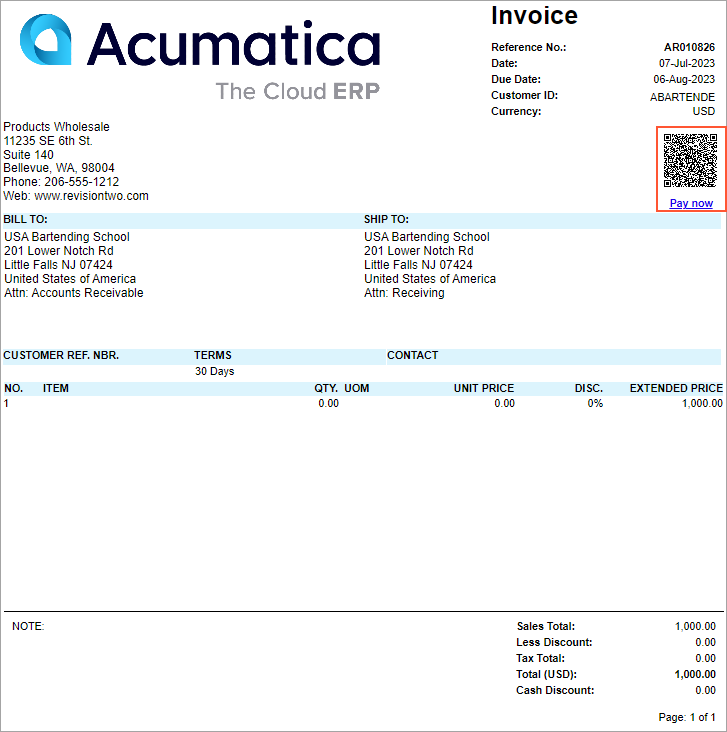

# Processing of Payment Links {#_28a2020b-1731-4f73-9645-47caecc99832 .concept}

In Acumatica ERP, webhooks have been used to implement the receipt of payments that were made in the processing center by using payment links. The system receives information about all created payments from the processing center and processes those payments that were created by using payment links.

**Attention:** Using webhooks is the preferable way to receive payments and is supported by Acumatica ERP. However, webhook creation requires manual actions by administrative users.

## Supported Document Types { .section}

You can create payment links for the following document types created on the following forms:

-   [Invoices and Memos](AR_30_10_00.md) \(AR301000\): *Invoice*, *Debit Memo*, *Overdue Charge*, and *Prepmt. Invoice*
-   [Sales Orders](SO_30_10_00.md) \(SO301000\): Sales orders with the *Sales Order* automation behavior
-   [Invoices](SO_30_30_00.md) \(SO301000\): Sales invoices

## Creation of Payment Links {#section_k1s_jq3_vyb .section}

When open AR documents and sales invoices are released, the system automatically creates payment links via business events. For sales orders with the *SO* behavior, you create payment links manually on the [Process Orders](SO_50_10_00.md) \(SO501000\) or [Sales Orders](SO_30_10_00.md) \(SO301000\) form.

The type of document that the system creates for payments made by using payment links from sales orders or prepayment invoices depends on the option in the **Create from Payment Link \(SO &amp; Prepmt. Inv.\)** box on the **Payment Links** tab of the [Processing Centers](CA_20_50_00.md) \(CA205000\) form:

-   *Payment*: A payment is created when a sales order or prepayment invoice is paid by using a payment link.
-   *Prepayment*: A prepayment is created when a sales order or prepayment invoice is paid by using a payment link.

For payment links to be created automatically for a document, the following conditions must be met:

-   A processing center must be specified for the document on the **Payment Links** tab of the [Invoices and Memos](AR_30_10_00.md) \(AR301000\), [Sales Orders](SO_30_10_00.md), or [Invoices](SO_30_30_00.md) \(SO303000\) form.
-   If the delivery method on the [Customer Classes](AR_20_10_00.md) \(AR201000\) form is *Email*, a valid email address must be specified for the customer in the **Bill-To Contact** section on the **Addresses** tab of the [Invoices and Memos](AR_30_10_00.md), [Sales Orders](SO_30_10_00.md), or [Invoices](SO_30_30_00.md) form.

To manually create payment links, you should do either of the following:

-   To create payment links for multiple released AR documents or sales invoices, you select *Create Payment Link* in the **Action** box on the [Process Payment Links](AR_51_35_00.md) \(AR513000\) form, select the required documents in the table, and click **Process**. Alternatively, you can create a payment link for an individual AR document or sales invoice by clicking **Create Payment Link** on the **Payment Links** tab of the [Invoices and Memos](AR_30_10_00.md) or [Invoices](SO_30_30_00.md) form, respectively.
-   To create payment links for multiple sales orders, you select *Create Payment Link* in the **Action** box on [Process Orders](SO_50_10_00.md) \(SO501000\) form, select the required sales orders in the table, and click **Process**. Alternatively, you can open the sales order on the [Sales Orders](SO_30_10_00.md) form and create a payment link by clicking **Create Payment Link** on the **Payment Links** tab.

If the AR document or sales order becomes open again \(for example, if payment application is reversed\), the **Create Payment Link** button becomes available again on the **Payment Links** tab of the respective form.

## Attachment Generation for Payment Links { .section}

For multiline documents, you can include only the document total in the payment link, while attaching the full line-item details separately as a PDF file.

**Attention:** This functionality doesn't depend on the state of the *Acumatica Payments* feature. If the feature is disabled and you create a sales order with more than 310 lines, the system will still send a request to create a payment link with an attachment.

To set up the generation of a PDF attachment for a payment link, perform the following steps:

1.  On the [Processing Centers](CA_20_50_00.md) \(CA205000\) form, select the needed processing center.
2.  On the **Payment Links** tab, select the **Attach Document Details as PDF** check box.
3.  Click **Save** to save your changes.

Line details will be included in a PDF attachment for payment links created for these document types on the following forms:

-   [Sales Orders](SO_30_10_00.md) \(SO301000\): Sales orders with the *SO* type
-   [Invoices](SO_30_30_00.md) \(SO303000\): Sales invoices with the *Invoice* type
-   [Invoices and Memos](AR_30_10_00.md) \(AR301000\): Documents with the *Invoice*, *Prepmt. Invoice*, *Debit Memo*, and *Overdue Charge* type

When you create a payment link for a document on a data entry form, the system generates one of the following reports and attaches it as PDF files to the applicable document:

-   [Sales Order](SO_64_10_10.md) \(SO641010\) to a sales order
-   [Invoice &amp; Memo](SO_64_30_00.md) \(SO643000\) to a sales invoice
-   [Invoice/Memo](AR_64_10_00.md) \(AR641000\) to an AR invoice, a debit memo, an overdue charge, or a prepayment invoice

If the status of a sales order is *Open*, you can change its line items—for example, by specifying a different quantity. In this case, you click **Sync Payment Link** on the **Payment Links** tab of the [Sales Orders](SO_30_10_00.md) \(SO301000\) form. If you sync a payment link with an attachment, the system will:

1.  Remove the currently attached PDF file with line details
2.  Create a new PDF file and attach it to the payment link

## Attachments to Email Notifications { .section}

Although the system uses the default reports for email notifications, you can select other reports in the mailing and printing settings of the customer class or the customer. These reports are fully customizable and you can change or update them to meet your business needs.

On the [Customers](AR_30_30_00.md) \(AR303000\) and [Customer Classes](AR_20_10_00.md) \(AR201000\) forms, no default report is specified for the *SALES ORDER PAY LINK* and *INVOICE PAY LINK* mailing IDs.

If a payment link is generated with an attachment, the system attaches the following reports to both the email and the payment link:

-   **No report is specified for the _SALES ORDER PAY LINK_ or _INVOICE PAY LINK_ mailing ID** \(default\): The report specified for the *SALES ORDER*, *SO INVOICE*, or *INVOICE* mailing ID
-   **A report is specified for the _SALES ORDER PAY LINK_ or _INVOICE PAY LINK_ mailing ID**: This report

## Synchronization of Payment Links { .section}

Once a payment link is created, synchronization between an AR document or sales order and the payment link is automatic. That is, related business events are active by default after you upgrade Acumatica ERP. Synchronization is triggered by any change made to the due date or amounts of the document or its lines, or any change to the dates or the unpaid balance for sales orders. Also, you can manually synchronize payment links on the [Invoices and Memos](AR_30_10_00.md) \(AR301000\), [Invoices](SO_30_30_00.md) \(SO303000\), [Sales Orders](SO_30_10_00.md) \(SO301000\), and [Process Payment Links](AR_51_35_00.md) \(AR513500\) forms.

Once the AR document or sales order corresponding to a payment link is fully paid or the document or sales order does not have an open balance, the payment link will be marked as closed in Acumatica ERP during the next synchronization.

A payment link is closed automatically if the corresponding sales order is assigned the *Completed* status. You can also close a payment link manually for a sales order at any time by clicking **Close Payment Link** on the **Payment Links** tab of the [Sales Orders](SO_30_10_00.md) form.

## Payment Links in Reports { .section}

The following reports, which show print-friendly versions of documents, contain a QR code for a payment link and the *Pay now* link, shown in the screenshot below, if a payment link has been created for the document:

-   [Invoice/Memo](AR_64_10_00.md) \(AR641000\)
-   [Sales Order](SO_64_10_10.md) \(SO641010\)
-   [Invoice &amp; Memo](SO_64_30_00.md) \(SO643000\)

The following screenshot shows an invoice printed on the [Invoice/Memo](AR_64_10_00.md) report.

## Troubleshooting { .section}

When you are processing payment links, you may encounter the issues listed in the following table. This table describes the issues and how they can be solved.

|Issue|What Causes the Issue|Solution|
|-----|---------------------|--------|
|On the [Sales Orders](SO_30_10_00.md) \(SO301000\) form, a payment link is closed and a new link cannot be created.|A payment link for the sales invoice is created when the invoice is released, because the *SO Invoice Payment Link Create* business event is active. If the linked sales order had a payment link too, this link is closed and a new one cannot be created.|If you process payment links on sales orders rather than sales invoices, you need to clear the **Active** check box for the *SO Invoice Payment Link Create* business event on the [Business Events](SM_30_20_50.md) \(SM302050\) form.|
|A technical error is displayed on the [Sales Orders](SO_30_10_00.md) form when you edit the lines of a sales order for which a payment link has been created.|After the creation of a payment link, each change in sales order lines triggers the *SO Payment Link Update* business event, which may lead to unnecessary service loading and technical errors.|If frequent changes to sales orders are required after payment link creation, you can do the following:1.  On the [Business Events](SM_30_20_50.md) form, clear the **Active** check box for the *SO Payment Link Update* business event.
2.  On the [Process Payment Links](AR_51_35_00.md) \(AR513500\) form, schedule synchronization of sales orders.

The frequency of synchronization should be once a week or less frequent.

|

-   **[To Create Payment Links for AR Documents](../UserGuide/AR__HOW_To_Create_Payment_Link_for_Invoices.md)**  

-   **[To Create Payment Links for Sales Orders](../UserGuide/AR__HOW_To_Create_Payment_Links_for_Sales_Orders.md)**  

-   **[To Process Payment Links](../UserGuide/AR__HOW_To_Process_Payment_Links.md)**  

**Parent topic:**[Configuring and Using Acumatica Payments](../UserGuide/AR__MNG_Acumatica_Payments.md)

