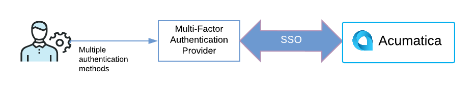

# Multifactor Authentication in Acumatica ERP {#_ed1f84a2-e6af-4903-b591-4e597c5286d8 .concept}

This topic describes possible strategies to use multifactor authentication in Acumatica ERP.

## Single Sign-On { .section}

The best way to implement multifactor authentication in Acumatica ERP is to take advantage of Acumatica’s single sign-on \(SSO\) capabilities. Currently, Acumatica ERP supports SSO with the following multifactor authentication providers:

-   **Microsoft**: Azure multifactor authentication supports phone calls, text messages, mobile app notification, and third-party tokens.
-   **Google**: Google offers two-factor authentication via mobile phone or USB security key. For more information, see [Google 2\_Step Verification](https://www.google.com/landing/2step/#tab=how-it-works).
-   **OneLogin**: A customization project is required for the use of OneLogin. Free and paid two-factor authentication options include a one-time password app, Duo Security, RSA SecurID, and mobile options. For more information, see [OneLogin MultiFactor Authentication](https://www.onelogin.com/product/multi-factor-authentication).

With the use of one of these multifactor authentication providers, users sign in to a provider by using multiple authentication options. The user is then seamlessly signed into Acumatica ERP by using the SSO functionality \(see the following screenshot\).

## Virtual Private Network \(VPN\) { .section}

An alternate strategy involves setting up a virtual private network \(VPN\). The VPN serves as the first layer of authentication, while the Acumatica ERP username and password act as the second layer.

**Parent topic:**[Configuring Multifactor Authentication](../UserGuide/AS__con_Authentication_multi_factor.md)

