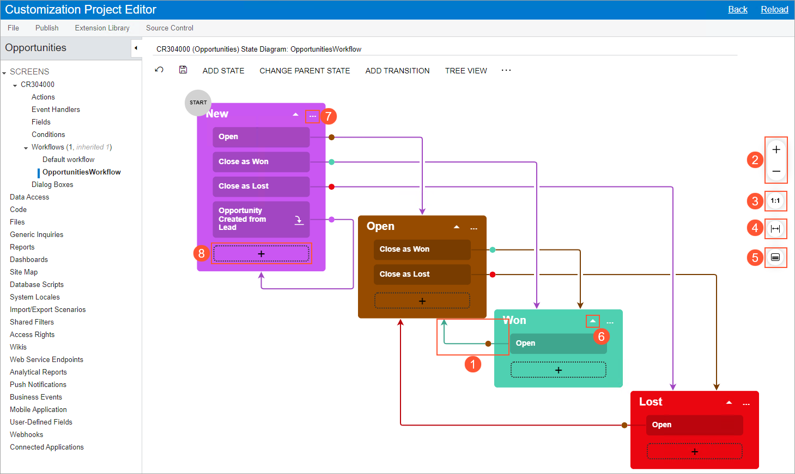
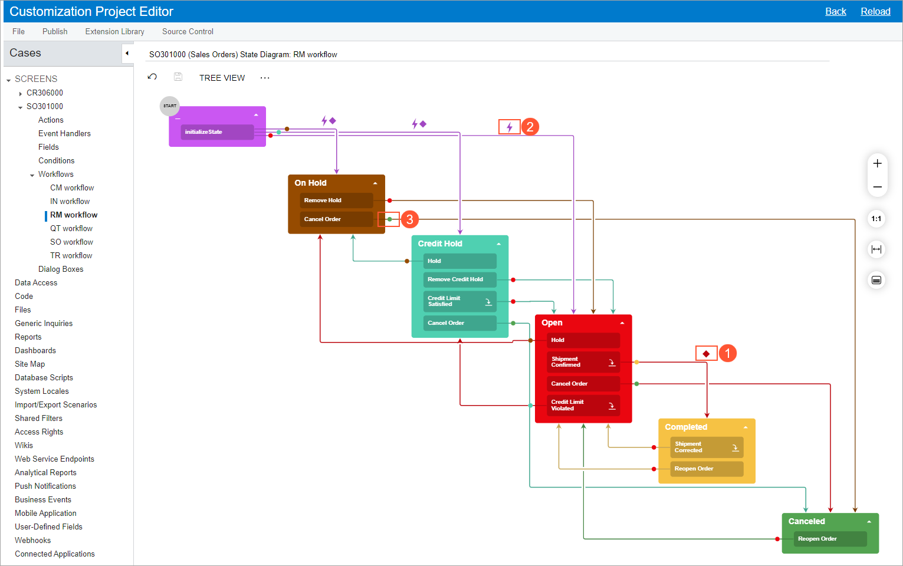

# Workflow \(Diagram View\) {#_6cc999f0-df33-4db0-9f93-36329ad1de7e .reference}

Page ID: \(AU201030\)

For a customized or custom workflow of a particular screen \(that is, a form in Acumatica ERP\), you can use the diagram view of the Workflow page \(also referred to as the *Workflow Visual Editor*\) to define the states, transitions, and actions of a workflow. \(In addition to the diagram view of the workflow, you can use the tree view of the workflow, which is described in [Workflow \(Tree View\)](AU_20_10_30.md).\) The diagram view provides visual representations of the states and the transitions between them.

To access the diagram view, you click **Diagram View** on the page toolbar of the [Workflow \(Tree View\)](AU_20_10_30.md) page for the particular customized, custom, or predefined workflow. The name that appears on the page consists of the form ID, the form name in parentheses, and *State Diagram: &lt;Workflow Name&gt; Workflow*. \(This name is also used for the tree view of the workflow.\)

**Attention:** For a workflow with composite states, the Workflow Visual Editor is not available, and the **Diagram View** button is not displayed on the More menu of the [Workflow \(Tree View\)](AU_20_10_30.md) page.

## Elements of the Diagram View { .section}

The diagram view of the Workflow page \(that is, the Workflow Visual Editor\) contains the following parts:

-   The page toolbar and More menu with various buttons and commands.
-   The main area, which displays the workflow of the selected form as a diagram and has the following elements:
    -   Boxes that contain the names of the states of the entity created by using the form and labels with the names of the actions or event handlers that trigger the transitions. The labels appear after you create a transition and specify the source and target states. For example, in the screenshot below, the *New* box reflects this state for an opportunity, and the *Open* and *Close as Won* labels within this box reflect the actions a user can perform while the opportunity has the *New* state \(which is the status on the form\).

        **Tip:** Actions and event handlers for the current state are not displayed if they do not trigger any transitions.

    -   Arrows that show the transitions between the states. For example, Item 1 in the following screenshot shows an arrow that represents a transition from the *Won* state to the *Open* state of an opportunity that has been created on the [Opportunities](CR_30_40_00.md) \(CR304000\) form.
-   Buttons that are shown to the right of the diagram: **Zoom In** or **Zoom Out** \(see Item 2 in the following screenshot\), **Reset Scale to 100%** \(Item 3\), **Fit Screen** \(Item 4\), and **Collapse All/Expand All** \(Item 5\).

    

|Element|Description|
|-------|-----------|
|Arrow|You click an arrow \(see Item 6 in the screenshot above\) to expand or collapse the list of actions or event handlers that trigger transitions for this state.|
|More button|You click the More button \(Item 7\) to invoke a More menu with the following commands:

 -   **Edit State**: Opens the [**State**](#_bb426dc7-6327-4dce-8276-130cbc3af39d) dialog box, which you can use to modify the state.
-   **Add Transition**: Opens the [**Add Transition**](#_37370254-2d13-499e-9423-25d409ae8259) dialog box, which you can use to add a transition from the current state to another state. In the dialog box, you specify the action or event handler that causes the transition, and the target state.
-   **Delete State**: Deletes the state. When you select this command, you need to confirm the deletion in the dialog box that is opened.

|
|Plus button|You click a plus button \(Item 8\) to manually draw a transition line for an action or an event handler that does not yet have any outgoing transitions from the current state. This opens the [Add Transition Dialog Box](#_37370254-2d13-499e-9423-25d409ae8259) dialog box with the **Target State** box filled in.

 When the transition is created, the action or event handler that triggers it is added to the box with the current state with the name you have specified in the **Trigger Name** box of the dialog box.

|

## Page Toolbar and the More Menu { .section}

The page toolbar includes standard buttons and page-specific buttons and commands. The page-specific commands can be shown as buttons on the page toolbar, as commands on the More menu, or in both places. These commands are listed in the following table in alphabetical order.

|Command|Description|
|-------|-----------|
|**Add Predefined State**|Opens the [**Add Predefined State**](#_d8ad11fb-c7d9-4d4b-a1c9-5e3821935ee9) dialog box, which you use to add a predefined state to the workflow.|
|**Add State**|Opens the [**Add State**](#_aefa3aa4-49e0-4471-bc8d-41a536614ee1) dialog box, which you use to add a new state to the workflow.|
|**Add Transition**|Opens the [**Add Transition**](#_37370254-2d13-499e-9423-25d409ae8259) dialog box, which you use to add a transition to the workflow.

 This command is available only if you select a state in the **States and Transitions** pane.

|
|**Change Parent State**|Opens the [**Change Parent State**](#_2d27c70f-2479-4eec-b6f1-b19b3129bd88) dialog box, which you use to select the parent state for the current state.

 This command is available only if you select a state in the **States and Transitions** pane.

|
|**Tree View**|Changes the view of the workflow from the diagram view to the tree view. \(In the tree view, you can click the **Diagram View** button to return to this view.\)|
|**View Changes**|Opens the [**Changes**](#_297e4a53-52d4-4e70-b9c2-67f68795a0c8) dialog box, which you use to view the changes in the workflow. This button is available only if the workflow is inherited \(that is, based on a predefined workflow\).|

|Element|Description|
|-------|-----------|
|The dialog box has the following elements.|
|**Action Type**|Read-only. The type of the action, which indicates that the action changes the state of an entity as a part of a workflow.|
|**Action Name**|Required. The internal name of the action, which will be displayed on the [Actions](AU_20_10_50.md) page and in the Workflow Editor.|
|**Display Name**|Required. The name of the action that will be displayed on the applicable Acumatica ERP form.|
|**Dialog Box**|The dialog box that will be displayed when the action is clicked. For details, see [Workflow Elements: General Information](../DeveloperGuide/WorkflowUI_ConfiguringWorkflowElements_GeneralInfo.md).|
|**Category**|The category of the More menu in which the menu command associated with the action will be displayed. The default list of categories depends on the form. To manage the categories, you click the **Manage Categories** button on the page toolbar.|
|**Add to Toolbar**|A check box that indicates \(if selected\) that the action will be displayed as a button on the form toolbar as well as under the selected category of the More menu if the action is available for a record based on its state. If the action is available but no category is specified, the action will be displayed on the form toolbar and under the **Other** category.

 If the check box is cleared, the action will not be displayed on the form toolbar but will be displayed on the More menu.

|
|The dialog box also contains the following buttons.|
|**OK**|Closes the dialog box and creates the action.|
|**Cancel**|Closes the dialog box without creating the action.|

## Add State Dialog Box {#_aefa3aa4-49e0-4471-bc8d-41a536614ee1 .section}

You use the **Add State** dialog box, which opens when you click **Add State**, to add a new state to the workflow.

|Element|Description|
|-------|-----------|
|The dialog box contains the following elements.|
|**Identifier**|A single-letter identifier of the state \(for example, *H* for *On Hold*\).|
|**Description**|The display name of the state \(for example, *On Hold*\).|
|**Parent State**|The parent state of the current state.

 If you select a parent state, the state you are creating becomes a nested one for this parent state. If this parent state is not a composite state yet \(that is, if it does not contain any nested states\), the parent state becomes a composite state.

 If you leave this box empty, the created state is added to the bottom of the list of states on the **States and Transitions** pane.

|
|The dialog box has the following buttons.|
|**OK**|Closes the dialog box and adds the state to the workflow.|
|**Cancel**|Closes the dialog box without adding the state.|

## Change Parent State Dialog Box {#_2d27c70f-2479-4eec-b6f1-b19b3129bd88 .section}

You use the **Change Parent State** dialog box, which opens when you click **Change Parent State**, to select the parent state for the current state.

|Element|Description|
|-------|-----------|
|The dialog box contains the following elements.|
|**State**|Read-only. The name of the current state.|
|**Parent State**|The parent state of the current state.

 If this box is empty and you select a value in it, the current state becomes a nested one. If the box contains a value and you remove it, the current state becomes an ordinary state \(that is, neither composite nor nested\). If you modify the value in this box, the current nested state moves to another composite state.

|
|The dialog box has the following buttons.|
|**OK**|Closes the dialog box and changes the parent state.|
|**Cancel**|Closes the dialog box without saving your changes to the parent state.|

## Add Predefined State Dialog Box {#_d8ad11fb-c7d9-4d4b-a1c9-5e3821935ee9 .section}

You use the **Add Predefined State** dialog box to add a predefined state to the workflow. This dialog box opens when you click **Add Predefined State** on the form.

|Element|Description|
|-------|-----------|
|The dialog box contains the following elements.|
|**State**|The name of the predefined state.|
|**Parent State**|The parent state for the predefined state.

 If you leave this box empty, the state is added to the bottom of the list of states on the **States and Transitions** pane.

|
|The dialog box has the following buttons.|
|**OK**|Closes the dialog box and adds the predefined state to the workflow.|
|**Cancel**|Closes the dialog box without adding the predefined state.|

## Add Transition Dialog Box {#_37370254-2d13-499e-9423-25d409ae8259 .section}

You use the **Add Transition** dialog box, which opens when you click **Add Transition**, to add a transition to the workflow.

|Element|Description|
|-------|-----------|
|The dialog box contains the following elements.|
|**Original State**|Read-only. The name of the state from which the transition is being created.|
|**Triggered by Action**|An option button that indicates that the transition is triggered by an action.|
|**Triggered by Event Handler**|An option button that indicates that the transition is triggered by an event handler.|
|**Trigger Name**|The name of the action or event handler that triggers the transition. You can select a name from the drop-down list. Alternatively, you can click **Create** \(right of the box\) and add a new action.|
|**Create**|A button that you click to open the **New Action** dialog box, so that you can specify the settings of the new action.

 This button is available if you select the **Triggered by Action** option button.

|
|**Condition**|Optional. The condition that must be fulfilled for the transition to take place.|
|**Target State**|The target state of the transition.

 In the box, you can select a nested state, a composite state, *@Next* \(the next state in the composite state\), or *@ParentNext* \(the next state of the parent state\).

 **Tip:** This box is filled in when you create a transition by clicking the plus button and manually drawing a transition line.

|
|The dialog box also contains the following buttons.|
|**OK**|Closes the dialog box and adds the transition to the workflow.|
|**Cancel**|Closes the dialog box without adding the transition.|

## Changes Dialog Box {#_297e4a53-52d4-4e70-b9c2-67f68795a0c8 .section}

You use this dialog box to view the source code of the workflow; the changes to the currently selected element \(state or transition\) are highlighted in red. The dialog box also contains the following buttons.

|Button|Description|
|------|-----------|
|**Revert Changes**|Returns the workflow to its predefined state.|
|**Close**|Closes the dialog box.|

## State Dialog Box {#_bb426dc7-6327-4dce-8276-130cbc3af39d .section}

This dialog box opens when you click the More button for a state and then click **Edit State**. The dialog box contains a Summary area and the following tabs: **Fields**, **Actions**, **Handlers**, **Fields to Update on Entry**, and **Fields to Update on Exit**.

|Element|Description|
|-------|-----------|
|**Identifier**|A single-letter identifier of the state \(for example, *H* for *On Hold*\).|
|**Description**|The display name of the state \(for example, *On Hold*\).|
|**Active**|A check box that indicates \(if selected\) that the selected state is active.|
|**Initial State of the Workflow**|A check box that indicates \(if selected\) that this state is the initial state of the workflow.|

|Element|Description|
|-------|-----------|
|The table toolbar includes standard buttons and the following table-specific button.|
|**Combo Box Values**|Opens the **Combo Box Values** dialog box, where you can specify the list of values that are displayed as combo boxes.|
|The table on the tab has the following columns.|
|**Active**|A check box that indicates \(if selected\) that the field is active for the selected state.|
|**Object Name**|The name of the DAC from which the field is selected.|
|**Field Name**|The name of the field.|
|**Disabled**|A check box that indicates \(if selected\) that the field is unavailable for the selected state.|
|**Hidden**|A check box that indicates \(if selected\) that the field is hidden for the selected state.|
|**Required**|A check box that indicates \(if selected\) that the field is required for the selected state.|
|**Default Value**|The default value of the field.

 **Attention:** You can specify default values of fields only for the initial state of a workflow.

|
|**Status**|Read-only. The status of the field.

 The column can have one of the following values:

 -   *Inherited*: The field that has been added to the predefined workflow.
-   *New*: The field that you have added to the workflow.

|

|Element|Description|
|-------|-----------|
|The tables on the tabs contain the same columns, which are listed in the following table.|
|**Active**|A check box that indicates \(if selected\) that the field should be updated after the transition.|
|**Field Name**|The name of the field that should be updated.|
|**From Schema**|A check box that indicates \(if selected\) that the field value from the database should be used.|
|**New Value**|The new value for the field.|
|**Status**|The status of the field to update.

 The column can have one of the following values:

 -   *Inherited*: The field that has been added to the predefined workflow.
-   *New*: The field that you have added to the workflow.

|

|Element|Description|
|-------|-----------|
|The table toolbar includes standard buttons and the following table-specific button.|
|**Create Action**|Opens the **New Action** dialog box, where you can create an action for the current state.|
|The table of the tab has the following columns.|
|**Active**|A check box that indicates \(if selected\) that the action is active for the selected state.|
|**Action**|An action that is available for the selected state.|
|**Duplicate on Toolbar**|A check box that indicates \(if selected\) that the action should be available on the page toolbar \(as a button\) as well as on the More menu.|
|**Auto-Run Condition**|A condition that \(if fulfilled\) makes the system trigger the action automatically.

 For a system action, the box is unavailable for editing.

 The default value of the box is *False*, which indicates that the system does not trigger the action automatically.

|
|**Connotation**|An optional color notation that you can assign to the action to give users additional information about it. For example, you can use connotations to indicate to users which action in the entity processing workflow is the one most likely to be taken, given the state of the entity, which actions require special consideration, and which actions provide links to additional information, such as reports.

 On the More menu, a connotation is displayed as a dot of the selected color \(see the list below\) right of the associated menu command. If the action is also displayed on the form toolbar, it is highlighted in the selected color.

 You can select one of the following options \(with the corresponding colors noted\):

 -   *Primary*: The primary color of the site theme
-   *Secondary*: The secondary color of the site theme
-   *Success*: Green
-   *Danger*: Red
-   *Warning*: Yellow
-   *Info*: Blue
-   *Light*: Light gray
-   *Dark*: Dark gray

 For an action on a form with a workflow, you can also specify a connotation in the **Action Properties** dialog box of the Actions page. In this case, this connotation is used for this action in all states of an entity in the workflow. If in a specific state, another connotation is specified for the action, the state-specific connotation takes precedence.

 **Tip:** Connotations are also supported for forms without workflows, but the connotations for these forms can be modified only through code. For details, see [Action Customization: Connotation for an Action](../StudioDeveloperGuide/CodeCustomization_ActionsCustomization_AddConnotation.md).

|
|**Status**|A read-only box that indicates the status of the action.

 The status of the action can be one of the following:

 -   *Inherited*: The system action.
-   *New*: The action that you have created.
-   *Modified*: The system action that you have modified.

|
|**Dialog Box**|The name of the dialog box that is displayed when a user clicks the action, if applicable; in this dialog box, the user should enter the needed values.|

|Element|Description|
|-------|-----------|
|The table has the following columns.|
|**Active**|A check box that indicates \(if selected\) that the event handler is active for the selected state.|
|**Handler**|An event handler that is available for the selected state.|
|**Status**|A read-only box that indicates the status of the event handler.

 The column can have one of the following values: *Inherited* or *New*.

|

## Transition Elements { .section}

In the Workflow Visual Editor, if a transition has a condition \(that is, if the transition is performed only when a particular condition is met for the entity\), a diamond icon is displayed above the transition \(see Item 1 in the following screenshot\).

If an action with a transition contains an auto-run condition \(that is, a condition for which the action is triggered automatically if the condition is met\), a lightning rod icon is displayed above the transition \(Item 2\).

The transition lines are of the same color as the states they originate from, which makes it easier to distinguish between transitions. Also, each transition has a dot that indicates the direction of the transition and that is of the same color as the target state \(Item 3\).

|Command|Description|
|-------|-----------|
|**Edit Transition**|Opens the [**Transition**](#_b48f0b93-55bb-4747-b45d-3e4d03773136) dialog box.|
|**Delete Transition**|Deletes the selected transition. When you select this command, you need to confirm the deletion in the dialog box that is opened.|

## Transition Dialog Box {#_b48f0b93-55bb-4747-b45d-3e4d03773136 .section}

This dialog box opens when you click the transition and then click the Edit button in the context menu.

|Element|Description|
|-------|-----------|
|The dialog box contains the following elements.|
|**Original State**|Read-only. The name of the state from which the transition is being created.|
|**Active**|A check box that indicates \(if selected\) that the transition is active for the selected action.|
|**Triggered by Action**|An option button that indicates that the transition is triggered by an action.|
|**Triggered by Event Handler**|An option button that indicates that the transition is triggered by an event handler.|
|**Trigger Name**|The name of the action or event handler that triggers the transition.|
|**Condition**|Optional. The condition that must be fulfilled for the transition to take place.|
|**Target State**|The target state of the transition. This box is filled in when you create a transition by clicking the plus button and manually drawing a transition line.|
|The dialog box also contains the **Fields to Update After Transition** table, which lists the fields that the system should update after the transition is performed. The table has the following columns.|
|**Active**|A check box that indicates \(if selected\) that the field should be updated after the transition.|
|**Field Name**|The name of the field that should be updated.|
|**From Schema**|A check box that indicates \(if selected\) that the field value from the database should be used.|
|**New Value**|The new value for the field.|
|**Status**|The status of the field to update.|
|The dialog box also contains the following button.|
|**OK**|Closes the dialog box and applies the selected options.|

