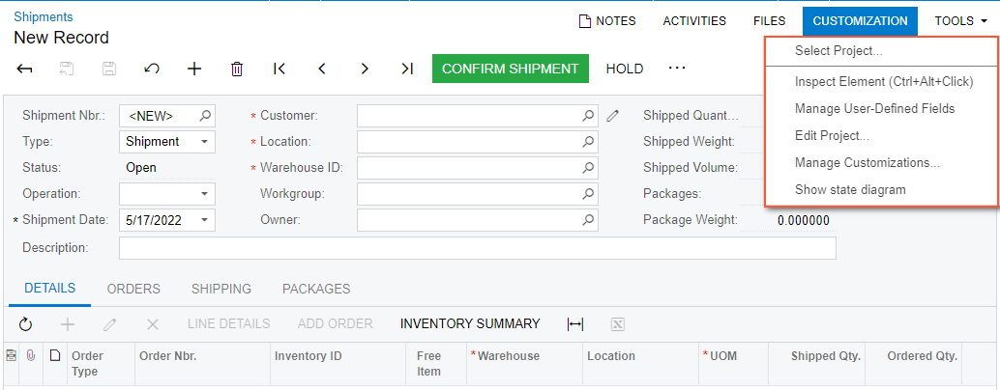

# Customization Menu {#_d6c46870-0c44-4f78-ae20-9bb9ef25dccd .reference}

You can access the **Customization** menu on the form title bar of an opened Acumatica ERP form if your user account is assigned the *Customizer* role. \(For details, see [To Assign the Customizer Role to a User Account](../CustomizationPlatform/CG_GL_Stages_Role.md).\)

**Tip:** You click **Customization** on the form title bar to access the customization-related menu commands associated with the form, as shown in the following screenshot.

## Menu Commands { .section}

You can use the following customization-related menu commands.

|Command|Description|
|-------|-----------|
|**Select Project**|Opens the **Select Customization Project** dialog box, which you use to select an existing customization project or to specify the name of a new project for all modifications that you are going to perform.|
|**Inspect Element**|Launches the [Element Inspector](AU_ElementInspector.md), so that you can select a UI control on the current form and open the **Element Properties** dialog box for the selected control. You use this dialog box to inspect and customize the control.

 **Tip:** You can use the keyboard shortcut Ctrl+Alt+Click to inspect elements on pop-up windows and dialog boxes.

 If you have selected a customization project, all the modifications that you initiate in the inspector will be added to this current project. Otherwise, the Element Inspector opens the **Select Customization Project** dialog box.

|
|**Manage User-Defined Fields**|Opens the [Edit User-Defined Fields](cs_20_50_20.md) \(CS205020\) form, where you can select user-defined fields for the current form from the previously defined list of attributes and user-defined fields \(for details, see [Managing Attributes and User-Defined Fields](CS__con_Attributes_and_User_Defined_Fields.md)\).

 This command appears only on data entry forms and reports.

 For details on how to add user-defined user fields, see [To Add User-Defined Fields to a Form](Admin_HOW_AddUserField.md).

|
|**Edit Project**|Opens the Customization Project Editor for the currently selected customization project.|
|**Manage Customizations**|Opens the [Customization Projects](SM_20_45_05.md) \(SM204505\) form.|
|**Show State Diagram**|Opens the **State Diagram** dialog box, which contains the workflow diagram for the selected form and the **Customize Workflow** button.

 If you click the **Customize Workflow** button, the system opens the **Select Customization Project** dialog box. In this dialog box, you select an existing customization project \(or click **New** and then specify the name of the customization project to be created in the **New Project** dialog box\) and click **OK**. This opens the Customization Project Editor, so that you can modify the workflow for the current form. For details, see [Workflow Creation: General Information](../DeveloperGuide/WorkflowUI_CreatingWorkflow_GeneralInfo.md) and [Diagram View: General Information](../DeveloperGuide/WorkflowUI_CustomizingInheritedWorkflow_GeneralInfo.md).

 If you have only one customization project, the system opens the Customization Project Editor for this project after you click **Customize Workflow**, without displaying the **Select Customization Project** dialog box.

 **Tip:** This command is displayed for forms with workflows without composite states.

|

|Element|Description|
|-------|-----------|
|The dialog box has the following element.|
|**Project Name**|Provides the ability to select an existing customization project.|
|The dialog box has the following buttons.|
|**OK**|Confirms your selection and closes the dialog box.|
|**Cancel**|Cancels the operation and closes the dialog box.|
|**New**|Opens the **New Project** dialog box, where you can create a new project.|

|Element|Description|
|-------|-----------|
|The dialog box has the following element.|
|**Project Name**|The name of the customization project you are creating.

 **Tip:** The customization project name is used as the namespace if you create an extension library from the project. The first character of the name must be a letter or the underscore symbol.

|
|The dialog box has the following buttons.|
|**OK**|Creates an empty customization project with the specified name and closes the dialog box.

 **Tip:** As soon as you click **OK**, the system creates a customization project in the database.

|
|**Cancel**|Closes the dialog box without creating a customization project.|

