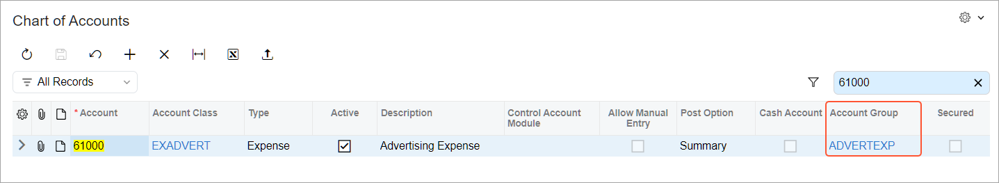

# Account Groups: To Create an Expense Account Group {#_d3149947-c2d3-4f43-aad4-f505d9ef02fa .task}

In the following implementation activity, you will learn how to create account groups.

**Attention:** This activity is based on the *U100* dataset. If you are using another dataset or if any system settings have been changed in *U100*, these changes can affect the workflow of the activity and the results of the processing. To avoid issues, restore the *U100* dataset to its initial state.

## Story { .section}

Suppose that you, as an implementation manager, are configuring project accounting for SweetLife Fruits &amp; Jams company. You need to create an account group for advertising expenses and map the general ledger account to which the expenses will be recorded to this group.

## System Preparation { .section}

To prepare to perform the instructions of the activity, launch the Acumatica ERP website, and sign in to a company with the *U100* dataset preloaded; you should sign in as system administrator by using the *gibbs* username and the *123* password.

## Step 1: Creating an Account Group { .section}

To create an account group, do the following:

1.  On the [Account Groups](PM_20_10_00.md) \(PM201000\) form, create a new record.
2.  In the **Account Group ID** box, type `ADVERTEXP`.

    Notice that the **Active** check box is selected by default.

3.  In the **Type** box, select *Expense*.
4.  In the **Description** box, type `Advertising Expenses`.
5.  On the table toolbar of the **Accounts** tab, click **Add Row**, and in the row, select the *61000 - Advertising Expense* account.
6.  Save the account group.

## Step 2: Reviewing the Chart of Accounts { .section}

To make sure that the account group has been configured correctly, do the following:

1.  Open the [Chart of Accounts](GL_20_25_00.md) \(GL202500\) form.
2.  In the search box on the form, type `61000`.
3.  In the **Account Group** column of the only row, notice that *ADVERTEXP* is specified, which means that the account is mapped to this account group.

    

You have created the account group and mapped a general ledger account to this group.

**Parent topic:**[Creating Account Groups](../UserGuide/Account_Groups_Mapref.md)

