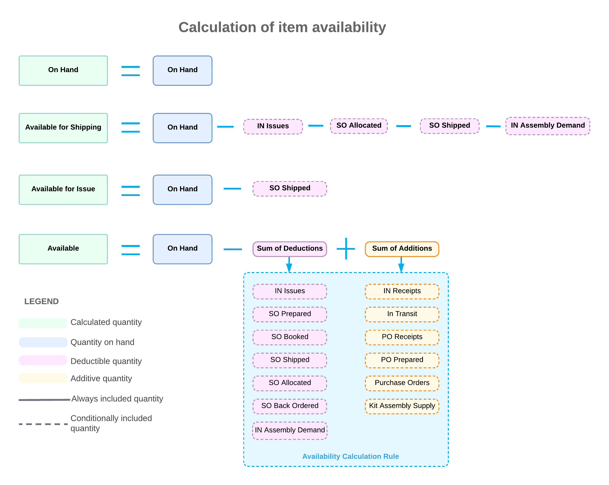

# Availability Calculation Rules: General Information {#_36d6e854-c66e-4d9f-b150-6abbf0ece76b .concept}

In Acumatica ERP, you can configure the way availability data is calculated in accordance with your company's policies. You define the availability calculation rules on the [Availability Calculation Rules](IN_20_15_00.md) \(IN201500\) form. For each item class, on the [Item Classes](IN_20_10_00.md) \(IN201000\) form, you need to specify the particular availability calculation rule, which defines the availability calculation options for this item class. These calculations cannot be overridden for individual stock items.

## Learning Objectives { .section}

In this chapter, you will configure the availability calculation rule that applies to inventory items.

## Applicable Scenarios { .section}

You create availability calculation rules in the following cases:

-   You are initially configuring inventory in Acumatica ERP.
-   You need to add an item class or inventory item with specific availability calculation settings.

## Types of Quantities Calculated { .section}

Acumatica ERP automatically updates the on-hand quantities of items at warehouses only when the documents that record inventory transactions have been released. On-hand quantities usually differ from the quantities that are actually available because documents may be processed after the actual operations with items have been performed in such cases as the following:

-   Certain quantities of items may be booked on sales orders that are on hold.
-   Some items may be picked for shipping but not yet shipped.
-   Items may be returned from customers before the corresponding returns are created.
-   Items may be received from vendors before the corresponding receipts are released.

When you select a stock item on an entry form of Acumatica ERP, in the table footer of the form, you can see the quantities of the item in inventory that are on hand, available, available for shipping, and available for issue. The system maintains these quantities according to the following rules \(also displayed in the diagram below\):

-   On-hand quantity: This is the on-hand or book quantity of items in inventory. This quantity is stored in the Acumatica ERP database and updated with every released inventory transaction.
-   Quantity available for shipping: This estimated quantity is calculated by using the following formula: the on-hand quantity minus the quantity on issues \(*IN Issues* in the diagram\) that have not been released yet, minus the quantity allocated for shipping \(*SO Allocated*\), minus the shipped quantity \(*SO Shipped*\), minus the quantities of stock components in kit assembly documents that have not been released yet \(*IN Assembly Demand*\), minus the quantities of stock kits in disassembly documents that have not been released yet \(*IN Assembly Demand*\). Thus, the quantity available for shipping can be less than the on-hand quantity. The system verifies the quantity available for shipping every time a new shipment is created.
-   Quantity available for issue: This is an estimated quantity of the items that can be issued from inventory, which is calculated as the on-hand quantity minus the shipped quantity \(*SO Shipped* in the diagram\). The system checks this quantity to prevent a user from issuing unavailable stock directly from a warehouse.

    This means that an inventory adjustment with a negative quantity, an issue, or a transfer cannot be released if the issued quantity is greater than the quantity available for issue at the selected location. Note that the system applies this rule only to locations for which the **Include in Qty. Available** check box is selected on the [Warehouses](IN_20_40_00.md) \(IN204000\) form. For locations that have this check box cleared, only direct inventory transactions on the [Issues](IN_30_20_00.md) \(IN301000\), [Transfers](IN_30_40_00.md) \(IN304000\), and [Adjustments](IN_30_30_00.md) \(IN303000\) forms can be used to issue an item. In these transactions, the system validates only the on-hand quantity.

-   Available quantity: You can configure the way this estimated quantity is calculated by using availability calculation rules. The available quantity may include anticipated transactions and therefore may be less than or greater than the on-hand quantity. Anticipated transactions correspond to the documents and transactions that have been entered in the system but not yet processed to the end. \(In the diagram, these documents and transactions are indicated by *Sum of Deductions*, which is subtracted from the on-hand quantity, and *Sum of Additions*, which is added to the on-hand quantity.\) In the availability calculation settings of an item class, you specify which anticipated transactions affect the available quantity. Thus, the available quantity may include goods on purchase orders \(*Purchase Orders* in the diagram\) and exclude the goods allocated for sales orders \(*SO Allocated*\). For details, see [Plan Types](#_87027d64-139d-474d-b097-379b2d80ab70).

    **Tip:** After you change the calculation options for item availability, we recommend that you perform the recalculation by using the [Recalculate Inventory](IN_50_50_00.md) \(IN505000\) form. The system will recalculate the item availability and allocation data in accordance with the options that you selected most recently.

    You can use the available quantity as a leading indicator of demand for the automated inventory replenishment process \(see [Replenishment for Stock Items](../ImplementationGuide/config_OrderMgmt_Replenishment_Mapref.md)\). Also, salespeople might want to consider the available quantity rather than the on-hand quantity when adding items to sales orders and overselling items to a controlled extent, which might be dictated by the company's sales policy.

You can review these quantities for a selected stock item on the [Inventory Summary](IN_40_10_00.md) \(IN401000\) form. You can also review them on the **Inventory Summary** tab on the side panel of the [Stock Items](IN_20_25_00.md) \(IN202500\) form.

The quantities shown in the following diagram, such as *IN Issues*, represent *plan types* that you can view on the [Inventory Allocation Details](IN_40_20_00.md) \(IN402000\) form. A plan type is an item's status, which reflects a combination of actions that could affect the item's availability in stock and that the system will apply to the item during the next processing stage. A plan of a particular type is related to unreleased documents that contain the item. The availability calculation rule applied to the item \(which is the rule specified for the item class\) determines the combination of plan types that affect the item availability in stock.

Dotted lines around an entry in the diagram indicate plan types that are used to calculate a particular quantity.

## Plan Types {#_87027d64-139d-474d-b097-379b2d80ab70 .section}

For each item class, you select an availability calculation rule to define how you want the system to calculate the available quantities for items of the class. Each availability calculation rule, which you create on the [Availability Calculation Rules](IN_20_15_00.md) \(IN201500\) form, defines the plan types that affect the available quantities of items of the class. Documents with the *Released* and *Posted* statuses do not affect calculation of these quantities.

When you configure an availability calculation rule, you select the plan types that increase the available quantity of items of the class and the plan types that decrease the available quantity of these items. The plan types that you do not select will not be included in availability calculations for items of the class.

The plan types that correspond to the following documents decrease the available quantity of a stock item if these plan types are selected for the availability calculation rule of the applicable item class:

-   Inventory issues: The system will deduct the quantities of the item included in issues from the available quantity of the item. The issues with the *On Hold* and *Balanced* statuses are used for availability calculation.

    The item plan that corresponds to these documents is *IN Issues*.

-   Prepared sales orders: The system will deduct the quantities of the item included in sales orders \(of the *SO*, *IN*, and *CS* types\) with the *On Hold*, *Credit Hold*, *Pending Approval*, and *Rejected* statuses from the available quantity of the item.

    The item plan that corresponds to these documents is *SO Prepared*.

-   Sales orders: The system will deduct the quantities of the item included in open sales orders \(of the *SO* type\) from the available quantity of the item.

    The item plan that corresponds to these documents is *SO Booked*.

-   Confirmed shipments and sales orders without shipments: The system will deduct the quantities of the item included in confirmed shipments and open orders of the *CS* and *IN* types from the available quantity of the item.

    The item plan that corresponds to these documents is *SO Shipped*.

-   Unconfirmed shipments and sales orders with specific allocations: The system will deduct all of the following quantities from the available quantity of an item:

    -   The quantities of the item included in unconfirmed shipments
    -   The quantities of the item included in sales orders of the *SA* type with any status
    -   Any specifically allocated \(reserved\) quantities of the item included in sales orders of the *SO* type with the *On Hold*, *Credit Hold*, *Pending Approval*, *Rejected*, and *Open* statuses
    The item plan that corresponds to these documents is *SO Allocated*.

-   Kit assembly documents and disassembly documents: The system will deduct the quantities of the item used for kit production \(according to unreleased kit assembly documents\) from the available quantity of the item. If items are listed on disassembly documents, their quantities \(with disassembly coefficients taken into account\) will be added to the available quantities.

    The item plan that corresponds to these documents is *Kit Assembly Demand*.

-   Back orders: The system will deduct the following from the available quantity of an item:

    -   The quantities of the item included in sales orders with the *Back Order* status
    -   The unallocated quantities of the item \(those that are unavailable at the specified warehouses or warehouse locations\) included in *On Hold*, *Credit Hold*, *Rejected*, *Pending Approval*, and *Open* sales orders of the *SA* order type
    The item plan that corresponds to these documents is *SO Back Ordered*.

The plan types that correspond to the following documents increase the available quantity of a stock item if the plan types are selected for an availability calculation rule selected for the applicable item class:

-   Inventory receipts: The system will add the quantities of the item included in unreleased inventory receipts to the available quantity of the item.

    The item plan that corresponds to these documents is *IN Receipts*.

-   Two-step inventory transfers: The system will add the quantities of the item included in unreleased incoming two-step inventory transfers \(that are not yet received at the destination warehouses\) to the available quantity of the item.

    The item plan that corresponds to these documents is *In-Transit*.

-   Purchase receipts: The system will add the quantities of the item included in unreleased purchase receipts to the available quantity of the item.

    The item plan that corresponds to these documents is *PO Receipts*.

-   Prepared purchase orders: The system will add the quantities of the item included in purchase orders with the *On Hold* or *Pending Approval* status to the available quantity of the item.

    The item plan that corresponds to these documents is *Purchase Prepared*.

-   Purchase orders: The system will add the quantities of the item included in open purchase orders to the available quantity of the item.

    The item plan that corresponds to these documents is *Purchase Orders*.

-   Kit assembly documents \(for kit items\):
    -   The system will add the quantities of the kits assembled and included in the unreleased kit assembly documents to the available quantity of the item.

        The item plan that corresponds to these documents is *Kit Assembly Supply*.

    -   The quantities of disassembled kits will be deducted from the quantity available.

        The item plan that corresponds to these documents is *IN Assembly Demand*.

**Parent topic:**[Creating Availability Calculation Rules](../UserGuide/Availability_Calculation_Rules_Mapref.md)

