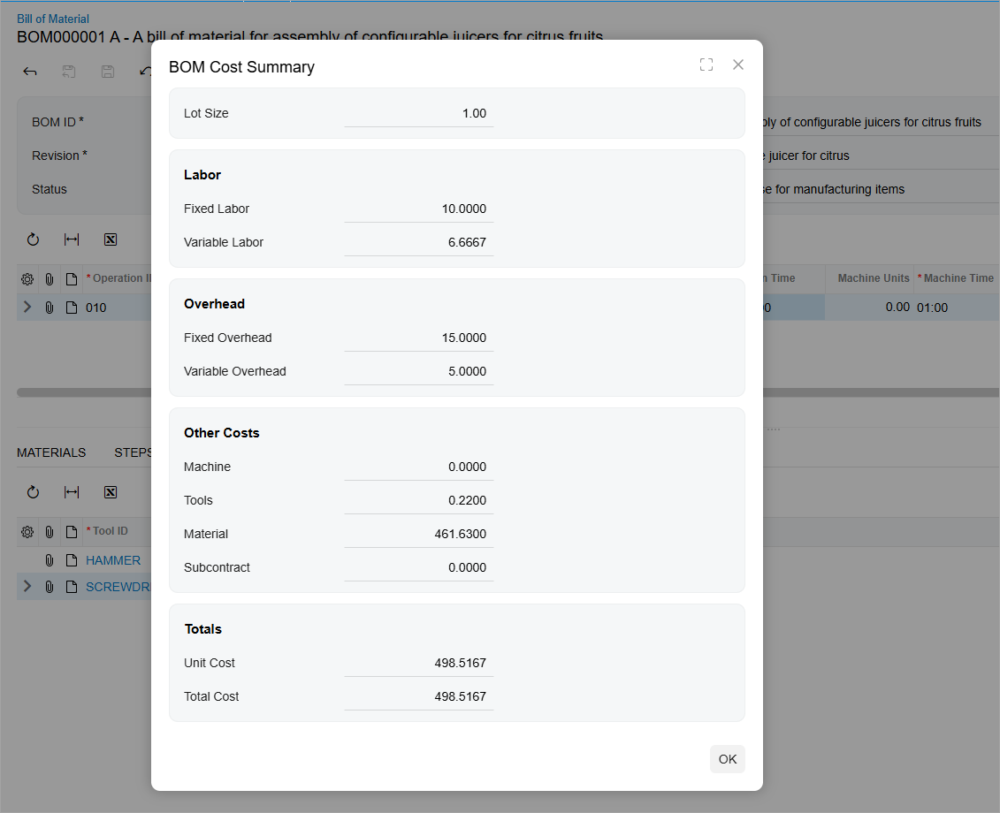

# Bills of Material: Implementation Activity {#_baf33d8b-6f79-4cdd-8694-cd2003c37483 .task}

In the following implementation activity, you will learn how to create a bill of material \(BOM\).

## Story { .section}

Suppose that SweetLife Fruits &amp; Jams has decided to assemble customized juicers according to customers' specifications. Assembly will take place in the Workhouse warehouse of the Service and Equipment Sales Center branch, in a specific work center. The process of assembling a juicer consists of one assembly operation and requires juicer parts as materials and a hammer and screwdriver as tools. Overhead costs have been specified at the work center level; you do not need to specify them on the bill of material. In the work center, two workers are involved in juicer assembly. Each worker produces three juicers per hour.

As an implementation manager, you will create the bill of material for the assembly process of the configurable juicer for citrus fruits.

## Configuration Overview { .section}

The following entities, which you will use in this activity, have been predefined in the *U100* dataset:

-   On the [Warehouses](IN_20_40_00.md) \(IN204000\) form, the *WORKHOUSE* warehouse
-   The following items on the [Stock Items](IN_20_25_00.md) \(IN202500\) form: *CFJCITRUS*, *JCREAMER*, *JUICECUP1L*, *MRBASEHIGH*, *STRBASKET*, and *SPLGUARD*

## Process Overview { .section}

On the [Bill of Material](AM_20_80_00.md) \(AM208000\) form, you will create the bill of material for the configurable juicer for citrus fruits. You will add the assembly operation, which is performed in the dedicated work center. Then you will add materials, steps, and tools for the operation. After that you will make the bill of material active and default for the juicer stock item. Finally, you will view the total cost of the bill of material.

## System Preparation { .section}

Before you start performing the activity, do the following:

1.  As prerequisites to the current activity, perform the following activities in the listed order:
    1.  [Configuring Production Cost Drivers: Implementation Activity](../ImplementationGuide/config_MFG_Production_Cost_Drivers_Implem_Activity.md) so that the needed tools have been created in a company with the *U100* dataset preloaded
    2.  [Configuring Work Centers: Implementation Activity](../ImplementationGuide/config_MFG_Work_Centers_Implem_Activity.md) so that the needed work center has been created in this company
2.  Sign in to this company \(in which the prerequisite activities have been performed\) as a system administrator with the *gibbs* username and *123* password.

## Step 1: Creating a Bill of Material { .section}

To create a bill of material, do the following:

1.  On the [Bill of Material](AM_20_80_00.md) \(AM208000\) form, add a new record.

    **Tip:** To open the form for creating a new record, type the form ID in the Search box, and on the Search form, point at the form title and click **New** right of the title.

2.  In the Summary area, specify the following settings:
    -   **Revision**: `A` \(automatically specified\)
    -   **Hold**: Selected
    -   **Description**: `A bill of material for assembly of configurable juicers for citrus fruits`
    -   **Inventory ID**: *CFJCITRUS*
    -   **Warehouse**: *WORKHOUSE*
    -   **Start Date**: 1/1/2025
    -   **End Date**: Empty
3.  On the form toolbar, click **Save**.

## Step 2: Adding an Operation { .section}

To add the assembly operation to the bill of material, do the following:

1.  On the toolbar of the Operations table, click **Add Row**.
2.  In the row, specify the following settings:
    -   **Operation ID**: `010`
    -   **Work Center**: *WCR10*

        You created this work center in [Configuring Work Centers: Implementation Activity](../ImplementationGuide/config_MFG_Work_Centers_Implem_Activity.md).

    -   **Setup Time**: `00:30`
    -   **Run Units**: `3`
    -   **Run Time**: `01:00`
3.  On the form toolbar, click **Save**.

## Step 3: Adding Materials { .section}

To add the materials required for the operation, do the following:

1.  In the Operations table, click the row with the *010* operation.
2.  In the lower part of the form, click the **Materials** tab.
3.  On this tab, add rows for the stock items listed in the following table, specifying the listed settings for each.

    |Inventory ID|Qty. Required|
    |------------|-------------|
    |*JCREAMER*|`1`|
    |*JUICECUP1L*|`1`|
    |*MRBASEHIGH*|`1`|
    |*STRBASKET*|`1`|
    |*SPLGUARD*|`1`|

4.  On the form toolbar, click **Save**.

## Step 4: Adding the Steps { .section}

To add steps required to perform the operation, do the following:

1.  On the **Steps** tab, add rows for the steps, as shown in the following table.

    |Description|Line Order|
    |-----------|----------|
    |`Attach the strain basket to the motor base.`|*10*|
    |`Attach the reamer to the strain basket.`|*20*|
    |`Attach the 1-liter juice cup to the motor base.`|*30*|
    |`Attach the splash guard.`|*40*|

2.  On the form toolbar, click **Save**.

## Step 5: Adding the Tools { .section}

To add the tools involved in the assembly process \(you created these tools in [Configuring Production Cost Drivers: Implementation Activity](../ImplementationGuide/config_MFG_Production_Cost_Drivers_Implem_Activity.md)\) to the operation settings, do the following:

1.  On the **Tools** tab, add rows for the tools listed in the following table, specifying the listed settings for each.

    |Tool ID|Qty. Required|Unit Cost|
    |-------|-------------|---------|
    |*HAMMER*|`1`|0.02|
    |*SCREWDRIVER*|`1`|0.20|

2.  On the form toolbar, click **Save**.

## Step 6: Activating the Bill of Material { .section}

To make the created bill of material active and specify it as the default bill of material for the *CFJCITRUS* item, do the following:

1.  In the Summary area, clear the **Hold** check box. The status changes to *Active*.
2.  On the form toolbar, click **Save**.
3.  On the More menu, click **Set as Default BOM**.

    **Tip:** You open the More menu by clicking the More button \(…\) on the form toolbar.

4.  In the **Default BOM Levels** dialog box, which opens, do the following:

    1.  Make sure that the **Item** and **Warehouse** check boxes are selected.
    2.  Click **Update**.
    The system inserts *BOM000001* in the **Default BOM ID** box of the **Manufacturing** tab of the following forms:

    -   The [Stock Items](IN_20_25_00.md) \(IN202500\) form for the *CFJCITRUS* item
    -   The [Item Warehouse Details](IN_20_45_00.md) \(IN204500\) form for the *CFJCITRUS* item and *WORKHOUSE* warehouse

## Step 7: Viewing Total Cost of Bill of Material { .section}

To make sure that you have specified all settings of the bill of material correctly, you will view the total cost of the bill of material. Do the following:

1.  On the More menu, click **Calculate BOM Cost**.
2.  In the **BOM Cost Settings** dialog box, which opens, keep the default settings and click **OK**.
3.  In the **BOM Cost Summary** dialog box, which opens, make sure that the **Total Cost** value is *498.5167* \(shown below\).

    

4.  Click **OK** to close the dialog box.

You have created the bill of material for the configurable juicer for citrus, made it active and default for the stock item that represents the juicer.

**Parent topic:**[Managing Bills of Material](../UserGuide/BOM_Mapref.md)

