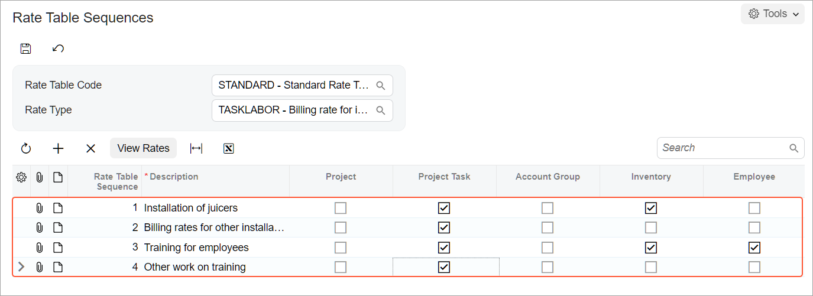

# Billing Rates: To Configure Employee- and Item-Specific Rates {#_c42c1ab3-1421-4225-a42e-d9ce4224d4c2 .task}

In this activity, you will learn how you can define complex billing rates with rate table codes that define different rates for different services, and for the same services provided by different employees.

**Attention:** This activity is based on the *U100* dataset. If you are using another dataset or if any system settings have been changed in *U100*, these changes can affect the workflow of the activity and the results of the processing. To avoid issues, restore the *U100* dataset to its initial state.

## Story { .section}

Suppose that the West BBQ Restaurant customer has ordered the service of juicer installation from the SweetLife Fruits &amp; Jams company, along with the service of employee training on operating the juicer. The juicer has been installed. Also, Alberto Jimenez, a junior consultant, has provided two hours of training, and Todd Bloom, a senior consultant, has provided six hours of training. All of the project tasks must be billed at different rates:

-   The installation work is provided at a price of $110 per hour.
-   The accompanying installation work is provided at a price of $90 per hour.
-   The standard rate of training, which applies to junior consultants, is $50 per hour.
-   The rate for the training provided by senior consultants is $60 per hour.

Acting as the project accountant, Pam Brawner, you need to configure the rate table that will provide billing rates based on a combination of various settings.

## Configuration Overview { .section}

In the *U100* dataset, the following tasks have been performed to support this activity:

-   On the [Enable/Disable Features](CS_10_00_00.md) \(CS100000\) form, the *Projects* feature has been enabled to provide the project management functionality.
-   On the [Project Tasks](PM_30_20_00.md) \(PM302000\) form, the *INSTALL* and *TRAINING* project tasks have been defined.
-   On the [Non-Stock Items](IN_20_20_00.md) \(IN202000\) form, the *INSTALL* and *TRAINING* non-stock items have been created.
-   On the [Employees](EP_20_30_00.md) \(EP203000\) form, the *EP00000002 – Todd Bloom* employee record has been created.

## Process Overview { .section}

In this activity, you will create a rate type on the [Rate Types](PM_20_41_00.md) \(PM204100\) form. Then on the [Rate Table Sequences](PM_20_50_00.md) \(PM205000\) form, you will define a rate sequence and the combination of settings that will be used for searching for the applicable billing rate. Then you will configure the rate table code on the [Rate Tables](PM_20_60_00.md) \(PM206000\) form and specify rate values for the different combinations of parameters. Finally, on the [Billing Rules](PM_20_70_00.md) \(PM207000\) form, you will configure a billing rule that uses the rate table code with the applicable billing rates.

## System Preparation { .section}

Before you start configuring billing rates, you need to launch the Acumatica ERP website and sign in to a company with the *U100* dataset preloaded. You should sign in as the project accountant by using the *brawner* username and the *123* password.

## Step 1: Creating Rate Type and Rate Sequences { .section}

To create a rate type and specify rate sequences with item-specific and employee-specific billing rates, do the following:

1.  On the [Rate Types](PM_20_41_00.md) \(PM204100\) form, click **Add Row** on the form toolbar, and specify the following settings in the row:
    -   **Rate Type**: `TASKLABOR`
    -   **Description**: `Billing rate for installation and training`
2.  Save the added rate type.
3.  On the [Rate Table Sequences](PM_20_50_00.md) \(PM205000\) form, add a new rate sequence with the following settings:
    -   **Rate Table Code**: *STANDARD*
    -   **Rate Type**: *TASKLABOR*
4.  Click **Add Row** on the table toolbar, and specify the following settings in the added row:
    -   **Rate Table Sequence**: `1`
    -   **Description**: `Installation of juicers`
    -   **Project Task**: Selected
    -   **Inventory**: Selected
5.  Again click **Add Row** on the table toolbar, and specify the following settings in the row:
    -   **Rate Table Sequence**: `2`
    -   **Description**: `Billing rates for other installation work`
    -   **Project Task**: Selected
6.  Again click **Add Row** on the table toolbar, and specify the following settings in the row:
    -   **Rate Table Sequence**: `3`
    -   **Description**: `Training for employees`
    -   **Project Task**: Selected
    -   **Inventory**: Selected
    -   **Employee**: Selected
7.  Again click **Add Row** on the table toolbar, and specify the following settings in the row:

    -   **Rate Table Sequence**: `4`
    -   **Description**: `Other work on training`
    -   **Project Task**: Selected
    The rate sequences should look as shown below.

    

8.  Save the rate sequences you have created.

## Step 2: Specifying Billing Rates { .section}

To specify billing rates for different groups of settings, do the following:

1.  On the [Rate Tables](PM_20_60_00.md) \(PM206000\) form, to configure the labor rates for installation work, do the following:
    1.  In the Summary area, specify the following settings:
        -   **Rate Table Code**: *STANDARD*
        -   **Rate Type**: *TASKLABOR*

            When you select the rate type, the system automatically inserts *1* as the **Rate Table Sequence**.

        -   **Rate Code**: `TASKLABOR`
        -   **Description**: `Labor rates for installation`
    2.  On the **Rate** tab, click **Add Row** on the table toolbar, and specify the following settings in the row:
        -   **Start Date**: *1/1/2026*
        -   **Rate**: `110.00`
    3.  On the **Tasks** tab, on the table toolbar, click **Add Row**, and in the row, select *INSTALL* as the **Project Task**.
    4.  On the **Inventory** tab, on the table toolbar, click **Add Row**, and in the row, select *INSTALL* as the **Inventory ID**.
    5.  Save the rate table.
2.  To configure the rates for the other installation work, do the following:
    1.  On the form toolbar, click **Add New Record**, and in the Summary area, specify the following settings:
        -   **Rate Table Sequence**: *2*
        -   **Rate Code**: `TASKLABOR`
        -   **Description**: `Labor rates for other installation work`
    2.  On the **Rate** tab, click **Add Row** on the table toolbar, and specify the following settings in the added row:
        -   **Start Date**: *1/1/2026*
        -   **Rate**: `90.00`
    3.  On the **Tasks** tab, on the table toolbar, click **Add Row**, and in the row, select *INSTALL* as the **Project Task**.
    4.  Save the rate table.
3.  To configure the billing rates for training, do the following:
    1.  On the form toolbar, click **Add New Record**, and in the Summary area, specify the following settings in the Summary area:
        -   **Rate Table Sequence**: *3*
        -   **Rate Code**: `TASKLABOR`
        -   **Description**: `Labor rates for training`
    2.  On the **Rate** tab, click **Add Row** on the table toolbar, and specify the following settings in the row:
        -   **Start Date**: *1/1/2026*
        -   **Rate**: `60.00`
    3.  On the **Tasks** tab, on the table toolbar, click **Add Row**, and in the row, select *TRAINING* as the **Project Task**.
    4.  On the **Inventory** tab, on the table toolbar, click **Add Row**, and in the row, select *TRAINING* as the **Inventory ID**.
    5.  On the **Employee** tab, on the table toolbar, click **Add Row**, and in the row, select *EP00000002 \(Todd Bloom\)* as the **Employee ID**.
    6.  Save the rate table.
4.  To configure rates for other training work, do the following:
    1.  On the form toolbar, click **Add New Record**, and in the Summary area, specify the following settings:
        -   **Rate Table Sequence**: *4*
        -   **Rate Code**: `TASKLABOR`
        -   **Description**: `Labor rates for other training work`
    2.  On the **Rate** tab, click **Add Row** on the table toolbar, and specify the following settings in the row:
        -   **Start Date**: *1/1/2026*
        -   **Rate**: `50.00`
    3.  On the **Tasks** tab, on the table toolbar, click **Add Row**, and in the row, select *TRAINING* as the **Project Task**.
    4.  Save the rates.

## Step 3: Creating a Billing Rule {#section_bsd_2cm_wmb .section}

To create a billing rule that uses the employee- and item-specific billing rates that you have configured, do the following:

1.  On the [Billing Rules](PM_20_70_00.md) \(PM207000\) form, add a new record, and enter the following settings in the Summary area:
    -   **Billing Rule ID**: `TASKLABOR`
    -   **Description**: `Time and material with @Rate`
2.  In the **Billing Steps** table, click **Add Row** on the table toolbar, and specify the following settings in the row:
    -   **Step ID**: `10`
    -   **Description**: `Installation and training`
3.  In the right pane \(**Calculation Rules** tab\), specify the following settings for the step selected in the left pane:
    -   **Billing Type**: *Time and Material*
    -   **Account Group**: *LABOR*
    -   **Rate Type**: *TASKLABOR*
    -   **If @Rate Is Not Defined**: *Raise Error*

        If no rate has been found, the corresponding project transaction won’t be presented in the invoice. With the *Raise Error* option selected, an error message is shown during billing. This prevents project costs from being omitted.

    -   **Invoice Description Formula**: `='Invoice for '+[PMProject.ContractCD]`
    -   **Line Quantity Formula**: `=[PMTran.BillableQty]`

        The invoice line quantity will be equal to the project transaction line quantity.

    -   **Line Amount Formula**: `=[PMTran.BillableQty]*@Rate`

        The amount of the invoice line is calculated as the billable quantity of the project transaction line multiplied by the corresponding rate value.

    -   **Line Description Formula**: `=[PMTran.Description]`
    -   **Use Sales Account From**: *Billing Rule*
    -   **Sales Account**: *40000 - Sales Revenue*
4.  On the **Billing Settings** tab of the right pane, clear the **Create Lines with Zero Amount and Quantity** check box.
5.  Save the billing rule.

You have configured billing rates that are based on various settings and a billing rule that will use these rates for billing.

To bill a project that will use these rates, perform the [Billing Rates: To Bill a Project with Employee-Specific Rates](Billing_Rates_Process_Activity_Employee.md) activity.

**Parent topic:**[Managing Billing Rates](../UserGuide/Billing_Rates_Mapref.md)

