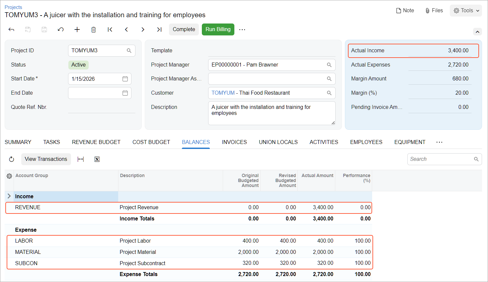

# Billing Rates: To Bill a Project with Different Billing Rates {#_b778886e-8253-4471-9489-8ba48dc60d69 .task}

In this activity, you will bill a project with different billing rates to be used for the billing of different services provided in the project.

**Attention:** This activity is based on the *U100* dataset. If you are using another dataset or if any system settings have been changed in *U100*, these changes can affect the workflow of the activity and the results of the processing. To avoid issues, restore the *U100* dataset to its initial state.

## Story { .section}

Suppose that the Thai Food Restaurant customer has bought a juicer from the SweetLife Fruits &amp; Jams company and ordered employee training from the company on how to use the juicer. SweetLife's project accountant, Pam Brawner, has created a project to account for the provided services. The training has taken place.

Acting as the project accountant, you need to bill the customer for the different services provided for the project with different billing rates.

## Configuration Overview { .section}

In the *U100* dataset, the following tasks have been performed to support this activity:

-   On the [Enable/Disable Features](CS_10_00_00.md) \(CS100000\) form, the *Projects* feature has been enabled to provide the project management functionality.
-   On the [Rate Tables](PM_20_60_00.md) \(PM206000\) form, the *STANDARD* rate table, with rates for labor and materials, has been configured.
-   On the [Billing Rules](PM_20_70_00.md) \(PM207000\) form, the *TIMEMATERIAL* billing rule has been created. The billing rule includes the steps that have been configured for billing project transactions related to different account groups. \(For an example of billing rule configuration, see [Billing Rates: To Create a Billing Rule with Rates](Billing_Rates_Implem_Activity.md).\)
-   On the [Customers](AR_30_30_00.md) \(AR303000\) form, the *TOMYUM* customer has been defined.
-   On the [Non-Stock Items](IN_20_20_00.md) \(IN202000\) form, the *INSTALL*, *JUICER15*, *SITEREVIEW* and *TRAINING* non-stock items have been created.
-   On the [Projects](PM_30_10_00.md) \(PM301000\) form, the *TOMYUM3* project for the *TOMYUM* customer has been created. On the **Tasks** tab of this form, the *PHASE1* and *PHASE2* project tasks has been configured and the *TIMEMATERIAL* billing rule and the *STANDARD* rate table are assigned to these project tasks. In the project, the **Create Pro Forma Invoice on Billing** check box is selected to indicate that when project billing is run, pro forma invoices are generated to be sent to the customer for acceptance before the accounts receivable invoices are prepared.
-   On the [Project Transactions](PM_30_40_00.md) \(PM304000\) form, the *PM00000002* project transaction related to the project has been created and released in preparation for billing.

## Process Overview { .section}

You will bill the project on the [Projects](PM_30_10_00.md) \(PM301000\) form and review the pro forma invoice amounts on the [Pro Forma Invoices](PM_30_70_00.md) \(PM307000\) form.

## System Preparation { .section}

Before you begin performing the steps of this activity, you need to perform the following instructions to prepare the system:

1.  Launch the Acumatica ERP website, and sign in to a company with the *U100* dataset preloaded. You should sign in as Pam Brawner by using the *brawner* username and the *123* password.
2.  In the info area at the upper-right corner of the top pane of the Acumatica ERP screen, make sure that the business date is set to *1/30/2026*. If a different date is displayed, click the Business Date menu button and select *1/30/2026* from the calendar. For simplicity, you'll create and process all documents in this activity using this business date.

## Step 1: Billing the Project and Processing the Related Documents { .section}

To bill the project by using the time and material billing rule, do the following:

1.  Open the [Project Transaction Details](PM_40_10_00.md) \(PM401000\) form.
2.  In the Selection area of the form, select *TOMYUM3* as the **Project**, and make sure that the other boxes are cleared. The table lists the related project transactions:

    -   The line with the *INSTALL* item in the amount of $320
    -   The line with the *JUICER15* item in the amount of $2000
    -   The line with the *SITEREVIEW* item in the amount of $80
    -   The line with the *TRAINING* item in the amount of $320
    Notice that in all lines, the **Billable** check box is selected and the **Billed** check box is cleared, indicating that the project is pending billing.

3.  On the [Projects](PM_30_10_00.md) \(PM301000\) form, open the *TOMYUM3* project. Notice that the **Actual Expenses** box in the Summary area shows $2,720 \(which is the total of the processed project transactions\), while **Actual Income** box contains *0* because the project has not been billed yet.
4.  On the form toolbar, click **Run Billing**. The system creates a pro forma invoice and opens it on the [Pro Forma Invoices](PM_30_70_00.md) \(PM307000\) form. On the **Time and Material** tab of this form, review the four lines of the pro forma invoice \(which have been created based on unbilled transactions\).

    In each line, the system calculates **Billed Quantity** and **Billed Amount** by using the formula specified in the corresponding step of the billing rule. The following lines have been added to the pro forma invoice:

    -   The *INSTALL* and *TRAINING* lines have been billed by the *20 – Labor from non-stock price* step, which has been configured for the *LABOR* account group; the billed amount for each line has been calculated based on the *@Rate* parameter defined in the *STANDARD* rate table for the *LABOR* rate type \(which is 1.25\). The calculated billing amount is $400 \(320\*1.25\) for both lines.
    -   The *JUICER15* line has been billed by the *10 – Material cost plus markup* step, which has been configured for the *MATERIAL* account group; the billed amount has been calculated based on the billable quantity \(1\) and the *@Price* parameter \(which is the sales price of the *JUICER15* item, $2500\). The calculated billing amount is $2500.
    -   The *SITEREVIEW* line has been billed by the *30 – Re-invoice subcontractors* step, which has been configured for the *SUBCON* account group; the billed amount has been calculated by multiplying the transaction amount by the fixed coefficient \(1.25\). The calculated billing amount is $100 \(1.25 \* $80\).
    The unit price in each pro forma invoice line is calculated as the billed amount divided by the billed quantity.

5.  On the form toolbar, click **Remove Hold** to assign the pro forma invoice the *Open* status, and then click **Release** to release the pro forma invoice. The system closes the pro forma invoice \(which is now assigned the *Closed* status\) and creates a corresponding accounts receivable invoice based on the pro forma invoice.
6.  On the **Financial** tab, click the **AR Ref. Nbr.** link to open the accounts receivable invoice that was created on the [Invoices and Memos](AR_30_10_00.md) \(AR301000\) form.
7.  On the form toolbar of the [Invoices and Memos](AR_30_10_00.md) form, click **Remove Hold** to assign the invoice the *Balanced* status, and then click **Release** to release the accounts receivable invoice.

## Step 2: Reviewing the Project Transactions and the Updated Project Balance { .section}

To review the project transactions and project balance, do the following:

1.  On the [Project Transaction Details](PM_40_10_00.md) \(PM401000\) form, in the Summary area, select *TOMYUM3* as the **Project**. In the table, review the project transactions that have been created based on the released accounts receivable invoice \(these are the lines that have *AR* specified in the **Source** column and that have negative amounts\). In the **GL Batch Nbr.** column, the reference number of the corresponding GL batch is shown. Also notice that the project transactions based on which you have performed billing now have the check box in the **Billed** column selected, indicating that these transactions have been billed.
2.  On the [Projects](PM_30_10_00.md) \(PM301000\) form, open the *TOMYUM3* project. Notice that in the Summary area, the **Actual Income** box now shows $3,400, which is the total amount of the invoice that you have processed. On the **Revenue Budget** tab, notice that the system has automatically created two revenue budget lines \(one for each project task\) and filled in the **Actual Amount** for the rows \(3,000 and 400\).
3.  On the **Balances** tab \(see below\), review the project income and expenses aggregated by account groups.

    

You have billed the project based on the different billing rates specified for different types of expenses.

**Parent topic:**[Managing Billing Rates](../UserGuide/Billing_Rates_Mapref.md)

