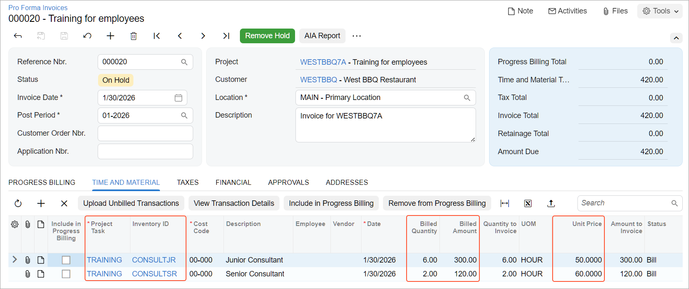

# Billing Rates: To Bill a Project with Employee-Specific Rates {#_4b07afb3-1324-463a-a26b-20a4f70eebe2 .task}

In this activity, you will learn how you can define employee-specific billing rates by using rate tables and how to bill a project by using these billing rates.

## Story { .section}

Suppose that the West BBQ Restaurant customer has ordered from the SweetLife Fruits &amp; Jams company a training session for its employees on how to use juicers that were previously purchased from SweetLife. Alberto Jimenez, a junior consultant of SweetLife, has provided six hours of training, and Todd Bloom, a senior consultant of SweetLife, has provided two hours of training. Alberto's rate is $50 per hour, and Todd's is $60.

Acting as the SweetLife project accountant, Pam Brawner, you need to create a project to account for the provided services, enter the project transaction to record the provided work, bill the customer, and verify that all services have been billed at the appropriate rates.

## Configuration Overview { .section}

In the *U100* dataset, the following tasks have been performed to support this activity:

-   On the [Enable/Disable Features](CS_10_00_00.md) \(CS100000\) form, the *Projects* feature has been enabled to provide the project management functionality.
-   On the [Customers](AR_30_30_00.md) \(AR303000\) form, the *WESTBBQ* customer has been created.
-   On the [Non-Stock Items](IN_20_20_00.md) \(IN202000\) form, the *CONSULTJR* and *CONSULTSR* non-stock items have been created.
-   On the [Account Groups](PM_20_10_00.md) \(PM201000\) form, the *LABOR* account group has been created.

## Process Overview { .section}

In this activity, on the [Projects](PM_30_10_00.md) \(PM301000\) form, you will create a new project, specify a billing rule and rate table for it, and define the project tasks. Then you will bill the project and review the billed amount and quantities in the prepared pro forma invoice on the [Pro Forma Invoices](PM_30_70_00.md) \(PM307000\) form.

## System Preparation { .section}

Before you begin performing the steps of this activity, you need to perform the following instructions to prepare the system:

1.  As a prerequisite activity, configure the billing rates and billing rule as described in [Billing Rates: To Configure Employee-Specific Rates](Billing_Rates_Implem_Activity_Employee.md).
2.  Sign in to a company with the *U100* dataset preloaded. You should sign in as Pam Brawner by using the *brawner* username and the *123* password.
3.  In the info area at the upper-right corner of the top pane of the Acumatica ERP screen, make sure that the business date is set to *1/30/2026*. If a different date is displayed, click the Business Date menu button and select *1/30/2026* from the calendar. For simplicity, you'll create and process all documents in this activity using this business date.

## Step 1: Creating a Project { .section}

To create a project, do the following:

1.  On the [Projects](PM_30_10_00.md) \(PM301000\) form, add a new record.
2.  In the Summary area, specify the following settings:
    -   **Project ID**: `WESTBBQ7A`
    -   **Customer**: *WESTBBQ*
    -   **Description**: `Training for employees`
3.  On the **Summary** tab \(**Project Properties** section\), specify *Task and Item* in the **Cost Budget Level** box.
4.  On the **Summary** tab \(**Billing and Allocation Settings** section\), specify the following settings:
    -   **Billing Period**: *On Demand*
    -   **Billing Rule**: *TMLABOR*
    -   **Rate Table Code**: *LABOR*

        You defined the *LABOR* rate table code on the [Rate Tables](PM_20_60_00.md) \(PM206000\) form when you performed the [Billing Rates: To Configure Employee-Specific Rates](Billing_Rates_Implem_Activity_Employee.md) activity.

5.  On the **Tasks** tab, add a row with the following settings to define the project task:

    -   **Task ID**: `TRAINING`
    -   **Type**: *Cost and Revenue Task*
    -   **Description**: `Training for employees`
    -   **Status**: *Active*
    -   **Default**: Selected
    Notice that the billing rule and the rate table code have been copied to the task settings from the project settings.

6.  Save the project.
7.  On the form toolbar, click **Activate**. The system assigns the project the *Active* status.

## Step 2: Creating Project Transactions { .section}

To enter the project transactions for the provided services, perform the following steps:

1.  On the [Project Transactions](PM_30_40_00.md) \(PM304000\) form, add a new record.
2.  In the Summary area, specify the following description: `Training for WESTBBQ7A`.
3.  On the **Details** tab, click **Add Row**.
4.  Specify the following settings in the added row:

    -   **Project**: *WESTBBQ7A*
    -   **Project Task**: *TRAINING* \(specified automatically\)
    -   **Cost Code**: *00-000*
    -   **Account Group**: *LABOR*
    -   **Inventory ID**: *CONSULTJR*
    -   **Quantity**: `6`
    -   **Unit Rate**: `40.00`
    This transaction represents six hours of training provided by Alberto Jimenez.

5.  Add one more transaction to the batch by clicking **Add Row** and specifying the following settings in the row:

    -   **Project**: *WESTBBQ7A*
    -   **Project Task**: *TRAINING*
    -   **Cost Code**: *00-000*
    -   **Account Group**: *LABOR*
    -   **Inventory ID**: *CONSULTSR*
    -   **Quantity**: `2`
    -   **Unit Rate**: `45.00`
    This transaction represents two hours of training provided by Todd Bloom.

6.  In the Summary area, make sure that the total billable quantity is 8 and the total amount is $330.
7.  Save your changes.
8.  On the form toolbar, click **Release** to release the project transaction.

## Step 3: Billing the Project and Reviewing the Rates { .section}

To bill the project and review the rates at which the provided services have been billed, do the following:

1.  On the [Projects](PM_30_10_00.md) \(PM301000\) form, open the *WESTBBQ7A* project, which you have created earlier in this activity.
2.  On the **Cost Budget** tab, make sure that the system has updated the cost budget with two new lines from the project transaction that you have released.
3.  On the form toolbar, click **Run Billing**.

    The system creates a pro forma invoice and opens it on the [Pro Forma Invoices](PM_30_70_00.md) \(PM307000\) form.

4.  On the **Time and Material** tab, review the invoice lines that the system has created based on the transactions prepared for billing \(see below\). These transactions have been processed by using the *TMLABOR* billing rule, and the rates have been taken from the rate table assigned to the project task. The pro forma invoice includes the following lines:

    -   The line with the *CONSULTJR* inventory item has a billed amount of $300, which has been calculated as 6 hours multiplied by $50.
    -   The line with the *CONSULTSR* inventory item has a billed amount of $120, which has been calculated as 2 hours multiplied by $60.
    

You have created a pro forma invoice for the customer and verified that the appropriate rates have been selected for the provided services.

**Parent topic:**[Managing Billing Rates](../UserGuide/Billing_Rates_Mapref.md)

