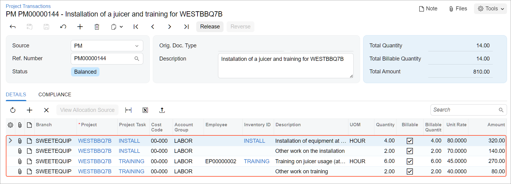
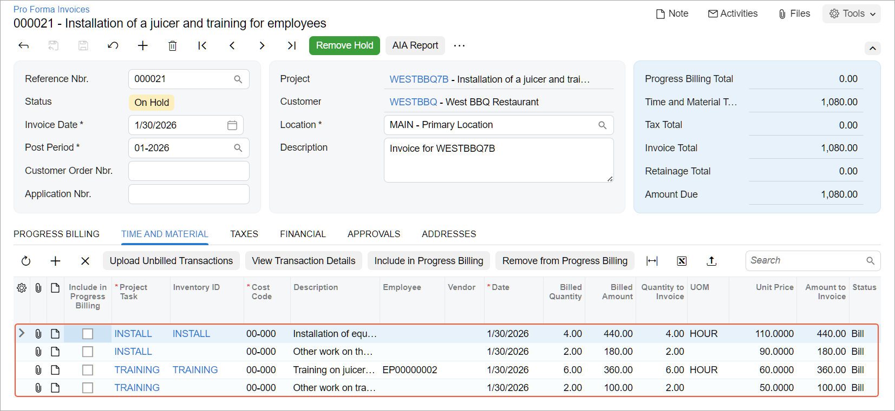

# Billing Rates: To Bill a Project with Employee- and Item-Specific Rates {#_96c68fd9-5da7-4372-9dcb-4f8e5cc6e601 .task}

In this activity, you will learn how you can bill a project whose billing rule uses employee- and item-specific billing rates.

## Story { .section}

Suppose that the West BBQ Restaurant customer has ordered from the SweetLife Fruits &amp; Jams company the services of juicer installation and employee training on operating the juicer. The juicer has been installed. Also, Alberto Jimenez, a junior consultant of SweetLife, has provided two hours of training, and Todd Bloom, a senior consultant of SweetLife, has provided six hours of training. The provided services should be billed at different rates.

Acting as the SweetLife project accountant, Pam Brawner, you need to create a project to account for the provided services, and specify the applicable billing rules. Then you need to enter the project transaction to record the provided work, bill the customer, and verify that all services have been invoiced at the appropriate rates.

## Configuration Overview { .section}

In the *U100* dataset, the following tasks have been performed to support this activity:

-   On the [Enable/Disable Features](CS_10_00_00.md) \(CS100000\) form, the *Projects* feature has been enabled to provide the project management functionality.
-   On the [Customers](AR_30_30_00.md) \(AR303000\) form, the *WESTBBQ* customer has been created.
-   On the [Account Groups](PM_20_10_00.md) \(PM201000\) form, the *LABOR* account group has been configured.
-   On the [Non-Stock Items](IN_20_20_00.md) \(IN202000\) form, the *TRAINING* and *INSTALL* non-stock item have been created.
-   On the [Employees](EP_20_30_00.md) \(EP203000\) form, the *EP00000002 – Todd Bloom* employee record has been created.

## Process Overview { .section}

In this activity, on the [Projects](PM_30_10_00.md) \(PM301000\) form, you will create a new project, specify a billing rule and rate table for it, and define the project tasks. Then you will bill the project and review the billed amount and quantities in the prepared pro forma invoice on the [Pro Forma Invoices](PM_30_70_00.md) \(PM307000\) form.

## System Preparation { .section}

Before you begin performing the steps of this activity, you need to perform the following instructions to prepare the system:

1.  As a prerequisite activity, configure the billing rates and billing rule by following the instructions in [Billing Rates: To Configure Employee- and Item-Specific Rates](Billing_Rates_Implem_Activity_Item.md).
2.  Sign in to a company with the *U100* dataset preloaded. You should sign in as Pam Brawner by using the *brawner* username and the *123* password.
3.  In the info area at the upper-right corner of the top pane of the Acumatica ERP screen, make sure that the business date is set to *1/30/2026*. If a different date is displayed, click the Business Date menu button and select *1/30/2026* from the calendar. For simplicity, you'll create and process all documents in this activity using this business date.

## Step 1: Creating a Project { .section}

To create a project, do the following:

1.  On the [Projects](PM_30_10_00.md) \(PM301000\) form, add a new project with the following settings:
    -   **Project ID**: `WESTBBQ7B`
    -   **Customer**: *WESTBBQ*
    -   **Description**: `Installation of a juicer and training for employees`
2.  On the **Summary** tab \(**Project Properties** section\), specify *Task and Item* in the **Cost Budget Level** box.
3.  On the **Summary** tab \(**Billing and Allocation Settings** section\), specify the following settings:
    -   **Billing Period**: *On Demand*
    -   **Billing Rule**: *TASKLABOR*
    -   **Rate Table Code**: *STANDARD*
4.  On the **Tasks** tab, add two project tasks with the following settings.

    |Task ID|Type|Description|Status|
    |-------|----|-----------|------|
    |`INSTALL`|*Cost and Revenue Task*|`Juicer installation`|*Active*|
    |`TRAINING`|*Cost and Revenue Task*|`Training for employees`|*Active*|

    Notice that the *TASKLABOR* billing rule and the *STANDARD* rate table code have been specified automatically for both project tasks.

5.  Save the project.
6.  On the form toolbar, click **Activate**. The system assigns the *Active* status to the project.

## Step 2: Processing Project Transactions { .section}

To enter the project transactions for the provided services, perform the following steps:

1.  On the [Project Transactions](PM_30_40_00.md) \(PM304000\) form, add a new record.
2.  In the Summary area of the form, make sure *PM* is specified as the **Source**, and specify `Installation of a juicer and training for WESTBBQ7B` as the **Description**.
3.  In the table, add a transaction to the batch by clicking **Add Row** and specifying the following settings in the row:

    -   **Project**: *WESTBBQ7B*
    -   **Project Task**: *INSTALL*
    -   **Cost Code**: `00-000`
    -   **Account Group**: *LABOR*
    -   **Inventory ID**: *INSTALL*
    -   **Quantity**: `4`
    -   **Unit Rate**: `80.00`
    This transaction represents four hours of juicer installation.

4.  Add one more transaction to the batch by clicking **Add Row** and specifying the following settings:

    -   **Project**: *WESTBBQ7B*
    -   **Project Task**: *INSTALL*
    -   **Cost Code**: `00-000`
    -   **Account Group**: *LABOR*
    -   **Description**: `Other work on the installation`
    -   **Quantity**: `2`
    -   **Unit Rate**: `70.00`
    This transaction represents two hours of other work on the installation.

5.  Add the third transaction to the batch by clicking **Add Row** and specifying the following settings:

    -   **Project**: *WESTBBQ7B*
    -   **Project Task**: *TRAINING*
    -   **Cost Code**: `00-000`
    -   **Account Group**: *LABOR*
    -   **Employee**: *EP00000002 - Todd Bloom*
    -   **Inventory ID**: *TRAINING*
    -   **Quantity**: `6`
    -   **Unit Rate**: `45.00`
    This transaction represents six hours of training provided by Todd Bloom.

6.  Add the last transaction to the batch by clicking **Add Row** and specifying the following settings:

    -   **Project**: *WESTBBQ7B*
    -   **Project Task**: *TRAINING*
    -   **Cost Code**: `00-000`
    -   **Account Group**: *LABOR*
    -   **Description**: `Other work on training`
    -   **Quantity**: `2`
    -   **Unit Rate**: `40.00`
    This transaction represents two hours of other work on training. The entered batch of project transactions should look as shown below.

    

7.  In the Summary area, make sure that the total billable quantity is 14 and the total amount is $810.
8.  Save your changes to the project transaction.
9.  On the form toolbar, click **Release** to release the batch of project transactions.

## Step 3: Billing the Project and Reviewing the Rates { .section}

To bill the project, do the following:

1.  On the [Projects](PM_30_10_00.md) \(PM301000\) form, open the *WESTBBQ7B* project.
2.  On the form toolbar, click **Run Billing**.

    The system creates a pro forma invoice and opens it on the [Pro Forma Invoices](PM_30_70_00.md) \(PM307000\) form.

3.  On the **Time and Material** tab, review the invoice lines that the system has created based on the transactions prepared for billing. These transactions have been processed by using the billing rule, and the rates have been taken from the rate table assigned to the project tasks. The pro forma invoice includes the following lines \(see below\):

    -   The line with the *INSTALL* project task and *INSTALL* inventory item has a billed amount of $440, which has been calculated as 4 hours of installation multiplied by $110.
    -   The line with the *INSTALL* project task and with no inventory item selected has a billed amount of $180, which has been calculated as 2 hours of other work on the installation multiplied by $90.
    -   The line with the *TRAINING* project task, the *TRAINING* inventory item, and the *EP00000002* employee has a billed amount of $360, which has been calculated as 6 hours of training multiplied by $60.
    -   The line with the *TRAINING* project task and empty inventory item has a billed amount of $100, which has been calculated as 2 hours of other work on training multiplied by $50.
    

You have created a pro forma invoice for the customer and verified that the appropriate rates have been selected for the provided services.

**Parent topic:**[Managing Billing Rates](../UserGuide/Billing_Rates_Mapref.md)

