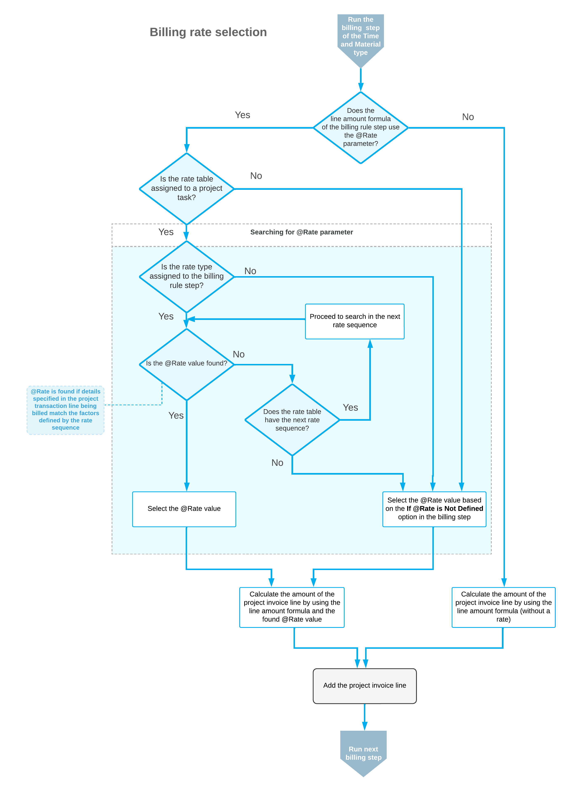

# Billing Rates: Rate Selection Rules {#_4a7c387c-22cf-4614-949e-12485b7019e1 .concept}

When a project transaction is billed or an allocation is run, the system finds the applicable rate—that is, the value of the *@Rate* parameter specified in the billing rule formula. This selection is based on the combination of the rate type assigned to the current step of a billing rule \(or allocation rule\) and the rate table code that is assigned to the project task to which the billed or allocated transaction corresponds.

Each combination of rate table code, rate type, and rate code includes one rate sequence or multiple rate sequences, each of which defines billing rates based on a set of factors. The numeric identifiers of the sequences in the table define the order in which the system will search these sequences to find the applicable rate during the project billing or allocation process.

Starting with the first sequence defined in the table on the [Rate Table Sequences](PM_20_50_00.md) \(PM205000\) form, the system compares the settings specified in the project transaction to the factors defined by the rate sequence. If all the settings match, the system stops the search and uses the rate it has found as the value of the *@Rate* parameter in the formula. If any factor does not match, the system continues searching for the applicable billing rate in the next rate sequence until an applicable rate is found.

The system may not find an applicable rate in all sequences defined in the system for the combination of rate table code, rate type, and rate code. In this case, the system performs the action determined by the option selected in the **If @Rate Is Not Defined** box on the [Billing Rules](PM_20_70_00.md) \(PM207000\) or [Allocation Rules](PM_20_75_00.md) \(PM207500\) form for the step being performed. The system can do one of the following:

-   Set the *@Rate* value to 0
-   Set the *@Rate* value to 1
-   Skip billing or allocating for the current project transaction
-   Throw an error and stops the billing or allocation process

The following diagram shows how the system selects the value of the *@Rate* parameter if the account group specified in the project transaction is the same as the account group of the billing rule step.

**Parent topic:**[Managing Billing Rates](../UserGuide/Billing_Rates_Mapref.md)

