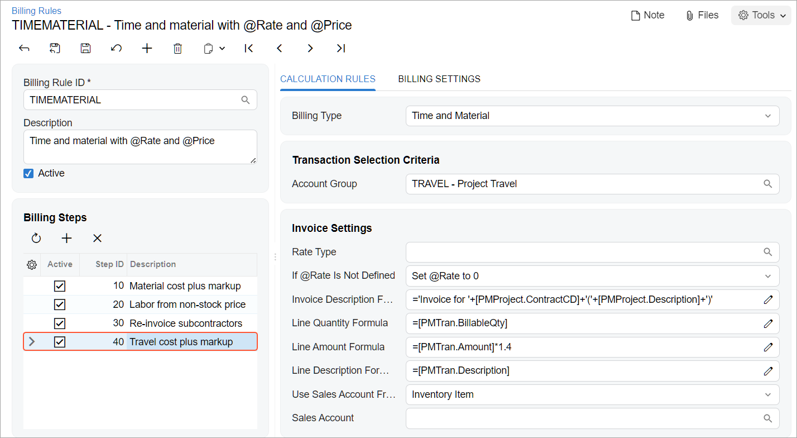
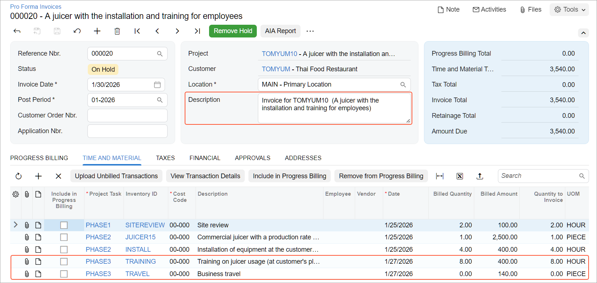

# Billing Rules: To Modify a Billing Rule {#_fb50755a-7713-77fd-9fe8-dfabb321b137 .task}

In this activity, you will learn how to update the settings of an existing billing rule, and review how this affects the documents generated by the project billing process.

**Attention:** This activity is based on the *U100* dataset. If you are using another dataset or if any system settings have been changed in *U100*, these changes can affect the workflow of the activity and the results of the processing. To avoid issues, restore the *U100* dataset to its initial state.

## Story { .section}

Suppose that as part of a contract to provide juicers to multiple restaurants, the Thai Food Restaurant customer has ordered a juicer from the SweetLife Fruits &amp; Jams company, along with the following services: site review, installation, and training of employees on operating the juicer. The SweetLife project accountant has created a project to account for the provided work and has generated a pro forma invoice for the project. Then suppose that the project accountant has reviewed the prepared pro forma invoice, and has decided that the following changes should be made:

-   The invoice’s description should be corrected to be more clear. The updated description will say *Invoice for* followed by the identifier of the project.
-   The processing of the travel expenses related to the project needs to be added to the billing rule. Per the agreement with the customer, these will be billed with a fixed margin coefficient of 1.4.
-   The invoice lines should be grouped by inventory item.

Acting as the project accountant, you need to update the billing rule and verify that invoices are generated in the appropriate format.

## Configuration Overview { .section}

In the *U100* dataset, the following tasks have been performed to support this activity:

-   On the [Enable/Disable Features](CS_10_00_00.md) \(CS100000\) form, the *Projects* feature has been enabled to provide support for the project management functionality.
-   On the [Account Groups](PM_20_10_00.md) \(PM201000\) form, the *MATERIAL*, *LABOR*, and *SUBCON* expense account groups have been defined.
-   On the [Billing Rules](PM_20_70_00.md) \(PM207000\) form, the *TIMEMATERIAL* billing rule has been configured. The billing rule includes a step for each of the configured expense account groups.
-   On the [Projects](PM_30_10_00.md) \(PM301000\) form, the *TOMYUM10* project has been created. On the **Tasks** tab, the *TIMEMATERIAL* billing rule is specified for each project task. Also, the **Create Pro Forma Invoice on Billing** check box is selected on the **Summary** tab, indicating that a pro forma invoice is created when the project is billed.
-   On the [Project Transactions](PM_30_40_00.md) \(PM304000\) form, the *PM00000006* batch of project transactions related to the project has been created and released.

## Process Overview { .section}

You will bill the project on the [Projects](PM_30_10_00.md) \(PM301000\) form; you will also review how the current billing rules work, and how the prepared pro forma invoice looks on the [Pro Forma Invoices](PM_30_70_00.md) \(PM307000\) form. Then you will delete the pro forma invoice, to cancel billing, and modify the billing rule on the [Billing Rules](PM_20_70_00.md) \(PM207000\) form. You will change the description of the invoices to be created, add a new step to a billing rule for processing the travel expenses, and configure the grouping of project transactions for employee labor to a single line.

After you make these changes to the billing rule, you will bill the project again on the [Projects](PM_30_10_00.md) form. Finally, you will review the pro forma invoice created with the modified billing rule on the [Pro Forma Invoices](PM_30_70_00.md) form.

## System Preparation { .section}

Before you begin performing the steps of this activity, perform the following instructions to prepare the system:

1.  Launch the Acumatica ERP website, and sign in to a company with the *U100* dataset preloaded; you should sign in as Pam Brawner by using the *brawner* username and the *123* password.
2.  In the info area at the upper-right corner of the top pane of the Acumatica ERP screen, make sure that the business date is set to *1/30/2026*. If a different date is displayed, click the Business Date menu button and select *1/30/2026* from the calendar. For simplicity, you'll create and process all documents in this activity using this business date.

## Step 1: Billing the Project { .section}

To bill the project for the Thai Food Restaurant customer, do the following:

1.  On the [Projects](PM_30_10_00.md) \(PM301000\) form, open the *TOMYUM10* project, and on the **Cost Budget** tab, review the cost budget of the project. In the lines with the *PHASE3* task, notice that travel expenses are associated with the *TRAVEL* account group, while the employee's labor on conducting training is associated with the *LABOR* account group.
2.  On the form toolbar, click **Run Billing** to review the pro forma invoice the system creates for this project with the existing *TIMEMATERIAL* billing rule.

    The system creates a pro forma invoice and opens it on the [Pro Forma Invoices](PM_30_70_00.md) \(PM307000\) form. Review the details of the pro forma invoice, which should be improved as follows:

    -   The pro forma invoice description is *Invoice for TOMYUM10*. While the description is correctly noting the project identifier in the system, you would like the invoice description to also include the description of the project.
    -   On the **Time and Material** tab, there is no line with the *TRAVEL* inventory item because the billing rule does not include a step configured for the billing of the expenses related to the *TRAVEL* account group.
    -   On the **Time and Material** tab, there are three lines with the *PHASE3* task and the *TRAINING* inventory item. For a more typical and easier-to-grasp way of presenting invoice lines, multiple lines with the same inventory item should be grouped into one line.
3.  On the form toolbar, click **Delete** to delete the pro forma invoice.

Now you need to modify the billing rule, and perform the billing process for the project again.

## Step 2: Modifying the Billing Rule { .section}

To change the *TIMEMATERIAL* billing rule, do the following:

1.  On the [Billing Rules](PM_20_70_00.md) \(PM207000\) form, open the *TIMEMATERIAL* billing rule.
2.  To modify the description of invoices created with the billing rule, do the following:
    1.  In the **Billing Steps** table, click the *10 - Material cost plus markup* step so that you can modify the settings of this step.
    2.  On the **Calculation Rules** tab of the right pane, enter the following formula in the **Invoice Description Formula** box:

        `='Invoice for '+[PMProject.ContractCD]+'('+[PMProject.Description]+')'`

    3.  Save your changes.
    4.  In the **Billing Steps** table, click the *20 - Labor from non-stock price* step and in the right pane, enter the following formula in the **Invoice Description Formula** box:

        `='Invoice for '+[PMProject.ContractCD]+'('+[PMProject.Description]+')'`

    5.  Save your changes.
    6.  In the **Billing Steps** table, click the *30 - Re-invoice subcontractors* step and in the right pane, enter the following formula in the **Invoice Description Formula** box:

        `='Invoice for '+[PMProject.ContractCD]+'('+[PMProject.Description]+')'`

    7.  Save your changes.
3.  To add a billing step to bill travel expenses with a fixed margin coefficient of 1.4, do the following:

    1.  In the **Billing Steps** table, add a new row, and specify the following settings in the row:
        -   **Active**: Selected
        -   **Step ID**: `40`
        -   **Description**: `Travel cost plus markup`
    2.  In the right pane, specify the following settings for the step selected in the left pane \(see below\):
        -   **Billing Type**: *Time and Material*
        -   **Account Group**: *TRAVEL*

            With this step of the billing rule, the system processes the project transaction that debits accounts mapped to the *TRAVEL* account group.

        -   **If @Rate Is Not Defined**: *Set @Rate to 0*
        -   **Invoice Description Formula**: `='Invoice for '+[PMProject.ContractCD]+'('+[PMProject.Description]+')'`
        -   **Line Quantity Formula**: `=[PMTran.BillableQty]`

            The system uses the quantity of the project transaction as the quantity of an invoice line.

        -   **Line Amount Formula**: `=[PMTran.Amount]*1.4`

            The system uses the amount of the project transaction multiplied by 1.4 as the amount of the invoice line.

        -   **Line Description Formula**: `=[PMTran.Description]`

            The system uses the description of the project transaction as the description of the invoice line.

        -   **Use Sales Account From**: *Inventory Item*
    

4.  To group project transactions with the *LABOR* account group into a single invoice line if they also have the same inventory item, do the following:
    1.  In the left pane, click the *20 - Labor from non-stock price* step.
    2.  On the **Billing Settings** tab of the right pane, in the **Aggregate Transactions By** section, select the **Inventory ID** check box.
5.  Save your changes to the billing rule.

## Step 3: Billing a Project With the Updated Billing Rule { .section}

To bill the project with the billing rule that you have modified and review how the changes to the billing rule affect the prepared pro forma invoice, do the following:

1.  On the [Projects](PM_30_10_00.md) \(PM301000\) form, open the *TOMYUM10* project.
2.  On the form toolbar, click **Run Billing**.

    The system creates a pro forma invoice and opens it on the [Pro Forma Invoices](PM_30_70_00.md) \(PM307000\) form. Notice the following changes to the pro forma invoice, which are shown below:

    -   The description of the pro forma invoice is now *Invoice for TOMYUM10 \(А juicer with the installation and training for employees\)*.
    -   On the **Time and Material** tab, a line with the *TRAVEL* inventory item has appeared.
    -   On the **Time and Material** tab, there is only one line with the *PHASE3* task and *TRAINING* inventory item.
    

3.  Click the line with the *PHASE3* task and *TRAINING* inventory item, and on the table toolbar, click **View Transaction Details** to review the list of project transactions corresponding to the invoice line. In the **Transaction Details** dialog box, which opens, make sure that three transactions were grouped into one line during the billing, based on the aggregation setting of the billing rule you have modified.

You have modified the billing rule and prepared pro forma invoice for the project based on this updated rule.

**Parent topic:**[Creating Billing Rules](../UserGuide/Billing_Rules_Mapref.md)

