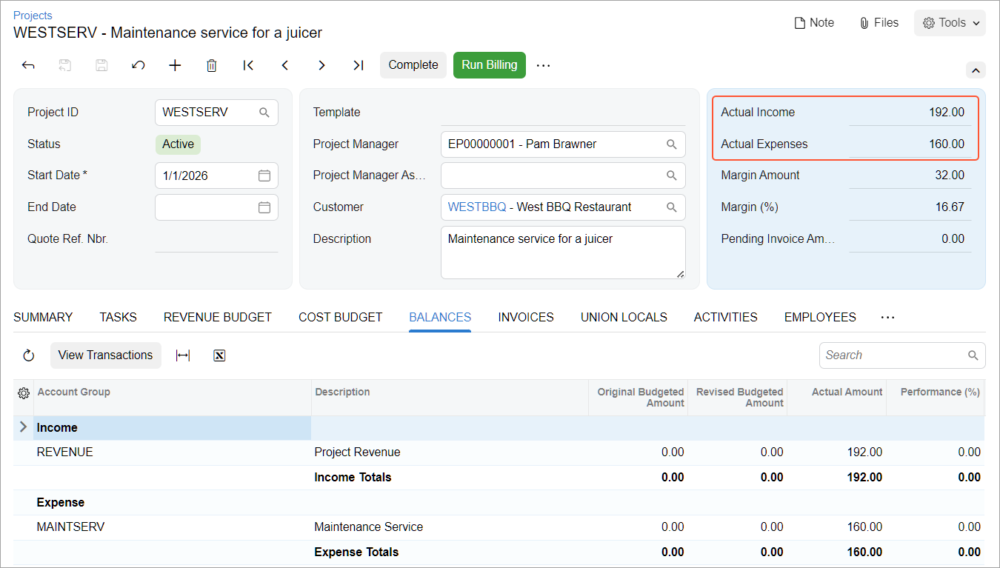

# Billing Rules: To Modify a Billing Rule to Track New Expenses {#_c53c0b58-16c1-4385-a11e-d9ce1234d110 .task}

This activity will walk you through the process of modifying a billing rule by adding a new step, so that you can bill a new type of expenses within projects.

**Attention:** This activity is based on the *U100* dataset. If you are using another dataset or if any system settings have been changed in *U100*, these changes can affect the workflow of the activity and the results of the processing. To avoid issues, restore the *U100* dataset to its initial state.

## Story { .section}

Suppose that the West BBQ Restaurant customer has contacted the SweetLife Fruits &amp; Jams company and requested a maintenance service for a juicer. This is a new type of service that the company has not previously provided for any customer. SweetLife's employee has visited the customer and provided two hours of the new maintenance service.

Acting as the project accountant of SweetLife, you need to update the billing rule used in the project to track the new type of expenses and bill the customer for the provided services.

## Configuration Overview { .section}

In the *U100* dataset, the following tasks have been performed to support this activity:

-   On the [Enable/Disable Features](CS_10_00_00.md) \(CS100000\) form, the *Projects* feature has been enabled to support the project management functionality.
-   On the [Billing Rules](PM_20_70_00.md) \(PM207000\) form, the *STANDARD* billing rule has been created.
-   On the [Account Groups](PM_20_10_00.md) \(PM201000\) form, the *MAINTSERV* account group has been created.
-   On the [Chart of Accounts](GL_20_25_00.md) \(GL202500\) form, the *54500 - Maintenance Expense* expense account has been created. The account has been mapped to the *MAINTSERV* account group.
-   On the [Non-Stock Items](IN_20_20_00.md) \(IN202000\) form, the *MAINTSERV* inventory item has been created. The *54500 \(Maintenance Expense\)* account has been selected as the expense account of the item and the default price has been set to $80.
-   On the [Customers](AR_30_30_00.md) \(AR303000\) form, the *WESTBBQ* customer has been configured.
-   On the [Projects](PM_30_10_00.md) \(PM301000\) form, the *WESTSERV* project has been created for the *WESTBBQ* customer, and the *SERVICE* project task has been added to the project. On the **Tasks** tab, the *STANDARD* billing rule has been specified for the project task.

## Process Overview { .section}

On the [Billing Rules](PM_20_70_00.md) \(PM207000\) form, you will add a new step to the billing rule; for the step, you will configure processing transactions related to the new maintenance service. Then you will create project transactions on the [Project Transactions](PM_30_40_00.md) \(PM304000\) form to record the provided maintenance work and update the actual project values. Finally, you will bill a project and review the prepared pro forma invoice on the [Pro Forma Invoices](PM_30_70_00.md) \(PM307000\) form.

## System Preparation { .section}

To prepare to perform the instructions of the activity, launch the Acumatica ERP website, and sign in to a company with the *U100* dataset preloaded; you should sign in as project accountant by using the *brawner* username and the *123* password.

## Step 1: Modifying a Billing Rule { .section}

To add to an existing billing rule a billing step to bill maintenance expenses with a fixed margin coefficient of 1.2, do the following:

1.  On the [Billing Rules](PM_20_70_00.md) \(PM207000\) form, open the *STANDARD* billing rule.
2.  In the left pane, add a row, and specify the following settings for it:
    -   **Active**: Selected
    -   **Step ID**: `40`
    -   **Description**: `Maintenance cost plus markup`
3.  In the right pane \(**Calculation Rules** tab\), specify the following settings for the step selected in the left pane:
    -   **Billing Type**: *Time and Material*
    -   **Account Group**: *MAINTSERV*

        In this step of the billing rule, the system processes a project transaction that debits accounts mapped to the *MAINTSERV* account group.

    -   **If @Rate Is Not Defined**: *Set @Rate to 0*
    -   **Invoice Description Formula**: `='Invoice for '+[PMProject.ContractCD]`
    -   **Line Quantity Formula**: `=[PMTran.BillableQty]`

        The system uses the quantity of the project transaction as the quantity of each invoice line.

    -   **Line Amount Formula**: `=[PMTran.BillableQty]*1.2*@Price`

        The invoiced amount is calculated as the billable quantity of the project transaction multiplied by the price of the related inventory item with the markup.

    -   **Line Description Formula**: `=[PMTran.Description]`

        The system uses the description of the project transaction as the description of the invoice line.

    -   **Use Sales Account From**: *Inventory Item*
4.  On the **Billing Settings** tab, clear the **Create Lines with Zero Amount and Quantity** check box.
5.  Save your changes to the billing rule.

## Step 2: Creating and Processing a Project Transaction { .section}

To update the actual values of the project, create and process a project transaction for two hours of maintenance work by doing the following:

1.  On the [Project Transactions](PM_30_40_00.md) \(PM304000\) form, create a new transaction.
2.  In the Summary area, specify *PM* as the **Source** and `Maintenance service for WESTSERV` as the **Description**.
3.  In the table on the **Details** tab, click **Add Row** on the table toolbar.
4.  Specify the following settings in the added row:
    -   **Project**: *WESTSERV*
    -   **Project Task**: *SERVICE*
    -   **Cost Code**: *00-000*
    -   **Account Group**: *MAINTSERV*
    -   **Inventory ID**: *MAINTSERV*
    -   **Quantity**: `2`
    -   **Unit Rate**: `80.00`
5.  On the form toolbar, click **Save**, and then click **Release**.
6.  On the [Projects](PM_30_10_00.md) \(PM301000\) form, open the *WESTSERV* project, and on the **Cost Budget** tab, notice that a line with the cost of the provided maintenance service has appeared with an **Actual Amount** of $160.

## Step 3: Billing the Project and Reviewing the Billed Amount { .section}

To bill the project and review the document prepared for the customer, do the following:

1.  While you are still reviewing the *WESTSERV* project on the [Projects](PM_30_10_00.md) \(PM301000\) form, on the form toolbar, click **Run Billing**.

    The system creates a pro forma invoice and opens it on the [Pro Forma Invoices](PM_30_70_00.md) \(PM307000\) form.

2.  On the **Time and Material** tab, review the invoice line that the system has created for the project transaction that you processed in the previous step. The **Billed Amount**, which is calculated by using the line amount formula you have specified for the new step of the billing rule, is $192, which is the project transaction quantity \(2\) multiplied by the default price of the inventory item \($80\) and then multiplied by 1.2.
3.  On the form toolbar, click **Remove Hold** to assign the pro forma invoice the *Open* status, and then click **Release**. The system closes the pro forma invoice \(which is now assigned the *Closed* status\), and creates an accounts receivable invoice based on the pro forma invoice.
4.  On the **Financial** tab, click the **AR Ref. Nbr.** link to open the accounts receivable invoice that the system created on the [Invoices and Memos](AR_30_10_00.md) \(AR301000\) form.
5.  On the form toolbar, click **Remove Hold** to assign the accounts receivable invoice the *Balanced* status, and then click **Release**.
6.  On the [Projects](PM_30_10_00.md) \(PM301000\) form, open and review the *WESTSERV* project \(see below\). Notice that in the Summary area, the **Actual Income** box now shows $192, which is the total amount of the invoice that you have processed. The **Actual Expenses** box shows the amount of the project transaction that you have processed earlier \($160\).

    

You have updated the project billing rule and billed the project for time and material by using this rule.

**Parent topic:**[Creating Billing Rules](../UserGuide/Billing_Rules_Mapref.md)

