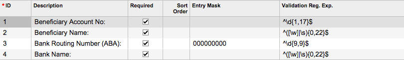
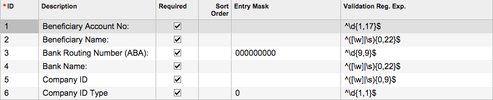
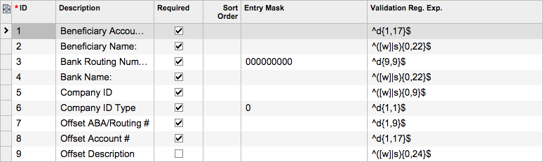

# To Add a Payment Method for ACH Payments \(Export Scenarios\) {#_03b95332-5391-44cb-bf7b-af3d867e1f09 .task}

You use the [Payment Methods](CA_20_40_00.md) \(CA204000\) form to create a payment method to be used for Automated Clearing House \(ACH\) payments in one of the following ways:

-   By using the *ACH* \(exports payments to an unbalanced file\) and *ACHBA* \(exports payments to a balanced file\) predefined payment methods, which are available for selection on this form. *ACH* and *ACHBA* are already configured to be used for paying your vendors through the ACH network.
-   By using the *ACH* or *ACHBA* payment method as a basis and using commands on the **Clipboard** menu on the form toolbar. You can copy the settings of a particular payment method and paste them to create another one \(changing any needed settings\), or you can create a template for multiple similar payment methods.
-   By entering the settings of a payment method manually.

This procedure describes how to manually create a payment method based on an export scenario, which will be used to pay your vendors through the ACH network.

**Note:** Alternatively, you can create a payment method based on the U.S. ACH plug-in. For details, see [To Add a Payment Method for the U.S. ACH Plug-In](CA__HOW_Add_PM_for_ACH_Plug-In.md).

## Before You Proceed { .section}

Review the cash accounts you have and decide which ones you are going to use as the source of payments to your vendors. You will specify these in Step 9 of the next section.

## To Add a Payment Method for ACH Payments { .section}

To add a payment method that uses an export scenario, do the following:

1.  Open the [Payment Methods](CA_20_40_00.md) \(CA204000\) form.
2.  On the form toolbar, click **Add New Record**.
3.  In the **Payment Method ID** box, type the identifier you want to use for the payment method \(such as *ACH*\).
4.  Select the **Active** check box to make the payment method available for use in the system.
5.  In the **Means of Payment** box, select the *Direct Deposit* option.
6.  Select the **Use in AP** check box to make the payment method available to be assigned to vendors.
7.  Select the **Require Remittance Information for Cash Account** check box. The **Remittance Settings** tab appears on the form so you can add elements to fill with the ACH credentials for the cash accounts.
8.  In the **Description** box, type a description for the payment method.
9.  On the **Allowed Cash Accounts** tab, do the following to add the list of cash accounts you are planning to use as a source for payments made to vendors by using the payment method:
    1.  For each cash account you want to link to the payment method, on the table toolbar, click **Add Row**. In the **Cash Account** box, select the cash account.
    2.  Select the **AP Default** check box for the listed cash account that is to be used by default.
10. On the **Settings for Use in AP** tab, configure the export of batches to a file to be sent to the ACH operator for processing as follows:
    1.  In the **Additional Processing** section, select the **Create Batch Payments** option button to indicate that the payment method involves creating payment batches.

        **Tip:** Once you select this option button, the **Quick Batch Generation** check box appears on the **Allowed Cash Accounts** tab. You can select this check box to quickly prepare batches of AP payments on the [Prepare Payments](AP_50_30_00.md) \(AP503000\) form. For details, see [To Quickly Prepare a Batch of Payments](AP__how_Quickly_Prepare_a_Batch_of_Payments.md).

    2.  In the **Export Method** box, select *Export Scenario*.
    3.  In the **Export Scenario** box, under the **Export Settings** section \(which appears to the right\), select the *Export AP Payments to ACH v2* or *Export AP Payments to ACH Balanced v2* scenario, which is designed to export the batch payments in the proper format.
    4.  Select the **Release Batch Payment Before Export** check box if you want to export ACH payment batches after they are released. If you want to export batches before release, leave this check box cleared.
    5.  In the **Payment Method Details** table, add the elements shown in the following screenshot, which will appear on the [Vendors](AP_30_30_00.md) \(AP303000\) form so users can enter the ACH credentials specific to the particular vendor.

        

11. On the **Remittance Settings** tab, add the elements shown in the following screenshots, which will appear on the [Cash Accounts](CA_20_20_00.md) \(CA202000\) form so users can enter your company's ACH credentials for each cash account.

    If you create a payment method to export payments to unbalanced file, add the following elements:

    

    If you create a payment method to export payments to balanced file, add the following elements:

    

12. On the form toolbar, click **Save**.

After the payment method is configured, you should specify your remittance information for each cash account you have listed on the **Allowed Cash Accounts** tab \(as described in [To Add Remittance Information to a Cash Account](CA__HOW_Add_RemittanceInfo_to_CashAccount.md)\), and specify ACH credentials for each vendor that agreed to receive your payments through the ACH network.

**Parent topic:**[Setting Up U.S. ACH Payment Processing](../UserGuide/CA__CON_Setup_US_ACH.md)

