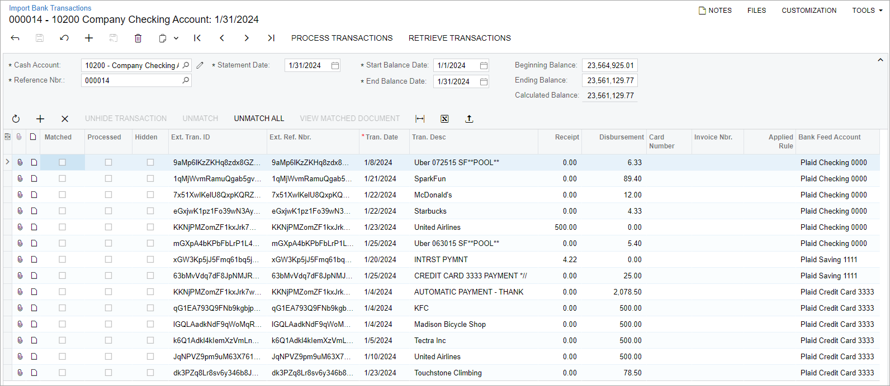
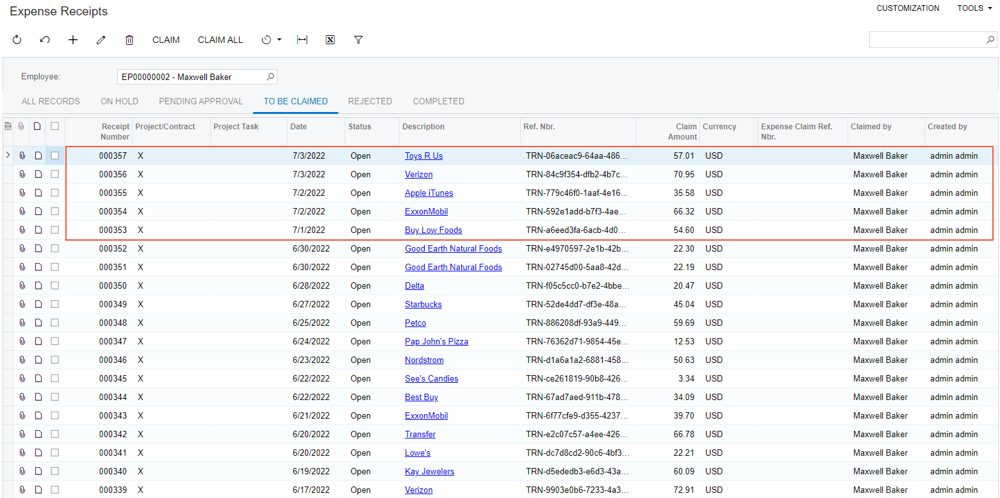

# To Import Bank Transactions from a Bank Feed {#_ca010f04-6b87-41ac-86fb-4f43dddba101 .task}

When Plaid or MX integration has been set up, you perform the instructions described below to import bank transactions from a bank feed into the system. You use the [Retrieve Bank Feed Transactions](CA_50_75_00.md) \(CA507500\) form for this import.

**Important:** A Plaid bank feed retrieves not more than 730 days of transaction history. If the mapped bank account has transactions older than 730 days, they will not be imported into the system.

## Before You Proceed { .section}

Make sure that the following features are enabled on the [Enable/Disable Features](CS_10_00_00.md) \(CS100000\) form:

-   *Bank Feed Integration*
-   *Mapping of Multiple Accounts for Bank Feeds* if you need to map multiple bank accounts to one cash account

Make sure that Plaid or MX integration has been properly set up. For details, see [To Set Up Plaid Integration](CA__HOW_Set_Up_Plaid_Integration.md) and [To Set Up MX Integration](CA__HOW_Set_Up_MX_Integration.md).

## To Import Bank Transactions { .section}

To import bank transactions into the system, do the following:

1.  Open the [Retrieve Bank Feed Transactions](CA_50_75_00.md) \(CA507500\) form.
2.  In the table, select each needed bank feed by selecting the unlabeled Included check box in its row.
3.  On the form toolbar, click **Process** to run the retrieval process for only the selected feeds or **Process All** to run the retrieval process for all listed bank feeds.

    **Tip:** You can schedule this process by clicking **Schedules** on the form toolbar.

4.  On the [Import Bank Transactions](CA_30_65_00.md) \(CA306500\) form, open the imported bank statement.
5.  Review the transactions imported for the cash account or accounts, as shown in the example in the following screenshot.

    

    During the import of the bank transactions, for the imported transactions with the *Disbursement* type, the system automatically creates expense receipts \(or updates existing expense receipts\) on the [Expense Receipt](EP_30_10_20.md) \(EP301020\) form if the following conditions are met:

    -   The **Create Expense Receipts** check box is selected on the [Bank Feeds](CA_20_55_00.md) \(CA205500\) form.
    -   The transaction amount is greater than *0.00*.
    -   The transaction status is not *Pending* and the **Create Expense Receipts for Pending Transactions** check box is cleared on the [Bank Feeds](CA_20_55_00.md) form, or the transaction status is *Pending* and the **Create Expense Receipts for Pending Transactions** check box is selected.
    -   On the **Corporate Cards** tab of the [Bank Feeds](CA_20_55_00.md) form, there is a record with a cash account ID that is the same as the transaction account ID and an employee ID that is the same as the account owner of the transaction.
    -   On the **Expense Items** tab of the [Bank Feeds](CA_20_55_00.md) form, there is a matching line with the **Skip** check box cleared, or there is no matching line.
    -   On the [Expense Receipt](EP_30_10_20.md) form, there is no expense receipt with a **Receipt Number** that is the same as the transaction ID.

        If a transaction has a pending transaction ID and an expense receipt exists with a **Receipt Number** that is the same as this pending transaction ID, this expense receipt is updated.

    The following screenshot illustrates an example of the expense receipts that have been created automatically for some transactions imported on the [Import Bank Transactions](CA_30_65_00.md) form.

    

**Parent topic:**[Integrating Acumatica ERP with Bank Feeds](../UserGuide/CA__MNG_Bank_Feed_Integration.md)

