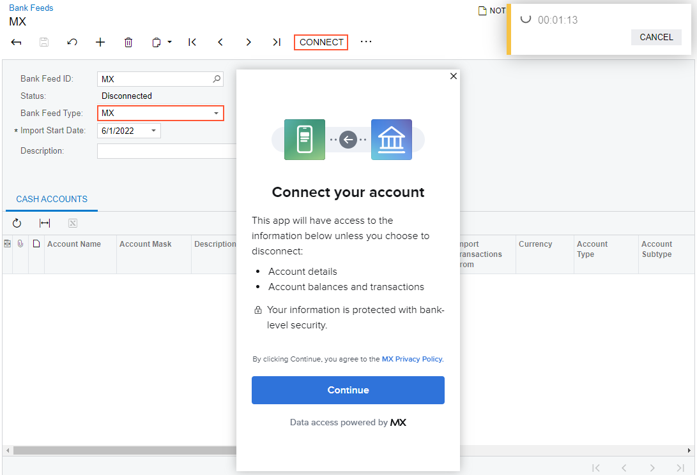
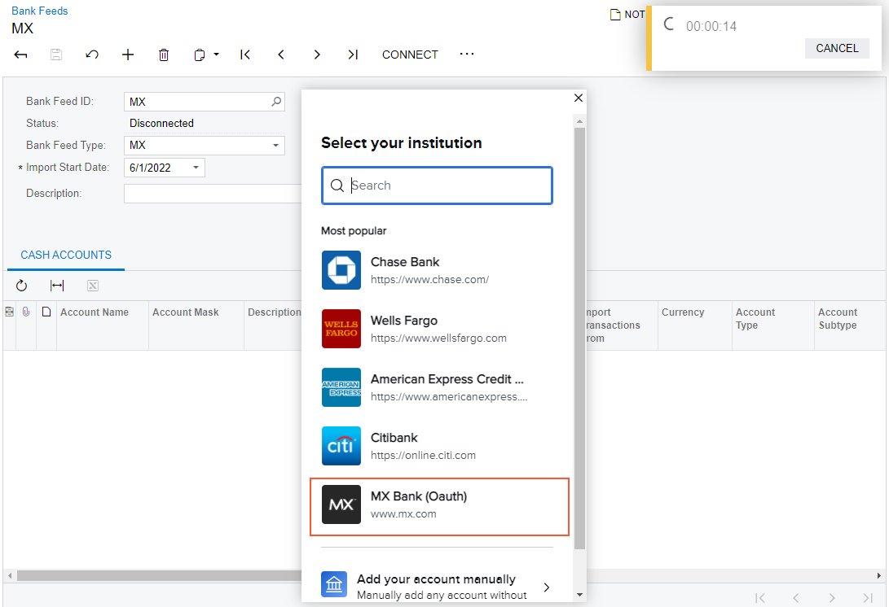
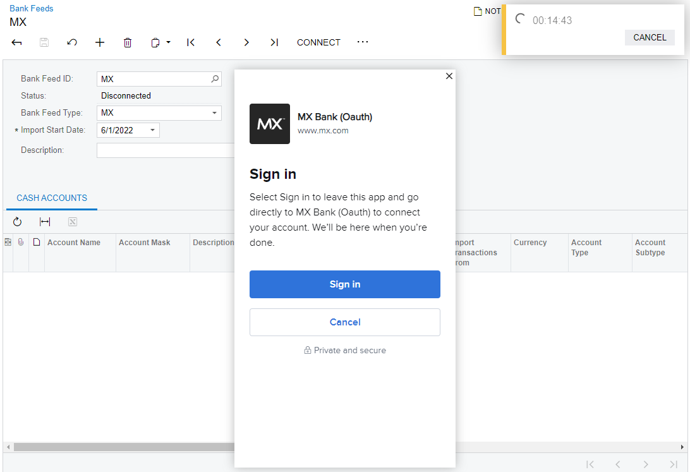
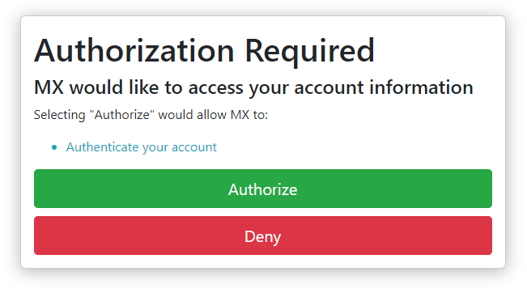
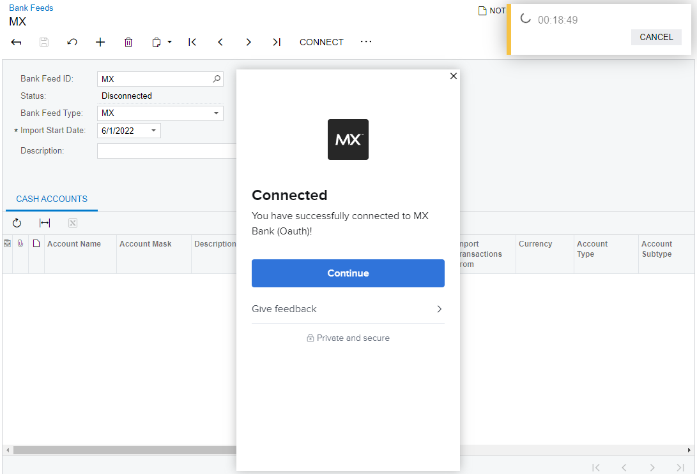
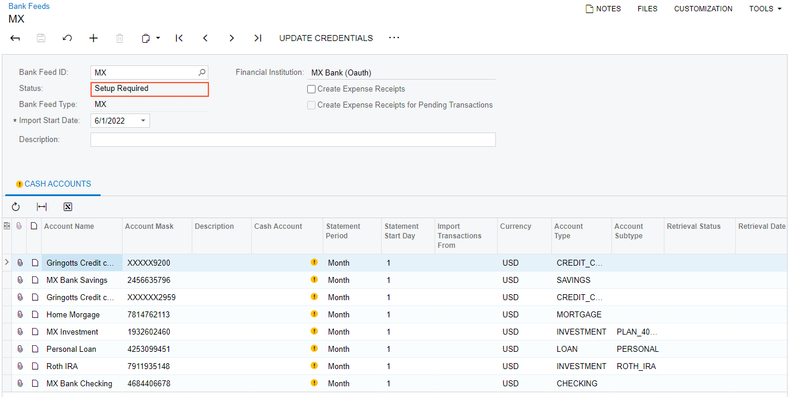
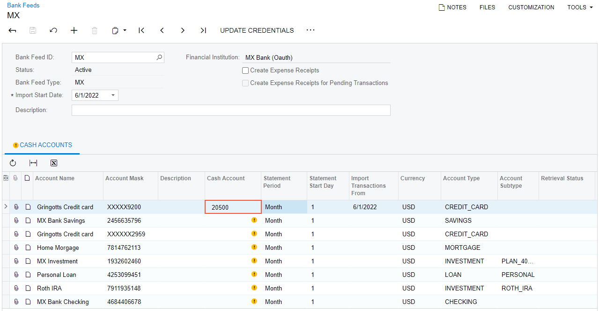
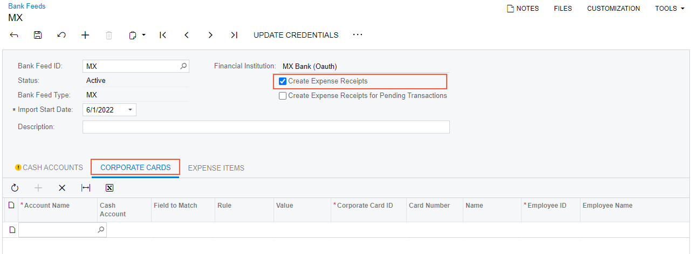
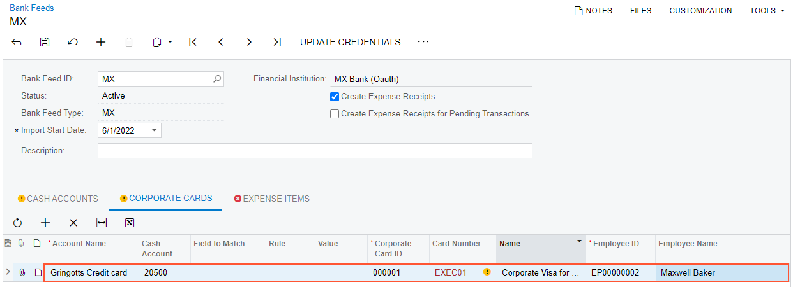
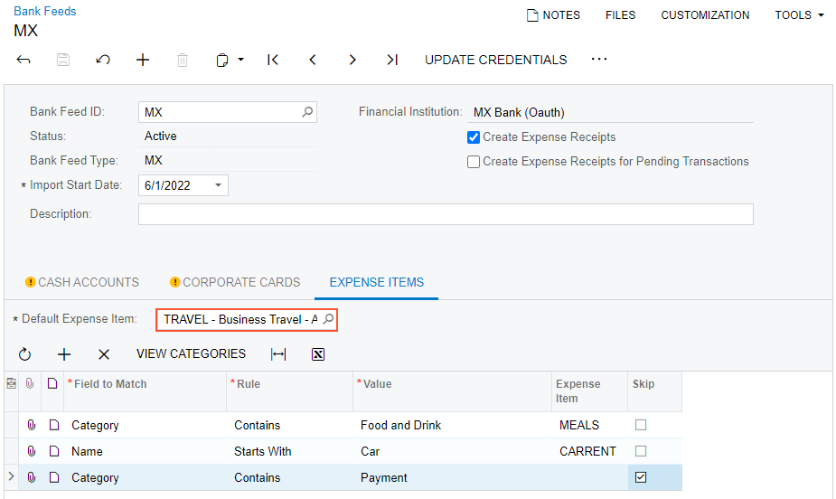

# To Set Up MX Integration {#_a82a8c05-d64d-4b63-93b1-3e0e19c53e75 .task}

You perform the following instructions to set up the integration of Acumatica ERP with MX. You use the [Retrieve Bank Feed Transactions](CA_50_75_00.md) \(CA507500\) form as a starting point and then specify the settings of the bank feed on the [Bank Feeds](CA_20_55_00.md) \(CA205500\) form.

## Before You Proceed { .section}

Make sure that the *Bank Feed Integration* feature has been enabled on the [Enable/Disable Features](CS_10_00_00.md) \(CS100000\) form.

## To Set Up MX Integration { .section}

To set up MX integration, do the following:

1.  Open the [Retrieve Bank Feed Transactions](CA_50_75_00.md) \(CA507500\) form.
2.  On the form toolbar, click **Add New Record**.
3.  On the [Bank Feeds](CA_20_55_00.md) \(CA205500\) form, which is opened, specify the following settings:
    -   **Bank Feed ID**: `MX`
    -   **Bank Feed Type**: *MX*
    -   **Import Start Date**: The date starting from which you want to import transactions
4.  On the form toolbar, click **Connect**, as shown in the following screenshot.

    

    Click **Continue** in the dialog box that is opened.

    **Note:** The dialog box shown in the previous screenshot and the dialog boxes shown later are hosted forms supported by MX and are subject to change. \(MX might change the view and steps required for the user before selecting the financial institution.\) Once the user selects a bank, the authorization path will also depend on the bank's setup.

5.  In the next dialog box, which is shown in the following screenshot, click a bank. \(In this example, **MX Bank \(Oauth\)** is selected.\)

    

6.  In the next dialog box, which is shown in the following screenshot, click **Sign in**, which provides the ability to sign in to MX Bank if **MX Bank \(OAuth\)** was clicked. \(If any other institution was selected in the previous instruction, you should enter the credentials to access the bank account's information.\)

    

7.  In the dialog box that is displayed, click **Authorize** to authorize this access in the bank.

    

    **Note:** Authentication can also be implemented by sending a code to your email address or phone number that is predefined in the bank profile. The authentication method depends on the selected bank.

8.  In the next dialog box, which is shown in the following screenshot, click **Continue** to complete the connection to MX Bank.

    

    **Note:** MX does not require you to select accounts; this service automatically adds to the bank feed all bank accounts available for the credentials that have been entered.

    Once the connection has been established, the dialog box is closed, and the status of the bank feed changes to *Setup Required*, as shown in the following screenshot. This status indicates that you need to specify a cash account for at least one listed account in order to import transactions for the bank feed.

    

9.  Optional: If the *Mapping of Multiple Accounts for Bank Feeds* feature is enabled on the [Enable/Disable Features](CS_10_00_00.md) \(CS100000\) form, select the **Map Multiple Bank Accounts to One Cash Account** check box that appears in the Summary area.
10. On the **Cash Accounts** tab, specify a cash account for at least one listed account, as shown in the following screenshot. Once you do this, the status of the bank feed changes to *Active* When you import transactions for the bank feed, they will be imported for only those accounts for which a cash account is selected.

    

    **Note:** If you have selected the **Map Multiple Bank Accounts to One Cash Account** check box, you can specify the same cash account for multiple bank feed accounts.

11. If you need to create expense receipts, select the **Create Expense Receipts** check box in the Summary area, as shown in the following screenshot. The **Corporate Cards** and **Expense Items** tabs appear on the form.

    

12. On the table toolbar of the **Corporate Cards** tab, click **Add Row**, and select a corporate card in the **Corporate Card ID** column of the row, as shown in the following screenshot.

    

    **Note:** When you select the **Create Expense Receipts** check box and specify a corporate card, the system displays an error message that a default expense item must be selected; otherwise, your changes cannot be saved.

13. On the **Expense Items** tab, select an item in the **Default Expense Item** box, as shown in the following screenshot.

    

14. Optional: Add a row to the table for each expense category \(with *Category* selected in the **Field to Match** column\), and specify the rule for matching it.
15. Click **Save** to save the settings of the bank feed.

**Parent topic:**[Integrating Acumatica ERP with Bank Feeds](../UserGuide/CA__MNG_Bank_Feed_Integration.md)

