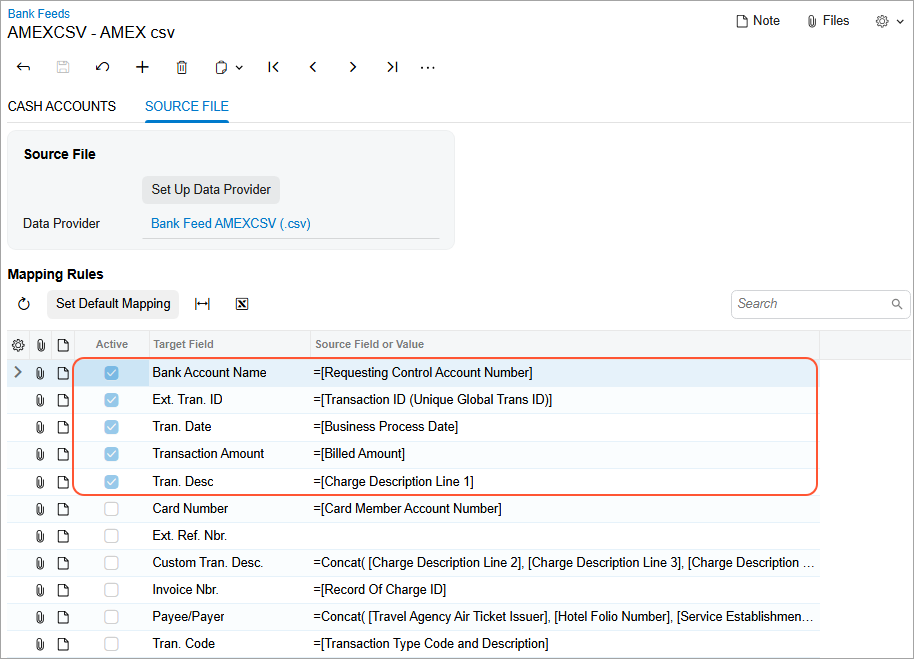

# Loading of Bank Feeds from an AMEX GL1025 File {#_88b63dea-72dc-43c1-b40a-4423a1092d40 .concept}

In Acumatica ERP, you can import **American Express GL1025 bank statement files** through bank feeds. If your organization uses American Express corporate cards, this lets you process large volumes of employee expense transactions efficiently.

With this functionality, transactions provided in GL1025 format can be loaded automatically, reducing manual effort and streamlining expense processing.

**Attention:** This functionality is available only if the *Bank Feed Integration* and *AMEX GL1025 File Import for Bank Feeds* features are enabled on the [Enable/Disable Features](CS_10_00_00.md) \(CS100000\) form.

## How GL1025 Bank Feeds Are Processed { .section}

On the [Bank Feeds](CA_20_55_00.md) \(CA205500\) form, you can select either *AMEX GL1025 \(.txt\)* or *AMEX GL1025 \(.csv\)* in the **File Format** box on the **Source File** tab. Each file extension is treated as a separate file type with its own predefined parsing rules.

When a bank feed is configured to use one of the GL1025 formats, Acumatica ERP:

-   Detects new GL1025 files placed in the connected SFTP folder
-   Reads and parses file contents according to the GL1025 specification
-   Creates bank transactions for the associated cash account
-   Creates expense receipts for the corporate card and employee defined in the bank feed
-   Prevents the creation of duplicate transactions by using the external transaction ID
-   Supports standard bank feed actions, including test mode loading, manual loading, and sequential processing of multiple files

## Setup of AMEX GL1025 Transaction Retrieval { .section}

To set up the functionality of retrieving AMEX GL1025 transactions from a bank feed, do the following:

1.  On the [Bank Feeds](CA_20_55_00.md) \(CA205500\) form, create a bank feed, selecting *AMEX GL1025 \(.txt\)* or *AMEX GL1025 \(.csv\)* as the **File Format** and entering credentials to the SFTP folder where the bank stores the files.
2.  Click **Set Up Data Provider**. The system creates a new data provider for AMEX files and inserts it in the **Data Provider** box.
3.  Review the mapping rules populated by the system and changes the mapping, if needed. For details, see the *Field Mapping* section below.
4.  On the **Cash Accounts** tab of the [Bank Feeds](CA_20_55_00.md) form, specify the needed bank accounts exactly as they are defined in the imported files and their corresponding cash accounts.
5.  Activate the bank feed—changing its status to *Active*—by clicking **Activate** on the form toolbar. Now users can start retrieving bank transactions on the [Retrieve Bank Feed Transactions](CA_50_75_00.md) \(CA507500\), [Import Bank Transactions](CA_30_65_00.md) \(CA306500\), or [Process Bank Transactions](CA_30_60_00.md) \(CA306000\) form.

For more details, see [To Set Up Bank Feeds Loaded from an AMEX GL1025 File](CA__HOW_Set_Up_BankFeeds_AMEX.md).

## File Detection and Import { .section}

You import AMEX statements in GL1025 format, which you select on the [Bank Feeds](CA_20_55_00.md) \(CA205500\) form. Once the system retrieves a new GL1025 file, it parses the file and creates:

-   Bank transactions for the cash account mapped to the bank account on the **Cash Accounts** tab of the [Bank Feeds](CA_20_55_00.md) form, while preventing duplicates based on **Transaction ID / Ext. Tran ID**
-   Expense receipts for the corporate card and employee specified in the bank feed setup

## Field Mapping { .section}

On the **Source File** tab of the [Bank Feeds](CA_20_55_00.md) \(CA205500\) form, fields in Acumatica ERP are mapped to GL1025 fields \(see below\).

The system applies predefined mapping rules to some fields; these mappings have the **Active** check box selected. These rules can be edited, if needed. To validate the mapping, you should load transactions by clicking **Load in Test Mode** on the form toolbar and then review the results. For example, you may need to verify that the bank account is mapped to the correct field if the file contains multiple account levels.

Optionally, you can map other fields.

## Transaction Processing { .section}

When the system creates transactions, the values in the following fields will be truncated if they exceed the maximum character length allowed in Acumatica ERP.

|Field|Max. Character Length in Acumatica ERP|
|-----|--------------------------------------|
|**Transaction Description**|512|
|**Custom Transaction Description**|512|
|**Invoice Number**|256|
|**Payee/Payer**|256|
|**Transaction Code**|35|

The values of the following fields won't be truncated. If the value of a field exceeds the allowed character length, you’ll instead see an error when transactions are retrieved.

|Field|Max. Character Length in Acumatica ERP|
|-----|--------------------------------------|
|**Transaction ID**|255|
|**Card Number**|25|
|**Ext. Ref. Nbr.**|40|

**Parent topic:**[Integrating Acumatica ERP with Bank Feeds](../UserGuide/CA__MNG_Bank_Feed_Integration.md)

