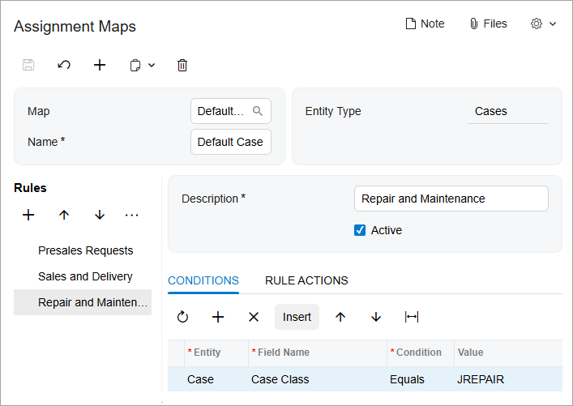

# Assignment Maps: To Configure a Case Assignment Map {#_506c3024-d85b-4d00-99b5-3b4644f1b0bc .task}

The following implementation activity will show you how to configure a case assignment map in Acumatica ERP.

**Attention:** This activity is based on the *U100* dataset. If you are using another dataset or if any system settings have been changed in *U100*, these changes can affect the workflow of the activity and the results of the processing. To avoid issues, restore the *U100* dataset to its initial state.

## Story { .section}

Suppose that you are an implementation consultant for the SweetLife Fruits &amp; Jams company.You need to configure a case assignment map in Acumatica ERP in order to provide the customer support team with the ability to assign cases to owners as follows:

-   The employee *David Chubb*, a sales manager in SweetLife, will be working with cases for presales questions from potential clients and customers.
-   The *Delivery* workgroup will be working with cases for sale and delivery of company products, such as jam, fruits, and juicers.
-   The *Technical Support* workgroup will be working with cases for cleaning, maintenance, and repair of juicers. This workgroup will also help answer all kinds of technical questions from potential clients and customers.

## Configuration Overview { .section}

In the *U100* dataset, for the purposes of this activity, the following tasks have been performed:

-   On the [Employees](EP_20_30_00.md) \(EP203000\) form, the following employees have been created:
    -   *Marcos Garcia*
    -   *Jeffrey Vega*
    -   *David Chubb*
-   On the [Company Tree](EP_20_40_61.md) \(EP204061\) form, the company tree has been configured, and it includes the *Delivery* and the *Technical Support* workgroups in the *After-Sales* department.
-   On the [Case Classes](CR_20_60_00.md) \(CR206000\) form, the *PRESALE*, *DELIVERY*, and *JREPAIR* case classes have been created.

## Process Overview { .section}

In this activity, you will do the following:

1.  Create a case assignment map on the [Assignment Maps](EP_20_50_10.md) \(EP205010\) form.
2.  Select the default case assignment map on the [Customer Management Preferences](CR_10_10_00.md) \(CR101000\) form.
3.  Assign cases to the owner on the [Assign Cases](CR_50_32_10.md) \(CR503210\) form; make sure that cases are assigned according to the default case assignment map.

## System Preparation { .section}

Before you start configuring a case assignment map, you should do the following:

1.  Launch the Acumatica ERP website with the *U100* dataset preloaded
2.  Sign in to the system as implementation consultant Kimberly Gibbs by using the following credentials:
    -   **Username**: *gibbs*
    -   **Password**: *123*
3.  Make sure that on the Company and Branch Selection menu, in the top pane of the Acumatica ERP screen, the *SweetLife Head Office and Wholesale Center* branch is selected.

## Step 1: Creating a Case Assignment Map { .section}

To create a case assignment map, do the following:

1.  Open the [Assignment and Approval Maps](EP_20_50_00.md) \(EP205500\) from.
2.  On the form toolbar, click **Add Assignment Map**. A new assignment map opens on the [Assignment Maps](EP_20_50_10.md) \(EP205010\) form.
3.  In the Summary area of the form, do the following:
    1.  In the **Name** box, type `Default Case Assignment Map`.
    2.  In the **Entity Type** box, select *Cases*.
4.  In the **Rules** tree, click **Add Rule** to add the rule for distributing the cases of the *PRESALE* class.
5.  In the **Description** box \(on the right pane\), type `Presales Requests`.
6.  Make sure that the **Active** check box is selected.
7.  On the **Conditions** tab, do the following:
    1.  On the table toolbar, click **Add Row**.
    2.  In the **Entity** box, select *Case*.
    3.  In the **Field Name** box, select *Case Class*.
    4.  In the **Condition** box, select *Equals*.
    5.  In the **Value** box, select *PRESALE*.
8.  On the **Rule Actions** tab, do the following:
    1.  In the **Assign Ownership To** box, select *Employee*.
    2.  In the **Employee** box, select *David Chubb*.
9.  In the **Rules** tree, click **Add Rule** to add the rule for distributing the cases of the *DELIVERY* class.
10. In the **Description** box, type `Sales and Delivery`.
11. Make sure that the **Active** check box is selected.
12. On the **Conditions** tab, do the following:
    1.  On the table toolbar, click **Add Row**.
    2.  In the **Entity** box, select *Case*.
    3.  In the **Field Name** box, select *Case Class*.
    4.  In the **Condition** box, select *Equals*.
    5.  In the **Value** box, select *DELIVERY*.
13. On the **Rule Actions** tab, do the following:
    1.  In the **Assign Ownership To** box, select *Employee*.
    2.  In the **Workgroup** box, select *Delivery* as follows:
        1.  Click the magnifier button.
        2.  In the dialog box that contains the company tree select **After-Sales** &gt; **Delivery**.
        3.  Double click *Delivery* to cause the system to close the dialog box and insert this value in the **Workgroup** box.
14. In the **Rules** tree, click **Add Rule** to add the rule for distributing the cases of the *JREPAIR* class.
15. In the **Description** box, type `Repair and Maintenance`.
16. Make sure that the **Active** check box is selected.
17. On the **Conditions** tab, do the following:
    1.  On the table toolbar, click **Add Row**.
    2.  In the **Entity** box, select *Case*.
    3.  In the **Field Name** box, select *Case Class*.
    4.  In the **Condition** box, select *Equals*.
    5.  In the **Value** box, select *JREPAIR*.
18. On the **Rule Actions** tab, do the following:
    1.  In the **Assign Ownership To** box, select *Employee*.
    2.  In the **Workgroup** box, select *Technical Support* as follows:
        1.  Click the magnifier button.
        2.  In the dialog box that contains the company tree select **After-Sales** &gt; **Technical Support**.
        3.  Double click *Technical Support* to cause the system to close the dialog box and insert this value in the **Workgroup** box.
19. On the form toolbar, click **Save**.

You have created and configured *Default Case Assignment Map*, as shown in the following screenshot. Now you need to specify this map on the [Customer Management Preferences](CR_10_10_00.md) \(CR101000\) form.

## Step 2: Selecting a Default Case Assignment Map { .section}

To select a default case assignment map, do the following:

1.  Open the [Customer Management Preferences](CR_10_10_00.md) \(CR101000\) form.
2.  On the **General** tab, in the **Case Assignment Map** box of the **Assignment Settings** section, select *Default Case Assignment Map*.
3.  On the form toolbar, click **Save**.

You have selected the *Default Case Assignment Map* as the default case assignment map. Now users can mass-assign cases of the *PRESALE*, *DELIVERY* and *JREPAIR* case classes on the [Assign Cases](CR_50_32_10.md) \(CR503210\) form, and the system will distribute these cases according to the rules in this assignment map.

**Parent topic:**[Configuring Assignment Maps](../UserGuide/CRM_Assignment_Maps_Mapref.md)

