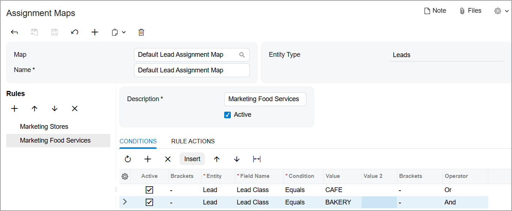

# Assignment Maps: To Configure a Lead Assignment Map {#_0de8af13-9f4a-459c-aed1-6ff22e00cd5f .task}

The following implementation activity will show you how to configure a lead assignment map in Acumatica ERP.

**Attention:** This activity is based on the *U100* dataset. If you are using another dataset or if any system settings have been changed in *U100*, these changes can affect the workflow of the activity and the results of the processing. To avoid issues, restore the *U100* dataset to its initial state.

## Story { .section}

Suppose that you are an implementation consultant at the SweetLife Fruits &amp; Jams company.You need to configure a lead assignment map in Acumatica ERP in order to provide the marketing team with the ability to assign groups of leads to owners as follows:

-   The *Marketing Stores* workgroup will be working with leads that represent supermarkets and other stores.
-   The *Marketing Food Services* workgroup will be working with leads that represent restaurants, cafes, bakeries, and other food service companies.

## Configuration Overview { .section}

In the *U100* dataset, for the purposes of this activity, the following tasks have been performed:

-   On the [Employees](EP_20_30_00.md) \(EP203000\) form, the following employees have been created:
    -   *Bill Owen*
    -   *Joanne Simpson*
-   On the [Company Tree](EP_20_40_61.md) \(EP204061\) form, the company tree has been configured and it includes the *Marketing Stores* and the *Marketing Food Services* workgroups in the *Marketing* department.
-   On the [Lead Classes](CR_20_70_00.md) \(CR207000\) form, the following lead classes have been created:
    -   *STORE* \(for leads that are supermarkets and other stores\)
    -   *BAKERY* \(for leads that are bakeries\)
    -   *CAFE* \(which includes leads that are restaurants and cafes\)

## Process Overview { .section}

In this activity, you will do the following:

1.  Create a lead assignment map on the [Assignment Maps](EP_20_50_10.md) \(EP205010\) form
2.  Specify the created assignment map as the default lead assignment map on the [Customer Management Preferences](CR_10_10_00.md) \(CR101000\) form

## System Preparation { .section}

Before you start configuring a lead assignment map, you should do the following:

1.  Launch the Acumatica ERP website with the *U100* dataset preloaded.
2.  Sign in to the system as implementation consultant Kimberly Gibbs by using the following credentials:
    -   **Username**: *gibbs*
    -   **Password**: *123*
3.  Make sure that on the Company and Branch Selection menu, in the top pane of the Acumatica ERP screen, the *SweetLife Head Office and Wholesale Center* branch is selected.

## Step 1: Creating a Lead Assignment Map { .section}

To create a lead assignment map, do the following:

1.  Open the [Assignment and Approval Maps](EP_20_50_00.md) \(EP205500\) form.
2.  On the form toolbar, click **Add Assignment Map**. A new assignment map opens on the [Assignment Maps](EP_20_50_10.md) \(EP205010\) form.
3.  In the Summary area of the form, do the following:
    1.  In the **Name** box, type `Default Lead Assignment Map`.
    2.  In the **Entity Type** box, select *Leads*.
4.  In the **Rules** tree, click **Add Rule** to add the rule for distributing the leads of the *STORE* class.
5.  In the **Description** box \(on the right pane\), type `Marketing Stores`.
6.  Make sure that the **Active** check box is selected.
7.  On the **Conditions** tab, do the following:
    1.  On the table toolbar, click **Add Row**.
    2.  In the **Entity** box, select *Lead*.
    3.  In the **Field Name** box, select *Lead Class*.
    4.  In the **Condition** box, select *Equals*.
    5.  In the **Value** box, select *STORE*.
8.  On the **Rule Actions** tab, do the following:
    1.  In the **Assign Ownership To** box, select *Employee*.
    2.  In the **Workgroup** box, select *Marketing Stores* as follows:
        1.  Click the magnifier button.
        2.  In the dialog box that contains the company tree select **Marketing** &gt; **Marketing Stores**
        3.  Double click *Marketing Stores* to cause the system to close the dialog box and insert this value in the **Workgroup** box.
9.  In the **Rules** tree, click **Add Rule** to add the rule for distributing the leads of the *CAFE* and *BAKERY* classes.
10. In the **Description** box, type `Marketing Food Services`.
11. Make sure that the **Active** check box is selected.
12. On the **Conditions** tab, do the following:
    1.  On the table toolbar, click **Add Row**.
    2.  In the **Entity** box, select *Lead*.
    3.  In the **Field Name** box, select *Lead Class*.
    4.  In the **Condition** box, select *Equals*.
    5.  In the **Value** box, select *CAFE*.
    6.  In the **Operator** box, select *Or*.
    7.  On the table toolbar, click **Add Row**.
    8.  In the **Entity** box, select *Lead*.
    9.  In the **Field Name** box, select *Lead Class*.
    10. In the **Condition** box, select *Equals*.
    11. In the **Value** box, select *BAKERY*.
13. On the **Rule Actions** tab, do the following:
    1.  In the **Assign Ownership To** box, select *Employee*.
    2.  In the **Workgroup** box, select *Marketing Food Services* as follows:
        1.  Click the magnifier button.
        2.  In the dialog box that contains the company tree select **Marketing** &gt; **Marketing Food Services**
        3.  Double click *Marketing Food Services* to cause the system to close the dialog box and insert this value in the **Workgroup** box.
14. On the form toolbar, click **Save**.

You have created and configured *Default Lead Assignment Map*, as shown in the following screenshot. Now you need to specify this map on the [Customer Management Preferences](CR_10_10_00.md) \(CR101000\) form.

## Step 2: Selecting a Default Lead Assignment Map { .section}

To select a default lead assignment map, do the following:

1.  Open the [Customer Management Preferences](CR_10_10_00.md) \(CR101000\) form.
2.  On the **General** tab, in the **Lead Assignment Map** box of the **Assignment Settings** section, select *Default Lead Assignment Map*.
3.  On the form toolbar, click **Save**.

You have selected the *Default Lead Assignment Map* as the default lead assignment map. Now users can mass-assign leads of the *STORE*, *BAKERY*, and *CAFE* classes on the [Assign Leads](CR_50_30_10.md) \(CR503010\) form, and the system will distribute these leads according to the rules in this assignment map.

**Parent topic:**[Configuring Assignment Maps](../UserGuide/CRM_Assignment_Maps_Mapref.md)

