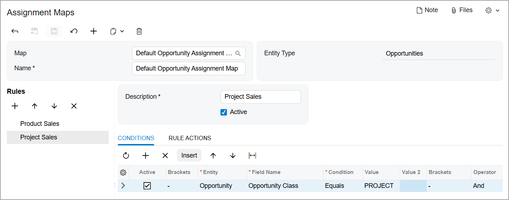

# Assignment Maps: To Configure an Opportunity Assignment Map {#_9699b4f0-7dd9-41c0-8e43-2c826151d3b7 .task}

The following implementation activity will show you how to configure an opportunity assignment map in Acumatica ERP.

**Attention:** This activity is based on the *U100* dataset. If you are using another dataset or if any system settings have been changed in *U100*, these changes can affect the workflow of the activity and the results of the processing. To avoid issues, restore the *U100* dataset to its initial state.

## Story { .section}

Suppose that you, as an implementation consultant for the SweetLife Fruits &amp; Jams company.You need to configure an opportunity assignment map in Acumatica ERP in order to provide the sales team with the ability to assign groups of opportunities to owners as follows:

-   The *Product Sales* workgroup will be working with opportunities for selling company products, such as jam, fruits, and juicers.
-   The *Project Sale* workgroup will be working with opportunities for conducting trainings and workshops for customers, such as cleaning and maintenance of juicers.

## Configuration Overview { .section}

In the *U100* dataset, for the purposes of this activity, the following tasks have been performed:

-   On the [Employees](EP_20_30_00.md) \(EP203000\) form, the following employees have been created:
    -   *David Chubb*
    -   *Pam Brawner*
-   On the [Company Tree](EP_20_40_61.md) \(EP204061\) form, the company tree has been configured and it includes the *Product Sales* and the *Project Sales* workgroups in the *Sales* department.
-   On the [Opportunity Classes](CR_20_90_00.md) \(CR209000\) form, the *PRODUCT* and *PROJECT* opportunity classes have been created.

## Process Overview { .section}

In this activity, you will do the following:

1.  Create an opportunity assignment map on the [Assignment Maps](EP_20_50_10.md) \(EP205010\) form.
2.  Select the default opportunity assignment map on the [Customer Management Preferences](CR_10_10_00.md) \(CR101000\) form.

## System Preparation { .section}

Before you start configuring an opportunity assignment map, you should do the following:

1.  Launch the Acumatica ERP website with the *U100* dataset preloaded
2.  Sign in to the system as implementation consultant Kimberly Gibbs by using the following credentials:
    -   **Username**: *gibbs*
    -   **Password**: *123*
3.  Make sure that on the Company and Branch Selection menu, in the top pane of the Acumatica ERP screen, the *SweetLife Head Office and Wholesale Center* branch is selected.

## Step 1: Creating an Opportunity Assignment Map { .section}

To create an opportunity assignment map, do the following:

1.  Open the [Assignment and Approval Maps](EP_20_50_00.md) \(EP205500\) form.
2.  On the form toolbar, click **Add Assignment Map**. A new assignment map opens on the [Assignment Maps](EP_20_50_10.md) \(EP205010\) form.
3.  In the Summary area of the form, do the following:
    1.  In the **Name** box, type `Default Opportunity Assignment Map`.
    2.  In the **Entity Type** box, select *Opportunities*.
4.  In the **Rules** tree, click **Add Rule** to add the rule for distributing the opportunities of the *PRODUCT* class.
5.  In the **Description** box \(on the right pane\), type `Product Sales`.
6.  Make sure that the **Active** check box is selected.
7.  On the **Conditions** tab, do the following:
    1.  On the table toolbar, click **Add Row**.
    2.  In the **Entity** box, select *Opportunity*.
    3.  In the **Field Name** box, select *Opportunity Class*.
    4.  In the **Condition** box, select *Equals*.
    5.  In the **Value** box, select *PRODUCT*.
8.  On the **Rule Actions** tab, do the following:
    1.  In the **Assign Ownership To** box, select *Employee*.
    2.  In the **Workgroup** box, select *Product Sales* as follows:
        1.  Click the magnifier button.
        2.  In the dialog box that contains the company tree select **Sales** &gt; **Product Sales**.
        3.  Double click *Product Sales* to cause the system to close the dialog box and insert this value in the **Workgroup** box.
9.  In the **Rules** tree, click **Add Rule** to add the rule for distributing the opportunities of the *PROJECT* class.
10. In the **Description** box, type `Project Sales`.
11. Make sure that the **Active** check box is selected.
12. On the **Conditions** tab, do the following:
    1.  On the table toolbar, click **Add Row**.
    2.  In the **Entity** box, select *Opportunity*.
    3.  In the **Field Name** box, select *Opportunity Class*.
    4.  In the **Condition** box, select *Equals*.
    5.  In the **Value** box, select *PROJECT*.
13. On the **Rule Actions** tab, do the following:
    1.  In the **Assign Ownership To** box, select *Employee*.
    2.  In the **Workgroup** box, select *Project Sales* as follows:
        1.  Click the magnifier button.
        2.  In the dialog box that contains the company tree select **Sales** &gt; **Project Sales**.
        3.  Double click *Project Sales* to cause the system to close the dialog box and insert this value in the **Workgroup** box.
14. On the form toolbar, click **Save**.

You have created and configured *Default Opportunity Assignment Map*, as shown in the following screenshot. Now you need to specify this map on the [Customer Management Preferences](CR_10_10_00.md) \(CR101000\) form.

## Step 2: Selecting a Default Opportunity Assignment Map { .section}

To select a default opportunity assignment map, do the following:

1.  Open the [Customer Management Preferences](CR_10_10_00.md) \(CR101000\) form.
2.  On the **General** tab, in the **Opportunity Assignment Map** box of the **Assignment Settings** section, select *Default Opportunity Assignment Map*.
3.  On the form toolbar, click **Save**.

You have selected the *Default Opportunity Assignment Map* as the default opportunity assignment map. Now users can mass-assign opportunities of the *PRODUCT* and *PROJECT* classes on the [Assign Opportunities](CR_50_31_10.md) \(CR503110\) form, and the system will distribute these opportunities according to the rules in this assignment map.

**Parent topic:**[Configuring Assignment Maps](../UserGuide/CRM_Assignment_Maps_Mapref.md)

