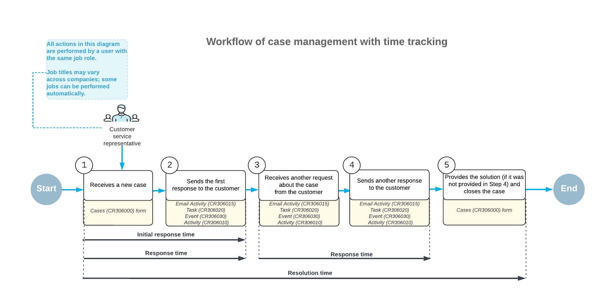
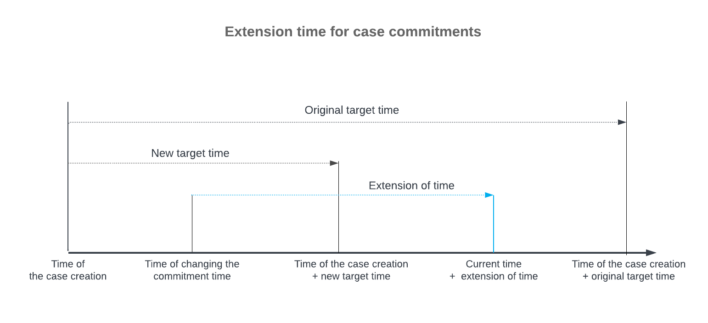

# Case Classes: Case Commitments {#_d6314691-e3ef-480b-a744-d5009b2369d0 .concept}

If a company has a service-level agreement with a customer, it may include the company's commitments to do the following within a specified period of time: provide an initial response, respond to the customer, and resolve the case. The periods of time during which the company must fulfill its commitments may depend on the severity level of a case, which is determined by the impact on your customer's business. In Acumatica ERP, you can easily monitor the fulfillment of commitments for each case.

For each class, you can specify target time periods to be tracked for any severity level. You can configure these commitments if the *Case Commitments* feature is enabled on the [Enable/Disable Features](CS_10_00_00.md) \(CS100000\) form.

## Setup of Commitments for a Case Class { .section}

You specify the time commitments for a case class on the **Commitments** tab of the [Case Classes](CR_20_60_00.md) \(CR206000\) form. For each row that you add to the table on this tab, in the **Severity** column, you can select one of the predefined options \(*Urgent*, *High*, *Medium*, or *Low*\).

For the severity level in the row, you can activate the tracking of time for any of the target time periods and specify the time period in days, hours, and minutes. To do this, you select the **Enable** check box that precedes the needed target column, which is one of the following:

-   **Target Initial Response Time**: The time period within which the customer service representative needs to respond to the initial request from the customer in a case of the class with this severity.
-   **Target Response Time**: The time period within which the customer service representative needs to respond to any customer request regarding the case of the class with this severity.
-   **Target Resolution Time**: The time period within which the customer service representative needs to resolve a case of the class with this severity by providing a solution to the customer's request.

For each time period that is tracked for the case and severity, you can also specify an extension to meet the case commitment when the response or resolution must be delivered more quickly due to some change. \(See the *Extension of Case Commitment Times* section of this topic for more information about these time extensions.\) These extensions can be specified in each of the following columns if the respective **Enable** check box is selected:

-   **Initial Response Extension**: The time extension that may be permitted for the initial response to the customer
-   **Response Extension**: The time extension that the customer service representative may be granted to respond to any customer request regarding the case
-   **Resolution Extension**: The time extension that the customer service representative may be granted to resolve the case

Suppose that you need to track the time of the case resolution for urgent cases of the class. First, you select the *Urgent* severity. Then you activate the tracking of the needed time by selecting the **Enable** check box that has the **Resolution Time Tracking** tooltip. The **Target Resolution Time** and **Resolution Extension** columns become available for editing, and you can specify the duration of each time period.

For each case class with time commitments specified, you must indicate which condition causes the system to stop counting the resolution time for a case. To do this, you select one of the following options in the **Stop Counting Time** box:

-   *If Case Becomes Inactive*: The system stops tracking the resolution time for a case of the class when the status of the case has changed to *Resolved* or *Released* on the [Cases](CR_30_60_00.md) \(CR306000\) form. When the case has either status, the system clears the **Active** check box on the form.
-   *If Case Solution Is Provided in Activity*: The system stops tracking the resolution time for a case of the class when a completed activity associated with the case is marked as including a case solution. That is, the system stops tracking the time when the **Case Solution Provided** check box is selected for the activity on the [Activity](CR_30_60_10.md) \(CR306010\), [Task](CR_30_60_20.md) \(CR306020\), [Event](CR_30_60_30.md) \(CR306030\), or [Email Activity](CR_30_60_15.md) \(CR306015\) form.

By default, outgoing system emails do not affect the tracking of resolution time for cases of the class. The system continues counting the resolution time of a case and calculating the case commitment statistics. However, you can include emails of the *System Email* type in the resolution time calculation by selecting the **Include System Activities in Response Time Calculation** check box on the [Case Classes](CR_20_60_00.md) form if this fits your company's needs.

## Case Management with Tracking Activated { .section}

When a customer support representative creates a case on the [Cases](CR_30_60_00.md) \(CR306000\) form, they select its severity level in the **Severity** box of the Summary area. If the tracking of the target periods of time for the selected severity level has been activated and defined on the [Case Classes](CR_20_60_00.md) \(CR206000\) form for the class of this case, the system starts tracking time to monitor the fulfillment of commitments.

**Note:** The system tracks the time only for the activated commitments.

If time tracking has been activated for all commitments on the [Case Classes](CR_20_60_00.md) form, the system begins tracking the initial response time, response time, and resolution time for each case of the class on the [Cases](CR_30_60_00.md) form, starting at the time of the case's creation, as follows:

-   The system tracks the time of the first response for both the initial response time commitment and the response time commitment.
-   When the user sends the initial response to the customer, the system stops tracking the initial response time and response time and continues tracking only the resolution time.
-   If the customer sends an additional request or provides the requested information, the system starts tracking the response time again until the user responds to this inquiry.
-   The tracking of time for the resolution time commitment stops when a solution for the case is provided or the case is resolved or released, depending on the option selected in the **Stop Counting Time** box on the [Case Classes](CR_20_60_00.md) form.

You can see the process of time tracking during the case workflow in the following diagram.

## Extension of Case Commitment Times { .section}

If the tracking of time for the case commitments is activated on the [Case Classes](CR_20_60_00.md) \(CR206000\) form, as described above, an extension of time to meet case commitments can be specified for any severity level of the class.

As a user works work a case on the [Cases](CR_30_60_00.md) \(CR306000\) form, the specified extension becomes applicable in scenarios where the expected time to fulfill the commitment is reduced \(that is, the response or resolution must be delivered more quickly\). These scenarios may include the following changes to the case after its creation:

-   Changing the case severity to another level \(usually, to a higher level\) in which the specified duration to fulfill the commitment is less than the duration in the previously selected severity level
-   Changing the case class to another class in which the specified duration to fulfill the commitment is less than the duration in the previously selected class with the same severity level

In either of these scenarios, the remaining time to fulfill the commitment \(starting at the moment of the change\) may be less than it would have been if the user had selected the current severity level or class at the moment of case creation. To avoid the commitment not being met for this case, the system adds the extension specified for this commitment to the current time period and sets the extended target time \(for example, for resolving the case or responding to the customer\), as shown in the following diagram.

For details about scenarios in which you can use a time extension, see [Case Management: Time Extensions for Case Commitments](CRM_Support_Managing_Cases_Case_Commitments_Grace_Period.md)

**Parent topic:**[Defining Case Classes](../UserGuide/CRM_Case_Classes_Mapref.md)

