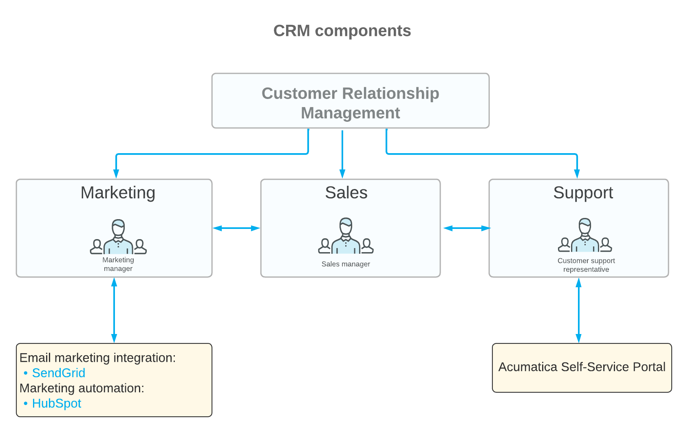
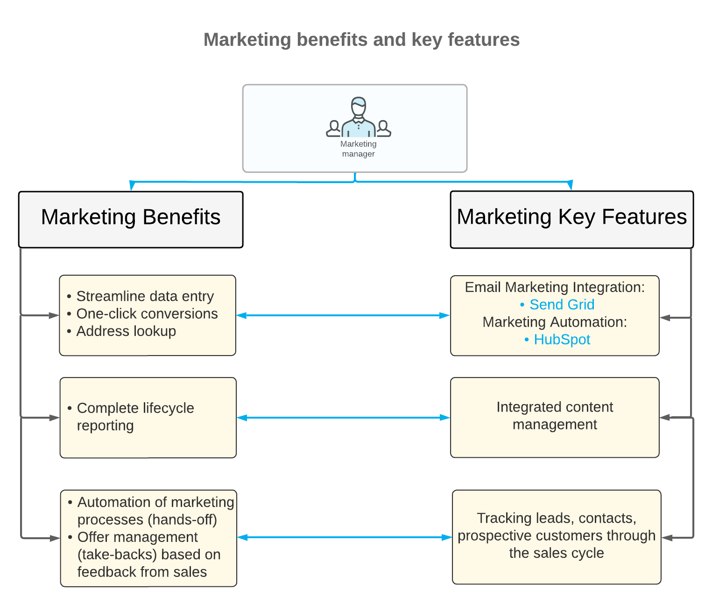
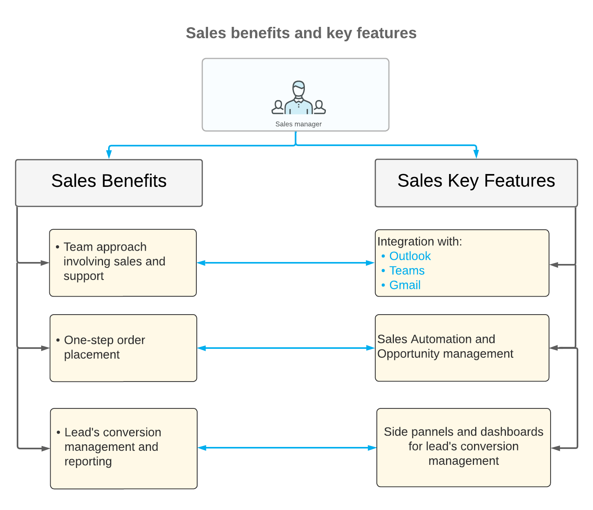

# CRM: Introduction to Customer Relationship Management {#_93e5d60c-dd0e-4428-a846-a38c225e16c9 .concept}

The customer relationship management \(CRM\) functionality of Acumatica ERP helps companies manage their interactions with current and potential customers to effectively identify and address their target audience’s needs and build strong relationships with their customers.

Acumatica ERP delivers tools that provide marketing, sales, and support teams with process automation, data management, and reporting. You can easily customize the CRM functionality to fit your company’s business goals, ensure higher profitability, and streamline your marketing, sales, and support processes.

CRM consists of three major parts: marketing, sales, and support, as shown in the following diagram.

Marketing and sales teams engage with prospective and existing customers at various stages, depending on the customer's readiness to conclude a deal at any given moment; the following sections summarize the marketing and sales processes. The support team interacts primarily with existing customers providing solutions for their requests, that is, cases.

## Marketing { .section}

To fuel its CRM marketing processes, a company collects information about prospective customers who might be interested in the company's products and services. The company may use any of the following diverse sources of customer data:

-   The company's site
-   Social media
-   Events, activities, and presentations
-   Webinars and master classes
-   Databases
-   Partners

To work with this data effectively, your company's marketing team needs to first collect it in one place.

Acumatica ERP provides various simple and fast ways to enter or upload prospective customers' data into the system, including the following:

-   Import from external systems
-   Integration with Outlook, HubSpot, and SendGrid
-   Usage of the incoming mail processing functionality
-   Use of the Acumatica mobile app
-   Manual input

After customer data has been entered into the system, the marketing team starts creating a target audience—that is, leads. In Acumatica ERP, a lead represents the contact information of a prospective customer.

During the lead creation stage, a marketing team may have the following goals:

-   Checking of customer data for duplication
-   Confirmation of customer data
-   Generation of interest in company's products and services

Also, a marketing team can work with existing customers to build and maintain long-term mutual relationships, fostering customer loyalty and encouraging repeat purchases.

To help companies achieve these goals, Acumatica ERP provides flexible tools for a marketing team to interact with leads and existing customers, such as the following:

-   Marketing lists
-   Mass emails
-   Tracking activities, such as phone calls, events, and chats
-   Marketing campaigns

As a result of these actions, a marketing manager performs a process called *lead qualification*: the evaluation of the prospective or existing customer's interest in making a deal. If the possibility of a purchase is high, the marketing manager transfers the lead or existing customer to a sales team for further work. At this point, the lead is considered a *marketing-qualified lead \(MQL\)*.

The following diagram illustrates the lead qualification workflow as performed by a marketing team.

By using the Acumatica ERP marketing tools in your company's routines, your marketing team can increase customer engagement and streamline its marketing processes. The following diagram shows the key marketing features of Acumatica ERP.

## Sales { .section}

A CRM sales team focuses on turning prospective customers—that is, leads—into existing customers that place orders of the company's products and services. To move the prospective customer toward a sale, a sales representative continues working with the lead by entering and working with opportunities and sales quotes in Acumatica ERP.

If a lead, as a result of their interaction with a sales representative, confirms the intention to make a deal, the sales representative creates an opportunity, which in Acumatica ERP represents a potential deal with the lead. At this point, the lead is considered a *sales-accepted lead \(SAL\)*. Acumatica ERP provides the capability to convert a lead to an opportunity easily and quickly.

Along with the creation of an opportunity from a lead in Acumatica ERP, a sales representative can create a business account to represent the prospective customer and a contact for each representative of the company.

During further work with an opportunity, a sales representative creates a sales quote, which in Acumatica ERP represents an offer that is based on an opportunity, and sends it to the prospective or existing customer.

When the prospective or existing customer is ready to make its first purchase and accepts a sales quote or an opportunity, a sales representative can create a sales order or invoice in Acumatica ERP in one click, along with extending the business account to be a customer in the system.

The following diagram shows the creation of a sales order from an opportunity or a sales quote based on the opportunity.

By using the Acumatica ERP sales tools in your company's routines, your sales team can streamline its processes, enhance lead tracking, improve customer communication, and ultimately boost sales efficiency. The following diagram shows the key sales features of Acumatica ERP.

## Customer Support { .section}

Acumatica ERP provides tools for process automation, case management, and reporting for customer support teams. You can easily customize the case management functionality to fit your company’s business goals, ensure higher profitability, and streamline your customer support processes.

The case management functionality gives your customer support personnel the ability to create support cases, assign cases to owners, and process cases.

The following diagram illustrates the processing of a case in Acumatica ERP.

