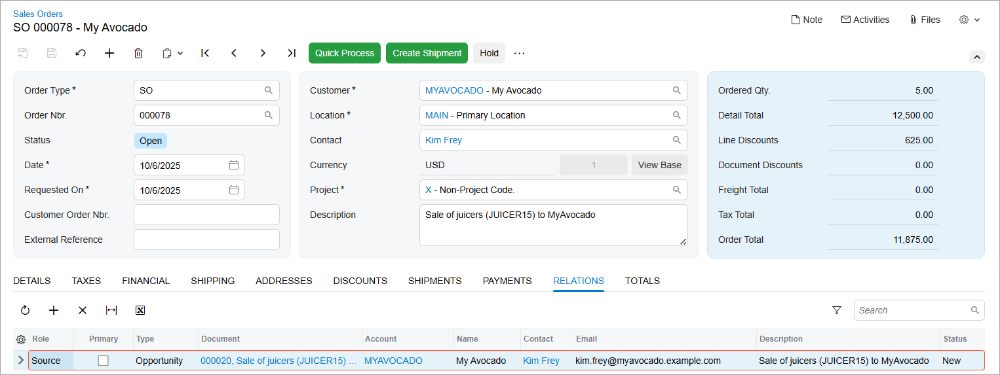

# Relations: Process Activity {#_a7c08690-4868-41f2-b8b4-4c10e4d68c66 .task}

The following activity demonstrates how to manage relations in Acumatica ERP.

**Attention:** This activity is based on the *U100* dataset. If you are using another dataset or if any system settings have been changed in *U100*, these changes can affect the workflow of the activity and the results of the processing. To avoid issues, restore the *U100* dataset to its initial state.

## Story { .section}

Suppose that you are David Chubb, a sales manager of the SweetLife Fruits &amp; Jams company. You have obtained a qualified lead from the marketing team, and your manager has assigned the lead to you. Kim Frey, a manager at the MyAvocado Lounge chain of restaurants, visited SweetLife’s official website, chose a pro series juicer made by Squeezo Inc., and would like to buy five juicers of this kind. You have contacted Kim Frey and she has confirmed her interested in the product. You have also discussed the financial terms of the deal with Erica Spencer, who is the director of operations at the MyAvocado Lounge chain of restaurants, and agreed to give the chain a 5% discount on the purchase. You need to do the following:

-   Convert the lead to an opportunity
-   Specify the decision maker for the deal in the opportunity
-   Create a sales order based on the opportunity

## Configuration Overview {#section_tz4_djx_cnb .section}

In the *U100* dataset, for the purposes of this activity, the following tasks have been performed:

-   On the [Enable/Disable Features](CS_10_00_00.md) \(CS100000\) form, the *Customer Management* feature has been enabled. This feature provides the customer relationship management \(CRM\) functionality, including lead and customer tracking, as well as the handling of sales opportunities, contacts, marketing lists, and marketing campaigns.
-   On the [Business Accounts](CR_30_30_00.md) \(CR303000\) form, the *MYAVOCADO* business account of the *Customer* type has been created.
-   On the [Opportunity Classes](CR_20_90_00.md) \(CR209000\) form, the *PRODUCT* opportunity class has been created.
-   On the [Leads](CR_30_10_00.md) \(CR301000\) form, the *Kim Frey* lead has been created and associated with the *MYAVOCADO* business account.
-   On the [Contacts](CR_30_20_00.md) \(CR302000\) form the *Erica Spencer* contact has been created.
-   On the [Stock Items](IN_20_25_00.md) \(IN202500\) form, the *JUICER15* stock item, which holds the settings of a commercial juicer, has been created.

## Process Overview { .section}

In this activity, you will do the following:

1.  On the [Leads](CR_30_10_00.md) \(CR301000\) form, convert a lead to an opportunity.
2.  On the [Opportunities](CR_30_40_00.md) \(CR304000\) form, do the following:
    1.  Add products to the newly created opportunity.
    2.  Specify a role in the opportunity for a contact \(a decision maker\).
    3.  Create a sales order.
3.  On the [Sales Orders](SO_30_10_00.md) \(SO301000\) form, view the record associated with the sales order on the **Relations** tab.

## System Preparation { .section}

Before you start performing the activity, you should do the following:

1.  Launch the Acumatica ERP website with the *U100* dataset preloaded, and sign in to the system as sales manager David Chubb by using the following credentials:
    -   **Username**: *chubb*
    -   **Password**: *123*
2.  Make sure that on the Company and Branch Selection menu, in the top pane of the Acumatica ERP screen, the *SweetLife Head Office and Wholesale Center* branch is selected.

## Step 1: Converting a Lead to an Opportunity { .section}

To convert the *Kim Frey* lead to an opportunity, do the following:

1.  Open the Leads \(CR3010PL\) form.
2.  In the **Display Name** column, click the *Kim Frey* link to open this lead on the [Leads](CR_30_10_00.md) \(CR301000\) form.

    **Tip:** To search for a record in a list of records, you can enter a keyword or phrase in the Search box of the table toolbar. The system will find all the records that match your search string and display these records in the table.

3.  On the More menu, under **Processing**, click **Convert to Opportunity**.

    **Tip:** You open the More menu by clicking the More button \(…\) on the form toolbar.

4.  In the **Create Opportunity** dialog box, which opens, do the following on the **Main** tab:
    1.  In the **Subject** box of the **Opportunity** section, type `Sale of juicers (JUICER15) to MyAvocado`.
    2.  In the **Estimation** box, select the current business date.
    3.  In the **Opportunity Class** box, select *PRODUCT*.
    4.  In the **Business Account** section, notice that the system has inserted business account settings and that they are unavailable for editing.
    5.  In the **Contact** section, notice that the system has inserted contact settings \(which were specified in the **Contact** section of the [Leads](CR_30_10_00.md) form\).
    6.  At the bottom of the dialog box, click **Create and Review**.

        The system closes the dialog box, converts the lead to an opportunity, creates a contact for the lead, and opens the opportunity on the [Opportunities](CR_30_40_00.md) \(CR304000\) form. On the form, notice that values have been inserted in the **Business Account** and **Contact** boxes of the Summary area.

You have converted the lead to an opportunity.

## Step 2: Reviewing the Relations Between the Opportunity and the Associated Lead { .section}

To review the relations between the lead and the opportunity it was converted to, do the following:

1.  While you are still viewing the *Sale of juicers \(JUICER15\) to MyAvocado* opportunity on the [Opportunities](CR_30_40_00.md) \(CR304000\) form, on the **Relations** tab, notice that a row has been added with the settings of the lead. The *Source* role is selected in this row because this lead was the source of the opportunity selected on the form.
2.  In the **Document** column, click the link to the associated lead.
3.  On the [Leads](CR_30_10_00.md) \(CR301000\) form, which opens, go to the **Relations** tab. Notice that a row has been added with the following settings of the associated opportunity:

    -   **Role**: *Derivative*
    -   **Type**: *Opportunity*
    -   **Document**: The reference number of the opportunity, which is a link to it
    -   **Account**: *MYAVOCADO*, which is a link to the customer's account
    -   **Contact**: *Kim Frey*, which is a link to the customer's contact specified in the opportunity
    Also, notice that the system has created one more relation with the *Derivative* role for the associated contact.

## Step 3: Adding a Product to the Opportunity { .section}

To add a product to the opportunity, do the following:

1.  While you are still viewing the *Sale of juicers \(JUICER15\) to MyAvocado* leads on the [Leads](CR_30_10_00.md) \(CR301000\) form, click to the link in the **Document** column. The *Sale of juicers \(JUICER15\) to MyAvocado* opportunity opens.
2.  On the **Details** tab of the [Opportunities](CR_30_40_00.md) \(CR304000\) form, add a new row.
3.  In the new row, specify the following settings:
    -   **Inventory ID**: *JUICER15*

        Notice that the system has filled in the settings for the *JUICER15* inventory item, including the **Tax Category** and **Discount, %** settings.

    -   **Quantity**: `5`
    -   **Discount, %**: `5`

        A 5% discount is applied to this detail line.

4.  On the form toolbar, click **Save**.

You have added the product and the applicable discount and quantity to the opportunity.

## Step 4: Specifying a Role for a Customer Contact in the Opportunity { .section}

Suppose that you have confirmed the model and the number of juicers with Kim Frey and now need to discuss financial terms with Erica Spencer, who is the director of operations at the MyAvocado Lounge chain of restaurants. Further suppose that you have created a contact in the system. You need to associate the contact with the *MYAVOCADO* business account and specify Erica's role in the deal for the opportunity.

To add the *Decision-Maker* relation to the opportunity, do the following:

1.  While you are still viewing the *Sale of juicers \(JUICER15\) to MyAvocado* opportunity on the [Opportunities](CR_30_40_00.md) \(CR304000\) form, open the **Relations** tab, and add a row with the following settings:
    -   **Role**: *Decision-Maker*

        Notice that in the **Type** column, *Contact* is inserted for the row, which means that you can select a decision maker only among contacts.

    -   **Contact**: *Erica Spencer*

        Notice that the contact's email address is inserted in the **Email** column for the row.

    -   **Add to CC**: Selected

        With this check box selected, the *Erica Spencer* contact's email address will be added to each email notification automatically sent to this contact.

2.  On the form toolbar, click **Save**.

## Step 5: Creating a Sales Order Associated with the Opportunity { .section}

To create a sales order for the *MYAVOCADO* customer, do the following:

1.  While you are still viewing the *Sale of juicers \(JUICER15\) to MyAvocado* opportunity on the [Opportunities](CR_30_40_00.md) \(CR304000\) form, on the More menu \(under **Record Creation**\), click **Create Sales Order**.
2.  In the **Create Sales Order** dialog box, which opens, do the following:
    1.  In the **Order Type** box, make sure that *SO* is selected.
    2.  Click **Create and Review**. The system closes the dialog box and opens the [Sales Orders](SO_30_10_00.md) \(SO301000\) form with a new sales order that contains many of the settings copied from the opportunity. Notice that on the **Details** tab, the system has inserted a line with the product data specified for the opportunity.
3.  On the form toolbar, click **Save**.

You have created a sales order. Now you can view the relations between the opportunity and the sales order.

## Step 6: Reviewing the Relations Between the Opportunity and the Sales Order { .section}

To review the relations between the opportunity and the sales order, do the following:

1.  While you are still viewing the *Sale of juicers \(JUICER15\) to MyAvocado* sales order on the [Sales Orders](SO_30_10_00.md) \(SO301000\) form, go to the **Relations** tab. Notice that a row with the following settings has been added for the associated opportunity \(see the following screenshot\):

    -   **Role**: *Source*
    -   **Type**: *Opportunity*
    -   **Document**: The reference number of the opportunity, which is a link to it
    -   **Account**: *MYAVOCADO*, which is a link to the customer's account
    -   **Contact**: *Kim Frey*, which is a link to the customer's contact specified in the opportunity
    

2.  Click the link in the **Document** column.
3.  On the [Opportunities](CR_30_40_00.md) \(CR304000\) form, which opens in a new browser tab, open the **Relations** tab. In addition to the lead that was converted to the opportunity and the decision maker that you have added earlier in this activity, notice that a row with the settings of the associated sales order has been added.

You have reviewed how the records associated with an opportunity are managed in the system.

**Parent topic:**[Managing Relations](../UserGuide/CRM_Managing_Relations_Mapref.md)

