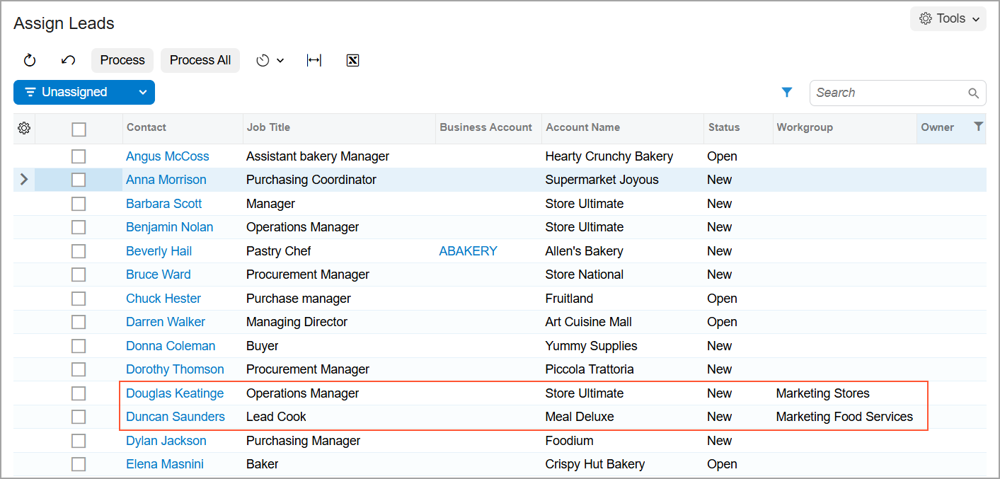

# Lead Assignment to Owners and Workgroups: Process Activity {#_4fed4813-66a9-41e6-b1e1-3af746d7ca61 .task}

The following activity demonstrates how to assign leads to owners and workgroups and set up the system to assign leads to owners automatically. The activity will show you how to define a lead class so that leads of the class are assigned to their creators by default. You will also practice manually assigning leads to the appropriate owners, both for an individual lead and by using the mass-processing form to assign multiple users to the needed owners.

**Attention:** This activity is based on the *U100* dataset. If you are using another dataset or if any system settings have been changed in *U100*, these changes can affect the workflow of the activity and the results of the processing. To avoid issues, restore the *U100* dataset to its initial state.

## Story { .section}

Suppose that you are Bill Owen, a new marketing manager of the SweetLife Fruits &amp; Jams company.You are performing several tasks related to assigning leads to the appropriate owner. First, you need to modify an existing lead class \(the class for confectioneries\) so that by default, when a new lead of the class is created, the system assigns the lead’s creator as its owner. Also, a new lead, *Stanley Carson*, has been created in the system, and you want to manually assign this lead to you and to your workgroup.

A number of leads whose companies can be classified as stores \(including supermarkets\) and food service companies \(bakeries, cafes, or restaurants\) have been imported into the system, and you want to distribute these leads between two workgroups of marketing employees as follows:

-   The *Marketing Stores* workgroup will be working with leads that represent supermarkets and other stores.
-   The *Marketing Food Services* workgroup, to which your *owen* user account belongs, will be working with leads that represent restaurants, cafes, bakeries, and other food service companies.

The workgroups listed above have been defined in the company tree and an assignment map has been created to assign leads to the needed workgroup; also, you have specified the needed configuration setting to cause the system to use this assignment map when you are mass-assigning leads. You will mass-assign leads by using this assignment map.

## Configuration Overview { .section}

In the *U100* dataset, for the purposes of this activity, the following tasks have been performed:

-   On the [Enable/Disable Features](CS_10_00_00.md) \(CS100000\) form, the *Customer Management* feature has been enabled. This feature provides the customer relationship management \(CRM\) functionality, including lead and customer tracking, as well as the handling of sales opportunities, contacts, marketing lists, and campaigns.
-   On the [Company Tree](EP_20_40_61.md) \(EP204061\) form, the company tree has been configured and it includes the *Marketing Stores* and the *Marketing Food Services* workgroups as well as the users in the *Marketing* department.
-   On the [Assignment Maps](EP_20_50_10.md) \(EP205010\) form, the *Lead Assignment Map* has been created. According to the actions related to rules, which are specified in the assignment map, the leads of the *STORE* class are assigned to the *Marketing Stores* workgroup in the SweetLife *Marketing* department, and the leads of the *BAKERY* and *CAFE* classes are assigned to the *Marketing Food Services* workgroup in the *Marketing* department.
-   On the [Lead Classes](CR_20_70_00.md) \(CR207000\) form, the following lead classes have been created: *STORE* \(for leads that are supermarkets and other stores\), *BAKERY*, *CAFE* \(which includes leads that are restaurants and cafes\), and *SWEETSHOP* \(for leads that are confectioneries\).
-   A list of lead records that includes bakeries, cafes, restaurants, and supermarkets has been imported to the system through the [Import by Scenario](SM_20_60_36.md) \(SM206036\) form.
-   On the [Leads](CR_30_10_00.md) \(CR301000\) form, the following leads have been added to the system:
    -   *Douglas Keatinge*, assigned to the *STORE* lead class
    -   *Stanley Carson*, assigned to the *BAKERY* lead class
    -   *Duncan Saunders*, assigned to the *CAFE* lead class

## Process Overview { .section}

In this activity, you will do the following:

1.  On the [Lead Classes](CR_20_70_00.md) \(CR207000\) form, specify how the system assigns the default owner of leads of a particular class.
2.  Manually assign a particular lead to an owner by using the [Leads](CR_30_10_00.md) \(CR301000\) form.
3.  Assign selected leads to owners by using the [Assign Leads](CR_50_30_10.md) \(CR503010\) form.

## System Preparation { .section}

Before you start assigning leads to owners, you should do the following:

1.  Launch the Acumatica ERP website with the *U100* dataset preloaded.
2.  Sign in to the system as marketing manager Bill Owen by using the following credentials:
    -   **Username**: *owen*
    -   **Password**: *123*
3.  Make sure that on the Company and Branch Selection menu, in the top pane of the Acumatica ERP screen, the *SweetLife Head Office and Wholesale Center* branch is selected.
4.  Make sure that on the [Customer Management Preferences](CR_10_10_00.md) \(CR101000\) form \(in the **Lead Assignment Map** box of the **Assignment Settings** section of the **General** tab\), *Lead Assignment Map* is specified. If it is not, select this assignment map, and save your changes. The system will use this assignment map during the process of mass-assigning leads.

## Step 1: Specifying a Default Owner for New Leads of a Lead Class { .section}

You can modify the settings of a lead class to specify how the system assigns the default owner of a newly created lead of the class—that is, whether the default owner is the creator of the lead, a user determined by an assignment map that you specify \(so that specific owners can be assigned\), or the owner of the entity \(such as a contact\) from which the lead is created, if the lead was created in this way.

In this step, you will specify the owner of a new lead of the *SWEETSHOP* class as its creator.

To specify the default owner of an existing lead class and make sure the owner is assigned correctly to a new lead of the class, do the following:

1.  Open the *SWEETSHOP* lead class record on the [Lead Classes](CR_20_70_00.md) \(CR207000\) form.
2.  On the **Details** tab, in the **Default Owner** box, select *Creator*.
3.  On the form toolbar, click **Save**.
4.  Make sure that the option that you have just specified assigns new leads to owners correctly by doing the following:
    1.  On the [Leads](CR_30_10_00.md) \(CR301000\) form, add a new record.
    2.  In the Summary area, in the **Lead Class** box, select *SWEETSHOP*.
    3.  On the **General** tab, in the **Contact** section, specify the following settings:
        -   **First Name**: `Sandra`
        -   **Last Name**: `Flynn`
        -   **Account Name**: `Crystal Sweet`
        -   **Job Title**: `Manager`
        -   **Email**: `s.flynn@crystalsweet.example.com`
    4.  In the **Owner** box of the Summary area, notice that *Bill Owen* is inserted in the box. Because this is the user account to which you are signed in and you are the creator of the lead, the setting of the lead class is assigning the owner appropriately.
5.  On the form toolbar, click **Save**.

You have specified how the system determines the default owner for leads of the *SWEETSHOP* lead class and then created a new lead to test the setting. The system has appropriately inserted the default owner for the new lead. Each time a user creates a lead of the *SWEETSHOP* class, the system will insert the employee name of the creator of the lead as the owner of the lead.

## Step 2: Assigning a Lead to an Owner Manually { .section}

To assign a lead to an owner manually, do the following:

1.  Open the *Stanley Carson* lead record on the [Leads](CR_30_10_00.md) \(CR301000\) form.

    **Tip:** You can find the record by clicking the magnifier button in the **Lead** box and typing the string you want to find in the Search box of the lookup table, which opens. When you see the record in the table, double-click it.

2.  In the **Workgroup** box on the **Additional Info** tab, select the *Marketing Food Services* workgroup.

    **Tip:** If a workgroup is specified in the **Workgroup** box, the list of employees available for selection in the **Owner** box is limited to those included in the selected workgroup.

3.  In the **Owner** box of the Summary area, select *Bill Owen*.
4.  On the form toolbar, click **Save**.

You have assigned a lead to yourself and you can start working with this lead.

## Step 3: Assigning Selected Leads to Workgroups { .section}

Suppose that the *Douglas Keatinge* and *Duncan Saunders* new leads have been added to the system and you need to assign these leads to workgroups.

To mass-assign multiple selected leads to owners, do the following:

1.  Open the [Assign Leads](CR_50_30_10.md) \(CR503010\) form.
2.  In the table, click the header of the **Owner** column.

    **Tip:** If you need to change the order of columns in any table, you can drag a column by its header to the new place in the table.

3.  In the Quick Filter menu, which opens, do the following to filter unassigned leads:
    1.  Select the *Is Empty* filter condition.
    2.  Click **Apply**.
4.  In the unlabeled column, select the check boxes for the *Douglas Keatinge* and *Duncan Saunders* leads.
5.  On the form toolbar, click **Process**. The **Processing** dialog box opens, showing the progress and, as soon as the processing has completed, the results of assigning leads to the workgroups according to the lead assignment map that is specified on the [Customer Management Preferences](CR_10_10_00.md) \(CR101000\) form.

    **Tip:** In situations when you want to assign all unassigned leads to owners, you would not select unlabeled check boxes in the table; you would instead click the **Process All** button on the form toolbar. Based on the *U100* settings specified for the *Lead Assignment Map* on the [Assignment Maps](EP_20_50_10.md) \(EP205010\) form, all leads would be assigned to either the *Marketing Stores* workgroup or *Marketing Food Services* workgroup.

6.  Click **Close** to close the dialog box and return to the form.
7.  Open the Column Configuration dialog box and select the **Workgroup** check box to display the **Workgroup** column in the table.
8.  Click **OK**.
9.  In the **Workgroup** column, for the *Douglas Keatinge* lead, you can see the *Marketing Stores* name of the workgroup, for the *Duncan Saunders* lead, you can see the *Marketing Food Services* name of the workgroup.

You have assigned two leads to workgroups according to the rules specified in the lead assignment map, as shown in the following screenshot.

**Parent topic:**[Assigning Leads to Owners and Workgroups](../UserGuide/CRM_Mktg_Assigning_Leads_To_Owners_Mapref.md)

