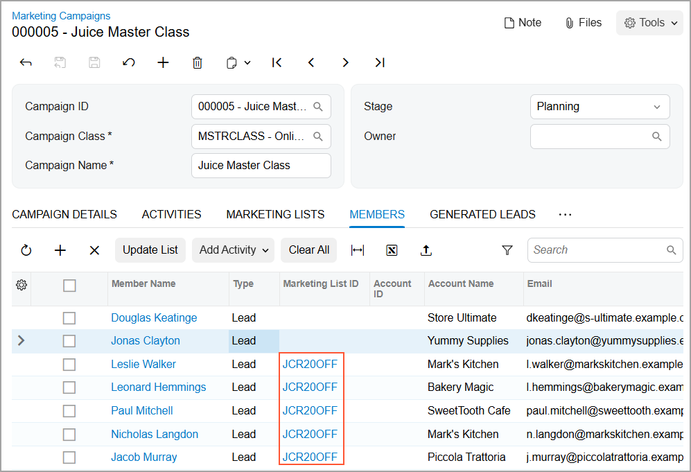
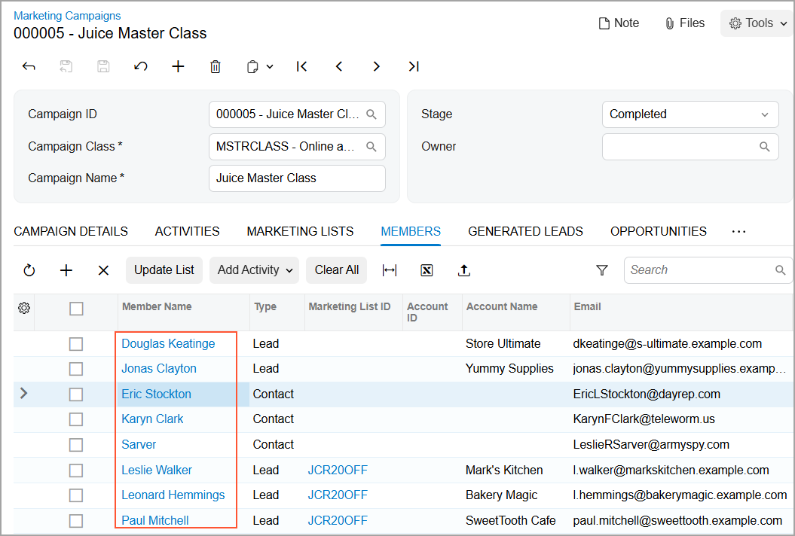

# Marketing Campaigns: Process Activity {#_8539f3c5-4479-44e1-9c00-6e45c9c5c49a .task}

The following activity demonstrates how to create a marketing campaign in the system and change the stages of the marketing campaign.

**Attention:** This activity is based on the *U100* dataset. If you are using another dataset or if any system settings have been changed in *U100*, these changes can affect the workflow of the activity and the results of the processing. To avoid issues, restore the *U100* dataset to its initial state.

## Story { .section}

Suppose that you are Bill Owen, a marketing manager of the SweetLife Fruits &amp; Jams company.SweetLife management has decided to launch a marketing campaign that will promote online master classes focused on teaching the audience how to use juicers that the company sells. You need to create the marketing campaign, add members, and after the campaign has finished, change the stage of the campaign to *Completed* in preparation for analyzing the campaign results.

## Configuration Overview { .section}

In the *U100* dataset, for the purposes of this activity, the following tasks have been performed:

-   On the [Enable/Disable Features](CS_10_00_00.md) \(CS100000\) form, the *Customer Management* feature has been enabled: This feature provides the customer relationship management \(CRM\) functionality, including lead and customer tracking, as well as the handling of sales opportunities, contacts, marketing lists, and campaigns.
-   On the [Campaign Classes](CR_20_25_00.md) \(CR202500\) form, the *MSTRCLASS* campaign class has been created.
-   On the [Leads](CR_30_10_00.md) \(CR301000\) form, a number of leads have been created, including *Jonas Clayton* and *Douglas Keatinge*.
-   On the [Marketing Lists](CR_20_40_00.md) \(CR204000\) form, the *JCR20OFF* marketing list, which includes a number of leads \(*Leslie Walker*, *Leonard Hemmings*, *Paul Mitchell*, *Nicholas Langdon*, and *Jacob Murray*\), has been added to the system, as described in [Marketing Lists: To Create a Static Marketing List](CRM_Mktg_Mng_Marketing_Lists_Create_Static_Mktg_List.md).

## Process Overview { .section}

In this activity, you will do the following on the [Marketing Campaigns](CR_20_20_00.md) \(CR202000\) form:

1.  Create a marketing campaign.
2.  Add members to the marketing campaign.
3.  Change the stage of the marketing campaign.

## System Preparation { .section}

Before you start creating a marketing campaign, you should do the following:

1.  Launch the Acumatica ERP website with the *U100* dataset preloaded.
2.  Sign in to the system as marketing manager Bill Owen by using the following credentials:
    -   **Username**: *owen*
    -   **Password**: *123*
3.  Make sure that on the Company and Branch Selection menu, in the top pane of the Acumatica ERP screen, the *SweetLife Head Office and Wholesale Center* branch is selected.
4.  Download the *CRMContactImport.xlsx* file, which has new contacts, to your computer.

## Step 1: Creating a Marketing Campaign { .section}

To create a marketing campaign, do the following:

1.  On the [Marketing Campaigns](CR_20_20_00.md) \(CR202000\) form, add a new record.
2.  In the Summary area, do the following:
    1.  In the **Campaign Class** box, select *MSTRCLASS*.
    2.  In the **Campaign Name** box, type the name of the campaign: `Juice Master Class`.
    3.  In the **Stage** box, select *Planning*.
3.  On the **Campaign Details** tab, specify the campaign settings as follows:
    1.  In the **Start Date** box, specify 1/30/2026.
    2.  In the **Workgroup** box, specify `Marketing`.
    3.  In the **Expected Response** box, specify `5` \(the number of responses to the campaign that you expect\).
    4.  In the **Planned Budget** box, specify `700`.
    5.  In the **Expected Return** box, specify `3500`.
    6.  In the text area, add the following description of the marketing campaign: `A marketing campaign that promotes online master classes focused on teaching the audience how to use juicers`.
4.  On the form toolbar, click **Save**.

You have created a marketing campaign. Now you can add members to this campaign.

## Step 2: Adding Individual Members to the Marketing Campaign { .section}

To add members to the marketing campaign one by one, do the following:

1.  While you are still viewing the *Juice Master Class* campaign on the [Marketing Campaigns](CR_20_20_00.md) \(CR202000\) form, open the **Members** tab.
2.  On the table toolbar, click **Add Row** to add a member to the marketing campaign.
3.  In the **Member Name** box, select *Jonas Clayton*. The system adds a row with the lead's data to the table.
4.  On the table toolbar, click **Add Row** to add another member to the marketing campaign.
5.  In the **Member Name** box, select *Douglas Keatinge*. The system adds a row with the lead's data to the table.
6.  On the form toolbar, click **Save**.

You have added two individual members to the marketing campaign one by one.

## Step 3: Adding Multiple Members to the Marketing Campaign by Using a Marketing List { .section}

Suppose that one more marketing campaign has already been launched: SweetLife offers citrus juicers at a special price to the leads with confirmed contact information to increase sales. These leads have been added to the *Citrus Juicers at a 20% Discount* \(*JCR20OFF*\) marketing list, and you need to add these members to the marketing campaign.

To add multiple members to the marketing campaign from the marketing list, do the following:

1.  While you are still viewing the *Juice Master Class* campaign on the [Marketing Campaigns](CR_20_20_00.md) \(CR202000\) form, open the **Marketing Lists** tab.
2.  In the **Selected** column, select the check box in the row with the *JCR20OFF* marketing list.
3.  On the form toolbar, click **Save**.
4.  In the **Confirmation** dialog box, which opens, click **Update** to update the campaign members.

The system automatically copies the members to the list of members on the **Members** tab from the *Citrus Juicers at a 20% Discount* marketing list. Notice that for these members, the name of the source marketing list has been added to the **Marketing List ID** column of the **Members** tab, as shown in the following screenshot.

You have added members from the marketing list to the marketing campaign.

## Step 4: Uploading with the Creation of New Contacts { .section}

Suppose that your colleague has given you a list of new contacts who might be interested in participating in the online master class. You have created an Excel file with these contacts, and now you are ready to add them to the marketing campaign. You want the system to create a new contact for each listed contact that is not already defined in the system.

To upload the new contacts from the file, you will use the **Load Records from File** button. While you are still viewing the *Juice Master Class* campaign on the [Marketing Campaigns](CR_20_20_00.md) \(CR202000\) form, do the following:

1.  On the table toolbar of the **Members** tab, click **Load Record from File**.
2.  In the **Import Data** dialog box, which opens, click **Upload File**, and select the *CRMContactImport.xlsx* file, which you previously downloaded to your computer.
3.  In the Specify Common Settings page of the dialog box, which opens, leave the default settings, and click **Next**.
4.  In the Map Properties to Columns page of the dialog box, which opens, notice that the system automatically matches most values in the **Column Name** and **Property Name** columns. Leave the default values in the columns, and click **Finish**.
5.  After the system has finished uploading the members to the form, click **Close** in the **Processing** dialog box.

    The system closes the dialog box.

6.  On the **Members** tab, make sure that the new contacts have been added to the campaign.
7.  Optional: Click the link in the **Member Name** column of one of the uploaded contacts to make sure that a new contact has been created in the system. The system opens the contact on the [Contacts](CR_30_20_00.md) \(CR302000\) form in a pop-up window.

## Step 5: Changing the Stage of the Marketing Campaign { .section}

Suppose that the *Juice Master Class* campaign has been launched and then completed.

To change the stage of the marketing campaign, do the following:

1.  While you are still viewing the *Juice Master Class* campaign on the [Marketing Campaigns](CR_20_20_00.md) \(CR202000\) form, in the **Stage** box of the Summary area, select *Execution*.

    **Tip:** On the **Activities** tab, you can add activities that are related to the launch, execution, and completion of the marketing campaign, as described in [Managing Emails and Activities](CRM_Mktg_Managing_Emails_Activities_Mapref.md).

2.  On the form toolbar, click **Save**.
3.  In the **Stage** box of the Summary area, select *Completed* to record in the system that the marketing campaign has been completed.
4.  On the form toolbar, click **Save**.
5.  On the **Members** tab, review the list of the members of the *Juice Master Class* marketing campaign \(see the following screenshot\). Notice that the list of the members includes all members that had been added to the campaign both manually and automatically.

    

You have completed the processes of creating the marketing campaign and changing the stages of the marketing campaign.

**Parent topic:**[Managing Marketing Campaigns](../UserGuide/CRM_Mktg_Mng_Marketing_Campaigns_Mapref.md)

