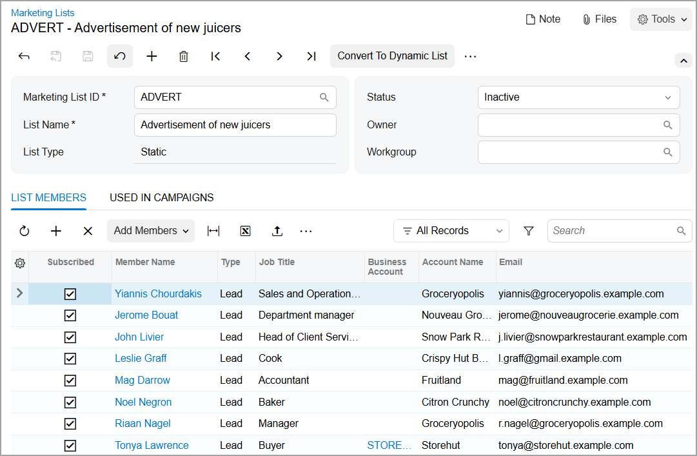

# Marketing Lists: To Create a Dynamic Marketing List {#_6917bf46-70be-439e-9bfe-99f8c2c84718 .task}

The following activity demonstrates how to create dynamic marketing lists.

**Attention:** This activity is based on the *U100* dataset. If you are using another dataset or if any system settings have been changed in *U100*, these changes can affect the workflow of the activity and the results of the processing. To avoid issues, restore the *U100* dataset to its initial state.

## Story { .section}

Suppose that you are Bill Owen, a marketing manager of the SweetLife Fruits &amp; Jams company.You need to create the following marketing lists:

-   A marketing list that includes all created leads with confirmed contact information. The members of this list will regularly receive a company newsletter.
-   A marketing list that includes all members who currently receive the newsletter. These members will receive an advertisement with new juicers.

## Configuration Overview { .section}

In the *U100* dataset, for the purposes of this activity, the following tasks have been performed:

-   On the [Enable/Disable Features](CS_10_00_00.md) \(CS100000\) form, the following features have been enabled:
    -   *Customer Management*: This feature provides the customer relationship management \(CRM\) functionality, including lead and customer tracking, as well as the handling of sales opportunities, contacts, marketing lists, and campaigns.
    -   *Scheduled Processing* in the *Monitoring &amp; Automation* group of features: This feature gives you the ability to create schedules for the automatic processing of documents.

## Process Overview { .section}

In this activity, you will create a dynamic marketing list from scratch on the [Marketing Lists](CR_20_40_00.md) \(CR204000\) form and a static marketing list by copying the members from the created dynamic marketing list.

## System Preparation { .section}

Before you start creating dynamic marketing lists, you should do the following:

1.  Launch the Acumatica ERP website with the *U100* dataset preloaded.
2.  Sign in to the system as marketing manager Bill Owen by using the following credentials:
    -   **Username**: *owen*
    -   **Password**: *123*
3.  Make sure that on the Company and Branch Selection menu, in the top pane of the Acumatica ERP screen, the *SweetLife Head Office and Wholesale Center* branch is selected.

## Step 1: Creating a Dynamic Marketing List by Using a Generic Inquiry { .section}

To create a dynamic marketing list, do the following:

1.  On the [Marketing Lists](CR_20_40_00.md) \(CR204000\) form, add a new record.
2.  In the Summary area, specify the following settings:

    -   **Marketing List ID**: `NEWS`
    -   **List Name**: `SweetLife News`
    -   **Status**: Active
    By default, the value in the **List Type** box is *Static* and unavailable for editing.

3.  On the form toolbar, click **Convert to Dynamic List**. Notice that the value in the **List Type** box has been changed to *Dynamic*.
4.  In the Summary area, specify the selection rules for list members as follows:
    1.  In the **Generic Inquiry** box, select *BI-Leads*.
    2.  In the **Shared Filter** box, select the *Leads Ready for Sales* shared filter, which is one of the filters that have been defined for the specified generic inquiry. This filter contains leads that have the *Open* status.

        On the **List Members** tab, the table becomes populated with the leads added to the marketing list.

        **Tip:** If you need to correct the resulting list of members, which are subscribed to marketing mailings automatically after adding them to the list, you can manually unsubscribe a list member or some of them from the mailings by clearing the unlabeled check box in the **Subscribed** column for these members. You can also unsubscribe all added members from the mailings by using **Manage Subscription** &gt; **Unsubscribe All** on the table toolbar.

5.  On the form toolbar, click **Save**.

You have created a dynamic marketing list that includes all leads that have the *Open* status. These leads can receive the SweetLife newsletter when it is sent.

## Step 2: Creating a Static Marketing List by Copying the Members from a Dynamic Marketing List { .section}

Suppose that you want to prepare an advertising letter with new juicers and send this letter to the current members of the dynamic marketing list that you have just created. To create a new static marketing list and copy the members from the dynamic marketing list, on the [Marketing Lists](CR_20_40_00.md) \(CR204000\) form, do the following:

1.  While you are still viewing the *SweetLife News* list, on the table toolbar of the **List Members** tab, click **Copy All**.
2.  In the Copy Members wizard, which opens, do the following:
    1.  Make sure that the **Add All Members to a New Static List** option button is selected.

        **Tip:** You can begin the process of copying the members to an existing marketing list by selecting the **Add All Members to Existing Static Lists** option on this page.

    2.  Click **Next**.
3.  On the **Main** tab of the Add Members to a New Marketing List page, which opens, specify the following settings:
    1.  **Marketing List ID**: `ADVERT`
    2.  **List Name**: `Advertisement of new juicers`
4.  Click **Create and Review**. The system closes the dialog box, adds the leads to the newly created static marketing list, and opens the list on the [Marketing Lists](CR_20_40_00.md) form, as shown on the following screenshot. Notice that the status of the newly created marketing list is *Inactive* by default.

    

**Tip:** You can create a static marketing list by copying the members from a static marketing list as well.

You have created a static marketing list by copying the members to it from a previously created dynamic marketing list.

**Parent topic:**[Managing Marketing Lists](../UserGuide/CRM_Mktg_Mng_Marketing_Lists_Mapref.md)

